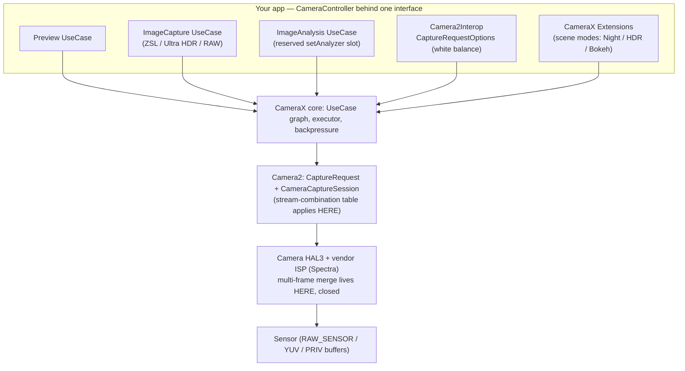

> "Hardcore" (advanced / low-level) techniques for building a high-quality
> Android camera app, grounded in open-source library code and hardware
> specifications. Dig deepest into four domains: (1) low-level Camera2 control
> — RAW/DNG capture, manual exposure/ISO/focus, `CaptureRequest` construction,
> repeating vs. single requests, the guaranteed stream-combination tables per
> hardware level, ZSL via reprocessing, probing `CameraCharacteristics`, and
> where CameraX hides all this and how Camera2 interop reaches back down; (2)
> computational photography — multi-frame merge: HDR+/bracketing, night mode,
> burst alignment/registration, super-resolution, tone mapping, and which
> pieces exist in open source; (3) performance & pipeline — buffer management,
> zero-shutter-lag, latency budgets, GPU processing after RenderScript's
> deprecation, threading, memory pressure under burst; (4) open-source
> teardowns with concrete code evidence. Every substantive claim backed by
> real GitHub code (repo + file/function path) or a hardware/spec primary
> source, with real performance numbers — not documentation rephrases. Then
> map each technique back to my CameraX-based, photo-only camera app, in its
> own vocabulary. Flag anything you could not verify to code/spec level.

## Short answer

The gap between a stock-camera clone and a "hardcore" camera app is three
distinct engineering problems wearing one API surface: **controlling the
sensor** (Camera2), **merging many frames into one better frame**
(computational photography), and **not stalling or running out of memory while
doing it** (the pipeline). CameraX is a policy layer over Camera2 that makes
the easy 90% trivial and the hard 10% reachable only through a documented
escape hatch (`Camera2Interop`). The headline findings, conclusion-first:

- **The single most load-bearing spec artifact is the guaranteed
  stream-combination table**, quoted verbatim below from the AOSP
  `CameraDevice.createCaptureSession` javadoc. It is *the* contract that says
  what you may run at once: a LEGACY device guarantees only three
  simultaneous targets and no RAW; RAW+preview+JPEG is guaranteed only once
  the device advertises the `RAW` capability; four concurrent streams need
  `LEVEL_3`. Everything else in Camera2 is downstream of this table.
- **"GCam-class results" are not something you reimplement — they are
  something you call.** Google's production HDR+ / Night Sight / Super-Res Zoom
  are closed, run on the Qualcomm Spectra ISP + Tensor silicon, and use a
  frequency-domain Wiener merge, motion metering, and learned finishing that
  no open-source Android app reproduces. The best public reimplementation
  (`timothybrooks/hdr-plus`) is an **offline Halide binary** that even
  *simplifies the paper's merge to a spatial-domain L1 blend*, and takes ~3.4 s
  to merge 8 frames on a desktop i7. On-device, the realistic lever is the
  vendor's own pipeline exposed through CameraX Extensions.
- **Zero-shutter-lag is a reprocessing trick, not a setting.** The camera keeps
  a ring of recent full-res frames and, on the shutter, reprocesses the frame
  from *before* the tap (`TEMPLATE_ZERO_SHUTTER_LAG` +
  `createReprocessableCaptureSession` + `ImageWriter`). CameraX's ring is
  **3 frames**; Google's `zsldemo` uses **10** and reports **50–100 ms**
  button-to-image on Pixel. ZSL is gated on `PRIVATE_REPROCESSING`/`YUV_REPROCESSING`
  and is silently dropped under flash or vendor extensions.
- **The whole pipeline lives or dies on buffer discipline.** If a consumer
  holds `maxImages` un-closed buffers, the AOSP `ImageReader` javadoc says the
  producer "will eventually stall or drop Images" — and with CameraX's blocking
  backpressure strategy that stall propagates to *preview*. A 12 MP RAW16 frame
  is `4000×3000×2 = 24 MB`; a 10-frame RAW burst is ~240 MB resident, which is
  why `maxImages` is the OOM knob.
- **Your app already does the two things that matter and correctly defers the
  rest.** It reaches Camera2 through interop exactly once (white balance via
  `CaptureRequestOptions`), and it delegates multi-frame merge to the vendor
  via CameraX Extensions (scene modes). The report's one actionable spec
  update: **CameraX 1.5 (Nov 2025) added `OUTPUT_FORMAT_RAW` to `ImageCapture`**,
  so the "RAW needs a Pro UI and CameraX can't do it" deferral is now half
  expired — RAW/DNG is reachable, though manual ISO/shutter and the 50/200 MP
  high-res path still are not.

The pipeline, and where each domain attaches:

Domain sections 1–3 are organized by *technique*; section 4 re-reads the same
ground by *repository*, so the two axes are MECE rather than repetitive. Every
code claim carries a repo + path; every unverified claim is collected in "What
I could not verify."

---

## Domain 1 — Low-level Camera2 control

### 1.1 The stream-combination tables (the contract everything else obeys)

Before RAW, before manual exposure, before ZSL, one question governs a Camera2
app: **which output streams may I configure simultaneously?** The answer is a
set of tables the platform *guarantees*, keyed on the device's hardware level
and capabilities, quoted verbatim from the AOSP
`CameraDevice.createCaptureSession` javadoc. The vocabulary first (verbatim):

> `PRIV` refers to any target whose available sizes are found using
> `StreamConfigurationMap#getOutputSizes(Class)` with no direct
> application-visible format, `YUV` refers to a target `Surface` using the
> `ImageFormat#YUV_420_888` format, `JPEG` refers to the `ImageFormat#JPEG`
> format, and `RAW` refers to the `ImageFormat#RAW_SENSOR` format. `PREVIEW`
> refers to the best size match to the device's screen resolution, or to 1080p
> (1920×1080), whichever is smaller. `RECORD` refers to the camera device's
> maximum supported recording resolution. `MAXIMUM` refers to the camera
> device's maximum output resolution for that format or target.

**LEGACY** — the floor. At most three targets, no RAW, no `MAXIMUM`-res
processing with preview:

| Target 1 | Target 2 | Target 3 | Use case |
|---|---|---|---|
| PRIV MAXIMUM | — | — | Simple preview / GPU video |
| JPEG MAXIMUM | — | — | No-viewfinder still capture |
| YUV MAXIMUM | — | — | In-app processing |
| PRIV PREVIEW | JPEG MAXIMUM | — | Standard still imaging |
| YUV PREVIEW | JPEG MAXIMUM | — | Processing + still capture |
| PRIV PREVIEW | PRIV PREVIEW | — | Standard recording |
| PRIV PREVIEW | YUV PREVIEW | — | Preview + processing |
| PRIV PREVIEW | YUV PREVIEW | JPEG MAXIMUM | Still + processing |

**LIMITED** adds high-resolution `RECORD`-stream combinations on top of LEGACY
(e.g. `PRIV PREVIEW + PRIV RECORD`, `PRIV PREVIEW + PRIV RECORD + JPEG RECORD`
for video snapshot). **FULL** adds `MAXIMUM`-resolution processing concurrent
with preview (`PRIV PREVIEW + PRIV MAXIMUM`, `PRIV PREVIEW + YUV MAXIMUM`,
`YUV 640×480 + PRIV PREVIEW + YUV MAXIMUM`). The **RAW capability** — advertised
independently, and possible on a LIMITED device — adds the DNG combinations:

| Target 1 | Target 2 | Target 3 | Use case |
|---|---|---|---|
| RAW MAXIMUM | — | — | No-preview DNG capture |
| PRIV PREVIEW | RAW MAXIMUM | — | Standard DNG capture |
| YUV PREVIEW | RAW MAXIMUM | — | Processing + DNG |
| PRIV PREVIEW | JPEG MAXIMUM | RAW MAXIMUM | **Simultaneous JPEG + DNG** |
| YUV PREVIEW | JPEG MAXIMUM | RAW MAXIMUM | Processing + JPEG + DNG |

**LEVEL_3** adds a fourth concurrent target, the combination that lets a "pro"
app run viewfinder + small analysis + full-res YUV/JPEG + RAW at once:

| Target 1 | Target 2 | Target 3 | Target 4 |
|---|---|---|---|
| PRIV PREVIEW | PRIV 640×480 | YUV MAXIMUM | RAW MAXIMUM |
| PRIV PREVIEW | PRIV 640×480 | JPEG MAXIMUM | RAW MAXIMUM |

Three facts an expert will insist on, all from the same doc. **(1)** Exceeding
a table is not always an exception: the doc enumerates three outcomes — the
session works, or it works but violates the `getOutputMinFrameDuration`
frame-rate guarantee, or `onConfigureFailed` fires. **(2)** The tables are
*programmatically queryable* via
`android.hardware.camera2.params.MandatoryStreamCombination`, so you never have
to hard-code them. **(3)** Session (re)configuration is expensive: "It can take
several hundred milliseconds for the session's configuration to complete, since
camera hardware may need to be powered on or reconfigured" — the closest thing
the spec gives to a latency number, and the reason your app should reconfigure
sessions as rarely as possible.

### 1.2 RAW / DNG capture

RAW is gated by a **capability flag, not a hardware level**: a device supports
it when `CameraCharacteristics.REQUEST_AVAILABLE_CAPABILITIES` contains
`REQUEST_AVAILABLE_CAPABILITIES_RAW`. Open Camera reads exactly this — in
`net.sourceforge.opencamera` `CameraController2.java`, it iterates the
capabilities array and tests `capability == REQUEST_AVAILABLE_CAPABILITIES_RAW`
(around line 1217, off the array read ~1211).

The write path is `DngCreator`. Its AOSP constructor (in
`platform_frameworks_base` `core/java/android/hardware/camera2/DngCreator.java`)
is `DngCreator(CameraCharacteristics characteristics, CaptureResult metadata)`
— it needs **the `CaptureResult` from the same capture that produced the RAW
buffer**, because that is where the sensor timestamp, black/white levels,
color-correction transform, neutral color point, noise profile, and lens
shading map come from. `writeImage(OutputStream, Image)` validates the image is
`ImageFormat.RAW_SENSOR` before writing.

Open Camera's real pipeline: `CameraController2.java` builds
`new DngCreator(characteristics, capture_result)` (~line 673), sets orientation
and location on it, then hands `DngCreator` + `Image` to the saver thread;
`ImageSaver.java`'s `saveImageNowRaw(...)` (~line 1984) calls
`dngCreator.writeImage(output, image)` (~line 2022) and then closes image,
creator, and stream. An instructive engineering note in the code: for
Storage-Access-Framework destinations it writes straight to the URI stream
rather than a temp file, because "copying to a temp file is much slower for
RAW" and DNG (unlike JPEG) needs no post-hoc EXIF rewrite. Google's own
`android/camera-samples` Camera2Basic (on the **`master`** branch, not `main`)
shows the minimal form in `CameraFragment.kt`'s `saveResult()`:
`DngCreator(characteristics, result.metadata).writeImage(stream, result.image)`.

### 1.3 Manual exposure, ISO, and focus

Manual sensor control is gated by the **`MANUAL_SENSOR` capability**, not by
"FULL." All FULL devices must advertise `MANUAL_SENSOR` + `MANUAL_POST_PROCESSING`
+ `BURST_CAPTURE`, but a LIMITED device *may also* advertise `MANUAL_SENSOR` —
so "manual = FULL" is a common but imprecise claim. The mechanism is: turn the
auto pipeline off, then set the sensor keys directly. From Open Camera
`CameraController2.java`:

- `CONTROL_AE_MODE = CONTROL_AE_MODE_OFF` (line 346), then
  `SENSOR_SENSITIVITY = iso` (347) and `SENSOR_EXPOSURE_TIME = actual_exposure_time`
  (355), mirrored on the still-capture builder (3664, 3674, 3680, …).
- `CONTROL_AF_MODE = CONTROL_AF_MODE_OFF` (3972) then
  `LENS_FOCUS_DISTANCE = focus_distance` (463; min/max at 3974/3977 for
  macro↔infinity).

The valid ranges come from characteristics, and the code's own comments flag
the real-world trap — **all of them may be null**:
`SENSOR_INFO_EXPOSURE_TIME_RANGE` (1366), `SENSOR_INFO_SENSITIVITY_RANGE`
(1360), `LENS_INFO_MINIMUM_FOCUS_DISTANCE` (1331), each annotated
`// may be null on some devices`. One nuance the spec adds:
`LENS_INFO_FOCUS_DISTANCE_CALIBRATION` (UNCALIBRATED / APPROXIMATE / CALIBRATED)
qualifies what `LENS_FOCUS_DISTANCE` (in diopters) *means* — on an UNCALIBRATED
device `0.0` is infinity and the dioptre value is not physically accurate.

### 1.4 Request construction: templates, repeating vs. single

You never build a `CaptureRequest` from scratch; you start from a template
tuned by the HAL for a use case. Open Camera uses `TEMPLATE_PREVIEW`
(`CameraController2.java:3092`), `TEMPLATE_STILL_CAPTURE` (3711/3795/4059/4222),
and `TEMPLATE_RECORD` (4510). The canonical repeating-vs-single split, verified
in Camera2Basic `CameraFragment.kt`: the viewfinder is a *repeating* request —
`session.setRepeatingRequest(previewRequest, null, cameraHandler)` off
`TEMPLATE_PREVIEW` — while a still is a *one-shot* `session.capture(stillRequest,
callback, …)` off `TEMPLATE_STILL_CAPTURE`. The template guarantees (AOSP
`CameraDevice.createCaptureRequest`): `TEMPLATE_PREVIEW/STILL_CAPTURE/RECORD/
VIDEO_SNAPSHOT` on all `BACKWARD_COMPATIBLE` devices; `TEMPLATE_MANUAL` only
with `MANUAL_SENSOR`; and, verbatim, `TEMPLATE_ZERO_SHUTTER_LAG` "is guaranteed
to be supported on camera devices that support the `PRIVATE_REPROCESSING`
capability or the `YUV_REPROCESSING` capability."

### 1.5 Zero-shutter-lag via reprocessing

ZSL removes the physical shutter lag by capturing the photo *before* the user
tapped. The device streams full-resolution `PRIVATE`-format frames into a ring
buffer continuously; on the shutter, the app picks the buffered frame whose
timestamp is closest to the button press and feeds it *back into the camera*
for final processing via `createReprocessableCaptureSession` +
`ImageWriter.queueInputImage(Image)` with a `TEMPLATE_ZERO_SHUTTER_LAG`
reprocess request. The AOSP `ImageWriter` doc is explicit about why the buffer
never touches app code: "For `PRIVATE` format Images produced by `ImageReader`,
this is the only way to send Image data to `ImageWriter`" — the opaque buffers
are round-tripped through the HAL with "potentially zero buffer copies."

Concrete numbers: Google's `google/zsldemo` keeps a **10-frame** full-res
PRIVATE ring and reports **"about 50–100 ms from the button press to the
full-quality image being available"** on Pixel (its README also says "do not
use this code in production"). Its selection heuristic prefers a frame ~3 back
with AE/AF converged and no flash, to dodge the finger-tap jitter. CameraX
implements the same idea with a **3-frame** ring (see 3.2). The "3 frames" is a
CameraX design choice, not a Camera2 constant.

### 1.6 Probing `CameraCharacteristics`

Enumeration is where a serious app starts. Open Camera reads
`INFO_SUPPORTED_HARDWARE_LEVEL` and branches over LEGACY/LIMITED/FULL/LEVEL_3
(`CameraController2.java:1113–1120`) — and here is a trap every reviewer raises:
**the level constants are not monotonically ordered** (`LEGACY=2, LIMITED=0,
FULL=1, LEVEL_3=3, EXTERNAL=4`), so a numeric `>=` comparison is a bug; Open
Camera correctly uses explicit equality branches. Capabilities come from
iterating `REQUEST_AVAILABLE_CAPABILITIES` (~1211–1217); supported sizes/formats
from `SCALER_STREAM_CONFIGURATION_MAP` →
`StreamConfigurationMap.getOutputSizes(...)`.

### 1.7 Where CameraX hides this, and how interop reaches down

CameraX abstracts sessions and stream combinations into `UseCase`s (Preview,
ImageCapture, ImageAnalysis) and picks a legal combination for you. Two seams
let you reach back to raw Camera2 keys, both in package
`androidx.camera.camera2.interop` and both annotated `@ExperimentalCamera2Interop`:

- **`Camera2Interop.Extender`** — inject `CaptureRequest` keys at *UseCase-build*
  time: `Camera2Interop.Extender(builder).setCaptureRequestOption(KEY, value)`.
- **`Camera2CameraControl`** — inject them *dynamically at runtime*. Verified
  signatures from `Camera2CameraControl.java` (googlesource
  `platform/frameworks/support`): `from(CameraControl)`,
  `setCaptureRequestOptions(CaptureRequestOptions)` /
  `addCaptureRequestOptions(...)` / `clearCaptureRequestOptions()`, each
  returning a `ListenableFuture<Void>` that "completes when the repeating
  `CaptureResult` shows the options have been submitted completely" and fails
  with `OperationCanceledException` if superseded. This is the crucial
  behavioral difference from raw Camera2: you set *options on the repeating
  request*, you do not own the builder or the session.
- **`Camera2CameraInfo.from(cameraInfo).getCameraCharacteristic(KEY)`** reaches
  the raw characteristics for probing.

What CameraX historically did **not** expose: RAW/DNG through `ImageCapture` at
all — for years the answer was "drop to Camera2." That changed in **CameraX
1.5** (released Nov 13 2025; docs recommend 1.5.1 for bug fixes), which added
pro-level image capture: probe with
`ImageCapture.getImageCaptureCapabilities(cameraInfo).getSupportedOutputFormats()`,
then choose `OUTPUT_FORMAT_RAW` (DNG alone), `OUTPUT_FORMAT_RAW_JPEG`
(simultaneous RAW+JPEG — mapping onto the guaranteed `PRIV + JPEG + RAW`
combination of 1.1), or `OUTPUT_FORMAT_JPEG_ULTRA_HDR`. Even so, interop stays
experimental and CameraX still owns session/stream management — you set keys,
not stream-combination tables.

---

## Domain 2 — Computational photography (multi-frame merge)

### 2.1 HDR+: the burst pipeline, and what open source actually reproduces

The reference algorithm is Hasinoff et al., **"Burst photography for high
dynamic range and low-light imaging on mobile cameras," SIGGRAPH Asia 2016**
(ACM TOG 35(6)). Its shape, cross-checked against the survey by Delbracio et
al., "Mobile Computational Photography: A Tour" (arXiv:2102.09000):

- **A same-exposure burst of 2–8 raw frames**, deliberately *underexposed* and
  held in a zero-shutter-lag ring buffer — underexposure avoids highlight
  clipping and shortens each frame to limit motion blur; denoising happens at
  the Bayer/raw level, not after demosaic.
- **A reference frame** is chosen (sharpest of the first few, close to the
  shutter press); alternates are aligned to it and merged.
- **The merge is in the frequency domain** — per-tile, per-frequency
  interpolation between reference and aligned tiles, weighted by measured
  difference vs. modeled noise (a Wiener-style shrinkage that down-weights
  misaligned tiles).

The public reimplementation is **`timothybrooks/hdr-plus`** — a **Halide**
ahead-of-time binary, not an Android app. Its three stages are Halide
generators in `/src`: `align.cpp`, `merge.cpp`, `finish.cpp`, assembled in
`hdrplus_pipeline_generator.cpp` (I/O in `Burst.cpp` / `InputSource.cpp`; the
task's assumed `HDRPlus.cpp` does not exist in `/src`). Performance, from the
author: **~3.4 s to merge eight raw images on a quad-core 2.2 GHz i7**, plus
~1 s/frame I/O — desktop, offline.

**The adversarial finding that matters most here:** the open-source
`merge.cpp` is **spatial-domain, not the paper's frequency-domain Wiener
filter.** It weights each aligned tile by its L1 distance to the reference
(`min_dist = 10`, `max_dist = 300`, `factor = 8.0` — full weight below
`min_dist`, zero above `max_dist`), then blends half-overlapped tiles with a
raised-cosine window. Brooks states it plainly: "Our algorithm is significantly
simplified… the same intuition behind non-local means… No 2D DFT, no Wiener
filter." So anyone citing `hdr-plus` as a faithful HDR+ merge is wrong — it is a
simplified spatial NLM. Do not repeat that error.

### 2.2 Burst alignment / registration

`hdr-plus` `align.cpp` (verified constants) is a hierarchical, coarse-to-fine
Gaussian pyramid with **downsample factor 4 per level** (`DOWNSAMPLE_RATE = 4`,
`gauss_down4`), **32-px Bayer tiles** (`T_SIZE = 32`, `T_SIZE_2 = 16` through
the pyramid, tiles overlapping by 16), an **±4 (8×8) search per level**
(`RDom r1(-4, 8, -4, 8)`), and an **L1 distance metric**
(`dist = abs(i32(ref_val) - i32(alt_val))` summed over the tile). It has **no
subpixel refinement** — Brooks notes Google's production version adds a
bivariate-polynomial subpixel fit that his reimplementation omits.

### 2.3 Super-resolution

Wronski et al., **"Handheld Multi-Frame Super-Resolution," SIGGRAPH 2019**
(ACM TOG 38(4), Article 28) — the algorithm behind Pixel "Super Res Zoom."
The key ideas: it **replaces demosaicing** (produces full RGB directly from a
burst of CFA raw frames), it exploits **natural hand tremor** (~0.9 px, one
standard deviation, per the Tour survey) as the sub-pixel sampling diversity
that makes super-resolution possible, and it accumulates frames with kernel
regression under a **per-pixel robustness mask** that merges fewer frames where
local motion/occlusion is detected. Reported runtime: **~100 ms per 12 MP raw
frame on mobile** (project page).

### 2.4 Night mode

Liba et al., **"Handheld Mobile Photography in Very Low Light," SIGGRAPH Asia
2019** (ACM TOG 38(6), Article 164) — Pixel Night Sight. It extends HDR+ with
**motion metering** (optical flow measures scene motion *before* the shutter to
set per-frame exposure + gain jointly minimizing noise and blur), switches from
zero-shutter-lag to **positive-shutter-lag** to allow longer exposures, and
adds a **learned auto white balance** because color perception fails at low
light. Vendor-blog numbers (Google's Night Sight post, not the paper text): the
default HDR+ per-frame exposure is capped at **66 ms** to preserve ZSL; Night
Sight allows **up to 15 handheld frames** at ~48–333 ms each (≈1 s total),
scaling to **6×1 s ≈ 6 s on a tripod** when no motion is detected; it operates
down to **0.3 lux**.

### 2.5 Tone mapping / finishing

`hdr-plus` `finish.cpp` runs (verified order): black/white level → white
balance → **Malvar gradient-corrected demosaic** → bilateral chroma denoise →
sRGB color matrix → **tone map** → gamma → S-curve contrast (strength 5.0) →
unsharp-mask sharpen (strength 2.0). Its tone map is an **exposure-fusion-style
local operator** — it synthesizes a brighter virtual exposure, weights dark and
bright versions with a normal distribution over exposure value, and blends via
a **Laplacian pyramid**, iterated 3× on high-contrast scenes — i.e. a
Mertens-flavored fusion, *not* a Reinhard/Drago global operator.

The OSS-friendly classics live in OpenCV's `photo` module
(`modules/photo/src/merge.cpp`): `createMergeMertens` implements **Mertens,
Kautz, Van Reeth, "Exposure Fusion," Pacific Graphics 2007** (contrast +
saturation + well-exposedness weights, Laplacian-pyramid blend, produces LDR
directly — no radiance map, no tonemap); `createMergeDebevec` implements
**Debevec & Malik, SIGGRAPH 1997** (recover an HDR radiance map), paired with
`TonemapReinhard` / `TonemapDrago` / `TonemapMantiuk`.

### 2.6 What is open source vs. what is proprietary (be honest)

The uncomfortable truth, stated adversarially:

- **Production HDR+ / Night Sight / Super-Res Zoom are closed.** The real
  capture control (ZSL buffer management, motion metering, PSL scheduling), the
  frequency-domain Wiener merge, the learned finishing, and the ML auto white
  balance are not open-sourced, and they run on the **Qualcomm Spectra ISP +
  Pixel Visual Core / Tensor** — closed silicon and firmware.
- **`hdr-plus` is a research reimplementation**: offline Halide, simplified
  spatial merge, no subpixel align, ~3.4 s/8 frames on a desktop. It teaches
  the pipeline; it does not ship in a phone.
- **The most capable multi-frame merge in a real OSS Android app is Open
  Camera's HDR** — and it is a fundamentally *simpler* class: **exposure
  bracketing**, not same-exposure raw denoise-merge. Verified against
  `HDRProcessor.java` (`net.sourceforge.opencamera`): it accepts **exactly 1 or
  3 bracketed 8-bit bitmaps** (`n_bitmaps != 1 && != 3` throws
  `INVALID_N_IMAGES`), aligns them with **Median Threshold Bitmap** block
  matching (`autoAlignment(...)`, Ward 2003), fits a per-channel linear
  response across exposures (`createFunctionFromBitmaps`, `y = A·x + B`), tone
  maps with a selectable operator (`CLAMP/EXPONENTIAL/REINHARD/FILMIC/ACES`),
  and applies local contrast with **CLAHE** (`adjustHistogram(...)`,
  `clip_limit = (5·n_pixels)/256`).
- **No open-source Android app ships a real-time, on-device Night-Sight-class
  low-light burst merge or multi-frame RAW super-resolution.** For those
  results in an app you *ship*, the only on-device lever is the vendor's own
  pipeline through CameraX Extensions.

---

## Domain 3 — Performance & pipeline

### 3.1 Buffer management with `ImageReader` (backpressure is the whole game)

The AOSP `ImageReader` javadoc (`aosp-mirror/platform_frameworks_base`
`media/java/android/media/ImageReader.java`) states the rule verbatim: "Due to
memory limits, an image source will eventually **stall or drop Images** in
trying to render to the Surface if the ImageReader does not obtain and release
Images at a rate equal to the production rate." `maxImages` is "the maximum
number of images the user will want to access simultaneously," and acquiring
more than `maxImages` without `close()` throws `IllegalStateException`. Two
acquisition modes: `acquireNextImage()` returns the *oldest* queued frame;
`acquireLatestImage()` "acquires all the images possible… but `close`s all
images that aren't the latest" and is "recommended… for most use-cases, as it's
more suited for real-time processing" — it auto-drains the lag chain so a slow
consumer sees the newest frame.

CameraX wraps this as `ImageAnalysis` backpressure strategy (official
`androidx.camera.core.ImageAnalysis` docs):

- **`STRATEGY_KEEP_ONLY_LATEST`** (default, non-blocking): a one-deep buffer,
  overwritten by each new frame — the direct analogue of `acquireLatestImage()`.
  `setImageQueueDepth()` has no effect here.
- **`STRATEGY_BLOCK_PRODUCER`** (blocking): a deeper queue; drops only when
  full — and the blocking "occurs across the entire camera device scope… when
  both preview and image analysis are bound… **preview would also be blocked**
  while CameraX is processing the images." That is the load-bearing warning:
  choosing the blocking strategy to avoid dropping analysis frames can stall
  your viewfinder.

Either way you must call `ImageProxy.close()` — and the CameraX docs warn *not*
to call the wrapped `Media.Image.close()`, which "would break the image sharing
mechanism inside CameraX."

### 3.2 Zero-shutter-lag latency

CameraX exposes ZSL as
`ImageCapture.Builder.setCaptureMode(CAPTURE_MODE_ZERO_SHUTTER_LAG)` (1.2+),
storing the **three most recent frames** and, on the shutter, retrieving "the
captured frame with the timestamp that is closest to that of the button press."
Gating and limits (official docs): check `CameraInfo.isZslSupported()`; requires
API 23+ and `PRIVATE` reprocessing; **only for image capture, not video or
extensions**; **disabled when flash is ON or AUTO**; falls back to
`CAPTURE_MODE_MINIMIZE_LATENCY`; and "will increase the memory footprint." The
only sourced millisecond figure is `google/zsldemo`'s **50–100 ms** on Pixel
(§1.5) — CameraX itself publishes no ms number; do not attribute one to it.

### 3.3 GPU processing after RenderScript

RenderScript is **deprecated since Android 12 / API 31** (and AGP 7.2), and the
migration doc is blunt: "Device and component manufacturers have already
stopped providing hardware acceleration support, and RenderScript support is
expected to be removed entirely in a future release." The official replacements:

- **Vulkan compute** "if you need to take full advantage of GPU acceleration" —
  but with no SDK bindings, so it is written via the NDK + JNI. Other listed
  options: OpenGL ES 3.1 compute, Canvas operations, and **AGSL** (Android
  Graphics Shading Language).
- **The CPU-intrinsics path**: `android/renderscript-intrinsics-replacement-toolkit`
  (canonical org is `android/`, not `google/`) replaces ten intrinsics — blend,
  blur, color matrix, convolve, histogram, LUT, LUT3D, resize, **YUV→RGB** — and
  its README is explicit that these "execute **multithreaded on the CPU**…
  Neon/AdvSimd on Arm… SSE on Intel," claiming a **2× speedup** over the old
  intrinsics. **It is CPU+SIMD only — there is no GPU path in this library**
  (a common misconception worth correcting).
- **`RenderEffect`** (API 31, `android/graphics/RenderEffect.java`) is a
  **RenderNode/View compositing effect, not general compute** — its factories
  are `createBlurEffect`, `createColorFilterEffect`, `createBlendModeEffect`,
  `createShaderEffect`, `createChainEffect`, etc., applied via
  `RenderNode.setRenderEffect(...)`. Note `createRuntimeShaderEffect` is *not*
  an API-31 method (AGSL runtime shaders came later).

The real OSS GPU image pipeline on Android is **`cats-oss/android-gpuimage`**.
Its architecture, verified in source: `GPUImageRenderer` implements both
`GLSurfaceView.Renderer` **and** the camera `PreviewCallback` — one object is
the GL renderer and the preview sink. In `onPreviewFrame` it calls the native
`GPUImageNativeLibrary.YUVtoRBGA(...)` to convert NV21 preview bytes to an RGBA
texture, and `onDrawFrame` runs `filter.onDraw(textureId, …)` where
`GPUImageFilter` carries a GLSL vertex+fragment shader pair (every effect
subclasses it); the camera path sets `RENDERMODE_CONTINUOUSLY`.

Why the YUV→RGB conversion is worth moving off the CPU at all: benchmarked on a
Pixel 4A (Minhaz, `blog.minhazav.dev`), a RenderScript YUV→RGB is **~28 ms/frame**
and a hand-tuned NEON path **~12 ms/frame** — single-device blog figures, cite
as illustrative — and the conversion *inflates* the buffer from **1.5 B/px**
(YUV_420_888) to **4 B/px** (ARGB_8888), ~2.7×.

### 3.4 Threading

The rule, and its rationale, verbatim from the CameraX configuration docs:
"Many of the platform APIs on which CameraX is built require **blocking
interprocess communication (IPC) with hardware that can sometimes take hundreds
of milliseconds** to respond. For this reason, CameraX only calls these APIs
from background threads." CameraX serializes camera-device access through
`CameraXExecutors.newSequentialExecutor()` ("all tasks… in order and without
overlapping"); analyzer/capture callbacks run on whichever `Executor` you pass,
so UI-touching callbacks must be given `mainThreadExecutor()`. Raw Camera2 does
the same by hand: AOSP's own `CameraToo` sample drives `openCamera` and session
setup on a dedicated `HandlerThread`, never the main thread.

### 3.5 Memory pressure under burst

Format bytes-per-pixel: RAW16 = 2, YUV_420_888 = 1.5, ARGB_8888 = 4. The
arithmetic (shown, not asserted):

| Buffer | Computation | Size |
|---|---|---|
| 12 MP RAW16 (4000×3000) | 4000·3000·2 | **24.0 MB** (22.9 MiB) |
| 12 MP YUV_420_888 | 12,000,000·1.5 | 18.0 MB (17.2 MiB) |
| 12 MP ARGB_8888 | 12,000,000·4 | 48.0 MB (45.8 MiB) |
| 48 MP RAW16 (8000×6000) | 8000·6000·2 | 96.0 MB (91.6 MiB) |
| 10-frame RAW16 burst | 10·24 MB | **240 MB** (229 MiB) |

Two honest caveats. "24 MB per 12 MP RAW frame" is correct only in **decimal
MB**; the same buffer is **22.9 MiB** in binary units — so always show `w×h×2`
rather than a rounded label. And a ZSL PRIVATE ring's true footprint is
HAL-defined (often compressed/tiled), so "~170 MB for a 10-deep 12 MP ring" is
an order-of-magnitude estimate, not a measured number. The load-bearing
conclusion stands regardless: **burst memory is linear in frame count, and
`ImageReader.maxImages` is the knob that bounds OOM** — which is exactly why the
AOSP javadoc says to "use only the minimum number necessary."

---

## Domain 4 — Open-source teardowns (the repos, rated)

Same ground as 1–3, re-read by repository — what each project *proves* and,
adversarially, what it does **not** do:

| Repo (path) | What it proves, at code level | What it is **not** |
|---|---|---|
| **Open Camera** `net.sourceforge.opencamera` — `CameraController2.java`, `ImageSaver.java`, `HDRProcessor.java` | The most complete OSS Camera2 app: real manual AE/ISO/focus (`CONTROL_AE_MODE_OFF` + `SENSOR_*`), DNG via `DngCreator`, hardware-level probing with the correct non-monotonic branch, MTB-aligned bracketed HDR with CLAHE | No reprocessing/ZSL; HDR is 8-bit exposure bracketing, not raw burst merge |
| **`android/camera-samples`** Camera2Basic (`master`) — `CameraFragment.kt` | The minimal correct RAW+JPEG capture and the repeating-vs-single request split | Auto-only; no manual sensor, no ZSL sample |
| **`google/zsldemo`** | The only end-to-end ZSL demo: 10-frame PRIVATE ring, `ImageWriter` reprocessing, frame-selection heuristic; **50–100 ms** on Pixel | "Do not use in production" (author's own warning) |
| **`timothybrooks/hdr-plus`** — `align.cpp`, `merge.cpp`, `finish.cpp` | The HDR+ pipeline made legible: pyramid tile align (L1, ±4), Laplacian exposure-fusion finish; ~3.4 s/8 frames | Offline Halide; **simplified spatial merge, not the paper's Wiener merge**; no subpixel align |
| **`cats-oss/android-gpuimage`** — `GPUImageRenderer.java` | The OSS GPU pipeline: GL renderer + preview callback in one object, native YUV→RGB, GLSL filter chain, `RENDERMODE_CONTINUOUSLY` | Owns its own `GLSurfaceView`; does not compose with CameraX's `PreviewView` |
| **OpenCV** `photo` — `merge.cpp` | Production Mertens/Debevec/Robertson + Reinhard/Drago/Mantiuk tonemap | Not Android-specific; a heavy native dependency |
| **`android/renderscript-intrinsics-replacement-toolkit`** | The sanctioned RenderScript-intrinsic replacement: blur/blend/colormatrix/resize/YUV→RGB, 2× faster, Neon/SSE | **CPU+SIMD only, no GPU**; no float allocations |
| **CameraX** `androidx.camera.*` (googlesource `platform/frameworks/support`) | The policy layer: `Camera2Interop`/`Camera2CameraControl` escape hatches, 3-frame ZSL, 1.5 RAW/Ultra-HDR output formats, sequential-executor threading | Interop is `@ExperimentalCamera2Interop`; you set keys, not stream tables |

---

## Domain 5 — Mapping to the app (in its own vocabulary)

The app is CameraX-based, photo-only, six modules, with **`CameraController`**
owning **hardware truth** behind an interface and each screen's ViewModel owning
**session truth**. Every technique above lands in one of three buckets: *already
in use*, *correctly deferred*, or *a spec premise this report updates*.

### 5.1 Techniques already in the app

- **Camera2 interop is already the app's one reach-down, for white balance.**
  The white-balance feature applies presets "at runtime (camera2 interop
  capture-request options), not at bind time," querying
  `CONTROL_AWB_AVAILABLE_MODES` as hardware truth. That is precisely the
  `Camera2CameraControl.setCaptureRequestOptions` seam of §1.7 — the future
  that "completes when the repeating `CaptureResult` shows the options
  submitted" is why WB changes the live preview without a rebind. This is the
  model for any further reach-down: set options on the repeating request behind
  `CameraController`, never expose a raw builder across the seam.
- **Multi-frame merge is already delegated to the vendor, via scene modes.**
  The scene-mode feature binds CameraX Extensions (Night/HDR/Bokeh/Auto). Per
  Domain 2, this is the *correct and only* on-device path to GCam-class results:
  you are calling the vendor's Spectra pipeline, not reimplementing `hdr-plus`.
  The feature's own note that quality comes "as much from multi-frame processing
  (Night's exposure stacking, HDR's bracket merging) as from the lenses" is
  exactly right, and the report confirms there is no OSS on-device alternative
  worth building instead.
- **Zero-shutter-lag is already wired, as the mechanism behind "quality
  priority Off."** The quality-priority feature drives
  `CAPTURE_MODE_ZERO_SHUTTER_LAG` (Off) vs. maximize-quality/Ultra HDR (On,
  default). The spec's observations all match the platform contract: ZSL is
  "not a control" (it is a 3-frame reprocessing ring, §3.2), CameraX itself
  suppresses it "for a non-OFF flash mode" (the documented flash-ON/AUTO
  limit), and it is bypassed under vendor scene modes (extensions are
  incompatible with ZSL). The app depends on library behavior here rather than
  re-deciding it — the report validates that dependency as real and stable.
- **The threading model already matches the guidance.** Architecture puts
  CameraX callbacks on the main executor and blocking I/O on `Dispatchers.IO`;
  §3.4 is the "why" (hundreds-of-ms IPC, sequential executor) behind that being
  correct rather than incidental.
- **The reserved `setAnalyzer` slot is an `ImageAnalysis` seam.** When it is
  eventually used (QR, faces), §3.1 is the rule set it must obey:
  `STRATEGY_KEEP_ONLY_LATEST` to keep preview un-stalled, and `ImageProxy.close()`
  (never the wrapped `Media.Image.close()`).

### 5.2 Deferrals this report confirms as still-correct

- **Manual ISO/shutter (Pro mode).** The deferral's stated reason — "camera2
  requires the manual pair to be set together with auto-exposure fully off,
  which conflicts with scene modes and flash metering" — is exactly §1.3:
  `CONTROL_AE_MODE_OFF` + `SENSOR_SENSITIVITY` + `SENSOR_EXPOSURE_TIME`, and an
  active extension owns the pipeline (the same reason white balance is
  "suspended under vendor scene modes"). The report adds precision: the gate is
  the **`MANUAL_SENSOR` capability**, not "FULL," and the ranges may be null on
  device — so a Pro UI must probe and degrade, not assume. Reason stands.
- **Full-resolution 50/200 MP capture.** Orthogonal to everything above and
  still correct: the high-res sensor-pixel-mode path
  (`ULTRA_HIGH_RESOLUTION_SENSOR`, a separate capability from RAW) is simply not
  advertised to public Camera2 on the device, so no CameraX or Camera2 interop
  code can reach it. RAW would be sensor-native ~12.5 MP (the binned array),
  which is what §1.2's DNG path would produce — not a route to 200 MP.
- **ZSL alongside Ultra HDR.** §3.2 confirms the constraint is real: ZSL is
  incompatible with extensions and CameraX exposes no pre-bind combinability
  query, so "try both, fall back on a failed capture" would cost a committed
  photo. Suppressing ZSL when Ultra HDR is written is the right blanket rule.
- **Filters / GPU shader pipeline.** §3.3 is the cost estimate: the OSS
  reference (`GPUImage`) owns its own `GLSurfaceView` and would fight CameraX's
  `PreviewView` surface ownership, and RenderScript is dead — a real shader
  pipeline is Vulkan/AGSL or a GL-texture path, i.e. "a different product," as
  the ledger says.

### 5.3 The one spec premise to update

The RAW/Pro-mode deferral rests partly on "CameraX does not cleanly support
camera2 `MAXIMUM_RESOLUTION` … streams." **CameraX 1.5 (Nov 13 2025) added
`OUTPUT_FORMAT_RAW` and `OUTPUT_FORMAT_RAW_JPEG` to `ImageCapture`** (§1.7), so
the *RAW-reachability* half of that premise has expired: DNG capture is now a
supported `ImageCapture` output, probed via
`getImageCaptureCapabilities().getSupportedOutputFormats()`, no interop
required, mapping onto the guaranteed `PRIV + JPEG + RAW` stream combination.
What has **not** changed: manual ISO/shutter still needs interop and still
conflicts with scene modes/flash (5.2), and `MAXIMUM_RESOLUTION` high-res
capture is still unreachable on the device (5.2). So the deferral should be
re-scoped, not deleted — "RAW output is now a CameraX 1.5 `ImageCapture` format;
the deferral is really about the *Pro control UI* and the *unreachable high-res
mode*, not about RAW being impossible." Worth a `Last verified` revisit of the
`product.md` ledger row, if and when the owner wants RAW at all.

---

## What I could not verify (flagged)

Honest gaps, kept separate from the claims above rather than folded in:

- **No line-verified OSS raw-Camera2 ZSL implementation.** `google/zsldemo`
  documents the design and the 50–100 ms figure, but I did not line-verify a
  production app doing `createReprocessableCaptureSession` +
  `ImageWriter.queueInputImage` end-to-end. Open Camera does not use
  reprocessing.
- **`DngCreator` native metadata keys** (noise profile, neutral color point,
  color-correction transform, lens shading map) are documented as consumed but
  verified in native/`DngUtils`, not line-read; only `SENSOR_TIMESTAMP` +
  `SENSOR_INFO_TIMESTAMP_SOURCE` were confirmed in the Java constructor.
- **CameraX 1.5 exact RAW constant spellings.** `OUTPUT_FORMAT_RAW_JPEG` and
  `OUTPUT_FORMAT_JPEG_ULTRA_HDR` were named in the official blog; a standalone
  `OUTPUT_FORMAT_RAW` is in the release notes but not line-verified against
  `androidx.camera.core.ImageCapture` source. Confirm identifiers before
  quoting them as literals in code.
- **HDR+ paper merge tile size (commonly cited 16×16) and the exact Wiener
  shrinkage formula** — described qualitatively by the survey, not extracted
  from the paper PDF (WebFetch could not parse the binary).
- **Night Sight frame/exposure numbers** (66 ms ZSL cap, 15 handheld frames,
  6×1 s tripod, 0.3 lux) are from Google's Night Sight *blog*, not the
  peer-reviewed paper text. Super-Res "100 ms/12 MP" is from the project page,
  not confirmed inside the paper PDF.
- **Performance numbers are single-source where noted:** the Pixel-4A YUV→RGB
  28 ms/12 ms are one author's blog on one device; the only ZSL latency figure
  (50–100 ms) is `zsldemo`, not CameraX; the burst-memory figures are computed
  from format math, not measured on a device; the ZSL-ring footprint is an
  order-of-magnitude estimate (PRIVATE buffers are HAL-defined).
- **`ImageAnalysis` `STRATEGY_BLOCK_PRODUCER` default queue depth ("6")** is
  asserted in secondary sources but not confirmed against the
  `ImageAnalysis.Builder` reference — treat as unconfirmed.
- **Line numbers in Open Camera** were verified against the `benliuxie/opencamera`
  GitHub mirror of the SourceForge canonical; line numbers can drift between
  snapshots, so pin to a commit if quoting exact lines.
- **"Single-threaded camera-device access"** is substantiated architecturally
  (CameraX `newSequentialExecutor`; Camera2 one `HandlerThread`), not by a
  single quoted AOSP sentence.

## Sources

Open-source code (repo — file/class/function):

- [Open Camera](https://sourceforge.net/p/opencamera/code) (`net.sourceforge.opencamera`; mirror [benliuxie/opencamera](https://github.com/benliuxie/opencamera)) — `CameraController2.java` (manual AE/ISO/focus 346–463, hardware-level 1113–1120, RAW cap 1217, ranges 1331/1360/1366, `DngCreator` 673, templates 3092/3711/4510), `ImageSaver.java` (`saveImageNowRaw` 1984, `writeImage` 2022), `HDRProcessor.java` (MTB `autoAlignment`, CLAHE `adjustHistogram`, 1-or-3 bracket).
- [android/camera-samples](https://github.com/android/camera-samples) — `Camera2Basic/.../CameraFragment.kt` (`saveResult`, `takePhoto`), `master` branch.
- [google/zsldemo](https://github.com/google/zsldemo) — 10-frame PRIVATE ring, `ImageWriter` reprocessing, 50–100 ms Pixel.
- [timothybrooks/hdr-plus](https://github.com/timothybrooks/hdr-plus) — `src/align.cpp`, `src/merge.cpp`, `src/finish.cpp`; author writeup [timothybrooks.com/tech/hdr-plus](https://www.timothybrooks.com/tech/hdr-plus/).
- [cats-oss/android-gpuimage](https://github.com/cats-oss/android-gpuimage) — `GPUImageRenderer.java`, `GPUImage.java`.
- [opencv/opencv](https://github.com/opencv/opencv) — `modules/photo/src/merge.cpp`; [HDR imaging tutorial](https://docs.opencv.org/4.x/d3/db7/tutorial_hdr_imaging.html).
- [android/renderscript-intrinsics-replacement-toolkit](https://github.com/android/renderscript-intrinsics-replacement-toolkit) — README (ten intrinsics, Neon/SSE, 2×).
- CameraX — [androidx.camera source](https://android.googlesource.com/platform/frameworks/support/+/refs/heads/androidx-main/camera/) (`Camera2CameraControl.java`, `ImageCapture.java`).

Primary spec / hardware sources:

- AOSP [`CameraDevice`](https://developer.android.com/reference/android/hardware/camera2/CameraDevice) — `createCaptureSession` stream-combination tables, `createCaptureRequest` template guarantees, `TEMPLATE_ZERO_SHUTTER_LAG`.
- AOSP [`ImageReader`](https://developer.android.com/reference/android/media/ImageReader) — `maxImages`, `acquireLatestImage`, stall/drop; [`ImageWriter`](https://developer.android.com/reference/android/media/ImageWriter) — `queueInputImage`; [`DngCreator`](https://developer.android.com/reference/android/hardware/camera2/DngCreator); [`CameraCharacteristics`](https://developer.android.com/reference/android/hardware/camera2/CameraCharacteristics); [`RenderEffect`](https://developer.android.com/reference/android/graphics/RenderEffect).
- CameraX docs — [ImageAnalysis / backpressure](https://developer.android.com/media/camera/camerax/analyze), [ZSL](https://developer.android.com/media/camera/camerax/take-photo/zsl), [configuration / threading](https://developer.android.com/media/camera/camerax/configuration), [RenderScript migration](https://developer.android.com/guide/topics/renderscript/migrate), [CameraX 1.5 announcement](https://android-developers.googleblog.com/2025/11/introducing-camerax-15-powerful-video.html).

Papers:

- Hasinoff et al., "Burst photography for HDR and low-light imaging on mobile cameras," SIGGRAPH Asia 2016 — [hdrplusdata.org](https://hdrplusdata.org/).
- Liba et al., "Handheld Mobile Photography in Very Low Light," SIGGRAPH Asia 2019 — [arXiv:1910.11336](https://arxiv.org/abs/1910.11336), [Night Sight blog](https://research.google/blog/night-sight-seeing-in-the-dark-on-pixel-phones/).
- Wronski et al., "Handheld Multi-Frame Super-Resolution," SIGGRAPH 2019 — [project page](https://sites.google.com/view/handheld-super-res/).
- Delbracio, Kelly, Brown, Milanfar, "Mobile Computational Photography: A Tour," [arXiv:2102.09000](https://arxiv.org/abs/2102.09000).
- Mertens, Kautz, Van Reeth, "Exposure Fusion," Pacific Graphics 2007; Debevec & Malik, "Recovering HDR Radiance Maps," SIGGRAPH 1997.
- Benchmark blog: Minhaz, "YUV to RGB conversion" — [blog.minhazav.dev](https://blog.minhazav.dev/).
