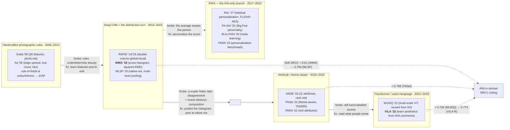

> The third of a four-report survey series building a domain mental model of
> Image Quality Assessment (IQA) and Image Aesthetic Assessment (IAA). R1 laid
> the map; R2 walked the IQA method lineage. **This report is the IAA
> (aesthetics) methods deep-dive: classic (~2006) through post-ViT**, mirroring
> R2's structure and house style — a failure-labelled lineage diagram, one
> consolidated AVA benchmark table (SRCC/PLCC + binary accuracy at MOS = 5),
> and "what broke → what fixed it" prose. It is built around the four
> IAA-specific forces that make aesthetics its *own* mental model and not just
> "IQA on pretty pictures": aesthetics is a **distribution, not a point**
> (NIMA's EMD loss is the pivot); aesthetics is **subjective**, so
> personalization (PIAA) is a first-class subfield with no IQA analog;
> **supervision is richer than a scalar** — attributes, photographic
> composition rules, and free-text comments; and **content/theme dependence**,
> so a good landscape ≠ a good portrait. It stays inside IAA and stops at the
> vision-language on-ramp; multimodal-LLM scoring (Q-Align and its aesthetic
> arm) is R4. The closing synthesis is how aesthetic assessment *thinks
> differently* from quality assessment — and why those four forces are exactly
> why aesthetics reached vision-language models first.

## Short answer

**IAA runs the same MOS-prediction relay as IQA — handcrafted → CNN →
transformer → vision-language — but four forces IQA never feels bend every rung,
and those four forces are the whole reason aesthetics reached vision-language
models first.** Memorise the forces and each method slots into place:

1. **Aesthetics is a distribution, not a point.** An image's beauty is a *vote
   histogram* (AVA keeps all ~210 votes per image), and the spread is signal —
   it marks polarising or unconventional photos. **NIMA (2018)** is the pivot of
   the whole field: instead of regressing the mean, it predicts the full 1–10
   histogram with a **squared-EMD** loss that respects the ordinal scale. This
   is where distribution prediction was born, and it back-propagated into IQA
   (R2's NIMA row on KonIQ is the same model).
2. **Aesthetics is subjective → personalization (PIAA) is a first-class
   subfield with no IQA analog.** A generic "average opinion" score is a
   compromise nobody holds. **Ren (2017)** opened PIAA — learn a *residual* over
   the generic score per user — and it grew a meta-learning branch (BLG-PIAA)
   and a dedicated benchmark (PARA). IQA has no equivalent because fidelity is
   far more objective than taste: two people agree a photo is blurry; they
   disagree whether it is beautiful.
3. **Supervision is richer than a scalar.** Beauty *underdetermines* a single
   number, so the field decomposed it — into named **attributes** (AADB's 11:
   rule-of-thirds, colour harmony, depth of field…), photographic **composition
   rules** (the classic handcrafted era literally *was* rule-of-thirds and
   colourfulness detectors), and finally **free-text comments** (VILA reads what
   people *wrote* about a photo). This is the on-ramp to vision-language and R4.
4. **Content / theme dependence.** A good landscape is not a good portrait, so
   the model must condition on *what the photo is*. Theme-aware nets (**TANet**,
   on the 47-theme TAD66K) make this explicit — the direct analog of HyperIQA's
   content-adaptive weights in R2.

**One number anchors the ladder: in-domain AVA SRCC climbs 0.51–0.61 (NIMA) →
0.756 (MLSP) → 0.726 (MUSIQ, an IQA transformer reused) → 0.774 (VILA-R), and
the R4 MLLM ceiling is ~0.822 (Q-Align).** Two cautions carried from R1: AVA
SRCC lives in a **markedly lower band than IQA** (~0.75–0.82 is the meaningful
range vs. ~0.94 on KonIQ) because beauty is a noisier target; and **binary
accuracy at MOS = 5 (~66–82%) is the criticised legacy metric** — NIMA's 81.5%
"looks" better than its 0.612 SRCC only because the binary number is inflated.

The rest of this report walks the eras (diagram first), tabulates AVA, and ends
by contrasting IAA's story with R2's: **IQA's frontier problem was cross-dataset
generalisation; IAA's was subjectivity and the underdetermined scalar** — and
that difference is why the two fields, running the same relay, hit
vision-language for opposite reasons.

## The lineage in one picture

Read it left to right as R2's relay, each solid arrow labelled with the failure
it repairs — but note the two structural differences from the IQA diagram. First,
the **distribution turn sits *inside* the deep-CNN era** (it is NIMA's loss
function, not a new backbone), which is why the E2→E3 arrow carries two failures
at once. Second, the **PIAA branch splits off downward and never rejoins** — it
is the one part of the IAA tree with no counterpart anywhere in R2. The dotted
lines are the in-domain AVA SRCC ceiling climbing rung by rung; unlike R2's KonIQ
ladder they top out around **0.77–0.82**, not 0.94, because the target is
intrinsically noisier.

## Benchmark table: the AVA coordinate system

All numbers are on **AVA** (the 255,530-image aesthetics set, standard
~235k/20k train/test partition) unless noted. **SRCC**/**PLCC** are the
meaningful correlations; **binary acc.** thresholds the mean score at 5.0 and is
the criticised legacy metric (R1) — shown only for historical continuity, and
note how it compresses into a deceptively high ~72–82% band. Blank = the
method's own paper does not report that number. Read *down* to watch the era
climb; read the supervision column to see the four forces arrive.

| Method | Year | Backbone | Supervision | SRCC | PLCC | Bin. acc. |
|---|---|---|---|---|---|---|
| Murray et al. (AVA paper) | 2012 | generic features + SVM | scalar (binary) | — | — | 66.7% |
| **RAPID** | 2014 | double-column CNN | binary label | — | — | 74.46% |
| RAPID (improved) | 2015 | double-column + style | binary label | — | — | 75.42% |
| NIMA (MobileNet) | 2018 | MobileNet | **distribution (EMD)** | 0.510 | 0.518 | 80.36% |
| NIMA (VGG16) | 2018 | VGG16 | distribution (EMD) | 0.592 | 0.610 | 80.60% |
| **NIMA (Inception-v2)** | 2018 | Inception-ResNet-v2 | distribution (EMD) | **0.612** | 0.636 | **81.51%** |
| **MLSP** (Pool-3FC) | 2019 | InceptionResNet-v2 (native-res) | scalar, multi-level pool | **0.756** | 0.757 | 81.72% |
| MUSIQ | 2021 | multi-scale ViT | scalar (→ **R2** for internals) | 0.726 | 0.738 | — |
| **TANet** | 2022 | theme-aware CNN | scalar + theme | 0.758¹ | 0.765¹ | — |
| **VILA-R** | 2023 | CoCa (image + comment pretrain) | **free-text comments** | **0.774** | 0.774 | — |
| VILA-P (zero-shot, ensemble) | 2023 | CoCa | comments, no AVA labels | 0.657 | 0.663 | — |
| *Q-Align (R4 reference)* | 2023 | MLLM | discrete rating words | *0.822* | *0.817* | — |

*Sources: numbers are each method's own paper except where footnoted. NIMA and
MLSP numbers were read directly off the primary tables (NIMA arXiv:1709.05424;
MLSP arXiv:1904.01382); RAPID's 74.46 %/75.42 % are from the Deng et al. deep-IAA
survey (arXiv:1610.00838) tabulating the two RAPID papers; MUSIQ/VILA AVA numbers
cross-agree between the MUSIQ paper and VILA's comparison table. The Q-Align row
is R1's frontier number, shown only as the ceiling this report climbs toward — it
is R4's subject, not this report's.*
*¹TANet's exact AVA SRCC/PLCC decimals are from a third-party re-benchmark table
(ArtiMuse, arXiv:2507.14533), not read off TANet's own results table — flagged;
treat as ≈ 0.758/0.765.*

Three reading rules, all load-bearing:

- **The supervision column is the story.** IQA's benchmark table (R2) varied the
  *backbone*; here the backbones are ordinary (VGG, Inception, ViT) and what
  actually moves is *what the model is taught from* — a binary label, then a
  distribution, then attributes/theme, then comments. That column is the four
  forces made visible.
- **NIMA's binary-vs-SRCC gap is the metric trap in one row.** 81.5 % binary
  accuracy alongside 0.612 SRCC is not a contradiction; it is the binary metric
  being inflated by AVA's class imbalance (scores cluster near 5–6). Trust the
  SRCC.
- **An IQA transformer (MUSIQ) sits mid-table with no aesthetic-specific
  design.** MUSIQ was built for quality (R2) and reused verbatim on AVA — it
  reaches 0.726, *below* the aesthetics-native MLSP (0.756). Generic capacity
  is not enough; the aesthetics-specific supervision is what pushes past it.

## Era 1 — Handcrafted photographic rules (2006–2013)

**Premise, in one paragraph.** Before deep learning, aesthetics prediction *was*
photography theory turned into feature detectors. The hypothesis: the rules
professionals follow — rule-of-thirds placement, colour harmony, controlled
depth of field, low blur, balanced exposure — leave measurable signatures in the
pixels, so compute those signatures and train a shallow classifier to separate
"professional" from "snapshot." This is the aesthetic mirror of R2's Natural
Scene Statistics era: both hand-build a small feature vector and put an SVM/SVR
on top, and both break for the same reason (hand-built features cannot cover the
real distribution).

**The methods.**

- **Datta et al.** (Ritendra Datta, Dhiraj Joshi, Jia Li, James Z. Wang, *ECCV
  2006*) — *"Studying Aesthetics in Photographic Images Using a Computational
  Approach."* Extracts **56 hand-crafted visual features** and predicts a
  peer-rated aesthetics score on **photo.net** images (rated 1–7). The feature
  list reads like a photography syllabus: exposure of light, **colourfulness**
  (a distribution-similarity measure), saturation and hue, the **rule of
  thirds**, wavelet-based texture, size and aspect ratio, region composition,
  low-depth-of-field indicators, shape convexity, plus an IRM "familiarity"
  distance to a reference database. The first serious statement that aesthetics
  is *computable*.
- **Ke et al.** (Yan Ke, Xiaoou Tang, Feng Jing, *CVPR 2006*) — *"The Design of
  High-Level Features for Photo Quality Assessment."* A tighter, more
  interpretable set of **high-level** features chosen top-down from what
  distinguishes professional work: **spatial distribution of edges** (pros
  isolate the subject, so edges cluster), **colour distribution**, **hue
  count**, **blur**, **contrast**, and **brightness**. It reaches ~72 %
  classification of professional vs. snapshot photos and >90 % precision at low
  recall — strong evidence that a handful of composition-aware features carry
  real signal.

**The era's verdict.** Handcrafted rules proved aesthetics is not random — a few
composition features already separate good from bad well above chance. But they
**underdetermine beauty**: rule-of-thirds and colourfulness are *necessary
vocabulary*, not a *sufficient model*, and a fixed feature set cannot express the
open-ended ways an image can be beautiful (or ugly). That ceiling — plus the
arrival of **AVA (2012)** with 255,530 distribution-labelled images (R1) — is the
entire motivation for the deep era. Note the direct legacy: these
photographic-rule features never died; they *reappear* as the named **attributes**
of Era 3 (AADB literally supervises "rule of thirds" and "colour harmony" as
labels) and as the vocabulary VILA later learns from comments.

## Era 2 — Deep CNN, and the distribution turn (2014–2019)

This era does two separate things, and conflating them is the classic mistake.
First it **learns the features** instead of hand-designing them (the RAPID move,
mirroring R2's CNNIQA). Second — and this is IAA's landmark contribution to the
whole IQA/IAA field — it **changes what is predicted from a point to a
distribution** (the NIMA move). The first is shared with IQA; the second is where
aesthetics led.

### RAPID — the CNN turn, and the composition/resolution tension

- **RAPID** (Xin Lu, Zhe Lin, Hailin Jin, Jianchao Yang, James Z. Wang) — *"RAPID:
  Rating Pictorial Aesthetics using Deep Learning,"* **ACM MM 2014**, extended as
  *"Rating Image Aesthetics Using Deep Learning,"* **IEEE TMM 2015**. The first
  strong deep aesthetic net, and its architecture *is* an argument about
  composition: a **double-column DCNN** with a **global-view column** (the whole
  image, warped/cropped to a fixed square) concatenated with a **local-patch
  column** (a randomly cropped patch at native resolution), their `fc7` features
  joined before classification. The 2015 version adds a third **style/semantic
  column** (SDCNN). AVA binary accuracy: **74.46 %** (2014) → **75.42 %** (2015).

RAPID's two columns encode the **IAA analog of R2's resolution problem**, and it
is sharper here than in IQA. In IQA, resizing throws away *high-frequency
distortion cues*; in IAA, **cropping or warping an image destroys the very
composition you are judging** — the rule-of-thirds placement, the framing, the
negative space are *global geometric* properties that a fixed-square resize
mangles and a crop can delete outright. RAPID's answer is to keep both a global
(composition-bearing but distorted) and a local (undistorted but partial) view.
It is a compromise, not a solution — which is exactly the gap MLSP closes.

### NIMA — the distribution landmark

- **NIMA** (Hossein Talebi, Peyman Milanfar, Google) — *"NIMA: Neural Image
  Assessment,"* **IEEE TIP 2018**, arXiv:1709.05424. **The single most-cited IAA
  method, and the pivot of this report.** Instead of regressing the mean score,
  NIMA predicts the **full distribution of ratings** — a probability vector over
  the ten ordered buckets 1…10 — with a plain ImageNet backbone (it tests VGG16,
  Inception-ResNet-v2, and MobileNet) and a **squared Earth Mover's Distance
  (EMD)** loss on the *cumulative* distributions:

$$
\text{EMD}(p, \hat{p}) = \left(\frac{1}{N}\sum_{k=1}^{N}
\left|\mathrm{CDF}_p(k) - \mathrm{CDF}_{\hat p}(k)\right|^{r}\right)^{1/r},
\quad r = 2, \; N = 10
$$

**Why the histogram, and why EMD, matter — three things at once:**

1. **The scale is ordinal, so the loss must be too.** Cross-entropy treats the
   ten buckets as *unordered* classes — predicting "8" for a true "9" costs the
   same as predicting "2." EMD respects order: it measures how far probability
   mass must *move*, so a near-miss costs less than a blunder. This is the exact
   right inductive bias for a rating, and it is why distribution prediction
   improves *both* mean-score correlation and downstream binary accuracy over
   scalar regression.
2. **It recovers uncertainty for free.** From the predicted histogram you read
   off both the **mean** (the aesthetic score) *and* the **standard deviation**
   (rater disagreement / uncertainty). A wide predicted distribution flags a
   polarising or ambiguous image — the signal R1 insisted was in the spread. A
   scalar regressor throws this away.
3. **It is task-agnostic.** The same machine predicts **aesthetic** quality on
   AVA *and* **technical** quality on TID2013 (where NIMA-VGG16 reaches LCC 0.941
   / SRCC 0.944, state-of-the-art for its day) — one loss, both problems. This is
   the first concrete evidence for R1's "same machine, different target" thesis,
   and it is why NIMA appears in *R2's* KonIQ table too.

Exact AVA numbers (from the paper): Inception-v2 reaches **SRCC 0.612 / LCC
0.636 / 81.51 % binary**, VGG16 0.592 / 0.610 / 80.60 %, MobileNet 0.510 / 0.518
/ 80.36 %. That ~0.61 SRCC stood as the reference point for years — modest in
absolute terms, but the *method* reshaped the field.

### MLSP — the native-resolution answer to composition

- **MLSP** (Vlad Hosu, Bastian Goldlücke, Dietmar Saupe, Univ. Konstanz) —
  *"Effective Aesthetics Prediction with Multi-level Spatially Pooled Features,"*
  **CVPR 2019**, arXiv:1904.01382. The AVA SOTA of its day (**SRCC 0.756 / PLCC
  0.757 / 81.72 % binary**) and the clean answer to RAPID's composition problem:
  **don't resize — pool.** MLSP feeds the **full-resolution** image through a
  fixed pre-trained **InceptionResNet-v2**, takes **multi-level spatially-pooled
  (MLSP)** features (activations from *all* conv blocks, spatially pooled to a
  fixed-size descriptor regardless of input dimensions), and trains only a
  shallow head on top.

MLSP is explicit that fixed-resize destroys aesthetic information — from the
abstract: *"previous approaches miss some of the information in the original
images, due to taking small crops, down-scaling or warping the originals during
training"* — and from the body: *"images that are downsized, stretched, or
cropped do not contain the same information as the higher resolution image that
was originally assessed by human observers,"* attributing part of the gain to
*"the changes in the aesthetics of the composition when cropping small parts of
an image."* Spatial pooling is what lets a native-resolution image of any size
produce a fixed-length feature — the composition survives, and the +0.14 SRCC
jump over NIMA is the payoff. (This is the IAA counterpart of MUSIQ's
native-resolution transformer in R2, reached by pooling rather than attention,
and two years earlier.)

**The era's verdict.** CNNs learned the features RAPID's columns approximated;
NIMA changed the prediction target from a point to a distribution — the field's
lasting contribution; MLSP fixed the composition/resolution problem by pooling at
native resolution. What Era 2 did *not* address: the score is still a single
summary of a crowd, and it is still **underdetermined** — the model outputs "6.2"
with no account of *why*, or *for whom*. Those two gaps split the field into the
two branches of Era 3 (attributes/theme) and the PIAA branch.

## Era 3 — Attribute, composition, and theme-aware (2016–2022)

**The reframe:** a scalar aesthetic score is *underdetermined* — many different
photos map to 6.2, and the number explains nothing. So decompose it. Predict the
**named attributes** that compose the judgment, and condition on the **theme**
that sets the criteria. This is the aesthetic analog of R2's content-adaptive
HyperIQA, and it is the on-ramp to explainability and language.

- **AADB** (Shu Kong, Xiaohui Shen, Zhe Lin, Radomir Mech, Charless Fowlkes) —
  *"Photo Aesthetics Ranking Network with Attributes and Content Adaptation,"*
  **ECCV 2016**, arXiv:1606.01621. Introduces the **AADB dataset** — 10,000
  images labelled with **11 photographic attributes** (interesting content,
  object emphasis, good lighting, colour harmony, vivid colour, shallow depth of
  field, motion blur, **rule of thirds**, balancing element, repetition,
  symmetry) — and a network that predicts them jointly with the overall score.
  Two ideas beyond attributes: (1) it is a **ranking network** that exploits
  **rater identity** — because AADB tracks who rated what, it samples image pairs
  rated by the *same* worker and trains on their relative order, cancelling
  per-rater scale bias (the pairwise-loss idea from R1); (2) **content
  adaptation**, a joint attribute + content branch. Best model: Spearman ρ ≈
  **0.678** on AADB. Notice the closed loop: AADB's *labels* are exactly Era 1's
  handcrafted *features* — the field turned Datta/Ke's detectors into supervised
  targets.
- **TANet / TAD66K** (Shuai He, Yongchang Zhang, Rui Xie, Dongxiang Jiang, Anlong
  Ming) — *"Rethinking Image Aesthetics Assessment: Models, Datasets and
  Benchmarks,"* **IJCAI 2022**. The **theme-aware** answer to content dependence.
  It ships **TAD66K** (66,327 images across **47 themes** — landscape, portrait,
  macro, night… — each densely annotated, ≥1,200 ratings/image) and **TANet**,
  which recognises an image's theme and applies **theme-specific aesthetic
  rules** rather than one global rule, because a good landscape and a good
  portrait are judged on different criteria. This is the most direct expression
  of R1's "theme-relative" force. TANet reports SOTA across AVA, FLICKR-AES, and
  TAD66K (AVA SRCC ≈ 0.758; TAD66K SRCC ≈ 0.513 — the low TAD66K number is the
  dataset being deliberately hard and diverse, the aesthetic echo of R2's FLIVE
  reality check).
- **PARA** (Yuzhe Yang, Liwu Xu, Leida Li, Nan Qie, Yaqian Li, Peng Zhang,
  Yandong Guo) — *"Personalized Image Aesthetics Assessment with Rich
  Attributes,"* **CVPR 2022**, arXiv:2203.16754. The richest supervision in the
  field: **31,220 images**, each labelled with **9 objective attributes** (aesthetic,
  quality, composition, colour, DOF, light, content, object emphasis, and a
  scene category) **+ 4 subjective attributes** (content preference, willingness
  to share, difficulty of judgment, emotion), from **438 subjects** who *also*
  provided their own **personality traits** (Big-Five) and demographics. PARA is
  simultaneously the culmination of the attribute line *and* the benchmark for
  the PIAA branch below — it is the dataset that says aesthetics is a function of
  both the image and the *person*.

**The era's verdict.** Decomposing the scalar into attributes and conditioning on
theme made aesthetics **interpretable** and closed the content-dependence gap —
and, crucially, it built the vocabulary bridge to language: once a model predicts
"colour harmony" and "rule of thirds," predicting *sentences* about the photo is a
short step. But attributes are still a **fixed, hand-designed schema** (11 for
AADB, 13 for PARA), the same limitation Era 1 had one level up — which is why the
vision-language era replaces the schema with open-ended text. The other gap Era 3
leaves — that even a perfect attribute vector describes the *average* viewer — is
what the PIAA branch attacks.

## The PIAA branch — the IAA-only subfield (2017–2022)

This section has **no counterpart in R2**, and that absence is the point. IQA
predicts one number because degradation is (mostly) objective — everyone agrees a
photo is blurry. Aesthetics is *taste*: the "generic" score (GIAA) that every
method above predicts is a population average that **no individual actually
holds**. Personalized IAA (PIAA) predicts the score *for a specific person*, and
it is a first-class subfield precisely because subjectivity is IAA's defining
force.

- **Ren et al.** (Jian Ren, Xiaohui Shen, Zhe Lin, Radomir Mech, David J. Foran)
  — *"Personalized Image Aesthetics,"* **ICCV 2017**. Opens the problem. The key
  construction: a person's taste is modelled as a **residual/offset over the
  generic score** — start from a strong generic (GIAA) model, then learn a small
  per-user correction from a handful of that user's ratings, because you never
  have enough labels per person to train a full model from scratch. Ships
  **FLICKR-AES** (≈ 40k images, ~200 rated per individual across 210 workers) and
  the small **REAL-CUR** set as the first PIAA benchmarks.
- **PA-IAA** (Leida Li, Hancheng Zhu, Sicheng Zhao, Guiguang Ding, Weisi Lin) —
  *"Personality-Assisted Multi-Task Learning for Generic and Personalized Image
  Aesthetics Assessment,"* **IEEE TIP 2020**. Conditions personalization on
  **psychology**: a multi-task network predicts the aesthetics *distribution*
  alongside the rater's **Big-Five personality** traits, then uses personality as
  the prior for the personal adaptation — the idea that taste correlates with who
  you are, made architectural.
- **BLG-PIAA** (Hancheng Zhu, Leida Li, Jifeng Wu, Sicheng Zhao, Guiguang Ding,
  Guangming Shi) — *"Personalized Image Aesthetics Assessment via Meta-Learning
  with Bilevel Gradient Optimization,"* **IEEE Trans. Cybernetics 2020**. Frames
  personalization as **meta-learning**: treat each user as a task and MAML-style
  bilevel optimisation learns an initialisation that **adapts to a new user from
  very few images**. This is the exact aesthetic mirror of R2's MetaIQA (same
  MAML machinery), but pointed at *raters* rather than *distortions* — a neat
  illustration that the two fields reuse each other's tools against different
  sources of variation.
- **PARA** (above) is the modern personalization **benchmark** — its per-subject
  labels and personality traits are what a PIAA model conditions on and is
  evaluated against.

**Why IQA has no equivalent (the synthesis, flagged as mine).** No primary PIAA
paper states it outright, but the structural reason is clean: **fidelity is more
objective than taste.** Degradation has a physical ground truth — the blur kernel,
the JPEG quantiser, the noise variance exist independent of the viewer — so
rater disagreement in IQA is measurement noise to be averaged out. In IAA the
disagreement *is the signal* (R1): it encodes genuine differences in taste,
culture, and expertise, so averaging it away discards real structure. That is why
IAA grew a personalization subfield and IQA did not, and why PARA measures the
*rater*, not just the image. (PIAA is evaluated on FLICKR-AES / PARA with a
per-user protocol, not AVA — its numbers are not comparable to the AVA table
above, so I do not tabulate them alongside; the branch matters for the *mental
model*, not the leaderboard.)

## Era 4 — Transformer and vision-language (2021–2023)

Two moves close this report. First, the **transformer era reaches AVA mostly by
reuse**: the strong IQA transformer is applied to aesthetics with no
aesthetic-specific redesign. Second, the **vision-language pivot** — the move
that makes aesthetics the field that reached language *first* — learns beauty
from what people *wrote*, not from scores.

- **MUSIQ** (Junjie Ke, Qifei Wang, Yilin Wang, Peyman Milanfar, Feng Yang, *ICCV
  2021*) is R2's multi-scale image transformer, **applied to AVA aesthetics
  unchanged**. Its native-resolution, multi-scale patch encoding is a natural fit
  for composition (same motivation as MLSP's pooling), and it reaches **AVA SRCC
  0.726 / PLCC 0.738**. **See R2 for the architecture** (hash-based 2D positional
  embedding, scale embedding, multi-scale token sequence) — the point here is only
  that a quality transformer transfers to aesthetics and lands *between* NIMA and
  MLSP, confirming that generic capacity helps but aesthetic-specific supervision
  is what wins.
- **VILA** (Junjie Ke, Keren Ye, Jiahui Yu, Yonghui Wu, Peyman Milanfar, Feng
  Yang) — *"VILA: Learning Image Aesthetics from User Comments with
  Vision-Language Pretraining,"* **CVPR 2023**, arXiv:2303.14302. **The pivotal
  method of the era, and the direct on-ramp to R4.** The insight: AVA does not
  just carry scores — it carries **hundreds of thousands of user *comments*** on
  the photos ("love the leading lines," "highlights are blown out," "great use of
  negative space"). VILA does **vision-language pretraining on image + comment
  pairs** (a CoCa-style contrastive + generative objective, no aesthetic score
  labels at all), learning a rich aesthetic representation from language, then
  fine-tunes for scoring with **VILA-R**, a **lightweight rank-based adapter**
  that uses a text anchor to adapt the frozen representation to AVA ratings.

VILA's numbers make the case twice over. **Zero-shot** (VILA-P, no AVA score
labels, prompting the pretrained model) already reaches **SRCC 0.657 / PLCC
0.663** — direct evidence that *aesthetic knowledge is carried in the comments*,
exactly as CLIP-IQA showed quality knowledge is carried in a pretrained VLM (R2).
Fine-tuned, **VILA-R reaches SRCC 0.774 / PLCC 0.774**, the strongest
non-MLLM AVA result and the top of this report's ladder. And note the author: the
same **Junjie Ke** who first-authored MUSIQ — the transformer and the
vision-language pivot came from one line of work.

**Why VILA is the R4 on-ramp.** The field's supervision arc — handcrafted rules
(Era 1) → learned features (Era 2) → hand-designed attribute schemas (Era 3) →
**open-ended natural-language comments (VILA)** — is the story of aesthetics
*stopping hand-labelling scores and starting to read what people said about
photos.* Once a model learns beauty from sentences, the obvious next question is
the R4 question: *why not let a full multimodal LLM read the photo, describe it,
and rate it in words?* — which is Q-Align and its aesthetic arm. VILA is the last
rung before language becomes the interface, and that is where R3 stops.

## Synthesis: how aesthetic assessment thinks differently

The IAA mental model is **the same MOS-prediction machine as IQA, bent by four
forces IQA does not feel** — and the whole report is those four forces, stated as
the failure/repair chain:

1. **Distribution, not a point.** Rater disagreement is signal, so predict the
   *histogram*, not the mean. **NIMA's squared-EMD** is the pivot — it gave
   calibration, uncertainty, and one loss for both aesthetic and technical
   quality, and it back-propagated into IQA. **This is where distribution
   prediction was born.**
2. **Subjectivity → personalization.** The average score is a compromise nobody
   holds, so predict it *per person*. **PIAA** (Ren → PA-IAA → BLG-PIAA → PARA)
   is a first-class subfield **with no IQA analog**, because fidelity is
   objective and taste is not.
3. **Richer-than-scalar supervision.** Beauty underdetermines a number, so
   decompose it — into **attributes** (AADB), **composition rules** (the whole of
   Era 1, reborn as labels), and finally **free-text comments** (VILA). Each step
   moved supervision closer to language.
4. **Content / theme dependence.** A good landscape ≠ a good portrait, so
   **condition on the theme** (TANet / TAD66K) — the aesthetic analog of
   content-adaptive IQA.

**Contrast with R2, explicitly.** IQA and IAA ran the *same* relay — handcrafted →
CNN → transformer → vision-language — but their **frontier problems were
opposite**, and that is the crux:

- **IQA's open problem was cross-dataset generalisation** (R2's §Generalisation:
  in-domain ~0.92 collapses to ~0.75 cross-dataset). Its target was
  well-defined; the struggle was making a model trained on one distortion
  distribution survive another. IQA reached vision-language to **generalise**.
- **IAA's open problem was subjectivity and the underdetermined scalar.** Its
  target was *ill-defined* — beauty is a distribution over disagreeing people,
  and a single number cannot hold it. IAA reached vision-language to **express**
  what a scalar could not: uncertainty, attributes, taste, and finally the words
  people actually used.

That is why aesthetics reached vision-language models *first* and for a deeper
reason. IQA wanted language for robustness; **IAA needed language because its
label was linguistic all along** — the aesthetic ground truth was never really a
number, it was the ~210 opinions and the comments beneath each photo, and NIMA's
histogram, AADB's attributes, and VILA's comments are three successive admissions
of that fact. R4 is where both branches rejoin: a multimodal LLM that reads,
describes, and rates — solving IQA's generalisation and IAA's expressibility with
the same machine.

## Sources

**Era 1 — handcrafted.**
[Datta et al., "Studying Aesthetics in Photographic Images Using a Computational Approach" (ECCV 2006)](https://doi.org/10.1007/11744078_23) ·
[Ke, Tang, Jing, "The Design of High-Level Features for Photo Quality Assessment" (CVPR 2006)](https://www.cs.cmu.edu/~yke/photoqual/).

**Era 2 — deep CNN + distribution.**
[RAPID (Lu, Lin, Jin, Yang, Wang; ACM MM 2014)](https://doi.org/10.1145/2647868.2654927), extended as ["Rating Image Aesthetics Using Deep Learning" (IEEE TMM 2015)](https://doi.org/10.1109/TMM.2015.2477040) ·
[NIMA (Talebi & Milanfar, IEEE TIP 2018, arXiv:1709.05424)](https://arxiv.org/abs/1709.05424) ([TF-Hub / community code](https://github.com/idealo/image-quality-assessment)) ·
[MLSP (Hosu, Goldlücke, Saupe; CVPR 2019, arXiv:1904.01382)](https://arxiv.org/abs/1904.01382) ([code](https://github.com/subpic/ava-mlsp)).

**Era 3 — attribute / theme-aware.**
[AADB (Kong, Shen, Lin, Mech, Fowlkes; ECCV 2016, arXiv:1606.01621)](https://arxiv.org/abs/1606.01621) ([project](https://github.com/aimerykong/deepImageAestheticsAnalysis)) ·
[TANet / TAD66K (He, Zhang, Xie, Jiang, Ming; IJCAI 2022)](https://www.ijcai.org/proceedings/2022/132) ([code](https://github.com/woshidandan/TANet-image-aesthetics-and-quality-assessment)) ·
[PARA (Yang, Xu, Li, Qie, Li, Zhang, Guo; CVPR 2022, arXiv:2203.16754)](https://arxiv.org/abs/2203.16754) ([project](https://cv-datasets.institutecv.com/#/data-sets)).

**PIAA branch.**
[Ren, Shen, Lin, Mech, Foran, "Personalized Image Aesthetics" (ICCV 2017)](https://openaccess.thecvf.com/content_iccv_2017/html/Ren_Personalized_Image_Aesthetics_ICCV_2017_paper.html) ([code](https://github.com/alanspike/personalizedImageAesthetics)) ·
[PA-IAA (Li, Zhu, Zhao, Ding, Lin; IEEE TIP 2020)](https://doi.org/10.1109/TIP.2020.2968285) ·
[BLG-PIAA (Zhu, Li, Wu, Zhao, Ding, Shi; IEEE Trans. Cybernetics 2020)](https://doi.org/10.1109/TCYB.2020.2984670) ([code](https://github.com/zhuhancheng/BLG-PIAA)).

**Era 4 — transformer / vision-language.**
[MUSIQ (Ke, Wang, Wang, Milanfar, Yang; ICCV 2021, arXiv:2108.05997)](https://arxiv.org/abs/2108.05997) (architecture detailed in R2) ·
[VILA (Ke, Ye, Yu, Wu, Milanfar, Yang; CVPR 2023, arXiv:2303.14302)](https://arxiv.org/abs/2303.14302) ([project](https://github.com/google-research/google-research/tree/master/vila)).

**Benchmark numbers.** NIMA AVA/TID2013 numbers read from the NIMA paper tables;
MLSP AVA numbers from the MLSP paper (Pool-3FC variant); RAPID AVA binary
accuracies (74.46 %/75.42 %) from the [Deng et al. deep-IAA survey
(arXiv:1610.00838)](https://arxiv.org/abs/1610.00838) tabulating the two RAPID
papers; MUSIQ and VILA AVA SRCC/PLCC cross-checked between the MUSIQ paper and
VILA's comparison table; AADB ρ from the AADB paper; Q-Align reference number
from R1's frontier table. AVA/AADB/PARA dataset facts via
[IQA / IAA Datasets](/wiki/iqa-iaa-datasets/); metrics (SRCC/PLCC, squared-EMD) via
[IQA / IAA Evaluation Metrics](/wiki/iqa-iaa-evaluation-metrics/).

**Flagged as not fully verified against a primary source** (stated, not asserted
as fact): **TANet's** exact AVA SRCC/PLCC decimals (≈ 0.758/0.765) are from a
third-party re-benchmark table (ArtiMuse, arXiv:2507.14533), not read off TANet's
own results table. **PARA's** "~25 annotations/image" is not stated in the paper
abstract (the 31,220-image / 438-subject / 13-attribute figures are confirmed).
**RAPID's** own PDF text could not be fetched directly (Stanford/ACM hosts
refused); its architecture and authorship are confirmed via ACM metadata and the
arXiv survey, and its "resize destroys composition" argument is *design-level /
implicit* — the explicit verbatim statement of that principle is **MLSP's**, quoted
in Era 2. The **"IQA has no personalization analog because fidelity is more
objective than taste"** framing is this report's synthesis, not a claim made by
any cited PIAA paper.
