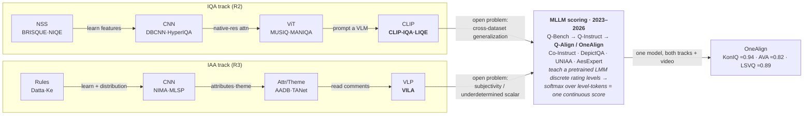
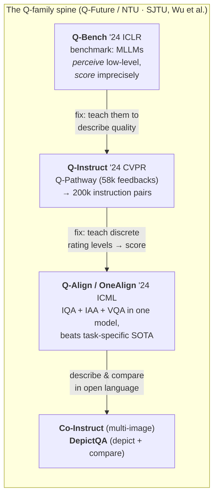

> The fourth and final report of a four-report survey series building a domain
> mental model of Image Quality Assessment (IQA) and Image Aesthetic Assessment
> (IAA). R1 mapped the problem space; R2 walked the IQA method lineage to its
> CLIP on-ramp; R3 walked the IAA lineage to its VILA on-ramp. **This report is
> the convergence finale: the 2023–2026 era in which the field stopped training
> a bespoke regressor per task and started *teaching a pretrained multimodal
> large language model (MLLM / LMM) to rate* — and IQA, IAA, and even video
> quality collapsed into one model.** It mirrors R2/R3's house style — a
> transition-labelled lineage diagram, a consolidated benchmark table, and
> "what broke → what fixed it" prose — and it closes the loop back to R1's
> thesis that IQA and IAA are the same MOS-prediction machine pointed at
> opposite questions. R4's claim is that the machine *literally became one
> model*. It assumes the whole series' vocabulary (FR/NR, KonIQ/CLIVE/AVA,
> SRCC/PLCC, the five-era arc) and does not re-explain it.

## Short answer

**The convergence is real and it is one model.** Q-Align's **OneAlign** — a
single multimodal LLM — sits at or above the top of *both* leaderboards at once:
**≈ 0.94 SRCC on KonIQ-10k** (technical quality, beating the best CLIP-era IQA
regressor) **and ≈ 0.82 SRCC on AVA** (aesthetics, beating VILA), while the same
weights also score **video** quality (LSVQ ≈ 0.89). R1's dotted line — "same
machine, opposite questions" — stopped being an analogy and became a checkpoint
file.

The pivot that made it happen, stated as R2/R3's failure/repair chain:

1. **The reframe.** Instead of fitting a numeric regressor per dataset, you take
   a pretrained MLLM (Q-Align uses **mPLUG-Owl2**) and teach it to rate the way
   humans were taught to rate: with the **five discrete words** *bad, poor,
   fair, good, excellent*. At inference you take the softmax over just those five
   level-token logits and read a continuous score as their
   $\{1,2,3,4,5\}$-weighted average. **Why discrete words, not a number:** an LLM
   is a next-*token* predictor, and 96–100 % of LMMs spontaneously answer
   "how is the quality?" with an adjective, not a numeral (Q-Align, Table 1);
   ordinal words are in-distribution for it, a continuous numeral is not — the
   discrete-level syllabus beats direct score regression by **+52.8 %** on a
   cross-dataset transfer in Q-Align's own ablation. This is the key mechanism;
   §The levels-as-tokens trick gives it room.

2. **Why it dissolves *both* frontier problems at once.** R2's open problem was
   **cross-dataset generalization** (in-domain ≈ 0.92 collapsing to ≈ 0.75); R3's
   was **subjectivity and the underdetermined scalar** (beauty is a distribution
   over disagreeing people that a number cannot hold). A pretrained MLLM attacks
   both with the *same* asset — **world knowledge + language grounding**. World
   knowledge is what lets Q-Align cross KonIQ→CLIVE at **0.860** where HyperIQA
   fell to 0.785: it did not overfit one dataset's camera population, it *knows
   what a good photo is*. And because it reasons in language about *why*, it can
   express the taste, uncertainty, and attributes a scalar erased — which is
   IAA's whole problem.

3. **The qualitative leap is explainability.** The output is no longer a bare
   number but **a score plus a natural-language critique** ("slightly
   underexposed, soft focus on the subject, pleasing warm palette"). Q-Bench
   showed general MLLMs (GPT-4V) already *perceive* low-level attributes but
   *score* imprecisely; Q-Instruct taught them to *describe* quality; Q-Align
   taught them to *rate* it — and Co-Instruct / DepictQA push on to *compare* and
   *depict* quality in open language. Aesthetics followed the identical recipe
   (UNIAA, AesExpert). The number and the reason now come from one forward pass.

The honest caveat, carried to the close: these gains cost a **multi-billion-
parameter model** against MANIQA's ~20 MB, MLLM scores raise **calibration and
reproducibility** questions, the language explanations can **hallucinate**, and
web-scale pretraining makes **benchmark contamination** a live worry — so whether
"SRCC on KonIQ/AVA" is even the right target anymore is itself now in play
(§Frontier). The practitioner's decision guide is in §Series synthesis.

## The convergence in one picture

The two lineages R2 and R3 tracked separately run into the same node. Read it as
R2's IQA relay (top) and R3's IAA relay (bottom) climbing in parallel, each
arriving at a vision-language on-ramp (LIQE / VILA), then **merging** into the
MLLM-scoring era where one model answers both — and video too.

The structural claim of the diagram: the two on-ramps are **not** two branches of
one MLLM family — they are the *same* family entered from two sides. Q-Align is
the merge node, and its unified model OneAlign is the single artifact both R2 and
R3 were climbing toward without knowing it.

## The pivot thesis: teach a pretrained MLLM to rate

Every era in R2 and R3 trained a **dedicated model for the quality function** —
BRISQUE's SVR, HyperIQA's hyper-network, MUSIQ's transformer, even LIQE's CLIP
head. The reference to "what a good image looks like" had to be *installed* into
that model, either by hand (NSS priors) or by ImageNet transfer plus MOS
fine-tuning. The convergence era's single idea is to **stop installing it and
start borrowing it**: a multimodal LLM pretrained on web-scale image-text already
carries a rich, general prior over what images are and what people say about
them, so the task shrinks from *"train a quality model"* to *"elicit and align
the quality opinion the model already has."*

This is the natural terminus of R2's CLIP on-ramp and R3's VILA on-ramp, and it
generalizes both. CLIP-IQA proved a two-word prompt ("Good photo" vs "Bad photo")
extracts a usable quality prior with zero labels; VILA proved aesthetic knowledge
is carried in the *comments* people wrote. The MLLM move asks the obvious next
question: **why stop at two prompts or a frozen dual encoder — why not let a full
language model look at the image, describe it, reason about it, and rate it?**

Why this attacks R2's and R3's *opposite* frontier problems with one instrument:

- **Against IQA's cross-dataset gap (R2).** A regressor trained on KonIQ partly
  fits KonIQ's camera population and rater pool, so it transfers poorly. An MLLM
  brings an enormous *external* prior that no single IQA dataset can perturb — it
  already knows what noise, blur, and good exposure are across the entire visual
  web — so it depends far less on the training set's idiosyncrasies. The
  cross-dataset numbers in §Consolidated benchmark bear this out directly.
- **Against IAA's underdetermined scalar (R3).** Beauty is linguistic all along
  (R3's close): the ground truth was never really a number, it was ~210 opinions
  and the comments beneath each photo. An MLLM's native output *is* language, so
  it can hold the attributes, the taste, and the disagreement a scalar threw
  away — and then, if you still want a number, collapse its rating-level
  distribution into one. The scalar becomes a *view* of a linguistic judgment
  rather than the judgment itself.

The qualitative leap over everything in R2/R3 is **explainability**: a score
*and* a reason, from one model. That is not a cosmetic bonus — it is what makes
the score auditable (you can see *why* it said 3.2) and what makes the aesthetic
score defensible (the "why" is exactly the content R3's attribute schemas were
groping toward, now open-ended).

## The Q-family: the spine of the convergence

The through-line of this era is one research cluster — the **Q-Future** group
(Nanyang Technological University and Shanghai Jiao Tong University), lead author
**Haoning Wu**, senior authors **Weisi Lin** and **Guangtao Zhai**. Their
three-paper arc *is* the convergence, and it runs benchmark → describe → rate.

### Q-Bench — the diagnosis (ICLR 2024, Spotlight)

**Q-Bench** asked a prior question: before building an MLLM scorer, *what can
general-purpose MLLMs already do on low-level vision?* It benchmarks GPT-4V,
Gemini, Qwen-VL-Plus and ~16 open models on three axes:

1. **Perception** — the **LLVisionQA** set (2,990 images, quality-attribute
   multiple-choice questions: is it blurry, noisy, well-lit?).
2. **Description** — the **LLDescribe** set (expert low-level descriptions on 499
   images), scoring how well an MLLM *narrates* quality.
3. **Assessment** — a softmax-over-tokens strategy to extract a *predictable
   quality score* from the MLLM on standard IQA datasets.

The load-bearing finding, and the one that set up the whole era: general MLLMs
have **"preliminary low-level visual skills"** — they *perceive and describe*
quality attributes well above chance — but those skills are **"unstable and
relatively imprecise"**, and the models **cannot produce precise quantitative
scores**. In R1's terms: MLLMs came pre-loaded with the low-level *perception*
IQA needs, but not the calibrated *scoring*. That precise gap is what the next
two papers close.

### Q-Instruct — teach the model to *describe* quality (CVPR 2024)

**Q-Instruct** is the instruction-tuning stage. Its data pipeline is two
datasets:

- **Q-Pathway** — **58,000 human low-level feedbacks on 18,973 images**: raw
  subjective *descriptions* ("the image is slightly dark with visible noise in
  the shadows, and the subject is out of focus"), not scores. This is the
  low-level-vision analog of VILA's comments (R3), collected on purpose.
- **Q-Instruct** — **200,000 instruction-response pairs** synthesized from
  Q-Pathway (GPT-assisted), turning descriptions into the question-answer format
  MLLM fine-tuning consumes.

Fine-tuning open MLLMs on it lifts their low-level perception and description
consistently. Q-Instruct teaches the *vocabulary and attention* of quality — the
model learns to talk about clarity, exposure, noise, and composition on demand.
What it does not yet do is emit a **calibrated, correlation-grade number**. That
is Q-Align.

### Q-Align / OneAlign — the convergence result (ICML 2024)

**Q-Align** is the paper this whole series was pointing at. It is built on
**mPLUG-Owl2**, and it produces **OneAlign: a single model trained jointly on
IQA + IAA + video VQA that beats task-specific SOTA on all three**, including
cross-dataset. The mechanism is worth its own section.

#### The levels-as-tokens trick — and why regressing a number fails

The core trick is to **not regress a number at all**. Instead:

1. **Reframe the label as five discrete words.** Human subjective studies (R1's
   ITU protocols) never asked raters for a real number — they asked for one of
   five categories: **excellent, good, fair, poor, bad**. Q-Align teaches the LMM
   exactly those words, mapping them to $\{5,4,3,2,1\}$ (excellent = 5 … bad = 1).
   During training the target is the *word*, so the loss lives entirely in the
   model's native next-token prediction — no bolted-on regression head.

2. **Convert the level-token distribution to a continuous score at inference.**
   Take the model's logits, restrict the softmax to just the five level tokens,
   and read the score as the probability-weighted average of their values (the
   paper's Eq. 4):

   $$
   S = \sum_{i=1}^{5} p_{\ell_i}\, \cdot\, i,
   \qquad
   p_{\ell_i} = \frac{e^{\,x_{\ell_i}}}{\sum_{j=1}^{5} e^{\,x_{\ell_j}}}
   $$

   where $x_{\ell_i}$ is the logit of level word $\ell_i$ and its value is
   $i \in \{1,\dots,5\}$. A confident "excellent" gives ≈ 5; a genuine tie between
   "good" and "fair" gives ≈ 3.5 — the *soft* mass over ordinal words recovers a
   continuous, well-behaved score, and it inherits the ordinal structure for free
   (adjacent words are adjacent numbers).

**Why the discrete-word detour beats regressing a numeral directly** — three
reasons, and the third is the killer:

- **An LLM is a token predictor, not a function approximator.** Continuous
  numerals ("3.7") are tokenized awkwardly and lie off the manifold of natural
  answers; ordinal adjectives are squarely *in* distribution. Q-Align (Table 1)
  measures this: **96–100 % of LMMs spontaneously answer a quality question with
  a qualitative word, not a number** — so the model wants to say "good", and the
  method leans into that instead of fighting it.
- **It matches how the labels were made.** Raters emitted categories; MOS is the
  *average* of categories. Predicting the category distribution and averaging it
  mirrors the data-generating process, so the target is aligned with the human
  protocol rather than an artifact of it.
- **It generalizes far better.** The paper's ablation (Table 11) shows the
  discrete-level syllabus beats a direct score-regression variant by **+52.8 %
  SRCC on a SPAQ→KADID cross-dataset transfer** — the discrete words carry
  meaning that transports across datasets where a fitted numeric scale does not.
  This is precisely the mechanism that dents R2's generalization frontier.

#### OneAlign — one model, three tasks

Trained with this one syllabus on a mixture of KonIQ (IQA), AVA (IAA), and LSVQ
(video VQA), **OneAlign** is a single set of weights that tops all three. The
headline in-domain numbers (verified against the paper's tables):

- IQA: **KonIQ 0.941 / 0.950 SRCC/PLCC**, SPAQ 0.932 / 0.935, KADID 0.941 / 0.942.
- IAA: **AVA 0.823 / 0.819**.
- Video: **LSVQ_test 0.886 / 0.886**, KoNViD-1k (cross) 0.876 / 0.888.

The task-specific Q-Align variants match or exceed the best of R2 and R3 head to
head: on IQA it beats **CLIP-IQA+** (KonIQ 0.895 → 0.940; cross KonIQ→CLIVE
0.805 → 0.860), and on aesthetics it beats **VILA** (AVA 0.774 → 0.822). One
model, both of the series' leaderboards, at the top.

### Co-Instruct and DepictQA — the comparative / descriptive frontier

Q-Align emits a score with an implicit critique. The next question is whether an
MLLM can do the genuinely *linguistic* quality tasks a regressor never could:

- **Co-Instruct** (Q-Future, ECCV 2024 Oral) — **open-ended, multi-image quality
  *comparison***. It is trained on **Co-Instruct-562K** and evaluated on
  **MICBench** (the first multi-image comparison benchmark for LMMs), and it
  answers questions like "which of these three photos has the best exposure, and
  why?" — comparative judgment across images in free language, which single-image
  scoring cannot express. This is R1's *pairwise-comparison* subjective protocol
  (the most discriminative one) reborn as an LMM capability.
- **DepictQA** (Zhiyuan You, Tianfan Xue, Chao Dong et al., CUHK / XPixel — a
  *different* group from Q-Future; ECCV 2024) — *"Depicting Beyond Scores"*:
  **describe-and-compare image quality in natural language** as a hierarchical
  descriptive judgment rather than a scalar. Its follow-up **DepictQA-Wild**
  scales the idea to in-the-wild data. DepictQA is the clearest statement that
  the *description is the assessment* — the score is a lossy projection of a
  richer linguistic verdict.

Together these mark the frontier moving from *"emit a better number"* to *"do the
quality task in language"* — describe, compare, reason — which reframes what the
benchmark should even measure (§Frontier).

## The aesthetic arm: aesthetics and quality now share one recipe

R3 ended on VILA learning aesthetics from user comments. The MLLM era carries
that forward and lands aesthetics on the **same instruction-tuning recipe as
quality** — proof that R1's "same machine" thesis holds on the aesthetic side too.

- **Q-Align's aesthetic arm** is the simplest evidence: the *identical* discrete-
  level method, trained on **AVA**, gives **0.822 / 0.817** SRCC/PLCC — the top of
  R3's AVA ladder — with no aesthetic-specific architecture. Quality and beauty
  are the same five words pointed at a different question, exactly R1's claim.
- **UNIAA** (*Unified Multi-modal Image Aesthetic Assessment*, Kuaishou/Kling +
  PKU, 2024) — a **unified aesthetic** baseline and benchmark. **UNIAA-Bench**
  spans three levels that echo Q-Bench — aesthetic **perception, description, and
  assessment** — and **UNIAA-LLaVA** is the model, trained on aesthetic
  visual-instruction data consolidated from multiple existing IAA datasets. It is
  Q-Bench's diagnosis structure ported to taste.
- **AesExpert** (Yipo Huang, Leida Li, Weisi Lin, Guangming Shi et al., Xidian
  University; ACM MM 2024) — the aesthetics instruction-tuning corpus done at
  scale: **AesMMIT**, an *Aesthetic Multi-Modality Instruction Tuning* dataset of
  **409K instructions over 21,904 images with 88K human feedbacks**, and the
  resulting **AesExpert** model (LLaVA-1.5 based). It is Q-Instruct's move — teach
  the model to *describe* — pointed at aesthetics: composition, colour harmony,
  mood, story, in open language.

The recipe is now visibly identical across both tracks: **benchmark the MLLM's
native ability (Q-Bench / UNIAA-Bench) → instruction-tune it to describe
(Q-Instruct / AesExpert / AesMMIT) → align it to rate (Q-Align, both arms).**
Aesthetics is no longer a separate craft; it is the quality recipe with a
different training set and a richer critique.

## Consolidated benchmark: one model at the top of both columns

This is the payoff table. All numbers are **SRCC / PLCC**, higher = better; blank
= the method's own paper does not report that column. The two tracks R2 and R3
kept apart now meet in the bottom two rows: **Q-Align and OneAlign are at or above
the top of the KonIQ column *and* the AVA column simultaneously** — the literal
one-model convergence.

### In-domain (the convergence payoff)

| Method | Era / track | KonIQ (IQA) | AVA (IAA) |
|---|---|---|---|
| MUSIQ | ViT · both | 0.916 / 0.928¹ | 0.726 / 0.738 |
| MANIQA | ViT · IQA (R2) | 0.893²  | — |
| CLIP-IQA+ | CLIP · IQA (R2) | 0.895 / 0.909 | — |
| LIQE | CLIP · IQA (R2) | 0.919 / 0.912 | 0.776³ |
| VILA-R | VLP · IAA (R3) | — | 0.774 / 0.774 |
| **Q-Align** | **MLLM** | **0.940 / 0.941** | **0.822 / 0.817** |
| **OneAlign** | **MLLM · unified** | **0.941 / 0.950** | **0.823 / 0.819** |
| DeQA-Score | MLLM (2025) | **0.941 / 0.953** | — |

The bottom block is the whole four-report arc in three rows: a single family of
models tops the IQA leaderboard R2 built *and* the aesthetics leaderboard R3
built, and OneAlign does it with **one set of weights** that also scores video
(LSVQ 0.886, not shown). No method above the line reports both columns
competitively; every method below does.

### Cross-dataset — where the generalization advantage shows (dissolving R2's frontier)

The honest test from R2 (§Generalisation): train on one authentic set, test on
another. This is where the MLLM's external world-knowledge pays off most clearly.
All rows are **train on KonIQ-10k → test on the named set**, SRCC:

| Model | → CLIVE | → SPAQ | → KADID | In-domain KonIQ (ref) |
|---|---|---|---|---|
| HyperIQA (CNN, R2) | 0.785 | — | — | 0.906 |
| CLIP-IQA+ (CLIP, R2) | 0.805 | — | — | 0.895 |
| **Q-Align (MLLM)** | **0.860** | **0.887** | 0.684⁴ | 0.940 |

Read the CLIVE column top to bottom: the CNN regressor drops to 0.785
cross-dataset, the CLIP method to 0.805, and **Q-Align holds 0.860** — the
smallest in-domain→cross-dataset collapse in the series, and direct evidence that
the pretrained prior is what generalizes. R2's frontier problem is not *solved*
(KADID synthetic distortions still drop it to 0.684), but it is materially dented
by exactly the ingredient R2 predicted would help: language grounding on top of a
massive external prior.

*Footnotes.* ¹MUSIQ KonIQ is 0.916 in its own paper; some re-evaluations report
0.929 (R1 used the latter) — treat sub-0.01 gaps as protocol noise. ²MANIQA's own
paper never tabulates KonIQ at paper protocol; 0.893 is the pyiqa whole-set number
(optimistic, different protocol — carried from R2, flagged there). ³LIQE AVA from
R1's reference table. ⁴Q-Align KonIQ→KADID 0.684 / 0.674: KADID is *synthetic*, so
this is a domain shift (authentic→synthetic) as much as a dataset shift. All
Q-Align / OneAlign numbers are read from the Q-Align paper's tables; DeQA-Score
KonIQ from its own Table 3. **Not attributed to Q-Align: FLIVE / PaQ-2-PiQ** — the
Q-Align paper's tables do not report it, so despite the task's expectation this
report leaves the FLIVE column blank rather than guess. **No direct MANIQA-vs-
OneAlign row exists** in Q-Align's tables; its named IQA baseline is CLIP-IQA+,
and the MANIQA cell above is cross-sourced from R2 for context only.

## The frontier: what MLLM scoring did *not* solve

The convergence is a real jump, but R2/R3's discipline was to end on the open
problem, and MLLM scoring opens as many as it closes.

- **Score calibration and reproducibility.** A softmax over five tokens is a
  *soft* score, but it is sensitive to prompt wording, decoding temperature, and
  checkpoint — two runs of "the same" MLLM scorer can disagree in ways a frozen
  20 MB regressor never would. **DeQA-Score** (You et al., CVPR 2025) attacks this
  directly: model the whole *score distribution* with a Thurstone fidelity loss
  rather than a point, improving calibration (KonIQ 0.941 / 0.953). Calibration is
  now a named subproblem, not a footnote.
- **Hallucination in the explanation.** The critique that makes the score
  auditable can also be *confidently wrong* — an MLLM may narrate "motion blur"
  that isn't there, or rationalize a score after the fact. A fluent, plausible,
  incorrect reason is arguably worse than no reason, because it invites trust.
  The descriptive-IQA line (DepictQA, Co-Instruct) makes this failure mode
  first-class rather than hidden inside a scalar.
- **Benchmark saturation and contamination.** KonIQ in-domain is at ≈ 0.94 and
  AVA at ≈ 0.82 — near the noise ceiling of the human labels themselves. Worse,
  web-scale pretraining makes **train/test contamination** a live risk: if AVA or
  KonIQ images (or discussions of them) sat in the pretraining corpus, a high SRCC
  may measure memorization, not perception. This is unfalsifiable from the outside,
  and it undermines the very leaderboards the field optimizes.
- **Compute cost.** OneAlign is a multi-billion-parameter MLLM; MANIQA is ≈ 20 MB
  and runs on a CPU, NIQE in milliseconds with no GPU. For on-device or high-
  throughput scoring the MLLM is simply the wrong tool — a three-order-of-magnitude
  cost gap for a ~0.02–0.05 SRCC gain and an explanation you may not need.
- **Is SRCC-on-AVA/KonIQ even the right target anymore?** This is the deepest
  question the era raises. If the model can *describe*, *compare*, and *reason*
  about quality (Q-Bench, Co-Instruct, DepictQA), then reducing it to one
  correlation coefficient on one dataset throws away most of what it can do — and
  rewards contamination and overfitting. The frontier is arguably shifting from
  *"higher SRCC"* to *"correct, faithful, non-hallucinated low-level
  description and comparison"* — a benchmark like Q-Bench, not a number like AVA
  SRCC.

And the field's third axis is folding in too. R1 kept **generative-image quality**
("how *real*?" — evaluating diffusion output) as a separate cousin; **video
quality (VQA)** was a separate literature again. Both are now being absorbed by the
same MLLM scorers: OneAlign *already* scores video (LSVQ, KoNViD); **Q-Bench-Video**
(CVPR 2025) benchmarks LMM video-quality understanding; and **Q-Eval-100K** (Zhang
et al., CVPR 2025 Oral — 100K text-to-image/video instances, 960K human MOS) with
its **Q-Eval-Score** evaluator points the same machinery at *generated* content's
quality and prompt alignment. R1's three orthogonal axes — degraded, beautiful,
real — are converging on one linguistic scorer.

## Series synthesis: the whole mental model, snapped shut

Step back across all four reports. **IQA and IAA climbed the identical five-rung
ladder — NSS → CNN → ViT → CLIP → MLLM — in two parallel tracks, and the two
tracks were one machine the whole time.** R1 asserted it as a thesis ("same
MOS-prediction machine, opposite questions"); R2 and R3 walked the two tracks and
showed the rungs matching (NIMA's distribution loss served both; MUSIQ scored both;
the same MAML machinery answered distortions in MetaIQA and raters in BLG-PIAA);
R4 shows the tracks **literally merging into one model** — OneAlign, one set of
weights that answers *how degraded?*, *how beautiful?*, and *how good is this
video?* in the same five words.

The arc, one line per rung, both tracks at once:

| Rung | IQA (R2) | IAA (R3) | What the rung removed |
|---|---|---|---|
| **NSS / rules** | BRISQUE, NIQE | Datta, Ke | — (hand-built priors) |
| **CNN** | DBCNN, HyperIQA | NIMA (EMD), MLSP | the handcrafted-feature dependency |
| **ViT** | MUSIQ, MANIQA | MUSIQ (reused) | the fixed-resolution-resize dependency |
| **CLIP / VLP** | CLIP-IQA, LIQE | VILA | the labelled-MOS dependency |
| **MLLM** | Q-Align | Q-Align (AVA arm) | the *bespoke-model-per-task* dependency |

Each rung removed one dependency of the last; the final rung removed the biggest
one — the need for a separate model at all. R1's dotted line is now a solid
checkpoint.

**But the crown of the mental model is knowing what to reach for.** "Use the MLLM"
is wrong more often than it is right. The decision guide, by constraint:

- **Need ≥ 0.9 SRCC *and* interpretability, compute available (server / batch):**
  **Q-Align / OneAlign** (or **DeQA-Score** when calibration matters most). You get
  the top of both leaderboards, cross-dataset robustness, and a natural-language
  reason. This is the right default *only* when you can afford billions of
  parameters and want the explanation.
- **Need tiny / fast / on-device, or high throughput:** **MANIQA** or **HyperIQA**
  (≈ 0.90 KonIQ, a few MB–tens of MB, GPU-optional), or **NIQE** when you need
  *zero* training, zero labels, and millisecond CPU scoring and can accept ≈ 0.66
  on authentic photos. The MLLM's ~0.02–0.05 SRCC edge does not justify a
  1000× cost here.
- **Need a *perceptual training loss* (super-resolution, diffusion, codecs):**
  **LPIPS** or **DISTS** (R2's parallel FR branch) — differentiable, reference-
  based, and the field's standard. MLLM scorers are not differentiable losses; do
  not reach for them here.
- **Need aesthetics specifically:** the same tiering — **NIMA** (distribution,
  tiny) or **MLSP / VILA** (native-res / comment-pretrained, mid-size) for
  cheap scoring; **Q-Align** or **AesExpert / UNIAA** when you want the score plus
  an open-language critique of composition and mood.
- **Need to *compare* images, or a *reason*, not a number:** **Co-Instruct**
  (multi-image comparison) or **DepictQA** (descriptive judgment) — the tasks a
  regressor structurally cannot do.

That table and that guide are the deliverable of the whole series: not "MLLMs
won", but a map of a single problem — predict a human opinion of an image — with a
five-era ladder, two tracks that are one machine, and a clear-eyed sense of which
rung to stand on for which job. R1 drew the map; R2 and R3 walked the two paths;
R4 is where they meet, and where the practitioner picks a tool with the whole
picture in view.

## Sources

**The Q-family (Q-Future · NTU / SJTU, Wu et al.).**
[Q-Bench (Wu, Zhang, Zhang, Chen, Liao, Wang, Li, Sun, Yan, Zhai, Lin; ICLR 2024 Spotlight, arXiv:2309.14181)](https://arxiv.org/abs/2309.14181) ([code](https://github.com/Q-Future/Q-Bench)) ·
[Q-Instruct (Wu, Zhang, Zhang, Chen, Liao, Wang, Xu, Li, Hou, Zhai, Xue, Sun, Yan, Lin; CVPR 2024, arXiv:2311.06783)](https://arxiv.org/abs/2311.06783) ([code](https://github.com/Q-Future/Q-Instruct)) ·
[Q-Align / OneAlign (Wu, Zhang, Zhang, Chen, Liao, Li, Gao, Wang, Zhang, Sun, Yan, Min, Zhai, Lin; ICML 2024, arXiv:2312.17090)](https://arxiv.org/abs/2312.17090) ([code](https://github.com/Q-Future/Q-Align)) ·
[Co-Instruct (Wu, Zhu, Zhang, Zhang, Chen, Liao, Li, Wang, Sun, Yan, Liu, Zhai, Wang, Lin; ECCV 2024 Oral, arXiv:2402.16641)](https://arxiv.org/abs/2402.16641) ([code](https://github.com/Q-Future/Co-Instruct)).

**Descriptive / comparative IQA (other groups).**
[DepictQA — "Depicting Beyond Scores" (You, Li, Gu, Yin, Xue, Dong; ECCV 2024, arXiv:2312.08962)](https://arxiv.org/abs/2312.08962) ([code](https://github.com/XPixelGroup/DepictQA)), follow-up [DepictQA-Wild (arXiv:2405.18842)](https://arxiv.org/abs/2405.18842) ·
[Compare2Score (Zhu, Wu, Li, Zhang, Chen, Zhu, Fang, Zhai, Lin, Wang; NeurIPS 2024, arXiv:2405.19298)](https://arxiv.org/abs/2405.19298).

**Aesthetic arm.**
[UNIAA (Zhou, Wang, Lin, Su, Chen, Tao, Zheng, Yuan, Wan, Zhang; arXiv:2404.09619)](https://arxiv.org/abs/2404.09619) ([code](https://github.com/KlingTeam/Uniaa)) ·
[AesExpert / AesMMIT (Huang, Sheng, Yang, Yuan, Duan, Chen, Li, Lin, Shi; ACM MM 2024, arXiv:2404.09624)](https://arxiv.org/abs/2404.09624) ([code](https://github.com/yipoh/AesExpert)).

**Calibration / reasoning / generative-and-video frontier.**
[DeQA-Score (You, Cai, Gu, Xue, Dong; CVPR 2025, arXiv:2501.11561)](https://arxiv.org/abs/2501.11561) ([code](https://github.com/zhiyuanyou/DeQA-Score)) ·
[Q-Insight (Li, Zhang, Zhao, Zhang, Li, Zhang, Zhang; 2025, arXiv:2503.22679)](https://arxiv.org/abs/2503.22679) ·
[Q-Eval-100K / Q-Eval-Score (Zhang, Kou, Wang, Li, Sun, … Liu, Zhai; CVPR 2025 Oral, arXiv:2503.02357)](https://arxiv.org/abs/2503.02357) ([code](https://github.com/zzc-1998/Q-Eval)) ·
[Q-Bench-Video (Q-Future; CVPR 2025, arXiv:2409.20063)](https://arxiv.org/abs/2409.20063) ([code](https://github.com/Q-Future/Q-Bench-Video)).

**Prior reports in this series.**
[R1 — Foundations](/posts/image-quality-and-aesthetic-assessment-foundations/) ·
[R2 — IQA methods (NSS to CLIP)](/posts/image-quality-assessment-methods-nss-to-clip/) ·
[R3 — IAA methods (NIMA to VILA)](/posts/image-aesthetic-assessment-methods-nima-to-vila/).

**Benchmark numbers.** Q-Align / OneAlign SRCC/PLCC (KonIQ, SPAQ, KADID, AVA,
LSVQ, KoNViD; cross-dataset KonIQ→CLIVE/SPAQ/KADID) and the levels-as-tokens
equation and ablations (Tables 1, 4, 11) are read from the
[Q-Align paper](https://arxiv.org/abs/2312.17090). DeQA-Score KonIQ 0.941/0.953
from its Table 3. R2/R3 comparison rows (MUSIQ, MANIQA, CLIP-IQA+, LIQE, VILA-R)
carry their flags from those reports.

**Flagged as not fully verified against a primary source** (stated, not asserted
as fact): **Compare2Score** and **Q-Insight** author lists were verified from a
single search-result source, not a direct arXiv author-block fetch — names may be
incomplete or mis-ordered. **Q-Insight** carries the "Q-" name but is a *different
group* (Jian Zhang et al., not Q-Future) — do not attribute it to Haoning Wu's
cluster. **FLIVE / PaQ-2-PiQ is not reported in Q-Align's tables**, so no OneAlign
FLIVE number is stated here despite the series' interest in that column.
**MANIQA does not appear as a row in Q-Align's IQA tables** (its named IQA
baseline is CLIP-IQA+); the MANIQA KonIQ cell is a cross-sourced pyiqa whole-set
number from R2, on a different, optimistic protocol. **UNIAA** has no confirmed
peer-reviewed venue (arXiv-only as verified). Corresponding-author designations
(Weisi Lin on the three Q-papers) are inferred from consistent last-author
placement, not from a marked asterisk in the fetched abstracts. **Weixia Zhang is
an author on Q-Align only**, not on Q-Bench or Q-Instruct — the "canonical
Q-cluster" author list is over-broad on that name.
