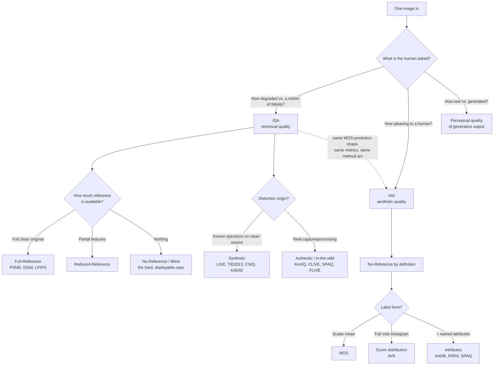
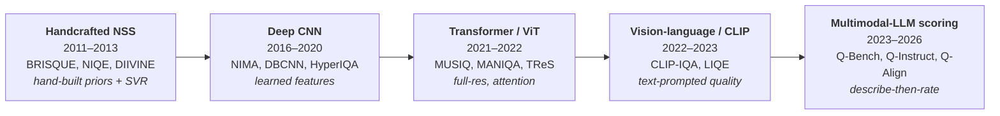

> The first of a four-report survey series building a domain mental model of
> Image Quality Assessment (IQA) and Image Aesthetic Assessment (IAA). This
> report is the foundations / map — the taxonomy, datasets, and evaluation
> methodology that the later three reports (IQA methods, IAA methods,
> convergence / LLM-scoring) all hang off, written so a reader who stops after
> it already has the mental map of the whole problem space. Foundations only —
> no deep-dive into individual model architectures.

## Short answer

**IQA and IAA are two prediction problems with the same shape and opposite
questions.** Both take one image and predict a human **Mean Opinion Score
(MOS)**; both are scored by how well the prediction *ranks* against human
opinion; both climbed the identical ladder from hand-crafted statistics to
CNNs to transformers to multimodal LLMs. They differ in what the human was
asked:

- **IQA** asks *"how degraded is this image?"* — a fidelity question about
  noise, blur, compression, and transmission artifacts. Low-level, largely
  content-agnostic.
- **IAA** asks *"how beautiful is this image?"* — a taste question about
  composition, lighting, color harmony, and subject. High-level, deeply
  content-dependent.
- A **third cousin**, the *perceptual quality* of GAN/diffusion output, is a
  distinct axis again — an image can be pristine (high IQA), gorgeous (high
  IAA), and still obviously fake. Do not conflate the three.

**Four facts are load-bearing for everything the later reports will say:**

1. **The hard, useful case is No-Reference (NR / blind).** IQA splits by how
   much of the undistorted original you get: **Full-Reference (FR)**,
   **Reduced-Reference (RR)**, **No-Reference (NR)**. FR is nearly solved
   (SRCC ≈ 0.97–0.98 on legacy sets); real deployment — rating a photo off a
   phone, a web upload, a generated image — has *no reference*, so NR is where
   the field lives. IAA is NR by definition: beauty has no ground-truth
   reference.
2. **Datasets drove the methods, in three waves.** Small **synthetic**-
   distortion sets (LIVE 779 images, TID2013 3,000) where a clean source is
   degraded by known operators → large **authentic** "in-the-wild" sets
   (KonIQ-10k, FLIVE ~40k) with real messy distortions and no reference → and
   for aesthetics, **AVA's 255,530 images labelled with full score
   *distributions*** rather than a single mean. Each wave exists because the
   previous one's models overfit and stopped transferring to real photos.
3. **The labels are distributions, not points.** A MOS is the mean of tens to
   thousands of noisy human votes. Modelling the *whole* vote histogram
   (NIMA's EMD loss) or the *ranking* between images (pairwise/ranking losses)
   beats regressing the scalar mean — because the disagreement between raters
   is signal, not noise.
4. **The metrics are correlations, not accuracy — and PLCC hides a fitting
   step almost everyone forgets to mention.** The field reports **SRCC**
   (rank monotonicity), **PLCC** (linear accuracy, *computed after a
   5-parameter logistic re-mapping of the predictions*), **KRCC** (Kendall),
   and **RMSE**. "Good" today: ≈ **0.94 SRCC/PLCC on KonIQ-10k** (IQA
   in-the-wild) and ≈ **0.82 SRCC on AVA** (aesthetics). Binary good/bad
   accuracy on AVA (~81%) is a legacy metric and a bad one.

The rest of this report is the map behind those four facts: the taxonomy
(§Taxonomy), the dataset spine as one comparison table (§Datasets), how the
human labels are collected (§Subjective studies), the metrics with their
formulas and reference numbers (§Metrics), and a one-paragraph preview of the
method arc that R2/R3/R4 fill in (§The arc).

## The problem space in one picture

Read the diagram top-down: the *question* forks first (IQA vs IAA vs
generative-perceptual), then IQA forks twice more — by **reference
availability** and by **distortion origin** — while IAA is reference-free and
forks by **label richness**. The dotted line is the punchline of the whole
survey: the two problems are technically almost the same machine pointed at
different targets, which is why R4 can credibly talk about a single model
scoring both.

### IQA vs IAA vs generative-perceptual — keeping three axes apart

| | Question | Governed by | Content-dependence | Reference exists? |
|---|---|---|---|---|
| **IQA** (technical) | How *degraded*? | noise, blur, compression, banding, transmission loss | low — a blurry cat and a blurry car are both "blurry" | sometimes (FR/RR); usually not (NR) |
| **IAA** (aesthetic) | How *beautiful*? | composition, lighting, color harmony, subject, story | high — the content *is* the aesthetic | never |
| **Generative perceptual** | How *real / natural*? | artifact signatures, texture plausibility, mode coverage | medium | no single reference (distributional) |

The three are **orthogonal, not a scale**. A RAW file straight off a sensor
can be technically flawless (high IQA) and aesthetically dull (low IAA). A
grainy film photograph can be technically "degraded" (low IQA) yet a
masterpiece (high IAA) — the grain is intentional. A diffusion sample can look
sharp and pretty (high IQA + IAA) while a human instantly clocks it as fake
(low generative-perceptual quality). The generative axis is measured
differently again — usually by **distributional** metrics (FID, and
perceptual distances like LPIPS) that compare a *set* of generated images to a
*set* of real ones, rather than scoring one image against a MOS — so it sits
adjacent to this survey rather than inside it, and R4 is where it re-enters as
LLM scorers begin to absorb all three.

## Taxonomy: reference availability and distortion origin

IQA is cut along two independent axes. Getting these straight is the single
most useful thing in this report, because every method in R2 announces itself
by where it sits on both.

### Axis 1 — reference availability

**Full-Reference (FR).** You have the pristine original *and* the distorted
copy, pixel-aligned. The task is to measure the perceptual distance between
them. This is the classic, largely-solved case: PSNR and SSIM are FR;
learned FR metrics (LPIPS, DISTS) are the modern version. FR is what you use
inside a codec or a super-resolution pipeline where the clean source is in
hand. On legacy synthetic sets, FR correlations are saturated (SRCC ≈ 0.98).

**Reduced-Reference (RR).** You do not have the full original, but you have a
compact set of features extracted from it (transmitted as side information —
a few hundred bytes over a broadcast channel, say). RR trades reference
completeness for bandwidth. It is the least-studied branch today because its
motivating use case (monitoring a transmission channel where you control the
sender) is narrow.

**No-Reference / Blind (NR / BIQA).** You have *only* the image. No original,
no side information. This is the hard case and the one that matters: every
real deployment — grading a user's phone upload, filtering a photo library,
ranking generated images — arrives with no reference. **NR is where the last
fifteen years of research concentrated, and it is the entire subject of R2.**
IAA is inherently NR: there is no "aesthetically pristine original" of a
photograph to compare against.

> **Why NR is genuinely hard.** With no reference, the model cannot measure a
> *distance*; it must have learned what an undistorted natural image looks like
> and detect deviation from that prior. Classical NR methods (BRISQUE, NIQE)
> did this with hand-crafted **Natural Scene Statistics**; modern NR methods
> learn the prior from data. The reference has to live *inside the model*.

### Axis 2 — distortion origin (this is what drove the datasets)

**Synthetic distortion.** Take a small set of pristine images, apply known
degradation operators (JPEG at a chosen quality, Gaussian blur at a chosen
σ, additive white noise at a chosen variance) at graded levels. You get a
clean design matrix — *reference × distortion-type × level* — and, for free,
a perfectly aligned reference for every distorted image (so synthetic sets
support FR *and* NR). LIVE, TID2013, CSIQ, and KADID-10k are all built this
way.

**Authentic / in-the-wild distortion.** Real photographs carry *mixtures* of
distortions from capture and processing — sensor noise ∩ motion blur ∩
over-compression ∩ bad exposure, all at once, entangled and unlabelled — and
crucially **no clean reference exists**. KonIQ-10k, LIVE-in-the-Wild (CLIVE),
SPAQ, and PaQ-2-PiQ/FLIVE are authentic sets. They can only be NR.

**Why the field abandoned synthetic-only.** Models trained on synthetic
distortions learned to recognise *those specific operators* and collapsed on
real photos whose distortions are compound and out-of-distribution — a
classic overfit-to-the-degradation-model failure. The move to authentic
in-the-wild sets around 2016–2020 is the central dataset transition in IQA,
and it is why NR methods after ~2019 are trained and benchmarked primarily on
KonIQ and FLIVE, not LIVE and TID. Keep this in mind reading R2: a method's
year tells you which distortion world it was built for.

## Datasets: the spine of the whole field

This is the reference table the later three reports point back to. Methods
come and go; these datasets are the fixed coordinate system everyone reports
against.

| Dataset | Year | Task | Images | Distortion | Label | Subjective study |
|---|---|---|---|---|---|---|
| **LIVE IQA** (R2) | 2006 | IQA | 779 (+29 ref) | synthetic, 5 types | **DMOS** 0–100 | ~23 subjects, in-lab, single-stimulus w/ hidden reference |
| **CSIQ** | 2010 | IQA | 866 (+30 ref) | synthetic, 6 types | **DMOS** 0–1 | ~35 subjects, ~5,000 ratings, in-lab |
| **TID2013** | 2013 | IQA | 3,000 (25 ref × 24 × 5) | synthetic, **24 types** × 5 | **MOS** 0–9 | **971 observers**, ~524k pairwise comparisons |
| **KADID-10k** | 2019 | IQA | 10,125 (81 ref × 25 × 5) | synthetic, 25 types × 5 | **MOS** | 30 crowd ratings/image |
| **CLIVE** (LIVE-in-the-Wild) | 2016 | IQA | 1,162 | **authentic** | **MOS** | **>350k scores**, >8,100 MTurk workers |
| **KonIQ-10k** | 2020 | IQA | 10,073 | **authentic** | **MOS** | **1.2M ratings**, 1,459 crowd workers |
| **SPAQ** | 2020 | IQA | 11,125 | authentic (66 phones) | **MOS** + 5 attributes + EXIF | in-lab, controlled |
| **PaQ-2-PiQ / FLIVE** | 2020 | IQA | ~39,810 + **120k patches** | authentic | **MOS** (picture + patch) | **~4M human judgments** |
| **AVA** | 2012 | **IAA** | **255,530** | none | **score distribution** (votes 1–10) + 66 tags + 14 styles | DPChallenge community, avg ~210 votes/image |
| **AADB** | 2016 | IAA | 10,000 | none | aesthetic score + **11 attributes** | 5 MTurk raters/image, identity tracked |
| **PARA** | 2022 | IAA | 31,220 | none | score + 9 objective + 4 subjective attributes + rater traits | **438 subjects**, ~25 annotations/image |
| **TAD66K** | 2022 | IAA | 66,327 | none | theme-aware scores, 47 themes | **>1,200 annotations/image** (dense) |
| **EVA** | 2020 | IAA | 4,070 | none | MOS + 4 attributes + difficulty + importance weights | ≥30 votes/image |

*Ref = number of pristine reference images. DMOS vs MOS explained in
§Subjective studies. Study-scale figures are the primary-source numbers;
where a paper did not state a subject/rating count I have left it off rather
than guess (SPAQ's exact rating count, PARA's total annotations, and EVA's
total votes are not stated in their abstracts).*

### The three transitions this table encodes

**1. Small synthetic → large synthetic (LIVE/TID → KADID).** LIVE's 779
images and TID's 3,000 are too small to train a deep network without
overfitting. KADID-10k (10,125 images) and its unlabelled companion
KADIS-700k (700,000 images for weak supervision) exist to feed data-hungry
CNNs while keeping the clean synthetic design.

**2. Synthetic → authentic (→ KonIQ, CLIVE, SPAQ, FLIVE).** The transition
that mattered most, for the reason in §Taxonomy: synthetic-trained models did
not survive contact with real photos. KonIQ-10k sampled 10,073 real images
from YFCC100M and collected **1.2 million** crowd ratings; FLIVE went further
with ~40k pictures plus 120k cropped patches and **~4 million** judgments,
enabling patch-level supervision. These are the modern NR-IQA proving grounds.

**3. Scalar MOS → score distribution (AVA).** AVA is the aesthetics
juggernaut — **255,530 images**, each with the *full histogram* of votes
(each image rated 1–10 by on average ~210 DPChallenge users), plus 66
semantic tags and 14 photographic-style labels. The distribution label is not
a nicety: it is what let NIMA (2017) predict a vote *histogram* via EMD loss
and recover both a mean score and a disagreement/uncertainty signal. AADB,
PARA, and EVA add **named attributes** (rule-of-thirds, color harmony, depth
of field…), which is what makes *explainable* aesthetics and, later, LLM
"describe-then-score" possible. TAD66K adds **theme awareness** (a landscape
and a macro shot are not judged by the same criteria).

> **Why this ordering is load-bearing for R2/R3/R4.** Method papers are
> unintelligible without knowing which dataset world they target. A 2013
> method reporting only LIVE/TID SRCC and a 2023 method reporting KonIQ/FLIVE
> SRCC are not comparable — they solved different problems. When R2 tabulates
> NR-IQA methods, the columns will be KonIQ and FLIVE; when R3 tabulates IAA,
> the column will be AVA. This table is why.

## Subjective studies: where the labels come from

Every number in every benchmark traces back to humans looking at images and
scoring them. The protocol shapes what the label *means*, and three protocol
choices ripple all the way into the loss functions R2/R3 use.

### How a score is collected

The governing standards are **ITU-R BT.500** (television picture quality, now
BT.500-14) and **ITU-T P.910** (multimedia/video), which specify viewing
distance, display calibration, ambient light, observer screening, and a
minimum of ~15 observers. The three method families:

- **Single-stimulus / Absolute Category Rating (ACR).** One image at a time,
  rated on a 5-point (bad…excellent) or continuous scale. Fastest — most
  ratings per unit time — so it dominates the large crowdsourced sets (CLIVE,
  KonIQ, SPAQ, FLIVE). The **ACR-HR** variant hides the reference among the
  stimuli.
- **Double-stimulus.** Reference and test shown together or in sequence;
  the subject rates the pair. **DSIS** (impairment scale) and **DSCQS**
  (rate both, take the difference) are the variants. Slower but robust, and
  it *requires* a reference — so it is a synthetic-set method.
- **Pairwise comparison.** Two images per trial; the subject picks the
  better one. Highest discriminative accuracy — it resolves near-ties that an
  absolute scale blurs — but the number of trials grows quadratically.
  **TID2013** used pairwise (a Swiss-tournament design, ~524k comparisons),
  which is why its labels are unusually reliable for a set its size.

### MOS vs DMOS — a genuine gotcha

- **MOS** (Mean Opinion Score) = the mean of raw opinion scores. Higher is
  usually better. Used by TID2013, KADID, KonIQ, CLIVE, SPAQ, FLIVE, and all
  the IAA sets.
- **DMOS** (Difference MOS) = the mean of *difference* scores. Per subject you
  compute score(reference) − score(test), *then* average. This cancels each
  subject's personal bias and normalises against how good the reference was.
  **Higher DMOS = more degradation = worse** — the opposite polarity of MOS.
  Used by **LIVE IQA** and **CSIQ**, both of which show a hidden reference in
  the session so the difference can be taken.

The sign flip is a real trap: a model reported as SRCC 0.97 against DMOS is
predicting *degradation*, and its raw output correlates *negatively* with
quality. Any cross-dataset comparison has to reconcile MOS vs DMOS polarity
first.

### What a distribution buys over a scalar, and the ambiguity problem

A MOS is a lossy summary of a noisy vote histogram. Two images with identical
mean 5.5 can have wildly different spreads — one a confident "everyone says
mediocre", the other a polarising "half love it, half hate it". The **spread
is signal**: it measures rater disagreement, which is high exactly for
aesthetically ambiguous or unconventional images.

- **AVA keeps the full histogram**, so a model can be trained to predict the
  *distribution* (NIMA's squared-EMD loss, §Metrics) and recover both mean
  and uncertainty. This is why distribution prediction beats scalar
  regression, and why R3's aesthetics methods predict histograms.
- **AADB tracks rater identity**, which lets you build *pairwise/ranking*
  losses (image A > image B according to rater r) that are robust to each
  rater's scale offset. This is why ranking losses recur across IQA and IAA.

The deeper problem this exposes: **the label is intrinsically uncertain.** A
scalar MOS with a wide confidence interval is a soft target, not a hard one.
Methods that acknowledge this — predicting distributions (EMD), predicting
relative order (ranking), or, in R4, predicting a *soft* discretised score
distribution (DeQA-Score) — consistently beat methods that regress the mean
as if it were exact.

## Metrics: how predictions are scored (with the fitting step everyone skips)

IQA/IAA methods are **not** scored by accuracy. They are scored by how well a
predicted score *correlates* with the human MOS across a test set, along two
independent qualities: **monotonicity** (does higher predicted mean higher
human?) and **linear accuracy** (are the values, after alignment, close?).
Four numbers, always reported together.

### SRCC / SROCC — Spearman rank-order correlation

Pearson correlation computed on the **ranks** of predicted vs. subjective
scores. It measures **prediction monotonicity** and is completely insensitive
to any monotonic (even nonlinear) rescaling of the predictions — all it cares
about is whether the ordering matches. Range [−1, 1]; it is the headline
number in most papers because ordering is what applications actually consume
(rank these photos, pick the best frame).

### PLCC — Pearson linear correlation, *after logistic re-mapping*

Pearson correlation between predicted and subjective scores — measuring
**linear accuracy**. **The step everyone omits in casual summaries:** a
method's raw output is only *monotonically*, not *linearly*, related to MOS,
so per VQEG convention you first fit a **5-parameter logistic** mapping from
raw prediction $x$ to the MOS scale, *then* compute PLCC (and RMSE) on the
mapped values:

$$
g(x) = \beta_1\left(\frac{1}{2} - \frac{1}{1 + e^{\beta_2 (x - \beta_3)}}\right) + \beta_4\, x + \beta_5
$$

The $\beta_1 \ldots \beta_5$ are least-squares fit to the subjective scores.
The logistic core handles the saturating nonlinearity of the quality scale;
the $\beta_4 x + \beta_5$ linear tail is what makes it the *5*-parameter
variant (vs. the older 4-parameter logistic). **Without this fitting step,
PLCC would unfairly punish a perfectly-ranked predictor** merely for outputting
on a different scale — so a PLCC reported without mention of the mapping is
still almost certainly using it; it is the silent default.

### KRCC / KROCC — Kendall rank correlation

$$
\tau = \frac{n_{\text{concordant}} - n_{\text{discordant}}}{\tfrac{1}{2}\,n(n-1)}
$$

Counts concordant minus discordant pairs. A stricter monotonicity measure
than Spearman; numerically lower in magnitude for the same data. Reported as a
robustness cross-check on SRCC.

### RMSE

Root-mean-square error between the **mapped** predictions and the subjective
scores — accuracy in raw MOS units, lower is better. Scale-dependent, so
comparable only *within* one dataset's MOS range, never across datasets with
different scales.

### EMD — the distribution loss (not a benchmark metric, a training loss)

For AVA-style distribution labels, NIMA predicts a probability vector over the
$N$ ordered rating buckets (1–10) and trains with **squared Earth Mover's
Distance** on the *cumulative* distributions:

$$
\text{EMD}(p, \hat{p}) = \left(\frac{1}{N}\sum_{k=1}^{N} \left|\mathrm{CDF}_p(k) - \mathrm{CDF}_{\hat p}(k)\right|^{r}\right)^{1/r}, \quad r = 2
$$

Unlike cross-entropy — which treats the ten rating buckets as *unordered*
classes — EMD respects order: predicting "8" when the truth is "9" costs less
than predicting "2". This is exactly the right inductive bias for an ordinal
score, and it is why distribution prediction empirically improves both mean-
score correlation and downstream binary accuracy over plain scalar regression.

### Binary accuracy on AVA — the legacy metric, and why it is criticised

Classic AVA papers threshold the mean score at **5.0** to make good/bad labels
and report classification accuracy. It persists for historical comparison but
is a poor metric on three counts:

1. **It discards magnitude.** A 4.9 and a 1.0 both count as "bad"; the metric
   cannot tell a near-miss from a disaster, so it does not measure how well
   scores track human ratings.
2. **It is inflated by class imbalance.** AVA scores cluster near the 5–6
   mean, so a near-constant predictor scores deceptively high — the whole
   reported band compresses into ~66–82%.
3. **It is threshold-sensitive.** Move the cut to 5.5 and the numbers move for
   no perceptual reason.

SRCC/PLCC are the meaningful aesthetics metrics; binary accuracy is a legacy
scoreboard R3 will report only for continuity.

### Reference frame — what "good" looks like

So the numbers in R2/R3/R4 land somewhere, here are the current ballparks,
taken from the Q-Align and Q-Insight benchmark tables (cross-checked between
the two).

**NR-IQA on KonIQ-10k** (authentic, the modern proving ground):

| Method (era) | SRCC | PLCC |
|---|---|---|
| NIMA (CNN, 2017) | 0.859 | 0.896 |
| DBCNN (CNN, 2019) | 0.875 | 0.884 |
| HyperIQA (CNN, 2020) | 0.906 | 0.917 |
| MUSIQ (transformer, 2021) | 0.929 | 0.924 |
| LIQE (CLIP, 2023) | 0.928 | 0.912 |
| Q-Align (MLLM, 2023) | **0.940** | **0.941** |
| DeQA-Score (MLLM, 2025) | **0.941** | **0.953** |

Read the ladder: hand-tuned CNNs sit around **0.86–0.91 SRCC**, transformers
push to **~0.93**, and multimodal-LLM scorers cross **0.94** — the current
in-domain ceiling. That ~0.94 is the number to hold in mind; anything R2/R4
reports gets measured against it. (Minor cross-source noise: MUSIQ's own paper
reports 0.916/0.928; re-evaluations differ by split — treat two-decimal gaps
below ~0.01 as noise.)

**IAA on AVA** (aesthetics):

| Method | SRCC | PLCC | Binary acc. |
|---|---|---|---|
| Murray et al. (2012, original) | — | — | 66.7% |
| NIMA (Inception-v2, 2017) | 0.612 | 0.636 | 81.5% |
| MUSIQ (2021) | 0.726 | 0.738 | — |
| LIQE (2023) | 0.776 | 0.763 | — |
| Q-Align (2023) | **0.822** | **0.817** | — |

Aesthetics correlations run **markedly lower than IQA** — beauty is a harder,
noisier target than degradation. NIMA's ~0.61 SRCC stood for years; Q-Align
was the first to clearly break **0.80**. And note the binary-accuracy trap in
one row: NIMA's 81.5% "looks" far better than its 0.612 SRCC, precisely
because the binary metric is inflated — a caution about which number to trust.

**Legacy synthetic sets** are effectively saturated and no longer
discriminative: FR methods reach SRCC ≈ 0.98 on LIVE; strong NR transformers
reach ≈ 0.97–0.98 on LIVE-synthetic and ≈ 0.93–0.95 on the harder TID2013.
This saturation is *why* the field moved to authentic sets — there was no
headroom left to measure progress.

## The arc: five eras, one skeleton (R2/R3/R4 fill it in)

Both IQA and IAA climbed the *same* five-rung ladder, roughly a rung every few
years. This is only the skeleton — the point of the series is that R2 (IQA
methods), R3 (IAA methods), and R4 (convergence / LLM scoring) each flesh out
segments of it. One paragraph and one diagram is all the foundations report
owes it.

The story in one paragraph: the field began with **hand-crafted Natural Scene
Statistics** — BRISQUE and NIQE model what undistorted natural images look
like (locally-normalised luminance fit to a generalised-Gaussian) and score
deviation, with a shallow regressor (SVR) mapping features to MOS; NIQE is
even "opinion-unaware", needing no training MOS at all. **Deep CNNs** then
learned the features end-to-end and predicted *distributions* (NIMA's EMD) or
fused two streams (DBCNN) or generated content-adaptive weights (HyperIQA).
**Transformers** handled full-resolution images without the destructive
resize CNNs needed (MUSIQ's multi-scale patches) and brought attention to the
distortion problem (MANIQA, strong on GAN artifacts). **Vision-language**
models reframed scoring as text: CLIP-IQA asks CLIP to choose between "Good
photo" and "Bad photo"; LIQE jointly predicts quality, distortion type, and
scene. Finally **multimodal LLMs** turn scoring into *rating-level
prediction*: Q-Align teaches an LMM the discrete words excellent…bad and reads
a score off the level probabilities, unifying IQA, IAA, and video quality in
one model (OneAlign) — the convergence R4 is about. Each rung raised the KonIQ
ceiling (§Metrics) and, crucially, **improved cross-dataset generalisation** —
the property synthetic-era methods most lacked.

That is the map. R2 descends into the NR-IQA branch, R3 into aesthetics, R4
into the multimodal-LLM convergence where the two branches rejoin.

## Sources

**Datasets.** [LIVE IQA (Sheikh, Sabir, Bovik, IEEE TIP 2006)](https://live.ece.utexas.edu/research/quality/subjective.htm) ·
[TID2013 (Ponomarenko et al., Signal Processing: Image Communication 2015)](https://www.ponomarenko.info/tid2013.htm) ·
[CSIQ (Larson & Chandler, J. Electronic Imaging 2010)](http://vision.eng.shizuoka.ac.jp/mod/page/view.php?id=23) ·
[KADID-10k / KADIS-700k (Lin, Hosu, Saupe; DeepFL-IQA, arXiv:2001.08113)](https://arxiv.org/abs/2001.08113) ·
[KonIQ-10k (Hosu et al., IEEE TIP 2020, arXiv:1910.06180)](https://arxiv.org/abs/1910.06180) ·
[CLIVE / LIVE-in-the-Wild (Ghadiyaram & Bovik, IEEE TIP 2016, arXiv:1511.02919)](https://arxiv.org/abs/1511.02919) ·
[SPAQ (Fang et al., CVPR 2020)](https://github.com/h4nwei/SPAQ) ·
[PaQ-2-PiQ / FLIVE (Ying et al., CVPR 2020, arXiv:1912.10088)](https://arxiv.org/abs/1912.10088) ·
[AVA (Murray, Marchesotti, Perronnin, CVPR 2012)](https://github.com/mtobeiyf/ava_downloader) ·
[AADB (Kong et al., ECCV 2016, arXiv:1606.01621)](https://arxiv.org/abs/1606.01621) ·
[PARA (Yang et al., CVPR 2022, arXiv:2203.16754)](https://arxiv.org/abs/2203.16754) ·
[TAD66K / TANet (He et al., IJCAI 2022)](https://www.ijcai.org/proceedings/2022/132) ([code](https://github.com/woshidandan/TANet-image-aesthetics-and-quality-assessment)) ·
[EVA (Kang, Valenzise, Dufaux, ACM MM workshop 2020)](https://github.com/kang-gnak/eva-dataset).

**Methods (preview — detailed in R2/R3/R4).** BRISQUE / NIQE / DIIVINE (UT LIVE lab, IEEE TIP/SPL 2011–2013) ·
[NIMA (arXiv:1709.05424)](https://arxiv.org/abs/1709.05424) ·
[DBCNN (arXiv:1907.02665)](https://arxiv.org/abs/1907.02665) ·
[HyperIQA (CVPR 2020)](https://github.com/SSL92/hyperIQA) ·
[MUSIQ (arXiv:2108.05997)](https://arxiv.org/abs/2108.05997) ·
[MANIQA (arXiv:2204.08958)](https://arxiv.org/abs/2204.08958) ·
[TReS (arXiv:2108.06858)](https://arxiv.org/abs/2108.06858) ·
[MetaIQA (CVPR 2020)](https://github.com/zhuhancheng/MetaIQA) ·
[CLIP-IQA (arXiv:2207.12396)](https://arxiv.org/abs/2207.12396) ·
[LIQE (arXiv:2303.14968)](https://arxiv.org/abs/2303.14968) ·
[Q-Bench (arXiv:2309.14181)](https://arxiv.org/abs/2309.14181) ·
[Q-Instruct (arXiv:2311.06783)](https://arxiv.org/abs/2311.06783) ·
[Q-Align / OneAlign (arXiv:2312.17090)](https://arxiv.org/abs/2312.17090) ·
[Compare2Score (arXiv:2405.19298)](https://arxiv.org/abs/2405.19298) ·
[DeQA-Score (arXiv:2501.11561)](https://arxiv.org/abs/2501.11561) ·
[Q-Insight (arXiv:2503.22679)](https://arxiv.org/abs/2503.22679).

**Benchmark numbers.** KonIQ and AVA SRCC/PLCC figures are from the
[Q-Align](https://arxiv.org/abs/2312.17090) benchmark tables, cross-checked
against [Q-Insight](https://arxiv.org/abs/2503.22679); NIMA's AVA numbers and
binary accuracy from the [NIMA paper](https://arxiv.org/abs/1709.05424).

**Aggregators / toolboxes** (for reproduction of the metrics above):
[chaofengc/Awesome-Image-Quality-Assessment](https://github.com/chaofengc/Awesome-Image-Quality-Assessment) ·
[pyiqa toolbox (IQA-PyTorch)](https://github.com/chaofengc/IQA-PyTorch).

**Standards.** ITU-R BT.500-14 (subjective assessment of television picture
quality); ITU-T P.910 (subjective video quality, ACR/ACR-HR/DCR/PC); VQEG
Final Report on FR-TV Phase II (the 5-parameter logistic fitting convention).

**Flagged as not fully verified against a primary source** (stated, not
asserted as fact): SPAQ's exact subject/rating count, PARA's total annotation
count, and EVA's total vote count are not given in their abstracts — only the
protocol is confirmed. LIVE IQA's single- vs double-stimulus wording differs
across secondary sources; the primary LIVE description is single-stimulus with
hidden reference. Legacy FR/NR SRCC ceilings on LIVE/TID2013 are stated as
ballpark bands, not exact re-evaluations.
