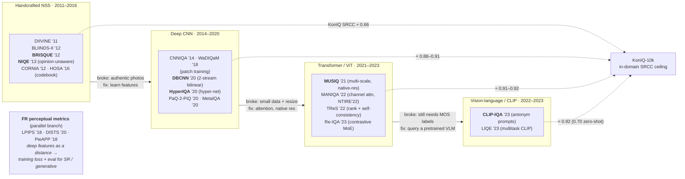

> The second of a four-report survey series building a domain mental model of
> Image Quality Assessment (IQA) and Image Aesthetic Assessment (IAA). R1 laid
> the map — taxonomy, datasets, metrics, the five-era arc. **This report walks
> the IQA method lineage in detail, era by era, classic (~2011) through
> post-ViT and CLIP.** It assumes R1's vocabulary (FR/NR, synthetic vs
> authentic, SRCC/PLCC, KonIQ/CLIVE/FLIVE) and does not re-explain it. It stays
> inside IQA: aesthetic-specific methods are R3, and multimodal-LLM scorers
> (Q-Align, Q-Instruct) are R4 — this report stops at the CLIP on-ramp that
> leads there.

## Short answer

**Blind IQA got solved by a five-step relay, and each step exists to fix the
previous one's specific failure mode.** That "what broke → what fixed it" chain
*is* the mental model; memorise it and every method slots into place:

1. **Handcrafted Natural Scene Statistics (NSS)** — BRISQUE, NIQE, DIIVINE —
   modelled what an undistorted image looks like (locally-normalised luminance
   fits a generalised Gaussian) and scored deviation, with an SVR on top.
   **Broke on:** authentic in-the-wild photos, whose compound distortions do
   not perturb the statistics the way single synthetic operators do. NIQE's
   twist — *opinion-unaware*, trained on pristine images only, no human scores
   — bought generality-in-principle but not in-the-wild accuracy.
2. **Early deep CNNs** — CNNIQA, WaDIQaM — learned the features instead of
   hand-designing them. **Broke on:** the small-data wall (IQA sets have
   hundreds to a few thousand images), which they patched with patch-based
   training and then, decisively, **ImageNet transfer learning** (DBCNN's
   two-stream bilinear net, HyperIQA's content-adaptive hyper-network,
   PaQ-2-PiQ's patch-to-picture model). Transfer learning is what first pushed
   KonIQ past ~0.90 SRCC.
3. **Full-Reference perceptual metrics** — LPIPS, DISTS — are a *parallel*
   branch: deep features as a perceptual *distance* that beat SSIM. They matter
   to the whole vision field as **differentiable training losses** and the
   default eval for super-resolution and generative models, not as blind
   scorers.
4. **Vision transformers** — MUSIQ, MANIQA, TReS, Re-IQA — brought long-range
   attention and, critically, **native-resolution handling** (MUSIQ), fixing
   the destructive fixed-square-resize that threw away the very high-frequency
   cues quality depends on. They need more data, which is exactly why R1's big
   authentic datasets were the enabler. Ceiling: ~0.92 SRCC on KonIQ.
5. **Vision-language / CLIP** — CLIP-IQA, LIQE — reframed scoring as *asking a
   pretrained model* ("Good photo" vs "Bad photo") instead of training a
   dedicated regressor. Zero-shot CLIP already reaches ~0.70 SRCC on KonIQ with
   **no quality labels at all**; a light multitask tune (LIQE) reaches
   regressor parity (~0.92). This is the pivot R4 continues to full multimodal
   LLMs.

**One number holds the whole ladder together: in-domain KonIQ-10k SRCC climbs
0.66 (BRISQUE) → 0.88 (DBCNN) → 0.91 (HyperIQA) → 0.92 (MUSIQ/TReS/LIQE),** and
the modern MLLM ceiling from R1 is ~0.94. **But the honest number is
cross-dataset**: train on KonIQ, test on CLIVE, and even HyperIQA falls 0.906 →
0.785. Generalisation, not in-domain SRCC, is the unsolved part — flagged
throughout.

## The lineage in one picture

Read it left to right as a relay where each arrow is labelled with the failure
it repairs. The FR perceptual-metric box floats free because it is not a blind
scorer at all — it is the field's *perceptual loss function*, reused wherever a
reference exists (codecs, super-resolution, generative eval). The dotted lines
are the in-domain KonIQ ceiling climbing rung by rung; the un-drawn story is
that all of them drop sharply cross-dataset (see §Generalisation).

## Benchmark table: the coordinate system

All SRCC (Spearman) unless noted, higher = better. **LIVE** and **TID2013** are
synthetic (legacy, near-saturated); **CLIVE** (LIVE-in-the-Wild), **KonIQ-10k**,
**FLIVE** (PaQ-2-PiQ) are authentic — where methods actually differ. Blank =
the method's own paper does not report it. Read *down* a column to watch an era
climb; read *across* a row to watch a method collapse from synthetic to
authentic.

| Method | Year | Ref | Backbone | LIVE | TID2013 | CLIVE | KonIQ | FLIVE |
|---|---|---|---|---|---|---|---|---|
| DIIVINE | 2011 | NR | NSS + SVR | 0.916 | — | — | — | — |
| BLIINDS-II | 2012 | NR | NSS-DCT + Bayes | 0.912 | — | — | 0.529¹ | — |
| **BRISQUE** | 2012 | NR | NSS-MSCN + SVR | 0.939 | 0.604 | 0.608 | 0.665 | 0.288 |
| **NIQE** (opinion-unaware) | 2013 | NR | NSS + MVG distance | 0.914 | — | 0.451² | 0.377² | 0.211 |
| CORNIA | 2012 | NR | codebook + SVR | 0.947 | 0.678 | 0.629 | 0.780 | — |
| HOSA | 2016 | NR | codebook + SVR | 0.946 | 0.735 | 0.640 | 0.671 | — |
| CNNIQA | 2014 | NR | shallow CNN (patch) | 0.956 | — | 0.609² | 0.755² | 0.266 |
| WaDIQaM-NR | 2018 | NR | VGG-ish CNN (patch) | 0.960³ | 0.835³ | 0.682 | 0.797 | — |
| **DBCNN** | 2020 | NR | VGG-16 + S-CNN bilinear | 0.968 | 0.816 | 0.851 | 0.875 | — |
| **HyperIQA** | 2020 | NR | ResNet-50 + hyper-net | 0.962 | — | 0.859 | 0.906 | — |
| PaQ-2-PiQ | 2020 | NR | ResNet-18 + RoIPool | — | — | 0.840 | 0.870 | 0.601 |
| MetaIQA | 2020 | NR | ResNet-18 + MAML | — | — | 0.835 | 0.850 | — |
| **MUSIQ** | 2021 | NR | multi-scale ViT | — | — | — | 0.916 | 0.646 |
| MANIQA | 2022 | NR | ViT + channel attn | 0.982⁴ | 0.937⁴ | 0.840² | 0.893² | — |
| TReS | 2022 | NR | ResNet + Transformer | 0.969 | 0.863 | 0.846 | 0.915 | 0.554 |
| Re-IQA | 2023 | NR | 2× ResNet-50 contrastive | 0.970 | 0.804 | 0.840 | 0.914 | 0.645 |
| IQT | 2021 | **FR** | InceptionResNetV2 + Tf | 0.970 | 0.899 | — | — | — |
| **CLIP-IQA** (zero-shot) | 2023 | NR | CLIP ViT-B/16 | — | 0.510 | 0.612 | 0.695 | — |
| CLIP-IQA+ (CoOp) | 2023 | NR | CLIP + learned prompt | — | 0.632 | 0.805 | 0.895 | — |
| **LIQE** | 2023 | NR | CLIP multitask | 0.970 | — | 0.904 | 0.919 | — |

*Sources: values are the method's own paper unless a footnote says otherwise.
Synthetic columns for DBCNN/BRISQUE/CORNIA/HOSA/WaDIQaM(DIQaM) are from DBCNN
Table I; authentic columns for DBCNN/HyperIQA/PaQ-2-PiQ/Re-IQA cross-agree
across the Re-IQA, MUSIQ, and TReS comparison tables (high confidence).*
*¹BLIINDS-II KonIQ from MetaIQA Table 3. ²pyiqa toolbox whole-set, single
checkpoint, no logistic re-map — a **different, optimistic protocol** than the
paper's 80/20 split (used only where no clean paper number exists: NIQE,
CNNIQA, and MANIQA on authentic sets). ³WaDIQaM row uses the unweighted DIQaM-NR
variant (from DBCNN Table I); the weighted variant's random-split numbers are
unverified. ⁴MANIQA's own paper reports only synthetic sets and PIPAL; it never
tabulates KonIQ/CLIVE at paper protocol.*

Three reading rules for this table, all load-bearing:

- **Synthetic saturates, authentic discriminates.** By 2020 everything scores
  0.95–0.98 on LIVE; the spread that tells methods apart lives in the CLIVE and
  KonIQ columns. This is exactly R1's "why the field moved to authentic sets".
- **The FLIVE column is a reality check.** Even the best methods sit at
  ~0.60–0.65 SRCC on FLIVE — it is deliberately large and diverse, and it says
  blind IQA in the true wild is far from saturated.
- **The MANIQA and NIQE authentic cells carry a protocol asterisk.** Do not
  compare a pyiqa whole-set number to a paper's 80/20-split number as if
  equal — the toolbox number is systematically more optimistic on the training
  set and effectively cross-dataset elsewhere.

## Era 1 — Handcrafted Natural Scene Statistics (2011–2016)

**Premise, in one paragraph.** For a pristine natural image, the
**mean-subtracted contrast-normalised (MSCN)** luminance coefficients

$$
\hat{I}(i,j) = \frac{I(i,j) - \mu(i,j)}{\sigma(i,j) + C}
$$

— where $\mu, \sigma$ are a local Gaussian-windowed mean and standard
deviation — reliably follow a near-Gaussian, more precisely a **generalised
Gaussian (GGD)** shape, and the *products of adjacent* MSCN coefficients follow
an **asymmetric GGD (AGGD)**. Distortions perturb this regularity in
characteristic ways: blur narrows the distribution, noise fattens its tails,
JPEG imprints blocking. So the recipe is: fit GGD/AGGD parameters as a small
feature vector, and regress the *deviation from naturalness* onto a quality
score. These models are still the **speed and interpretability baseline** —
BRISQUE and NIQE run in milliseconds on a CPU, no GPU, no learned features to
audit.

**The methods.**

- **DIIVINE** (Moorthy & Bovik, IEEE TIP 2011) — *distortion-identification
  based*. Two stages: a classifier first names the distortion *type* from
  steerable-pyramid wavelet NSS features, then a distortion-specific regressor
  scores it. The two-stage design is its strength on known distortions and its
  weakness in the wild, where distortions are mixed and unnamed. LIVE SRCC
  0.916–0.925.
- **BLIINDS-II** (Saad, Bovik & Charrier, IEEE TIP 2012) — moves the statistics
  into the **DCT domain**, models block-DCT coefficients with a GGD, and infers
  quality via a Bayesian (MAP) model. LIVE SRCC ~0.912; collapses on authentic
  (KonIQ 0.529).
- **BRISQUE** (Mittal, Moorthy & Bovik, IEEE TIP 2012) — **the canonical one**.
  Pure spatial domain: 36 GGD+AGGD features at two scales, straight into an
  **SVR** onto DMOS. No transform, no distortion-specific machinery, no
  reference — just a "how un-natural is this?" score. The default classic
  baseline everyone still cites. LIVE 0.939, but CLIVE 0.608 / KonIQ 0.665 —
  the in-the-wild collapse in two numbers.
- **NIQE** (Mittal, Soundararajan & Bovik, IEEE SPL 2013) — **the one that
  mattered conceptually**. Fits a multivariate Gaussian to NSS features from a
  corpus of *pristine* patches; a test image's score is the Mahalanobis-style
  distance from that pristine model. **Why "opinion-unaware" was a big deal:**
  NIQE never sees a distorted image and never sees a human MOS/DMOS. That
  removed two dependencies at once — no expensive subjective study to train on,
  and no overfitting to the *specific distortion types* in a training set, so
  in principle it generalises to unseen distortions. And yet it reaches LIVE
  SRCC 0.914, competitive with the opinion-*aware* methods, using no labels at
  all. The catch is the wild: NIQE and its successor ILNIQE fall hardest on
  authentic data (FLIVE 0.211; ILNIQE KonIQ ~0.507) — a pristine-only Gaussian
  is simply the wrong prior for compound real distortion.
- **CORNIA** (Ye et al., CVPR 2012) and **HOSA** (Xu et al., IEEE TIP 2016) —
  the **codebook / unsupervised-feature** branch. CORNIA drops handcrafted NSS
  entirely: it learns a K-means codebook over normalised raw patches, encodes
  by soft-assignment + max-pooling, and regresses with SVR — the first
  demonstration that *learned* features beat handcrafted NSS. HOSA extends it
  with high-order statistics (variance, skewness) aggregated against a compact
  100-word codebook. Notably these **hold up better on KonIQ** (CORNIA 0.780)
  than the pure-NSS methods — a foreshadowing that learned features generalise
  further, which the CNN era makes decisive.

**The era's verdict.** NSS solved *synthetic* blind IQA cleanly (~0.94 on LIVE)
and remains unbeaten on speed and interpretability. It broke on authentic
photos because compound, entangled distortions do not perturb MSCN regularity
the way a single clean operator does — a textbook overfit-to-the-distortion-model
failure. That failure is the entire motivation for Era 2.

## Era 2 — Early deep CNN, and the transfer-learning turn (2014–2020)

**The small-data problem** defines this era. Subjective IQA sets are tiny by
deep-learning standards — LIVE ~779 distorted images, TID2013 3,000, CLIVE
1,162, KonIQ-10k 10,073 — because every image needs many human ratings. A CNN
trained from scratch on hundreds of images overfits instantly. Two workarounds
define the whole era, and the second is the one that actually worked.

**Workaround 1 — patch-based training.**

- **CNNIQA** (Kang et al., CVPR 2014) — the first general CNN for NR-IQA. A
  shallow net on 32×32 normalised patches (one conv layer with paired
  max+min pooling, two FC layers), trained by assigning the image's score to
  every patch, turning $N$ images into ~1000·$N$ samples. LIVE 0.956, but
  FLIVE 0.266 — patches learn local texture, not global quality.
- **WaDIQaM / deepIQA** (Bosse et al., IEEE TIP 2018) — a deeper VGG-style patch
  net unifying FR and NR, whose key idea is **weighted patch aggregation**: a
  second branch predicts a per-patch *importance weight* so patches pool into
  the picture score by learned relevance rather than a flat average (some
  regions carry the quality verdict more than others).

Patch training bought data but capped out — a local patch cannot see global
composition or semantic content, and quality is partly semantic (a blurry sky
is fine; a blurry face is not).

**Workaround 2 — transfer learning from ImageNet.** This is the turn that
pushed KonIQ past 0.90.

- **DBCNN** (Zhang et al., IEEE TCSVT 2020) — **two-stream bilinear pooling**,
  the cleanest statement of the idea that quality has two faces. Stream 1 is a
  CNN pretrained to classify **synthetic distortion type + level** (handles
  the low-level degradation axis); Stream 2 is an **ImageNet-pretrained
  VGG-16** (handles the high-level semantic axis, which is what authentic
  distortion needs). Their feature maps are combined by **bilinear pooling**
  into one vector, fine-tuned on MOS. Result: the first method to hold up
  across both worlds (KonIQ 0.875, CLIVE 0.851).
- **HyperIQA** (Su et al., CVPR 2020) — **the content-adaptive hyper-network**,
  and KonIQ SOTA of its day (0.906). Insight: the perceptual rule for judging
  quality should *depend on image content*. A ResNet-50 extracts content
  features, and a **hyper-network generates the weights of the quality
  predictor per image** from that content — so a landscape and a portrait are
  scored by different learned rules. Three stages: understand content → generate
  perception rule → predict quality. This self-adaptivity is why it topped the
  authentic benchmarks.
- **PaQ-2-PiQ** (Ying et al., CVPR 2020) — **the FLIVE dataset paper** (R1's
  ~40k pictures + 120k patches, ~4M judgments). Its model is a ResNet-18 with
  **RoIPool** predicting both whole-picture and local-patch quality, with
  local-to-global feedback — the "patches to pictures" idea done right, with
  real patch labels instead of CNNIQA's inherited ones. Its modest FLIVE SRCC
  (~0.60) is not a weak model; it is FLIVE being genuinely hard.
- **MetaIQA** (Zhu et al., CVPR 2020) — **meta-learning across distortions**.
  Treats each distortion type as a separate task and uses MAML-style bi-level
  optimisation to learn a shared *quality prior* that fine-tunes fast to a new
  (even unseen/authentic) distortion from few samples. A different answer to
  small-data: don't just transfer semantics, transfer *adaptability*.

**The era's verdict.** Learned features beat handcrafted NSS decisively, and
**ImageNet transfer learning** — not raw architecture — is what cracked
authentic IQA, because authentic distortion judgments lean on semantic content
the small IQA sets could never teach. The residual problems this era handed
forward: CNNs still needed a **fixed-size input**, so they resized/cropped —
destroying the exact high-frequency detail quality depends on — and their
receptive fields were local, missing global quality perception. Both are what
the transformer era attacks.

## FR perceptual metrics: the field's loss function (a parallel branch)

These are **Full-Reference** — they need the pristine image — so they are not
blind scorers and do not compete on KonIQ. They belong here because the vision
community reuses them constantly as **differentiable perceptual losses** and as
the **standard perceptual eval for super-resolution and generative models**,
where a reference exists. Miss this and you misread half the SR/GAN literature.

- **LPIPS** (Zhang, Isola, Efros, Shechtman, Wang, CVPR 2018 — *"The
  Unreasonable Effectiveness of Deep Features as a Perceptual Metric"*). The
  claim in the title: the L2 distance between deep-network feature activations,
  per-channel unit-normalised and scaled by **learned linear weights**, tracks
  human perceptual similarity far better than SSIM/PSNR — and it does so across
  backbones (SqueezeNet/AlexNet/**VGG**, VGG being the de-facto choice for image
  generation). It is validated on the purpose-built **BAPPS** dataset (a 2AFC
  "which distortion is more similar to the reference" protocol, ~484k
  judgments). Perceptual similarity is treated as an *emergent property of deep
  features*, not a hand-designed formula — which is why almost any pretrained
  net works.
- **DISTS** (Ding, Ma, Wang, Simoncelli, IEEE TPAMI 2020) — **unifies structure
  and texture similarity**, and fixes a real LPIPS/SSIM failure mode. An
  injective CNN maps each image to a multi-scale representation; quality
  combines **texture** similarity (correlation of feature-map spatial *means*)
  with **structure** similarity (correlation of the feature *maps*). The
  headline property: it is the **first FR metric explicitly tolerant to texture
  resampling** — swap one patch of grass for another and DISTS barely moves,
  where SSIM/LPIPS penalise the pixel misalignment. That tolerance is exactly
  what GAN and texture-synthesis outputs need, since they are perceptually fine
  but not pixel-aligned. (LIVE 0.954, CSIQ 0.929, TID2013 0.830, trained on
  KADID.)
- **PieAPP** (Prashnani et al., CVPR 2018) — learns from **pairwise
  preference** instead of regressing a score: a network predicts the
  probability a human prefers one distorted image over another, trained on
  ~81k preference labels over 200 references, then scores a single pair. Its
  train/test distortion sets are disjoint by design, targeting generalisation
  to unseen distortions. (Unlike LPIPS/DISTS, PieAPP does not advertise itself
  as a training loss — that reuse is a community convention, not a paper claim.)

**Why they matter to R2's story.** LPIPS/DISTS are the FR half of the same
"deep features beat handcrafted statistics" insight driving the NR methods — and
because they are differentiable, they close the loop: a super-resolution or
diffusion model can be *trained* to minimise LPIPS/DISTS, and *evaluated* by it.
They sit adjacent to blind IQA, feeding the generative-perceptual axis R1 kept
separate.

## Era 3 — The transformer / ViT era (2021–2023)

**What ViT bought IQA, specifically** — three things, and the third is a cost:

1. **Long-range self-attention** captures *global* quality perception that a
   CNN's local receptive field misses (quality is a whole-image verdict).
2. **Native-resolution / aspect-ratio handling** — the killer app. CNNs forced
   a fixed square input, so they resized or cropped, destroying the
   high-frequency detail (fine blur, compression artifacts) that quality
   *lives in*. Transformers can ingest variable-size token sequences.
3. **Weaker inductive bias → needs more data.** This is why the transformer era
   and R1's big authentic datasets (KonIQ, FLIVE) are the same event: ViTs only
   pay off once there is enough labelled in-the-wild data to feed them.

**The methods.**

- **MUSIQ** (Ke, Wang, Wang, Milanfar, Yang, ICCV 2021) — **the genuine
  IQA-specific contribution of the era**: a *multi-scale image transformer*
  that encodes the full-resolution image plus resized variants into one token
  sequence, made position-aware by a **hash-based 2D spatial embedding** plus a
  **scale embedding**. No fixed square resize, no aspect-ratio destruction —
  the model sees the image as captured. KonIQ 0.916, FLIVE 0.646 (best in that
  column), and strong on SPAQ (0.917) and AVA aesthetics (0.726). MUSIQ's own
  paper deliberately reports *only* authentic/aesthetic sets — a statement that
  synthetic benchmarks were no longer the point.
- **MANIQA** (Yang et al., CVPRW 2022) — **multi-dimension attention**, and
  winner of the **NTIRE 2022 NR-IQA challenge**. Refines ViT features with a
  **transposed-attention block** (attention across the *channel* dimension, not
  just spatial) plus a Swin block (spatial), then a dual-branch patch-weighted
  head. Built to strengthen accuracy on **GAN-generated distortion**
  specifically — the challenge ran on PIPAL, where the winning MANIQA-E ensemble
  scored ~0.70 SRCC (a reminder of how hard GAN-artifact quality is). Its
  saturated synthetic numbers (LIVE 0.982, TID2013 0.937) are near the top of
  the table.
- **TReS** (Golestaneh, Dadsetan, Kitani, WACV 2022) — a hybrid **CNN +
  Transformer** with two auxiliary losses that are the interesting part: a
  **relative-ranking loss** (get the *ordering* of scores within a batch right,
  not just the values — the ranking-loss idea recurring from R1) and a
  **self-consistency loss** penalising prediction differences between an image
  and its horizontal flip (equivariance self-supervision → robustness).
  Broad, solid coverage: LIVE 0.969, CLIVE 0.846, KonIQ 0.915.
- **Re-IQA** (Saha, Mishra, Bovik, CVPR 2023) — **contrastive mixture of
  experts**. Two ResNet-50 encoders trained by self-supervision: one
  **content-aware** (MoCo-style) and one **quality-aware** (contrastive over
  distortion augmentations, building on CONTRIQUE). Their complementary
  high-level + low-level features concatenate into a *simple linear regressor*.
  Same two-faced insight as DBCNN (content + quality), now via contrastive
  pretraining instead of bilinear fusion. KonIQ 0.914, CLIVE 0.840.
- **IQT** (Cheon, Yoon, Kang, Lee, CVPRW 2021) — the **FR** transformer, winner
  of the **NTIRE 2021 perceptual IQA challenge**. A frozen ImageNet CNN feeds
  reference and distorted features; their *difference* feeds a Transformer
  encoder-decoder with a learnable quality token. Listed for completeness of
  the transformer story — it is FR, so it lives next to LPIPS/DISTS, not on the
  blind benchmarks.

**The era's verdict.** Transformers pushed the KonIQ ceiling to ~0.92 and, more
importantly, fixed the resize problem (MUSIQ) and brought global attention. What
they did *not* fix: every method here still needs a labelled MOS training set,
and cross-dataset generalisation stayed weak. That standing dependency on
labels is what the CLIP era attacks.

## Era 4 — Vision-language / CLIP: the bridge to R4 (2022–2023)

The reframe: stop *training a dedicated quality regressor* and instead *ask a
pretrained vision-language model*. This is the pivot that R4 carries all the way
to full multimodal LLMs.

- **CLIP-IQA / CLIP-IQA+** (Wang, Chan, Loy, AAAI 2023 — *"Exploring CLIP for
  Assessing the Look and Feel of Images"*). Uses CLIP with an **antonym prompt
  pair** — "Good photo." vs "Bad photo." — and takes the softmax over the two
  cosine similarities as the quality score. **CLIP-IQA** is *zero-shot*: no
  training, no quality labels, and it still reaches **KonIQ 0.695 / CLIVE 0.612**
  — direct evidence that a pretrained VLM already carries usable quality priors.
  **CLIP-IQA+** adds a CoOp learnable prompt context tuned on KonIQ and jumps to
  **KonIQ 0.895 / CLIVE 0.805**, closing most of the gap to trained regressors
  with a tiny number of learned parameters.
- **LIQE** (Zhang, Zhai, Wei, Yang, Ma, CVPR 2023 — *"Blind Image Quality
  Assessment via Vision-Language Correspondence"*; note: **no Bovik on this
  paper**, Kede Ma is senior author). **Multitask CLIP**: jointly predicts
  **scene category + distortion type + quality level** by matching the image
  against a textual template that enumerates candidate label combinations, with
  the joint probability read from image-text similarity. The auxiliary
  scene/distortion tasks regularise the quality head. It reaches **regressor
  parity — KonIQ 0.919, CLIVE 0.904** — and, tellingly, its CLIVE number is the
  *highest in the whole table*, hinting that the language grounding helps
  generalisation.

**Why this is the R4 on-ramp.** CLIP-IQA proves quality knowledge is *already
inside* a pretrained multimodal model, extractable with a prompt and no labels;
LIQE proves that reframing IQA as text-prompt correspondence reaches parity with
the best trained regressors. The natural next question — *why stop at CLIP's two
prompts; why not let a full language model describe the image and rate it?* — is
exactly Q-Align / Q-Instruct, and exactly R4.

## Generalisation: the part that is not solved

In-domain SRCC is a flattering number. The honest test is **cross-dataset**:
train on one authentic set, test on another. It falls hard, and this is the
field's real open problem.

| Model | Train → Test | Cross SRCC | In-domain (ref) | Drop |
|---|---|---|---|---|
| HyperIQA | KonIQ → CLIVE | 0.785 | 0.906 | −0.121 |
| HyperIQA | CLIVE → KonIQ | 0.772 | 0.859 | −0.087 |
| DBCNN | KonIQ → CLIVE | 0.723–0.755 | 0.875 | ~−0.13 |
| Re-IQA | KonIQ → CLIVE | 0.791 | 0.914 | −0.123 |
| CONTRIQUE | KonIQ → CLIVE | 0.731 | — | — |
| DBCNN | KonIQ → SPAQ | 0.801 | 0.875 | −0.074 |
| MUSIQ | KonIQ → SPAQ | 0.853 | 0.916 | −0.063 |

*Sources: HyperIQA Table 3, Re-IQA Table 3, LIQE Table 2 (SPAQ column); all
cross-dataset tables report SRCC only, never PLCC.*

The pattern is consistent: **in-domain ~0.88–0.92 collapses to ~0.72–0.79
cross-dataset**, a 0.10–0.13 SRCC drop, because each dataset has its own
distortion distribution, camera population, and rater pool, and the models
partly fit *the dataset* rather than *quality*. Two observations point at where
the fix is coming from: contrastive/self-supervised pretraining (Re-IQA) and
language grounding (LIQE reaches 0.881 on held-out SPAQ) both generalise
better than a plain regressor — the same two ingredients the CLIP and MLLM eras
lean on. Generalisation, not the in-domain leaderboard, is the reason the field
kept moving past MUSIQ.

## Synthesis: what broke, what fixed it

The mental model, stated as the failure/repair chain — this is the whole report
in one list:

1. **Handcrafted NSS** modelled naturalness and scored deviation. **Broke:**
   authentic compound distortion does not perturb MSCN statistics like clean
   synthetic operators do. **Fixed by →** learning the features from data.
2. **Deep CNNs** learned features but hit the **small-data wall**. **Fixed by
   →** patch training (data) and, decisively, **ImageNet transfer learning**
   (DBCNN's semantic stream, HyperIQA's content-adaptive weights) — because
   authentic-quality judgment is partly semantic.
3. **CNN transfer models** still forced a **fixed-resolution resize** that
   destroyed high-frequency quality cues, and saw only locally. **Fixed by →**
   **multi-scale vision transformers** (MUSIQ) handling native resolution, with
   global attention — enabled by the big authentic datasets ViTs need.
4. **Transformers** still **required labelled MOS** and generalised poorly.
   **Fixed (partly) by →** **CLIP prompting**: quality priors already live in a
   pretrained VLM (CLIP-IQA, zero-shot 0.70), and light multitask tuning (LIQE)
   reaches parity — pointing past dedicated regressors entirely.
5. **The still-open failure** is **cross-dataset generalisation** (0.10+ SRCC
   drops), which language grounding and contrastive pretraining dent but do not
   close — and which R4's multimodal-LLM scorers take up next.

Each era did not merely raise the KonIQ ceiling; it removed a *specific*
dependency of the previous one — on the distortion model, on training-set size,
on fixed resolution, on labels. That removal chain, not the SRCC numbers, is the
thing to carry into R3 (aesthetics, where the same relay runs against a harder,
noisier target) and R4 (where IQA and IAA rejoin under one multimodal model).

## Practical entry point: the pyiqa / IQA-PyTorch toolbox

Reproducing any row above without re-implementing papers: **pyiqa**
(`github.com/chaofengc/IQA-PyTorch`, Chaofeng Chen) is a pure-PyTorch toolbox of
**47 metrics (18 FR, 29 NR)** with pretrained weights, calibrated against the
original MATLAB implementations, behind one `pyiqa.create_metric(name)` API. Its
NR coverage spans this entire report — BRISQUE, NIQE, ILNIQE, CNNIQA, WaDIQaM,
DBCNN, HyperIQA, PaQ-2-PiQ, MetaIQA, MUSIQ, MANIQA, TReS, CLIP-IQA(+), LIQE, and
onward to Q-Align — plus the FR metrics (LPIPS, DISTS, PieAPP). One caveat that
matters for numbers: its benchmark leaderboard computes correlation over the
**whole dataset with a single checkpoint and no logistic re-mapping**, which is
a *different, more optimistic* protocol than the papers' 80/20 splits — great
for a quick apples-to-apples run of the shipped weights, not a substitute for
the paper tables above.

## Sources

**Era 1 — NSS.** DIIVINE (Moorthy & Bovik, IEEE TIP 2011) ·
BLIINDS-II (Saad, Bovik & Charrier, IEEE TIP 2012) ·
BRISQUE (Mittal, Moorthy & Bovik, IEEE TIP 2012) ·
NIQE (Mittal, Soundararajan & Bovik, IEEE SPL 2013) ·
CORNIA (Ye, Kumar, Kang & Doermann, CVPR 2012) ·
HOSA (Xu et al., IEEE TIP 2016). MATLAB releases via the
[UT LIVE lab](https://live.ece.utexas.edu/research/Quality/index.htm);
BRISQUE/NIQE are built into MATLAB and OpenCV.

**Era 2 — deep CNN.** [CNNIQA (Kang et al., CVPR 2014)](https://openaccess.thecvf.com/content_cvpr_2014/html/Kang_Convolutional_Neural_Networks_2014_CVPR_paper.html) ([unofficial code](https://github.com/lidq92/CNNIQA)) ·
[WaDIQaM / deepIQA (Bosse et al., IEEE TIP 2018, arXiv:1612.01697)](https://arxiv.org/abs/1612.01697) ([code](https://github.com/dmaniry/deepIQA)) ·
[DBCNN (Zhang et al., IEEE TCSVT 2020, arXiv:1907.02665)](https://arxiv.org/abs/1907.02665) ([code](https://github.com/zwx8981/DBCNN-PyTorch)) ·
[HyperIQA (Su et al., CVPR 2020)](https://github.com/SSL92/hyperIQA) ·
[PaQ-2-PiQ / FLIVE (Ying et al., CVPR 2020, arXiv:1912.10088)](https://arxiv.org/abs/1912.10088) ([code](https://github.com/baidut/PaQ-2-PiQ)) ·
[MetaIQA (Zhu et al., CVPR 2020, arXiv:2004.05508)](https://arxiv.org/abs/2004.05508) ([code](https://github.com/zhuhancheng/MetaIQA)).

**FR perceptual metrics.** [LPIPS (Zhang et al., CVPR 2018, arXiv:1801.03924)](https://arxiv.org/abs/1801.03924) ([code](https://github.com/richzhang/PerceptualSimilarity)) ·
[DISTS (Ding, Ma, Wang, Simoncelli, IEEE TPAMI 2020, arXiv:2004.07728)](https://arxiv.org/abs/2004.07728) ([code](https://github.com/dingkeyan93/DISTS)) ·
[PieAPP (Prashnani et al., CVPR 2018, arXiv:1806.02067)](https://arxiv.org/abs/1806.02067) ([code](https://github.com/prashnani/PerceptualImageError)).

**Era 3 — transformers.** [MUSIQ (Ke et al., ICCV 2021, arXiv:2108.05997)](https://arxiv.org/abs/2108.05997) ([code](https://github.com/google-research/google-research/tree/master/musiq)) ·
[MANIQA (Yang et al., CVPRW 2022, arXiv:2204.08958)](https://arxiv.org/abs/2204.08958) ([code](https://github.com/IIGROUP/MANIQA)) ·
[TReS (Golestaneh, Dadsetan, Kitani, WACV 2022, arXiv:2108.06858)](https://arxiv.org/abs/2108.06858) ([code](https://github.com/isalirezag/TReS)) ·
[Re-IQA (Saha, Mishra, Bovik, CVPR 2023, arXiv:2304.00451)](https://arxiv.org/abs/2304.00451) ([code](https://github.com/avinabsaha/ReIQA)) ·
[IQT (Cheon et al., CVPRW 2021, arXiv:2104.14730)](https://arxiv.org/abs/2104.14730) ([code](https://github.com/manricheon/IQT)).

**Era 4 — vision-language.** [CLIP-IQA / CLIP-IQA+ (Wang, Chan, Loy, AAAI 2023, arXiv:2207.12396)](https://arxiv.org/abs/2207.12396) ·
[LIQE (Zhang, Zhai, Wei, Yang, Ma, CVPR 2023, arXiv:2303.14968)](https://arxiv.org/abs/2303.14968) ([code](https://github.com/zwx8981/LIQE)).

**Benchmark numbers.** Synthetic-set and DIQaM values from DBCNN Table I;
authentic-set values cross-checked across the Re-IQA, MUSIQ, and TReS comparison
tables and each method's own paper; cross-dataset values from HyperIQA Table 3,
Re-IQA Table 3, and LIQE Table 2. CLIP-IQA(+) and LIQE numbers from their own
Table 1. Toolbox-derived numbers (NIQE, CNNIQA, and MANIQA on authentic sets)
are from the [pyiqa benchmark](https://github.com/chaofengc/IQA-PyTorch) and use
a whole-set protocol, flagged inline.

**Flagged as not fully verified against a primary source** (stated, not asserted
as fact): MANIQA and NIQE authentic-set SRCC are pyiqa whole-set numbers, a
different protocol than the papers' 80/20 splits — treated as optimistic and not
directly comparable to paper rows. MUSIQ reports no CLIVE result and none is
attributed to it. LIQE's only held-out *authentic* cross-dataset test is SPAQ
(0.881); no LIQE KonIQ→CLIVE number exists. The WaDIQaM row uses the unweighted
DIQaM-NR variant; the weighted variant's random-split numbers are unverified.
DISTS's exact TPAMI volume/year is cited variously as 2020–2022. All
cross-dataset results are SRCC-only in the primary tables.
