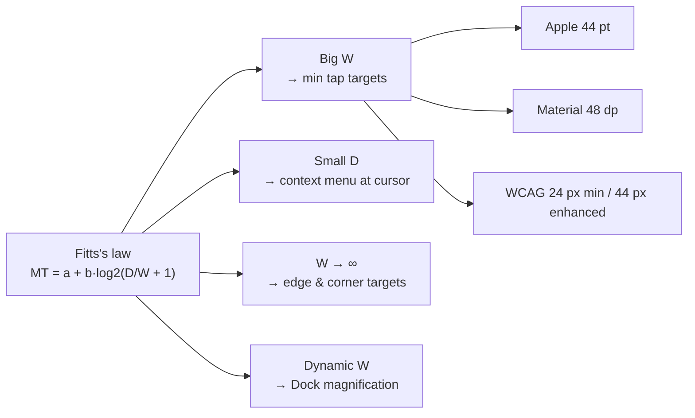
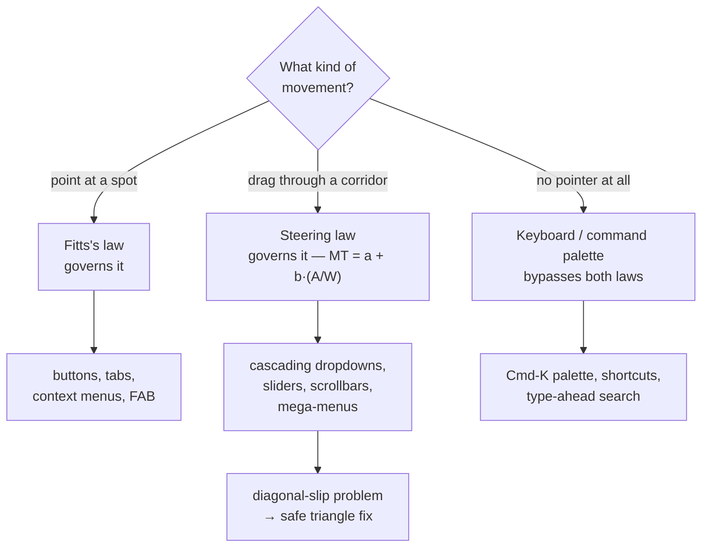

> Survey how modern UI building blocks and composition/navigation patterns are related to Fitts's law. I am not familiar with UX/UI or HCI, so please give me several concrete examples with proper diagrams, keywords, and formulas.

## Short answer

**Fitts's law** says the time to move a pointer to a target grows with the
*distance* to it and shrinks as the *target gets bigger*, and it grows only
*logarithmically* — so doubling the distance costs far less than halving the
size hurts. That single fact, plus one sibling law about dragging through
narrow paths, explains most of the layout decisions you already see every day:

- **Make targets big and close.** Minimum tap-target sizes (Apple **44 pt**,
  Material **48 dp**, WCAG **24 px** floor / **44 px** enhanced) are Fitts's
  law turned into a rule.
- **Screen edges and corners are effectively infinite targets** — the pointer
  physically *stops* at the edge, so you cannot overshoot. This is why the
  macOS menu bar (top edge) and the Windows Start button (bottom-left corner)
  are so fast, and why a menu bar floating *inside* a window is slower.
- **A context menu appears at the cursor**, so its distance $D \approx 0$ —
  the fastest possible non-keyboard target.
- **Nested/cascading dropdown menus** (hover mega-menus) are governed by a
  *different* law — the **steering law** — because you must keep the pointer
  inside a narrow corridor; the "diagonal slip" this causes is why Amazon's
  mega-menu uses a **safe triangle** predictor.
- **The keyboard beats all of it.** A **command palette** (`Cmd-K`) has *no
  target to aim at*, so it sidesteps Fitts's law entirely — the fastest target
  is no target.

One caveat up front on the formula. The version you may have seen written
$MT = a + b\log_2(2D/W)$ is **Fitts's original 1954 index**. The form used in
modern HCI and international standards is **MacKenzie's 1992 "Shannon"
reformulation**, $MT = a + b\log_2(D/W + 1)$, which fits real data slightly
better and never goes negative. This report uses the Shannon form as primary
and notes where they differ.

The rest of this report defines every term from zero, works a numeric example,
and walks through the building blocks and navigation patterns one at a time.

---

## 1. Fitts's law itself

### 1.1 The vocabulary (defined from zero)

- **Target** — the thing you are trying to click or tap: a button, a link, a
  menu item, an icon.
- **Pointer** / **cursor** — whatever you are moving toward the target: a mouse
  arrow, a trackpad cursor, or your fingertip on a touchscreen.
- **Hit target** / **tap target** — the *actually clickable region*, which is
  often bigger than the drawn graphic. A 24×24 px icon can carry a 44×44 px
  invisible tap target around it. Fitts's law cares about the hit target, not
  the pixels you can see.
- **Affordance** — a visual hint that says "this is interactive": a raised
  button, an underline, a shadow. Affordances tell you *where* the targets are;
  Fitts's law tells you *how fast* you can reach them.
- **Chrome** — the persistent UI frame around content: toolbars, tab bars,
  title bars, the address bar. (Not the browser named Chrome.)

### 1.2 The intuition, before any math

Imagine reaching for a coffee mug. If it is close, you get there fast. If it is
across the table, slower. If it is a wide bucket, you can be sloppy and still
hit it; if it is a thimble, you slow *way* down near the end to aim. Movement
time depends on **how far** and **how precisely** you must land.

The non-obvious part is *how* these trade off. Fitts found the relationship is
**logarithmic**: what matters is the *ratio* of distance to size, not either
alone. Moving twice as far adds only a small constant of time; but making the
target half as wide adds the same penalty as *doubling the distance*. **Size
buys you more than proximity does.** That asymmetry is the single most useful
thing to remember.

### 1.3 The formula

Let:

- $D$ = **distance** from the pointer's start to the target center (also written
  $A$ for "amplitude" in the original papers).
- $W$ = **width** of the target *measured along the axis of motion* — how much
  room you have to stop in the direction you are moving.
- $MT$ = **movement time** to acquire the target.
- $a$, $b$ = empirical constants fit to a specific device + user + setup.

**Fitts's original 1954 index of difficulty:**

$$
ID = \log_2\!\left(\frac{2D}{W}\right) \quad\text{[bits]}
$$

**MacKenzie's 1992 "Shannon" reformulation** (the modern standard, used in
ISO 9241-9):

$$
ID = \log_2\!\left(\frac{D}{W} + 1\right) \quad\text{[bits]}
$$

Either way, movement time is linear in the index of difficulty:

$$
MT = a + b \cdot ID
$$

- **$ID$ (index of difficulty)** is measured in **bits** — literally the same
  "bits" as in information theory. A harder reach = more bits. The name comes
  from the analogy to the Shannon–Hartley channel-capacity theorem: your arm is
  a noisy channel transmitting "aiming information."
- **$a$** (seconds) is fixed overhead — reaction time, the press itself. It does
  not depend on the target.
- **$b$** (seconds per bit) is the *cost per bit of difficulty*. It captures the
  device: a mouse has a smaller $b$ than a game controller aiming a cursor.

The two forms agree closely when $D \gg W$ (far, small targets) and diverge for
close, large targets, where Fitts's original can even go *negative* — the reason
MacKenzie's version replaced it.

**Throughput** rolls speed and accuracy into one device score:

$$
TP = \frac{ID_e}{MT} \quad\text{[bits/s]}
$$

Here $ID_e$ is the **effective** index of difficulty: you re-measure $W$ from
how much users' clicks *actually scattered* (the effective width
$W_e = 4.133 \cdot \sigma$, where $\sigma$ is the standard deviation of where
people landed). This "adjust for the errors they really made" step is what lets
throughput fairly compare a mouse to a touchscreen. Representative throughputs:
a **mouse ≈ 3.7–4.9 bits/s**; direct-touch finger pointing is often *higher*,
around **6–11 bits/s**, because your finger goes straight to the target with no
cursor to steer.

### 1.4 A worked example

Assume an illustrative mouse setup with $a = 0.05\text{ s}$ and
$b = 0.15\text{ s/bit}$.

**Target X** — a small toolbar icon far away: $D = 400$ px, $W = 40$ px.

$$
ID = \log_2\!\left(\frac{400}{40} + 1\right) = \log_2(11) = 3.46\text{ bits}
$$
$$
MT = 0.05 + 0.15 \times 3.46 = 0.57\text{ s}
$$

**Target Y** — a big button, close: $D = 100$ px, $W = 80$ px.

$$
ID = \log_2\!\left(\frac{100}{80} + 1\right) = \log_2(2.25) = 1.17\text{ bits}
$$
$$
MT = 0.05 + 0.15 \times 1.17 = 0.23\text{ s}
$$

Same click, **2.5× faster**, purely from geometry. Notice the small target's
distance was 4× larger but that alone would barely matter — most of the penalty
came from the *width*. (Fitts's original index would give X = 4.32 bits and
Y = 1.32 bits, the same story with slightly larger numbers.)

### 1.5 Two refinements you will meet

- **2-D (bivariate) targets.** Real buttons are rectangles, not 1-D segments.
  The common fix (MacKenzie & Buxton 1992) is to use the target's dimension
  *along the line of approach*, or the smaller of width/height (the `min` model)
  — because you can overshoot along the short axis. This is why a *wide, thin*
  button is easy to hit horizontally but fiddly vertically.
- **Small-target pointing error.** Below a certain size the target subtends such
  a small angle that aiming noise dominates and error rates climb sharply. This
  is the empirical floor under all the "minimum size" guidelines in §3.

---

## 2. The design corollaries everyone uses

### 2.1 Bigger is faster, closer is faster

Directly from the formula: raise $W$ or lower $D$ and $MT$ drops. The strong
version — **prefer size over proximity** — follows from the log: you get more
time back by enlarging a target than by moving it nearer.

### 2.2 Edges and corners are "infinitely deep" targets

Here is the trick that powers half of desktop UI. When a target sits flush
against a **screen edge**, the pointer *physically cannot travel past it* — the
cursor stops at the edge no matter how hard you flick the mouse. So along the
axis pointing into the edge, the effective width $W \to \infty$: you cannot
overshoot. Plug that in:

$$
\lim_{W \to \infty} \log_2\!\left(\frac{D}{W}+1\right) = \log_2(1) = 0
\;\Rightarrow\; MT \to a
$$

The difficulty collapses to the fixed overhead. You can "slam" the pointer at
the edge with zero precision.

```
   Target NOT on edge                Target ON the top edge
   (must stop precisely)             (pointer stops itself)

   ┌───────────────────────┐        ┏━━━━━━━┓━━━━━━━━━━━━━━━┓   <- screen edge
   │                       │        ┃ File  ┃  Edit  View  ┃   <- menu bar
   │      ┌────┐           │        ┗━━━━━━━┛━━━━━━━━━━━━━━━┛
   │      │ ▓▓ │  W finite │        You can overshoot upward
   │      └────┘           │        as much as you like — the
   │   cursor must brake   │        edge catches you. W_effective
   │   before overshoot    │        is infinite along ↑.
   └───────────────────────┘
```

- A **corner** is even better: it is infinite along *both* axes at once, so you
  can throw the pointer into it blind. These are the **prime pixels** or
  **magic corners** — the four fastest points on any screen.
- **Concrete examples.** The **macOS menu bar** lives on the top edge, so its
  menus are edge-targets; the **Windows Start button** sits in the bottom-left
  corner. Bruce Tognazzini's "First Principles of Interaction Design" reports
  that the Mac's edge-pinned menu bar is acquired roughly **5× faster** than a
  Windows menu bar drawn *inside* a window, which forfeits the pinning.
- **The magic pixel and the one-pixel tax.** Because the benefit depends on the
  target *truly* reaching the edge, even a **one-pixel non-clickable gap**
  between the target and the edge destroys it — Tognazzini cites a **20–30%
  slowdown** from a single dead pixel. This is a real bug class: a full-screen
  browser whose "close tab" hit area stops one pixel short of the top edge
  throws away its Fitts's-law advantage.

### 2.3 The Fitts's-law cost of the hamburger menu

The **hamburger menu** (the ☰ icon that hides navigation behind a drawer) is a
triple Fitts's-law offense:

1. It is **small** (a single icon, low $W$).
2. It is usually in a **top corner** — great as an *edge target to hit*, but on
   a phone that corner is in the ergonomic dead zone (see §2.4), and every
   destination is now *one tap deeper*.
3. It **hides the targets**, so reaching any real destination costs *icon tap →
   wait for drawer → aim at item* — two acquisitions instead of one, plus the
   items are far from where your thumb rests.

The measured consequence across the industry was lower engagement with hidden
nav versus visible tabs — which is why phone apps largely migrated navigation
*out* of the hamburger and *into* a bottom tab bar.

### 2.4 Bottom bars beat top bars on phones — but that is ergonomics, not Fitts's law

A **bottom tab bar** (iOS/Android) outperforms a **top navigation bar** on
phones. It is tempting to credit Fitts's law, but be precise: the bottom bar is
*not closer* in the Fitts sense for an arbitrary starting pointer — the real
reason is the **thumb zone** / **reachability**, a *separate ergonomic factor*.

Steven Hoober's field study (≈1,300 users) found **~49%** hold the phone
one-handed and **~75%** of interactions are thumb-driven. A held thumb sweeps a
comfortable arc:

```
  Phone held in right hand, one-handed:

  ┌─────────────────┐
  │   red (hard)    │   top corners: need a grip shift or second hand
  │                 │
  │  yellow         │   mid-screen: reachable with a stretch
  │        yellow   │
  │  green   green  │   bottom arc: thumb rests here, easy + accurate
  │ ███ tab  bar ███│ <- primary navigation belongs on this edge
  └─────────────────┘
```

The bottom edge is simultaneously a **Fitts edge-target** (infinite $W$
upward, easy to hit) *and* inside the **green thumb zone** (short, comfortable
travel). The two effects stack, but they are different claims: Fitts's law is
about *targeting geometry*; the thumb zone is about *what your hand can reach
without strain*. A top bar loses the second even though it is an equally good
edge-target.

---

## 3. Building blocks, analyzed



### 3.1 Buttons and minimum tap targets

The minimum-size guidelines are Fitts's law's small-target floor (§1.5) written
as policy. They are stated in *device-independent* units so they map to the same
physical size (~9 mm, the pad of a fingertip) on any screen density:

| Guideline | Minimum target | Level / status |
|---|---|---|
| **Apple Human Interface Guidelines** | **44 × 44 pt** | recommended minimum |
| **Material Design** | **48 × 48 dp** (≈ 9 mm) | recommended minimum |
| **WCAG 2.5.8 Target Size (Minimum)** | **24 × 24 CSS px** (or 24 px spacing) | AA (required) |
| **WCAG 2.5.5 Target Size (Enhanced)** | **44 × 44 CSS px** | AAA (stronger) |

Note the **hit target ≠ visual size** point: a 24 px icon meets Apple's 44 pt
rule if it carries invisible padding out to 44 pt. WCAG 2.5.8's *spacing*
exception is itself Fitts-flavored — separated small targets are acceptable
because the effective miss-cost drops when neighbors are far.

### 3.2 Floating Action Button (FAB)

Material's **FAB** — the circular button floating above content, usually
bottom-right — is a designed Fitts optimum: it is **large** (56 dp standard),
**persistent** (always in the same spot, so muscle memory zeroes the search
time), and parked near the **thumb zone**. It trades a bit of content occlusion
for a permanently cheap primary action.

### 3.3 Segmented control

A **segmented control** (the iOS pill of adjacent options, or a
button-group toggle) packs choices into **contiguous** targets with **no gaps**.
Adjacency matters twice: travel distance $D$ between options is tiny, and
because segments share borders there is no dead space to fall into — each
segment's $W$ runs right up to its neighbor.

### 3.4 Context menu — the $D \approx 0$ special case

A **context menu** (right-click / long-press menu) opens *at the pointer's
current location*. So $D \approx 0$, which drives the log term toward its
minimum and $MT$ toward the fixed overhead $a$:

$$
D \to 0 \;\Rightarrow\; \log_2\!\left(\frac{D}{W}+1\right) \to 0
$$

This is why right-click menus feel instant: you never travel. The cost is
*discoverability* (nothing on screen advertises them) — a recurring theme that
the fastest interactions are often the least visible.

### 3.5 The Dock and magnification — dynamic $W$

The **macOS Dock's magnification** (icons balloon as the cursor nears) is a live
demonstration of increasing $W$ on approach. Whether it is a *net* win is
debated — Fitts's law assumes a *fixed* target, and a moving/growing icon can
shift under you, sometimes adding correction time. Treat it as a caution:
enlarging $W$ helps only if it does not also perturb $D$ mid-flight.

### 3.6 Toolbars versus overflow menus

A visible **toolbar** puts each action one hop away (single acquisition). An
**overflow menu** (the "⋯" / "kebab") hides actions behind an extra tap — the
same *tax as the hamburger* (§2.3): two acquisitions, and the revealed items are
far from the trigger. The design rule that falls out: **surface frequent actions
in the toolbar; bury rare ones in overflow** — spend your cheap targets on the
common case.

---

## 4. Composition and navigation patterns



### 4.1 Pie / radial menus

A **pie menu** (a.k.a. radial menu) arranges options in a ring *around* the
cursor's current position. Two Fitts wins at once:

- **Constant, small $D$** — every option is the same short distance from the
  center, versus a linear menu where the last item is far.
- **Direction, not distance** — you can flick *toward* a slice; each wedge is
  wide at its outer edge, so $W$ effectively grows with travel, and expert users
  select by gesture direction alone (near-zero aiming). Photoshop's and
  gaming/`Blender`-style radial menus exploit this for muscle-memory speed.

### 4.2 The steering law and the nested-menu diagonal problem

**Cascading dropdown menus** and **hover mega-menus** (e-commerce category
menus) break Fitts's assumption. Selecting a submenu item is not a single point
— you must **keep the pointer inside a narrow corridor** the whole way, or the
menu closes. That is a *different* law:

> **Steering law** (Accot & Zhai, CHI 1997, "Beyond Fitts' Law: Models for
> Trajectory-Based HCI"): the time to steer through a tunnel of length $A$ and
> width $W$ is
> $$ MT = a + b \cdot \frac{A}{W} $$
> — note $A/W$ is **linear**, not logarithmic like Fitts. Narrow corridors are
> punishingly slow, and there is no "aim once and commit"; you pay continuously.

The classic failure is the **diagonal slip**. To reach a submenu item, the
natural path is a straight diagonal from the parent item to the target. But that
diagonal crosses *other* parent items, and the instant the pointer leaves the
parent's row the submenu often closes:

```
  Naive cascading menu (diagonal LEAVES the row → submenu closes):

  ┌───────────────┐
  │ Electronics ▸ │──────┐
  │ Books       ▸ │      ▼  submenu
  │ Home        ▸ │    ┌─────────────┐
  └───────────────┘    │ Laptops     │  ← target
        ●  cursor       │ Phones      │
         ＼  the diagonal│ Tablets     │
          ＼  path exits └─────────────┘
           ＼ "Books" row → menu snaps shut before you arrive

  Amazon's fix — the SAFE TRIANGLE (a.k.a. hover triangle / menu-aim):

  ┌───────────────┐
  │ Electronics ▸ │╲╲╲╲╲╲┐
  │ Books       ▸ │ ╲ safe╲ ┌─────────────┐
  │ Home        ▸ │  ╲ tri ╲│ Laptops     │
  └───────────────┘   ╲angle╲│ Phones      │
        ●───────────────────→│ Tablets     │
        cursor    as long as └─────────────┘
        the pointer stays inside the triangle formed by the
        cursor and the submenu's two right corners, keep the
        submenu open — the user is "aiming into" it.
```

The **safe triangle** (Ben Kamens' 2013 breakdown of Amazon's mega-dropdown, and
his `jQuery-menu-aim` plugin) watches the *direction* of pointer motion: while
the cursor moves inside the triangle spanned by its position and the submenu's
two far corners, the menu treats it as "heading in" and stays open, even if the
pointer momentarily grazes a sibling row. It is a **prediction** that turns an
unforgiving steering task back into a forgiving one. The naive alternative — a
timed close *delay* — makes menus feel sluggish; the triangle fixes the geometry
instead of masking it.

### 4.3 Command palettes — the fastest target is no target

A **command palette** (`Cmd-K` / `Ctrl-Shift-P` in VS Code, Slack, Linear,
Raycast) lets you *type* a command's name and hit Enter. There is **no target to
aim at**, so both Fitts's law and the steering law simply do not apply — you pay
neither travel nor steering cost. This is the ceiling: for expert, high-frequency
actions, **keyboard input beats any pointing optimization**, because the
cheapest acquisition is the one you never make. Plain **keyboard shortcuts** and
**type-ahead search** are the same idea in smaller doses.

### 4.4 Gestures and swipes

**Swipe gestures** (swipe-to-delete, back-swipe, pull-to-refresh) replace a
*point-at-a-target* task with a *direction* task. Like edge-targets, a
screen-edge swipe (iOS back-swipe from the left bezel) needs no precise start
point — you begin at the infinitely-catchable edge. The cost, again, is
discoverability: gestures are invisible affordances.

---

## 5. So what — a builder's checklist

Heuristics that fall directly out of the two laws:

1. **Spend size before proximity.** If you can only fix one thing, enlarge the
   target — the log makes width cheaper than distance.
2. **Honor the minimums:** 44 pt (Apple) / 48 dp (Material) / 24 px WCAG floor.
   Grow the *hit target* with invisible padding even when the icon is small.
3. **Pin high-value, low-precision actions to edges and corners.** Menu bars,
   Start-style launchers, close/maximize controls. Let the target *bleed* into
   the edge — **never leave a one-pixel gap**.
4. **Put phone navigation in the bottom thumb zone,** not behind a top-corner
   hamburger. Fitts *and* reachability both reward it.
5. **Bring the menu to the cursor** ($D \approx 0$): context menus, radial
   menus, inline toolbars near a selection.
6. **If users must steer a corridor** (cascading menus, sliders), keep it
   **short and wide**, and add a **safe-triangle** predictor for diagonal
   traversal — or flatten the hierarchy so there is no corridor.
7. **Surface frequent actions; bury rare ones.** Each hidden layer (hamburger,
   overflow, submenu) is an extra acquisition.
8. **Give experts a keyboard bypass** — a command palette and shortcuts. The
   fastest target is no target.
9. **Reduce the *number* of targets**, not just their size/distance
   (Tognazzini's "Fittsize"): fewer acquisitions beats faster ones.

---

## The laws at a glance

| Law | Formula | Governs | Growth |
|---|---|---|---|
| **Fitts's law** (1954; Shannon form 1992) | $MT = a + b\log_2(D/W + 1)$ | pointing at a discrete target | logarithmic in $D/W$ |
| **Steering law** (Accot & Zhai 1997) | $MT = a + b\,(A/W)$ | dragging through a bounded path | linear in $A/W$ |
| **Keyboard / command palette** | — (no pointing) | expert command entry | bypasses both |

The thumb zone is an **ergonomic** overlay on top of these, not a targeting law.

---

## Sources

- Fitts, P. M. (1954). *The information capacity of the human motor system in
  controlling the amplitude of movement.* Journal of Experimental Psychology —
  the original law.
- MacKenzie, I. S. (1992). [*Extending Fitts' law to two-dimensional
  tasks*](https://www.yorku.ca/mack/CHI92.html) (CHI '92) and the
  [full paper (PDF)](https://www.yorku.ca/mack/p219-mackenzie.pdf) — the Shannon
  reformulation $\log_2(D/W+1)$ and the 2-D `min` model.
- MacKenzie, I. S. (2018). [*Fitts' Law* (book chapter,
  PDF)](https://www.yorku.ca/mack/hhci2018.pdf) — throughput, effective width,
  and device comparisons.
- Accot, J., & Zhai, S. (1997). [*Beyond Fitts' Law: Models for Trajectory-Based
  HCI* (CHI '97,
  PDF)](https://research.cs.vt.edu/ns/cs5724papers/2.humanperf.fitts.accot.beyondfitts.pdf)
  — the steering law.
- Nielsen Norman Group. [*The Accot-Zhai Steering
  Law*](https://www.nngroup.com/articles/steering-law/).
- Tognazzini, B. [*First Principles of Interaction Design (Revised &
  Expanded)*](https://asktog.com/atc/principles-of-interaction-design/) — magic
  corners, the 5× menu-bar result, the one-pixel-edge slowdown, "Fittsizing."
- Apple. [*Human Interface Guidelines —
  Accessibility*](https://developer.apple.com/design/human-interface-guidelines/accessibility)
  — 44 pt minimum target.
- Material Design — 48 dp minimum touch target (≈ 9 mm), per
  [Material accessibility guidance](https://m2.material.io/design/usability/accessibility.html).
- W3C. [*Understanding SC 2.5.8: Target Size
  (Minimum)*](https://www.w3.org/WAI/WCAG22/Understanding/target-size-minimum.html)
  (24 px, AA) and [*SC 2.5.5: Target Size
  (Enhanced)*](https://www.w3.org/WAI/WCAG21/Understanding/target-size.html)
  (44 px, AAA).
- Kamens, B. (2013). [*Breaking down Amazon's mega
  dropdown*](https://bjk5.com/post/44698559168/breaking-down-amazons-mega-dropdown)
  and [*jQuery-menu-aim*](https://github.com/kamens/jQuery-menu-aim) — the safe
  triangle.
- Hoober, S. (2013), via [*The Thumb Zone: Designing for Mobile
  Users*](https://www.smashingmagazine.com/2016/09/the-thumb-zone-designing-for-mobile-users/)
  (Smashing Magazine) — one-handed use and reachability data.
