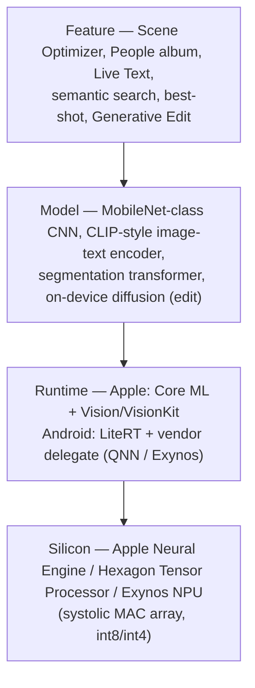

> How Samsung and Apple do on-device ML in their Camera and Gallery/Photos
> apps — the product-systems and engineering angle. Cover the shipped consumer
> stacks, not the academic method lineage. For each capability, get concrete:
> which model class, which runtime, which hardware block, and what the
> engineering effort/constraint actually is. Prefer primary/verifiable sources;
> where a capability is proprietary and undocumented, say so and reason from the
> closest open equivalent rather than inventing specifics.

## Short answer

Both companies ship the same four-layer stack — **silicon → runtime → model →
feature** — and the whole product story is what each layer forces on the ones
above it. The differences that matter are in *documentation and boundary
placement*, not in the underlying idea.

- **The stacks are structurally identical.** A fixed-function neural
  accelerator (Apple Neural Engine; Qualcomm Hexagon Tensor Processor or Samsung
  Exynos NPU) runs quantized, mobile-class models (MobileNet-family CNNs, a
  CLIP-style image–text encoder, a small segmentation transformer) dispatched by
  a vendor runtime (Apple Core ML; Android's LiteRT over a vendor delegate).
  Every "AI photo feature" is a head on top of one of a small number of shared
  backbones.

- **Apple documents its pipeline; Samsung documents its features.** Apple has
  published architecture papers naming the models behind face clustering,
  semantic search, and segmentation, with on-device latency and memory figures.
  Samsung publishes capabilities and *training-set sizes* ("learns about 300,000
  expert-selected pictures", "a vision-language model") but almost never names an
  architecture and never publishes a per-feature NPU latency or TOPS budget. So
  for Apple many "runs on the NPU at X ms" claims are sourced; for Samsung the
  equivalent claims are almost all inference.

- **The single hardest engineering problem is operator coverage, not TOPS.** An
  NPU is a systolic MAC array that is extremely efficient on the convolution and
  matrix-multiply operators it supports and useless on the ones it does not — an
  unsupported op falls back to CPU/GPU and can erase the win. This is why
  MobileNet-class convnets dominate on-device vision and why "efficient ViT"
  exists at all, and it is why headline TOPS numbers (many of which are
  unpublished or third-party) predict real throughput poorly.

- **The most important 2024–2026 platform fact is the death of NNAPI.** Google
  deprecated Android's Neural Networks API in Android 15 (2024) and now routes
  on-device inference through **LiteRT** (the renamed TensorFlow Lite, September
  2024) over vendor delegates / the LiteRT Next unified NPU API. Apple never had
  this fragmentation — Core ML has always been the single Apple path.

- **The cleanest capabilities are on-device on both platforms; generative edit
  is where the cloud enters.** Scene classification, face clustering, OCR, and
  semantic photo search run locally on both. Apple keeps even most generative
  edits on-device and routes only heavy Apple Intelligence requests to Private
  Cloud Compute (plus one homomorphic-encryption landmark-search exception);
  Samsung sends its heavy generative edits (Generative Edit fill, Sketch to
  Image, Portrait Studio) to **Google Cloud** (Gemini + Imagen on Vertex AI) and
  stamps them with a visible AI watermark, gated by a "Process data only on
  device" toggle.

The rest of this report walks the stack bottom-up (silicon, runtime), then goes
feature by feature across both products, then treats the privacy/cloud boundary,
and ends with an explicit ledger of what could not be verified. It deliberately
does **not** re-derive the academic method lineage for image quality/aesthetic
assessment or the Android camera plumbing — those live in the companion vault
pages and are only referenced here.

## The framing: four layers, and who owns each

Every product capability below is one box in the *Feature* row. What makes it
shippable is the three layers under it, and the recurring engineering tension is
that the bottom layer (a narrow, quantized MAC array) constrains the model layer
hard: only operators the NPU supports run fast, only precisions it supports fit,
and only memory footprints under a few tens of MB stay resident. The product
teams' real work is squeezing a useful model through that funnel.

## Layer 1 — the neural accelerator (ANE vs Hexagon vs Exynos NPU)

### What an NPU actually is

A mobile NPU is a **systolic array of multiply-accumulate (MAC) processing
elements** built for quantized dense linear algebra — the convolutions and
matrix multiplies that dominate neural nets. Data streams through the array and
is reused in place, which is what eliminates the memory-bandwidth waste a
general-purpose GPU incurs on these patterns; the multipliers are narrow (8-bit,
increasingly 4-bit) because that is all quantized inference needs. That
specialization is the whole point and also the whole problem: **the NPU is
excellent on its supported operators and falls back to CPU/GPU on everything
else.** Softmax, LayerNorm, dynamic reshapes/transposes, and other non-GEMM ops
are poorly served, so a model that "converts" to the vendor format may still run
partly off the accelerator — conversion success is not the same as running on
the NPU, and op placement must be profiled per device and per OS version. This
operator-coverage tax, not peak TOPS, is the dominant systems fact of the whole
field.

Because the array is cheap and feeding it from memory is not, **on-device
inference is memory-bandwidth- and thermal-bound, not FLOP-bound.** Lowering
precision (int8, int4) buys latency and energy by moving fewer bytes, and peak
TOPS is not sustainable under a phone's power/thermal envelope — sustained
throughput is set by energy-per-inference and memory traffic. Quote peak TOPS
with that caveat attached.

### The TOPS trajectories (with the parts that are not published)

Apple states first-party TOPS for most Neural Engine generations; the two to
*not* state without a caveat are A13 (Apple gave only "20% faster than A12", no
absolute figure) and M3 (sources conflict: 15.8 vs 18 TOPS).

| Apple chip | Year | ANE peak | Confidence |
|---|---|---|---|
| A11 Bionic | 2017 | 0.6 TOPS (first ANE) | Apple-stated |
| A12 | 2018 | 5 TOPS | Apple-stated |
| A13 | 2019 | **not stated** ("20% faster" only) | — flag |
| A14 / M1 | 2020 | 11 TOPS | Apple-stated |
| A15 / M2 | 2021–22 | 15.8 TOPS | Apple-stated |
| A16 | 2022 | 17 TOPS | Apple-stated |
| A17 Pro | 2023 | 35 TOPS | Apple-stated |
| A18 | 2024 | 35 TOPS | Apple-stated |
| M3 | 2023 | **15.8 or 18** — sources conflict | flag |
| M4 | 2024 | 38 TOPS | Apple-stated |

The Android side is worse for sourcing, and this is itself a finding:
**Qualcomm publishes no clean per-generation NPU-only TOPS** — only relative
multipliers ("4.35× AI vs the prior gen") or aggregate "AI performance" figures
that fold in CPU+GPU. The INT8 NPU ladder everyone quotes (Snapdragon 8 Gen 1
≈32 → Gen 2 ≈26 → Gen 3 ≈34/45 → 8 Elite ≈50 TOPS) is third-party (Wikipedia),
not a Qualcomm datasheet. The apparent 32→26 *regression* from Gen 1 to Gen 2 is
the tell that the third-party INT8 number misses the story: Gen 2's gains came
from adding **INT4 weight support** and micro-tiling, not from raising INT8
throughput. Samsung has published exactly one solid Exynos NPU figure — **26
TOPS for the Exynos 2100 (2021)** — and only relative multipliers since (Exynos
2400 quoted as "14.7× AI vs the 2200", with no absolute and ambiguous whether it
is NPU-only or aggregate). Galaxy flagships are also split by region: the S23
generation was Snapdragon-only globally, while the S24 base/plus used Exynos
2400 in Europe and Snapdragon elsewhere. Treat any single NPU-TOPS ladder for
Galaxy as false precision.

## Layer 2 — the runtime (Core ML vs LiteRT), and squeezing the model through it

### Apple: one path, automatic placement

Apple's stack is **Core ML** (the runtime and the `.mlpackage` / ML Program
format, compiled to `mlmodelc`), with **Vision** (image analysis requests),
**VisionKit** (Live Text / data-scanner UI), and **Create ML** (training)
layered on it. Placement across ANE / GPU / CPU is **automatic and per-layer**:
the developer ships one model and expresses a *preference* via `MLComputeUnits`
(`all`, `cpuOnly`, `cpuAndGPU`, `cpuAndNeuralEngine`); Core ML's runtime decides
the actual dispatch layer by layer, and that policy is deliberately opaque —
developers cannot pin a layer to the ANE, only state a preference. The single
Apple path is the mirror image of the Android fragmentation below.

Model compression is `coremltools.optimize`, with three composable families
Apple documents as ANE-friendly on recent silicon (A17 Pro / M4): **quantization**
(int8 weights+activations; int4 weight-only — note there is no int4 *activation*
path), **palettization** (lookup-table weights at 1/2/3/4/6/8 bits — Apple's name
for weight-clustering), and **magnitude pruning**; they compose (sparse then
palettized). Apple's own production numbers show the budgets these hit: the
panoptic-segmentation model at ~17 MB after 8-bit quantization, the scene-analysis
encoder at ~24.6 MB resident on the ANE. int8 weight-only or 6–8-bit
palettization is described as near-lossless and applied "in minutes"; int4 and
int8-activation are the aggressive settings that need care.

### Android: NNAPI is dead, long live LiteRT + vendor delegates

The load-bearing platform change of 2024–2026: Google **deprecated NNAPI**
(introduced Android 8.1, 2017) in **Android 15 (2024, NDK API level 35)**, on the
rationale that post-NNAPI on-device ML moved too fast (transformers, diffusion)
for an OS-versioned API to keep up. The successor path:

- **LiteRT** — TensorFlow Lite, renamed September 2024, same `.tflite` format and
  runtime, now under Google AI Edge and spanning PyTorch/JAX/Keras exports.
- **Delegates** — LiteRT's current delegate list is down to **GPU** (Android/iOS)
  and **Core ML** (iOS); the **NNAPI and Hexagon delegates are deprecated/removed**.
  GPU is the portable fallback.
- **LiteRT Next unified NPU API** — `CompiledModel.create(..., Accelerator.NPU)`
  dispatches to a vendor accelerator without the app touching vendor compilers:
  listed backends include **Qualcomm AI Engine Direct**, MediaTek NeuroPilot,
  **Samsung Exynos AI LiteCore**, Google Tensor, and Intel OpenVINO.
- **Vendor-direct** — for maximum control, Qualcomm's **QAIRT / AI Engine Direct
  (QNN)** targets the Hexagon Tensor Processor (the NPU); the older **SNPE** is
  superseded. A LiteRT Qualcomm AI Engine Direct accelerator announced **November
  2025** claims "up to 100× over CPU, 10× over GPU" and replaces the older QNN
  delegate. Samsung's **Neural SDK** last shipped v3.0 (2021) and is "no longer
  provided to third-party developers"; its **ENNDelegate** for the Exynos NPU is a
  license-gated (non-open-source) LiteRT delegate.

Model optimization on Android mirrors Apple's levers with LiteRT's four PTQ
schemes — dynamic-range (weights→int8, "4× smaller, 2–3×"), full-integer (int8
weights+activations, needs a representative dataset, "4× smaller, 3×+"), float16
(GPU), and experimental 16×8 — plus QAT as the accuracy fallback. **int4** is a
*Qualcomm-hardware* feature (Hexagon HTP supports INT4 weights via QAIRT for
Conv2D/MatMul with >32 output channels), not a standard LiteRT PTQ mode.

### The portability tax, stated plainly

The same PyTorch/ONNX model must be exported and **re-verified on every vendor
stack**, because op-support gaps differ by vendor and by OS version. "Runs on my
NPU" is a per-device claim, not a portable one. Apple pays this tax once (Core ML
only); Android app developers pay it per silicon vendor, which is precisely why
Google built the LiteRT Next abstraction to try to hide it.

## Layer 3+4 — the capabilities, feature by feature

For each capability: what the model class is, where it runs, and where the
evidence is solid versus inferred.

### Scene/object classification — Apple Vision vs Samsung Scene Optimizer

**Apple.** Vision exposes `VNClassifyImageRequest`, returning hierarchical
category labels filterable by precision/recall; in the shipping Camera/Photos
pipeline, classification is one *head* on the shared on-device scene-analysis
backbone (below), running on the ANE. The often-quoted "~1000 classes" figure is
a third-party blog, not Apple — Apple exposes the taxonomy via
`knownClassifications(forRevision:)` but publishes no fixed count. Do not state a
class count.

**Samsung.** Scene Optimizer is an **on-device, preview-stage CNN** classifier
running on the Exynos/Snapdragon NPU whose scene label is handed to the ISP for
scene-specific tuning — Samsung's semiconductor page describes exactly this
NPU+ISP handoff, and its camera documentation attributes it to a "Samsung Neural
Acceleration Platform … using Convolutional Neural Networks". The scene count
grew ~20 (Galaxy Note 9 / S9, 2018) → 30 (S10, 2019) → "up to 30" (S20+, 2020+);
whether later flagships exceed 30 is undocumented. A separate **post-capture**
deep-learning "detail enhancement engine" runs on the multi-frame result for
specific scenes (the moon-photo controversy is this stage). The binding
constraint is that the classifier must update the live scene badge at preview
framerate — a per-frame NPU budget of tens of milliseconds — but Samsung never
publishes the actual latency.

### Face detection & clustering — Apple People (& Pets) vs Samsung Gallery

**Apple** is the best-documented case in the whole report. The 2021 paper
"Recognizing People in Photos Through Private On-Device Machine Learning"
describes a **two-network design** (a face-crop embedding and an upper-body-crop
embedding, backbone "inspired by AirFace and MobileNetV3") feeding **two-pass
agglomerative clustering** (conservative within a "moment", then expansion across
moments), run **entirely locally** while the device charges overnight. The
sourced systems number: **face-embedding generation completes in under 4 ms on
the ANE, an 8× speedup over the same model on the GPU.** The privacy model:
matching/clustering is local; adding a name propagates the name+face association
across iCloud devices. Whether what transits iCloud is the *embedding* or only
the *label* is asserted by secondary press but not stated by Apple — flag it. The
"People & Pets" rename (animal recognition) is a later addition (iOS 18, 2024).

**Samsung** performs on-device face-template ("faceprint") generation and
clustering in Gallery. The strongest *source* here is unusual — a 2024 U.S.
federal court dismissal of an Illinois biometric-privacy class action, which
described Samsung's technology as generating and storing templates **on the
device** and found plaintiffs had not alleged the data is transmitted to Samsung.
Read adversarially, that is a finding about pleadings, not a Samsung "faces never
leave the device" guarantee; the detector/embedding architecture and clustering
algorithm are undocumented ("proprietary").

### OCR / text-in-images — Apple Live Text vs Samsung's two paths

**Apple.** OCR is on-device via Vision's `VNRecognizeTextRequest` (with `.fast`
vs `.accurate` levels and language hints). User-facing **Live Text** shipped in
iOS 15 (announced June 2021), requires A12 Bionic or newer (i.e. leans on the
ANE), and launched with 7 languages; `DataScannerViewController` (live-camera
scanning) followed in iOS 16 (2022). Live Text was on-device from the start —
there was no prior cloud-OCR era to migrate from.

**Samsung** has two OCR features with *opposite* processing models, which is the
interesting engineering fact. **Bixby Vision** text/translate (since the Galaxy
S8, 2017) is **network-dependent** ("a network connection is required") — cloud
OCR. But the **Gallery "extract text from image"** feature (the yellow **(T)**
icon, One UI 4.1.1, 2022) is a separate on-device path. Samsung does not state
the Gallery OCR engine (its own vs Google's ML Kit) — undocumented.

### Semantic / natural-language photo search — "a dog on a beach"

This is the capability where the four-layer framing is clearest and where the
"reason from the open equivalent" instruction bites, so treat it in two parts.

**The general mechanism (well-understood, vendor-neutral).** Natural-language
image retrieval works by mapping every photo *and* the text query into one shared
vector space with a **CLIP-family dual encoder** (contrastive image+text
training; the reference CLIP ViT-B/32 emits a 512-dim embedding per modality),
then doing **approximate nearest-neighbor (ANN)** search of the query vector
against the stored photo vectors. The decomposition is *encode-once-at-import*
(run the image encoder per photo → one vector) plus *ANN-at-query* (encode the
text once, search the vectors). Apple's **MobileCLIP** (CVPR 2024) is exactly the
efficient encoder this needs — its S0–S2 variants report single-digit-millisecond
image/text encoders (e.g. S2 ≈3.6 ms image, 74.4% zero-shot ImageNet), trained by
distilling a CLIP ensemble + a captioning model into a "reinforced dataset". On
the search side, at photo-library scale (tens of thousands of vectors, ~100 MB
float32 for 50k×512) a **flat brute-force scan is often fast enough** and ANN may
be unnecessary; when it is needed, the FAISS-style menu is HNSW (lowest latency,
highest RAM), IVF (partitioned, ~3× less RAM, cheap to rebuild — good for a
library that constantly gains/loses photos), and Product Quantization (compresses
the vector store from ~100 MB to a few MB at some recall cost).

**What each vendor actually ships.** Apple **documents** its backbone: the
**Apple Neural Scene Analyzer (ANSA)**, a **CLIP-style contrastive image–text
model** (MobileNetV3-variant image encoder, ~16M params; text encoder pruned
44M→26M; all heads under ~9.7 ms and ~24.6 MB resident on the ANE; 8-bit
quantized) trained on "a few hundred million image-text pairs", whose frozen
embeddings power visual search in Photos/Spotlight, Memories, deduplication,
scene classification in Camera, and wallpaper suggestions. Cross-modal text→image
search is embedding retrieval over these on-device vectors. Apple does *not*
document the ANN/index data structure it uses — that it is HNSW/IVF/etc. is
inferred, not stated. Apple separately documents an on-device **knowledge graph**
of people/places/events that powers Memories. **Samsung** shipped true
natural-language "Gallery Search" with the Galaxy S25 (One UI 7, January 2025),
which it describes as powered by a **"vision-language model that learns by
associating images with text"** plus generative expansion of candidate query
sentences; an independent cloud-vs-on-device breakdown lists it as **on-device**.
But Samsung names no architecture — **calling it "CLIP-like" is inference, not a
Samsung claim** — and the "generate candidate sentences" detail hints at a
query-expansion/tag-matching pipeline rather than pure embedding cosine
similarity; the actual retrieval mechanism is unknown. (A separate Gemini↔Gallery
integration in One UI 8.5, 2026, is a cloud/Google path, distinct from Samsung's
on-device engine.)

### In-product image quality / aesthetics — best-shot, curation, dedup

This is the *weakest-documented* area on both sides, and the honest finding is
that neither vendor names an IQA/IAA model in its shipping stack. (The academic
lineage — NIMA, MUSIQ, VILA, the CLIP/MLLM turn — is covered in this vault's
image-quality-assessment / image-aesthetic-assessment pages and reports R1–R4;
it is *not* re-derived here, and it should not be imported as if it described
these products.)

**Apple** documents only that Photos runs on-device "photo quality analysis" and
that ANSA embeddings drive Featured Photos, Memories curation, and duplicate
detection (the Duplicates album, iOS 16, 2022). There is **no** published
best-shot/aesthetic method — any specific aesthetic-scoring architecture tied to
Apple best-shot selection is inference.

**Samsung** actually publishes the most concrete aesthetic-scoring detail of
anyone, for **Single Take**: an "aesthetic engine" that "learns about 300,000
pictures selected by experts and evaluates … sharpness, picture quality, and
facial expressions" and a composition engine trained on "about 100 million
images", alongside person/motion/capture engines, feeding the best-shot crown
pick. That is an IAA regressor + expression classifier + composition model by
description — but the architecture is unnamed (no NIMA/VILA attribution) and no
NPU/latency figure is given. Gallery Stories/highlights are documented as
time/location/face clustering (whether an aesthetic scorer ranks frames is
unknown); duplicate detection (Clean Out) appears to catch exact re-saves
(hash/exact match) — a *perceptual near-duplicate embedding is not established*,
so do not assume one. Automatic blur-culling in Gallery is not documented at all;
Samsung documents blur *remediation* (Enhance-X, Remaster), not blur *detection*
for deletion.

### Camera-time and edit-time ML — the segmentation backbone and generative edit

**Apple's best-documented camera-time ML is semantic segmentation.** The 2021
paper "On-device Panoptic Segmentation for Camera Using Transformers" describes
**HyperDETR** (a decoupled DETR transformer) producing pixel masks for **six
classes — sky, person, hair, skin, teeth, glasses** (note: **not** foliage,
despite its frequent inclusion in feature lists), running on the ANE within the
A15 (iPhone 13) at ~17 MB after 8-bit quantization. These masks drive Portrait
mode (person mask + depth), **Smart HDR 4** (per-person masks for
contrast/skin-tone, sky segmentation for denoising), **Photographic Styles**, and
**semantic rendering** (up to four people). By contrast, **Deep Fusion** (iOS
13.2, 2019) and Smart HDR are neural multi-frame fusion but are documented mainly
through press, not an Apple research paper — treat their internal architecture as
press-sourced. (The multi-frame *capture* mechanics — HDR+/Night mode/super-res,
ZSL ring buffers — are covered in this vault's computational-photography and
Camera2 pages; the segmentation masks here are the *ML guidance layer* on top of
that pipeline.)

**Generative edit** is where on-device meets the cloud. On-device diffusion is
feasible but heavy: a diffusion pipeline is ~4 networks (~1.275B params total) and
its cost is the UNet denoiser run once per step (~20+ steps), so latency is
seconds. Apple's own published Core ML Stable Diffusion (December 2022, iOS 16.2)
measured, at 512² / 20 steps, ~7.9 s on an iPhone 14 Pro Max and ~18.5 s on an
iPhone 12 mini (later builds added 6-bit palettized weights). That order of
magnitude is why Apple keeps lightweight edits (Clean Up) on-device and routes
heavy generative Apple-Intelligence requests to **Private Cloud Compute**.
**Samsung's** Object Eraser simple-erase (~2021) is on-device, but **Generative
Edit** (generative fill/move/resize), **Sketch to Image**, **Photo Assist**, and
**Portrait Studio** are **cloud** — they require a network and a Samsung account
and stamp a visible **"AI-generated" watermark**. The generative platform is
explicitly **Google Cloud (Gemini + Imagen 2 on Vertex AI)** — *not* Google
Tensor silicon; no source ties Galaxy AI to Tensor, and Galaxy phones run
Snapdragon/Exynos.

## The privacy / on-device boundary

The two companies place the on-device↔cloud boundary differently, and both
placements are deliberate product positions.

**Apple — on-device by default, with three named cloud mechanisms.**
Classification, faces, segmentation, and semantic embeddings are all local.
Differential privacy is used only for **aggregate telemetry** (emoji/word
discovery, and from iOS 18.5 in 2025 training some Apple Intelligence features) —
**not** to protect the content of your own photos, a common conflation. Two
genuine cloud paths exist: **Enhanced Visual Search** (landmark search, 2024) is
the notable "leaves the device" exception — the on-device model computes a
landmark embedding, encrypts it under the **BFV homomorphic-encryption** scheme,
and the server runs a private nearest-neighbor search on the *ciphertext* (with
differential-privacy noise ε=0.8, δ=10⁻⁶ and an OHTTP relay hiding the device IP),
so Apple "can't decrypt the embedding or results" — on by default, which drew
criticism in January 2025. And **Private Cloud Compute** handles heavier
Apple-Intelligence generative requests on Apple-silicon servers that "delete
after the request". Apple does not publish a per-feature on-device/PCC table, so
which specific edit routes where is not fully enumerated.

**Samsung — hybrid with a visible switch.** The **"Process data only on device"**
toggle (Galaxy AI settings; the "Advanced intelligence" menu shipped with One UI
6.1 in 2024, documented by February 2025) forces Samsung's own features local and
disables the cloud-dependent ones — but it only affects *Samsung's* features, not
third-party apps (Gemini, ChatGPT). Samsung's public stance is that personal data
is "never stored long-term or used for AI training, whether processed on-device or
in the cloud", and cloud-generated edits carry the AI watermark. The tell of the
boundary is exactly where Samsung had a reason to document it: generative edits
(cloud + watermark) and NL search (on-device, per the independent breakdown) are
stated; the curation/IQA features (Single Take, Stories, duplicates) are only
*inferred* on-device.

## The engineering effort, distilled

Stripping away the feature list, the recurring hard problems — the actual work —
are the same on both platforms:

1. **Fit the model to the operator set, not just the FLOP budget.** MobileNet-class
   convnets win on-device because depthwise-separable convs are first-class NPU
   operators; ViT attention (softmax, LayerNorm, dynamic reshapes) is not, which
   is the entire reason "efficient ViT" work exists (EfficientFormer reports 2.2×
   speedup over a comparable model on the iPhone NPU by removing NPU-unfriendly
   ops). Apple's shipping choices confirm this — a MobileNetV3-variant image
   encoder for ANSA, a MobileNet-inspired face backbone, and only a *small*
   decoupled transformer (HyperDETR) for segmentation.

2. **Quantize aggressively and keep the footprint under a few tens of MB.** Apple's
   own shipping models land at ~17 MB (segmentation) and ~24.6 MB (scene analysis)
   after 8-bit quantization; int4 and int8-activations are the aggressive levers
   that need QAT/grouping because efficient nets have little redundancy to spare.

3. **Encode once, search cheap.** Semantic search is an amortization problem — pay
   the encoder cost per photo at import, keep search to an ANN (or even a flat
   scan) over small vectors. The model choice (MobileCLIP-class) exists to make
   the per-import cost affordable.

4. **Pick the boundary and own it.** The genuinely expensive capability
   (generative diffusion edit, seconds per image) forces a product decision: keep
   it on-device and eat the latency (Apple's Clean Up) or send it to the cloud and
   eat the privacy/watermark cost (Samsung's Generative Edit). There is no third
   option today.

5. **Pay the portability tax — or make Google pay it.** Apple's single Core ML path
   is a strategic advantage here; Android's answer (NNAPI's deprecation, LiteRT +
   the LiteRT Next unified NPU API) is an ongoing attempt to hide multi-vendor
   fragmentation that Apple never had.

## Uncertainty ledger — what could not be verified

Explicit, per the evidence bar. These are the claims a reader should *not* treat
as established:

- **NPU-only TOPS for any Qualcomm Snapdragon generation** — unpublished; the
  common INT8 ladder is third-party. **Exynos 2200/2400 TOPS** — unpublished
  (only relative multipliers). **Apple A13 and M3 TOPS** — A13 has no official
  figure; M3 sources conflict (15.8 vs 18).
- **Samsung model architectures** — Scene Optimizer CNN, Gallery face
  detector/embedding, the Single Take aesthetic/composition engines, and the S25
  Gallery-search "vision-language model" are all unnamed. "CLIP-like",
  "NIMA/VILA-style", and any Samsung per-feature NPU latency are inference.
- **Apple's on-device ANN/vector-index structure** for semantic search — inferred
  from the embedding architecture, not documented.
- **Whether iCloud syncs face embeddings or only labels** — asserted by press, not
  stated by Apple.
- **The exact ANSA / MobileCLIP embedding dimensions and the ANSA per-head
  latency/memory figures** — drawn from the research posts and should be
  re-verified against the source text before being quoted as hard numbers.
- **Samsung Gallery near-duplicate detection** as perceptual/embedding-based —
  unsupported; the evidence points to exact/hash matching. **Automatic
  blur-culling in Samsung Gallery** — not documented; likely absent.
- **The erase-vs-generative-fill on-device/cloud split inside Samsung Object
  Eraser**, and **which specific cloud model backs each Galaxy AI edit** —
  undocumented beyond the platform-level Gemini/Imagen/Vertex AI stack.
- **Server-class ANN benchmarks are not phone numbers** — they establish the shape
  of the recall/latency/memory tradeoff, not on-device figures. **Apple Stable
  Diffusion latencies are 2022–2023 device-specific figures**, cited with device +
  step count + precision, not a current-device guarantee.

## Sources

Primary sources are led with; secondary/third-party and contested figures are
marked in-line above.

**Apple — research & docs**
- [Recognizing People in Photos Through Private On-Device ML (2021)](https://machinelearning.apple.com/research/recognizing-people-photos)
- [A Multi-Task Neural Architecture for On-Device Scene Analysis / ANSA (2022)](https://machinelearning.apple.com/research/on-device-scene-analysis)
- [On-device Panoptic Segmentation for Camera Using Transformers (2021)](https://machinelearning.apple.com/research/panoptic-segmentation)
- [MobileCLIP (CVPR 2024)](https://machinelearning.apple.com/research/mobileclip) · [repo](https://github.com/apple/ml-mobileclip)
- [Combining ML and Homomorphic Encryption / Enhanced Visual Search (2024)](https://machinelearning.apple.com/research/homomorphic-encryption) · [Apple Support](https://support.apple.com/en-us/122033)
- [Stable Diffusion with Core ML on Apple Silicon (Dec 2022)](https://machinelearning.apple.com/research/stable-diffusion-coreml-apple-silicon) · [ml-stable-diffusion](https://github.com/apple/ml-stable-diffusion)
- [Deploying Transformers on the Apple Neural Engine](https://machinelearning.apple.com/research/neural-engine-transformers)
- [Vision `VNClassifyImageRequest`](https://developer.apple.com/documentation/vision/vnclassifyimagerequest) · [`VNRecognizeTextRequest`](https://developer.apple.com/documentation/vision/vnrecognizetextrequest) · [VisionKit `DataScannerViewController`](https://developer.apple.com/documentation/visionkit/datascannerviewcontroller)
- [Core ML overview](https://developer.apple.com/machine-learning/core-ml/) · [`MLComputeUnits`](https://developer.apple.com/documentation/coreml/mlcomputeunits) · [coremltools optimization](https://apple.github.io/coremltools/docs-guides/source/opt-overview.html)
- [Photos & privacy (Apple Legal)](https://www.apple.com/legal/privacy/data/en/photos/) · [Differential Privacy Overview (PDF)](https://www.apple.com/privacy/docs/Differential_Privacy_Overview.pdf) · [Private Cloud Compute](https://security.apple.com/blog/private-cloud-compute/)
- ANE TOPS: [A17 (Wikipedia)](https://en.wikipedia.org/wiki/Apple_A17) · [iPhone 16 newsroom (A18)](https://www.apple.com/newsroom/2024/09/apple-introduces-iphone-16-and-iphone-16-plus/) · [community ANE table](https://github.com/hollance/neural-engine/blob/master/docs/supported-devices.md)

**Samsung / Qualcomm / Google Android**
- [Samsung AI camera (NPU + ISP)](https://semiconductor.samsung.com/applications/ai/ai-camera/) · [Scene Optimizer (S10)](https://www.samsung.com/in/support/mobile-devices/how-does-the-scene-optimiser-improve-my-photos/) · [moon-photo AI detail engine](https://www.samsungmobilepress.com/articles/how-samsung-galaxy-cameras-combine-super-resolution-technologies-with-ai-technology-to-produce-high-quality-images-of-the-moon)
- [Illinois BIPA dismissal describing Gallery face templates (2024)](https://blogs.duanemorris.com/classactiondefense/2024/07/28/illinois-federal-court-dismisses-class-action-privacy-claims-involving-use-of-samsungs-gallery-app/)
- [Bixby Vision (network required)](https://www.samsung.com/us/support/answer/ANS10002530/) · [Gallery extract-text](https://www.samsung.com/ae/support/mobile-devices/how-to-extract-text-from-a-photo/)
- [S25 Gallery natural-language search interview](https://news.samsung.com/global/interview-a-new-and-enhanced-gallery-experience-how-samsung-transformed-photo-searching-and-video-editing-with-the-galaxy-s25-series) · [cloud-vs-on-device breakdown](https://www.androidauthority.com/samsung-galaxy-s25-ai-features-cloud-on-device-3517555/)
- [Single Take engines (300k aesthetic / 100M composition)](https://www.samsung.com/uk/support/mobile-devices/how-to-make-the-most-of-single-take-with-the-galaxy-s22-ai-camera/)
- [Samsung + Google Cloud generative AI (Gemini Pro + Imagen 2, 2024)](https://news.samsung.com/global/samsung-and-google-cloud-join-forces-to-bring-generative-ai-to-samsung-galaxy-s24-series) · [Portrait Studio (cloud)](https://www.samsung.com/us/support/answer/ANS10004857/) · ["Process data only on device"](https://9to5google.com/2025/02/20/how-to-turn-on-galaxy-ai-on-device-processing/)
- [NNAPI deprecation / migration (Android 15, 2024)](https://developer.android.com/ndk/guides/neuralnetworks/migration-guide) · [TFLite → LiteRT rename (Sept 2024)](https://developers.googleblog.com/tensorflow-lite-is-now-litert/) · [LiteRT delegates](https://developers.google.com/edge/litert/performance/delegates) · [LiteRT Next NPU API](https://developers.google.com/edge/litert/next/npu)
- [Qualcomm LiteRT AI Engine Direct accelerator (Nov 2025)](https://developers.googleblog.com/unlocking-peak-performance-on-qualcomm-npu-with-litert/) · [Hexagon INT4 weights](https://docs.qualcomm.com/nav/home/htp_guidelines_int4_weights.html) · [Samsung ENNDelegate](https://github.com/Samsung/ENNDelegate) · [Samsung Neural SDK](https://developer.samsung.com/neural/overview.html)
- [LiteRT post-training quantization](https://developers.google.com/edge/litert/models/post_training_quantization) · [Hexagon (Wikipedia, third-party TOPS)](https://en.wikipedia.org/wiki/Qualcomm_Hexagon) · [Exynos (Wikipedia)](https://en.wikipedia.org/wiki/Samsung_Exynos)

**Vendor-neutral foundations**
- [CLIP (OpenAI)](https://openai.com/research/clip) · [FAISS product quantization tutorial](https://www.pinecone.io/learn/series/faiss/product-quantization/) · [HNSW vs IVF](https://bigdataboutique.com/blog/hnsw-vs-ivfflat-how-to-choose-the-right-vector-index)
- [EfficientFormer (NeurIPS 2022)](https://arxiv.org/abs/2206.01191) · [MobileViT (2021)](https://arxiv.org/abs/2110.02178)
- [Quantization-aware training (NVIDIA)](https://developer.nvidia.com/blog/how-quantization-aware-training-enables-low-precision-accuracy-recovery/) · [PTQ on efficient nets (survey)](https://arxiv.org/pdf/2411.01431)
