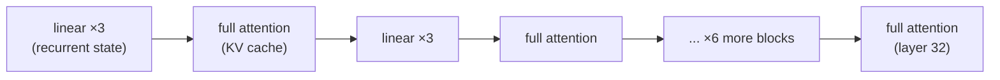

> Research what is and how to use Agent-A1-4B model for Mac Mini and mobile devices.

## Short answer

**Naming correction first**: there is no "Agent-A1-4B." The model is
**Agents-A1-4B** (plural), by **InternScience** (the InternAgent team at
Shanghai AI Laboratory), released 2026-07-14, Apache-2.0. It is a 4.5B-parameter
(4.21B language + 0.33B vision) dense **agentic** vision-language model, fine-tuned
from Alibaba's Qwen3.5-4B onto InternScience's own agent-trajectory data. If you
search "Agent-A1-4B" you will find nothing usable — search "Agents-A1-4B".

- **What it is**: a hybrid-attention (8 full-attention + 24 linear/recurrent
  layers out of 32), 256K-context, tool-calling VLM — architecturally Qwen3.5,
  behaviorally tuned for long-horizon search/tool-use agents (GAIA 95.1,
  BrowseComp 66.8, IFEval 94.8 per its own model card).
- **Mac Mini**: runs comfortably. The Q4_K_M GGUF is **3.38 GB** on disk
  (text 2.71 GB + vision 0.64 GB); with the full 256K-token context resident it
  is **~12 GB** total — fits a base 16 GB M4 Mac mini. Decode is
  memory-bandwidth-bound: a computed (not measured) roofline puts it at
  **~26–44 tok/s on an M4 (120 GB/s)** and **~60–100 tok/s on an M4 Pro
  (273 GB/s)**, quant- and context-dependent. **llama.cpp and Ollama both have
  native mainline support for this exact architecture** (`LLM_ARCH_QWEN35`);
  MLX (`mlx-lm`/`mlx-vlm`) supports it in code but has no pre-made 4B quant
  yet — you convert it yourself.
- **Mobile**: real but narrower than the happy path suggests. The Q4_K_M
  footprint fits comfortably in a modern flagship phone's RAM, and
  llama.cpp-based apps (PocketPal AI, ChatterUI) run on a `llama.rn` build
  that already carries `qwen35` support — but the actual limiter on iOS is the
  **per-app memory ceiling (jetsam)**, not total device RAM, which makes
  anything near 256K context impractical on-device. **MLC LLM's own loader
  explicitly ignores this model's vision and multi-token-prediction weights**
  — text-only agent, no image input, if you go that route. **ExecuTorch ships
  no 4B config for this architecture** (its qwen3.5 examples stop at 2B) — you'd
  be building an export recipe from scratch. Driving it as an *agent* (parsing
  its tool-call format, looping tool results back in) is a client-side harness
  you write yourself on every runtime; no runtime does this for you.

## What Agents-A1-4B actually is

InternScience released a 35B-A3B mixture-of-experts flagship on 2026-06-26
(paper: [arXiv:2606.30616](https://arxiv.org/abs/2606.30616), "Scaling the
Horizon, Not the Parameters"), then a dense 4B variant on 2026-07-14 "by
popular demand" for people who want a local agent
([model card](https://huggingface.co/InternScience/Agents-A1-4B)). Both are
trained the same way: full-domain supervised fine-tuning, then domain-level
teacher models for search/engineering/research/tools/instructions, then
multi-teacher on-policy distillation back into one model. The project page
([internscience.github.io/Agents-A1](https://internscience.github.io/Agents-A1/))
covers only the 35B flagship in detail; the 4B's own model card is the primary
source for the smaller variant used here.

The 4B's own benchmark table (quoted from its model card) is the honest
picture, including where it *loses* to its own non-agentic base model:

| Benchmark | Qwen3.5-4B (base) | **Agents-A1-4B** | Agents-A1 (35B-A3B) |
|---|---|---|---|
| GAIA | 58.3 | **95.1** | 96.0 |
| BrowseComp | 47.2 | **66.8** | 75.5 |
| IFEval | 89.8 | **94.8** | 94.8 |
| IFBench | 59.2 | 69.1 | 80.6 |
| VitaBench (tool-use) | 22.0 | **40.3** | 38.8 |
| SciCode | 16.1 | 29.6 | 44.3 |
| τ²-Bench (tool-use) | **79.9** | 78.2 | 79.8 |

The fine-tune is not a strict upgrade on every axis — τ²-Bench is a case where
the agentic distillation cost 1.7 points against the untuned base — which is
worth knowing before assuming "agentic fine-tune" always beats "generalist
base" on tool-use specifically.

## Architecture: why this model is cheap at long context

`config.json` (`InternScience/Agents-A1-4B`) declares `"architectures":
["Qwen3_5ForConditionalGeneration"]`, `"model_type": "qwen3_5"` — this is
Alibaba's Qwen3.5 architecture family, the successor to Qwen3-Next's hybrid
linear-attention design, not a bespoke InternScience architecture. The
load-bearing fact for on-device performance is in `layer_types`: of the 32
decoder layers, only **every 4th one is standard full (quadratic) attention**;
the other 24 are **linear attention** — a gated recurrent layer (Gated
DeltaNet-style) whose per-token state is a small, **fixed-size** matrix rather
than a cache that grows with context length.



8 full-attention layers pay ordinary KV-cache cost; 24 linear-attention layers
pay an **O(1)-in-context** recurrent state. That is the entire reason a 256K
context is remotely affordable on consumer hardware — a conventional
32-full-attention-layer model with the same head config would need **4×** the
KV cache at the same context (measured below).

Other exact config facts worth knowing:
- **GQA**: 16 query heads, `num_key_value_heads: 4`, `head_dim: 256` (note
  `16 × 256 = 4096 ≠ hidden_size 2560` — head dim is decoupled from
  `hidden_size / num_heads`, unlike vanilla Llama-style attention).
- **MRoPE**: interleaved multimodal RoPE (`mrope_section: [11, 11, 10]`,
  `rope_theta: 1e7`, `partial_rotary_factor: 0.25`) — only a quarter of each
  head's dimensions are rotated, the Qwen-VL-style position scheme for mixed
  text/image/video sequences.
- **Multi-token prediction (MTP)**: `mtp_num_hidden_layers: 1` — a DeepSeek-V3-style
  extra head for speculative decoding, present in the weights (see the
  parameter breakdown below) though not all runtimes use it yet.
- **Tied embeddings**: `tie_word_embeddings: true`; `vocab_size: 248320`.
- **Vision tower**: a separate 24-layer, 1024-hidden ViT (`patch_size: 16`,
  `spatial_merge_size: 2`), projected into the 2560-dim text space.
- **Context**: `max_position_embeddings: 262144` (256K), matched by
  `tokenizer_config.json`'s `model_max_length` and the GGUF's own
  `context_length: 262144`.

### Exact parameter split (from the safetensors headers, not a guess)

The model card's "4.5 GB / 4.5B" summary blurs language vs. vision. Fetching
the two `model-*.safetensors` shards' headers via HTTP Range requests (first 8
bytes = header length, next N bytes = the JSON tensor-shape table — no need to
download the weights) gives the exact split:

| Component | Parameters | Share |
|---|---|---|
| Language decoder (32 layers) | 3,570,049,536 | 78.65% |
| Token embedding (tied with output) | 635,699,200 | 14.00% |
| Vision tower (24-layer ViT) | 333,514,240 | 7.35% |
| **Total** | **4,539,265,536** | 100% |

`635,699,200 == vocab_size (248,320) × hidden_size (2,560)` exactly, confirming
the tied embedding. The "language model" total (decoder + embedding + final
norm) is **4,205,751,296** — which is *exactly* the `"total"` param count both
GGUF repos' metadata report for their main `.gguf` file, confirming the
`mmproj` file is a separate, independent artifact holding only the vision
tower.

## Quantization and memory arithmetic (computed, not eyeballed)

Real, HTTP-verified file sizes — `HEAD` requests against the resolved GGUF
and safetensors URLs, not the model card's rounded claims:

| Artifact | Bytes | Size |
|---|---|---|
| `model-00000-of-00002.safetensors` (bf16, shard 1/2) | 5,363,484,352 | |
| `model-00001-of-00002.safetensors` (bf16, shard 2/2) | 3,715,136,104 | |
| bf16 total | 9,078,620,456 | 9.08 GB |
| `Agents-A1-4B-Q4_K_M.gguf` | 2,708,805,312 | 2.71 GB |
| `Agents-A1-4B-Q8_0.gguf` | 4,482,404,032 | 4.48 GB |
| `Agents-A1-4B-mmproj.gguf` (fp16, shared by both quant repos) | 672,423,200 | 0.67 GB |

Dividing each file's bytes by the exact language-only parameter count
(4,205,751,296) gives the *actual* bits/weight — useful because K-quants are
not literally "4-bit":

| Format | Bits/weight (measured) |
|---|---|
| bf16 | 16.00 (by definition) |
| Q8_0 | **8.53** |
| Q4_K_M | **5.15** |
| mmproj (vision) | 16.13 — i.e. **not requantized**, stored fp16 in both quant repos |

Q4_K_M's real rate (5.15 bpw, not 4) is the expected K-quant behavior: each
superblock carries fp16 scale/min metadata plus mixed-precision sub-blocks, so
"Q4" is a floor, not the true average. This is a known llama.cpp K-quant
property, not specific to this model — worth knowing before sizing a download
by "4 bits × params."

### KV cache — the number that matters at 256K context

A script (`memory_arithmetic.py`, full listing below) computes the KV-cache
cost precisely from `layer_types`, rather than assuming all 32 layers pay it:

```python
# 2 (K and V) x kv_heads x head_dim x num_full_attention_layers x context x bytes/elem
kv_bytes = 2 * num_kv_heads * head_dim * num_full_attention_layers * ctx * bytes_per_elem
```

| Context | fp16 cache | q8_0 cache | q4_0 cache |
|---|---|---|---|
| 4,096 | 0.13 GB | 0.07 GB | 0.04 GB |
| 32,768 | 1.07 GB | 0.57 GB | 0.30 GB |
| 131,072 | 4.29 GB | 2.28 GB | 1.21 GB |
| 262,144 (max) | **8.59 GB** | 4.56 GB | 2.42 GB |

For comparison, a conventional (non-hybrid) 32-full-attention-layer model with
the same head config would need **34.36 GB** of fp16 cache at 256K — 4× more,
because only 8 of 32 layers here are quadratic-attention layers. The 24
linear-attention layers' recurrent state is small and, per `config.json`'s
`mamba_ssm_dtype: float32`, kept in fp32; assuming the standard
Gated-DeltaNet-style state shape `(value_heads, key_head_dim, value_head_dim)`
per layer (an architectural inference from the config's dimensions, not a
number HuggingFace publishes directly), that state totals **~0.05 GB total,
constant regardless of context** — this is the entire mechanism by which 256K
context is affordable at all on a laptop.

Total resident memory (weights + KV + linear state) at representative
operating points:

| Scenario | Weights | KV cache | Linear state | **Total** |
|---|---|---|---|---|
| Q4_K_M, 4K context | 3.38 GB | 0.13 GB | 0.05 GB | **3.57 GB** |
| Q4_K_M, 32K context | 3.38 GB | 1.07 GB | 0.05 GB | **4.51 GB** |
| Q4_K_M, 128K context | 3.38 GB | 4.29 GB | 0.05 GB | **7.73 GB** |
| Q4_K_M, 256K context (max) | 3.38 GB | 8.59 GB | 0.05 GB | **12.02 GB** |
| Q8_0, 32K context | 5.15 GB | 1.07 GB | 0.05 GB | **6.28 GB** |
| Q8_0, 128K context | 5.15 GB | 4.29 GB | 0.05 GB | **9.50 GB** |
| bf16, 32K context | 9.08 GB | 1.07 GB | 0.05 GB | **10.21 GB** |

**Reading this**: a base 16 GB Mac mini M4 comfortably runs Q4_K_M at any
context up to the full 256K (12 GB, leaving ~4 GB for macOS + the app); Q8_0 is
fine up to ~128K on the same machine; bf16 wants the 24 GB tier if you need
more than a short context.

### Decode-speed roofline (computed, explicitly not measured)

Autoregressive decode of a dense model on Apple Silicon is memory-bandwidth-bound:
each token requires reading essentially all the weights once, plus the
full-attention layers' KV cache for that step. `tok/s ≤ bandwidth ÷
bytes-read-per-token` is an upper bound — real throughput sits below it once
compute, thermal throttling and kernel overhead are added, and **no measurement
of this specific model on this specific hardware was made for this report**:

| Chip (Apple-stated bandwidth) | Quant | Context | Ceiling (weights-only) | Ceiling (+ full KV reread) |
|---|---|---|---|---|
| Mac mini M4 (120 GB/s) | Q4_K_M | 4K | 44.3 tok/s | 42.2 tok/s |
| Mac mini M4 (120 GB/s) | Q4_K_M | 32K | 44.3 tok/s | 31.7 tok/s |
| Mac mini M4 (120 GB/s) | Q8_0 | 4K | 26.8 tok/s | 26.0 tok/s |
| Mac mini M4 Pro (273 GB/s) | Q4_K_M | 4K | 100.8 tok/s | 96.0 tok/s |
| Mac mini M4 Pro (273 GB/s) | Q4_K_M | 32K | 100.8 tok/s | 72.2 tok/s |
| Mac mini M4 Pro (273 GB/s) | Q8_0 | 4K | 60.9 tok/s | 59.1 tok/s |

The gap between the two right-hand columns *is* the KV-cache tax appearing in
throughput terms — it widens with context because the full-attention layers'
cache read grows linearly while the weight read stays fixed. **Prefill** (the
first pass over the prompt) is compute-bound rather than bandwidth-bound and
scales with prompt length × active parameters; it was not modeled here and
will be markedly slower per-token than decode on a long research-agent prompt,
which is the normal shape of an agentic session (long tool-result contexts,
short generations).

### The full script

<details>
<summary>memory_arithmetic.py (click to expand)</summary>

```python
"""
Memory / KV-cache / throughput arithmetic for InternScience/Agents-A1-4B.
Inputs are exact values read from config.json, the safetensors headers
(parsed via HTTP Range requests), HEAD Content-Length on the GGUF repos,
and Apple's published Mac mini memory-bandwidth specs.
"""

hidden_size = 2560
num_hidden_layers = 32
full_attention_interval = 4
num_full_attention_layers = num_hidden_layers // full_attention_interval   # 8
num_linear_attention_layers = num_hidden_layers - num_full_attention_layers  # 24
num_kv_heads = 4
head_dim = 256
vocab_size = 248320
max_context = 262144

linear_num_key_heads = 16
linear_key_head_dim = 128
linear_num_value_heads = 32
linear_value_head_dim = 128
linear_conv_kernel_dim = 4

params_total = 4_539_265_536
params_language_model = 4_205_751_296
params_visual_tower = 333_514_240
params_embed_tokens = 635_699_200
params_decoder_layers = 3_570_049_536

bf16_shard0, bf16_shard1 = 5_363_484_352, 3_715_136_104
bf16_total = bf16_shard0 + bf16_shard1
q4_k_m_gguf = 2_708_805_312
q8_0_gguf = 4_482_404_032
mmproj_fp16 = 672_423_200

bandwidth_m4_gb_s = 120
bandwidth_m4_pro_gb_s = 273
GB, GiB = 1_000_000_000, 1024 ** 3

# 1. bits/weight
lang_bf16_bytes = params_language_model * 2
for label, b in [("bf16", lang_bf16_bytes), ("Q8_0", q8_0_gguf), ("Q4_K_M", q4_k_m_gguf)]:
    print(label, b * 8 / params_language_model, "bits/weight")

# 2. KV cache -- only the 8 full-attention layers pay it
for ctx in (4_096, 32_768, 131_072, 262_144):
    kv_fp16 = 2 * num_kv_heads * head_dim * num_full_attention_layers * ctx * 2.0
    print(ctx, kv_fp16 / GB, "GB (fp16 cache)")

# 3. linear-attention recurrent state: fixed size, NOT context-dependent
state_elems_per_layer = linear_num_value_heads * linear_key_head_dim * linear_value_head_dim
conv_cache_elems_per_layer = linear_conv_kernel_dim * (
    linear_num_key_heads * linear_key_head_dim + linear_num_value_heads * linear_value_head_dim)
total_state_bytes_fp32 = num_linear_attention_layers * (
    state_elems_per_layer + conv_cache_elems_per_layer) * 4
print("linear-attn state (constant):", total_state_bytes_fp32 / GB, "GB")

# 4. decode-speed roofline
for bw_gb_s in (bandwidth_m4_gb_s, bandwidth_m4_pro_gb_s):
    bw = bw_gb_s * GB
    for quant_bytes in (q4_k_m_gguf, q8_0_gguf):
        print(bw_gb_s, quant_bytes, "->", bw / quant_bytes, "tok/s ceiling (weights-only)")
```

</details>

Full script and captured output:
`/private/tmp/claude-501/-Users-hyungmokim-workspace-notes/0a2fcf3c-2d4b-4a37-97d5-9c2cfb2fa1fd/scratchpad/agents-a1-research/memory_arithmetic.py`

## Running it as an agent: the chat template and tool-call format

The whole point of this model is agentic tool-use, and the mechanism is
entirely in the Jinja chat template (`tokenizer_config.json` /
`chat_template.jinja`, quoted verbatim from the artifact, not paraphrased).
Three things to know before wiring a harness around it:

**1. The default system prompt gates tool use itself.** When no system message
is supplied, the template injects one that explicitly tells the model *not* to
call tools for anything answerable from its own knowledge:

> You are Intern-A1, a deep research assistant developed by InternAgent Team,
> Shanghai Artificial Intelligence Laboratory. [...] For everyday
> conversations, greetings, opinions, coding help, factual lookups,
> definitions, calculations, explanations, and any question you can
> confidently answer from your knowledge — just respond directly and
> naturally [...] Do NOT use any tools for these. [...] Only when the user's
> question requires up-to-date information, in-depth investigation,
> multi-source verification, or involves recent events, niche topics, or
> anything you are uncertain about, use the available tools.

Overriding this system prompt (as most agent harnesses do, to inject their own
persona/instructions) **also removes this tool-use gating** — worth
replicating in your own system prompt if you want the same "don't
over-call-tools" behavior.

**2. The tool-call syntax is a nested XML format, not the common
JSON-object style.** Tools are declared in a system-role block:

```
# Tools

You have access to the following functions:

<tools>
{tool JSON schema}
</tools>

If you choose to call a function ONLY reply in the following format with NO suffix:

<tool_call>
<function=example_function_name>
<parameter=example_parameter_1>
value_1
</parameter>
</function>
</tool_call>
```

and results are fed back wrapped in `<tool_response>...</tool_response>`
inside a user-role turn. This is **not** the OpenAI-style
`{"name": ..., "arguments": {...}}` tool-call JSON that most agent SDKs
default to parsing — a generic "OpenAI-compatible tool calling" client will
not extract these calls correctly without a template-aware parser. This is why
Ollama ships a dedicated `model/parsers/qwen35.go` state-machine parser for
exactly this format rather than relying on a generic tool-call regex — a real
signal that the format is nonstandard enough to need bespoke handling. Any
serving stack that exposes an OpenAI-compatible `/v1/chat/completions` with
tool-calling for this model (llama.cpp's `--jinja` server mode, Ollama, vLLM)
is doing this translation for you; a bare "load GGUF, wrap in a naive JSON
tool parser" harness is not.

**3. Reasoning is required to precede, not follow, a tool call** — the
template's own `<IMPORTANT>` block: "You may provide optional reasoning for
your function call in natural language BEFORE the function call, but NOT
after." Assistant turns wrap chain-of-thought in `<think>...</think>`, split
out separately as `reasoning_content` if the serving stack supports it
(matches the now-common Qwen/DeepSeek convention).

**4. Multi-step tool loops are template-detected, not caller-declared** — the
template inspects whether the most recent user-role message is itself a
`<tool_response>` block to decide whether it's mid-agentic-loop (skip
re-injecting the default system prompt) or a fresh query.

## On a Mac Mini

Given the arithmetic above, the practical guidance by chip tier (Apple's
official specs, `apple.com/mac-mini/specs`, fetched 2026-07-21):

| Tier | RAM | Bandwidth | Recommendation |
|---|---|---|---|
| Mac mini M4 | 16 GB | 120 GB/s | Q4_K_M, any context up to 256K (12 GB resident) |
| Mac mini M4 | 24 GB | 120 GB/s | Q8_0 up to ~128K context, or Q4_K_M with headroom for other apps |
| Mac mini M4 Pro | 24 GB | 273 GB/s | Q4_K_M at full speed; Q8_0 up to ~128K |
| Mac mini M4 Pro | 48 GB | 273 GB/s | bf16 comfortably, or Q8_0/Q4_K_M with a lot of headroom |

### llama.cpp / Ollama / LM Studio (GGUF path)

**This is the well-supported path, verified from source, not inferred.**
`llama.cpp` mainline carries a dedicated `LLM_ARCH_QWEN35` implementation
(`src/models/qwen35.cpp`), a conversion path
(`conversion/qwen.py:Qwen3_5TextModel`, composed from an MTP mixin, an MRoPE
mixin, and a linear-attention tensor-reordering base), and reuses its
Qwen3-VL vision-tower converter (`conversion/qwen3vl.py`, which explicitly
registers `Qwen3_5ForConditionalGeneration`) for the `mmproj` file — which is
*why* InternScience could ship an official multimodal GGUF on day one: this
support already existed for the 35B flagship released three weeks earlier.

```bash
brew install llama.cpp   # or build from source for --jinja tool-calling support
curl -LO https://huggingface.co/InternScience/Agents-A1-4B-Q4_K_M-GGUF/resolve/main/Agents-A1-4B-Q4_K_M.gguf
curl -LO https://huggingface.co/InternScience/Agents-A1-4B-Q4_K_M-GGUF/resolve/main/Agents-A1-4B-mmproj.gguf

# text + tool-calling, OpenAI-compatible server, template-aware tool parsing
llama-server -m Agents-A1-4B-Q4_K_M.gguf --mmproj Agents-A1-4B-mmproj.gguf \
  --ctx-size 32768 --jinja -ngl 99

# CLI, quick smoke test
llama-cli -m Agents-A1-4B-Q4_K_M.gguf -p "Explain KV cache in one paragraph." -ngl 99
```

`--jinja` makes `llama-server` render the model's own chat template
(including the tool-call block above) instead of a generic fallback — pass
your OpenAI-format `tools` array and it round-trips through the model's native
format automatically. `-ngl 99` offloads all layers to the GPU (Metal on Mac);
for a 4B model this is unconditionally worth it.

**Ollama** has its own **native Go/GGML** implementation of this architecture
(`fs/ggml/ggml.go` lists `"qwen35"`/`"qwen35moe"` as recognized arches,
`convert/convert.go` handles `Qwen3_5ForConditionalGeneration`,
`model/parsers/qwen35.go` implements the thinking/tool-call parser
specifically for this template) — so a local GGUF import works out of the
box:

```bash
ollama create agents-a1-4b -f Modelfile   # Modelfile: FROM ./Agents-A1-4B-Q4_K_M.gguf
ollama run agents-a1-4b
```

Notably, Ollama's repository also contains an **experimental** `x/mlxrunner`
backend (`x/models/qwen3_5/qwen3_5.go`) that runs this exact architecture
through MLX instead of GGML — an Apple-Silicon-native path inside Ollama
itself, still under the `x/` (experimental) namespace as of this writing, not
the default `ollama run` path.

**LM Studio** bundles llama.cpp as its inference engine and historically picks
up new architectures on its next llama.cpp-runtime bump; this report did not
verify which LM Studio build first shipped `qwen35` support, so check LM
Studio's runtime version against a recent llama.cpp release before assuming it
works out of the box.

### MLX (mlx-lm / mlx-vlm)

Both `mlx-lm` and `mlx-vlm` (Blaizzy/mlx-vlm) have source-level support for
the **dense** `qwen3_5` architecture — `mlx_lm/models/qwen3_5.py`,
`mlx_vlm/models/qwen3_5/qwen3_5.py` (with `LanguageModel`, `Model`, and
`VisionModel`), a dedicated `gated_delta.py` for the linear-attention layers,
and even an MTP speculative-decoding drafter
(`mlx_vlm/speculative/drafters/qwen3_5_mtp/`). This is real, current code —
not a "coming soon."

What does **not** yet exist: a pre-quantized `mlx-community` repo for the 4B
specifically. The `mlx-community/Agents-A1-*` repos found
(`Agents-A1-bf16`, `Agents-A1-8bit`, `Agents-A1-4bit`, `Agents-A1-OptiQ-4bit`)
are all tagged `qwen3_5_moe` — quantizations of the **35B MoE flagship**, not
the 4B dense model. To run Agents-A1-4B on MLX today you convert it yourself:

```bash
pip install -U mlx-vlm
python -m mlx_vlm.convert --hf-path InternScience/Agents-A1-4B -q --q-bits 4 \
  --mlx-path ./agents-a1-4b-mlx-4bit
python -m mlx_vlm.generate --model ./agents-a1-4b-mlx-4bit \
  --prompt "Plan a 3-step research task and use a tool to..." --max-tokens 512
```

This report did not run this conversion end-to-end — it is asserted from the
existence of the dense `qwen3_5` module and vision support in `mlx-vlm`'s
source, not from a successful local conversion, so budget time for the first
run to surface a compatibility gap the code search would not catch (a new
architecture's *first* community conversion commonly needs a point-release
fix even when the module exists).

## On mobile (iOS and Android)

The honest framing: the **weights fit**; the **runtime story is uneven**; and
**"driving it as an agent" is work you do yourself on every one of these**,
because none of them ship a tool-call harness for this model's specific
format — they give you a chat completion, and you write the loop.

| Phone RAM tier | Q4_K_M (3.38 GB) fits? |
|---|---|
| 4–6 GB (budget Android) | No — no headroom for OS, app, KV cache |
| 8 GB (mainstream iPhone/Android) | Marginal — short context only, jetsam risk on iOS |
| 12–16 GB (current flagships) | Yes, at moderate context (see the KV-cache table above) |

**llama.cpp-based apps (PocketPal AI, ChatterUI, and similar React-Native
wrappers)**: these bind through `llama.rn` (`mybigday/llama.rn`), whose
**current source already carries `LLM_ARCH_QWEN35`** (`cpp/models/qwen35.cpp`,
`cpp/llama-arch.h: LLM_ARCH_QWEN35`) — the same architecture support as
mainline llama.cpp. Whether a *specific installed app* can load this model
depends on which `llama.rn` version it has pinned (PocketPal AI's `package.json`
pins `llama.rn@0.12.4`, from 2026-05-25) — this report did not confirm that
exact pinned release already includes the qwen35 arch (it may predate the
merge), so **check the app's bundled `llama.rn` version against its release
notes for "qwen3.5"/"qwen35" support before assuming it will load**, rather
than discovering a "unsupported architecture" error after a multi-GB download
over cellular.

**iOS's real constraint is not device RAM, it's the per-app memory ceiling.**
Even on a phone with 8+ GB of total RAM, iOS's jetsam mechanism kills an app
that grows past a much lower per-app budget (device- and iOS-version-dependent,
historically in the low single-digit GB for many devices) — this is a
long-standing constraint on every llama.cpp-based iOS app, not specific to
this model, and it means the 256K-context, 12 GB-resident configuration that
works fine on a Mac mini is **not** a realistic on-device iOS target; plan for
a short-to-moderate context window (4K–32K, per the KV-cache table) on phones.
Android's app-memory limits are typically more permissive but still
device-specific (`largeHeap`, per-OEM overrides) and thermal throttling under
sustained decode is real on a phone in a way it mostly is not on a Mac mini
with a fan and a much larger thermal mass.

**MLC LLM**: has a compiled (TVM) path for `qwen3_5`
(`python/mlc_llm/model/qwen35/qwen35_loader.py`, a registered conversation
template, a compile-time gate on the model type) — but its own loader source
comment is explicit: **"Vision/MTP weights are ignored (text backbone
only)."** If you compile Agents-A1-4B through MLC, you get a text-only tool-using
agent with no image understanding, silently dropping the vision tower rather
than erroring — worth knowing before you build a workflow around image input
on this path.

**ExecuTorch** (Meta's on-device runtime, the realistic path to a fully
native iOS/Android app rather than a wrapper around a C++ shared library):
ships example configs for the dense `qwen3_5` architecture, but only at
**0.8B and 2B** parameter tiers (`examples/models/qwen3_5/config/0_8b_config.json`,
`2b_config.json`) — there is no official 4B recipe. The architecture-level
support (XNNPACK export path, `convert_weights.py`) is there in principle, so a
4B export is plausible, but it is not a "download and export" experience
today — you would be writing the config yourself and debugging whatever the
size jump breaks (memory planning, quantization calibration), with no
existing recipe to diff against.

**Termux (Android)**: side-steps all app-specific concerns by running upstream
`llama.cpp` directly in a Linux userspace on the phone — since mainline
`llama.cpp` supports this architecture natively, `llama-cli`/`llama-server`
built inside Termux should run Agents-A1-4B exactly as it would on a Mac,
modulo Android's process/thermal limits and Termux's own background-execution
restrictions on newer Android versions. This is the most likely "actually
works as described" mobile path precisely because it inherits desktop
llama.cpp's support rather than depending on a wrapper app's release cadence.

**Agentic tool-use on-device, honestly**: every runtime above gives you text
(or text+image) generation. None of them ship a harness that (a) declares
tools in this model's native `<tool_call>` XML format, (b) executes the
requested tool, and (c) loops the `<tool_response>` back in automatically —
that orchestration layer is application code you write regardless of
platform. On a Mac mini this is a solved problem (llama.cpp's `--jinja`
server + any OpenAI-tool-calling-compatible client, or Ollama's parser). On
mobile it is realistically a bespoke integration today; no ready-made mobile
app was found wiring this model's specific tool-call format end-to-end.

## Known issues and pitfalls, gathered in one place

- **"Agent-A1-4B" is not a real model name** — see the naming section above;
  it will not resolve on Hugging Face.
- **Q4_K_M is not literally 4-bit** — measured 5.15 bits/weight; budget disk
  and download size accordingly, not from a naive `params × 4 bits`
  calculation.
- **The vision tower is not quantized** — `mmproj` is fp16 in both the
  Q4_K_M and Q8_0 repos (identical 672,423,200-byte file). Multimodal
  deployments carry this fixed 0.67 GB regardless of which text quant you pick.
- **A generic OpenAI-tool-calling client will not parse this model's tool
  calls correctly** without a template-aware translation layer (llama.cpp
  `--jinja`, Ollama's dedicated parser, or your own) — the format is nested
  XML with embedded JSON parameter values, not a JSON tool-call object.
- **Overriding the default system prompt also removes the built-in
  "don't call tools for things you already know" gating** — most agent
  harnesses replace the system prompt by default; replicate the gating
  logic if you want the same restraint.
- **MLC LLM silently drops vision and MTP weights** — no error, just a
  text-only model if you compile through that path expecting multimodal input.
- **ExecuTorch has no 4B recipe** — only 0.8B/2B configs exist for this
  dense architecture as of this research.
- **Mobile llama.rn-based apps' actual support depends on their pinned
  version**, not on llama.cpp mainline — verify before a large cellular
  download.
- **iOS per-app memory ceilings, not phone RAM, are the real long-context
  limiter on iPhone** — plan for short-to-moderate context on-device, even on
  RAM-rich phones.
- **The MTP head (`mtp_num_hidden_layers: 1`) exists in the weights but is not
  universally exploited** — treat any specific runtime's speculative-decoding
  speedup claims as runtime-specific, not a property of the checkpoint alone.

## See also (this vault)

- [On-device ML runtimes (Core ML vs LiteRT)](/wiki/on-device-ml-runtimes/) — the general Core ML / LiteRT picture this
  report's llama.cpp/MLX/MLC/ExecuTorch survey sits alongside, for the
  narrower case of Apple's and Android's *first-party* ML stacks rather than
  a third-party LLM runtime.
- [On-device neural accelerators (NPU / ANE / Hexagon)](/wiki/on-device-neural-accelerators/) — why "runs on the NPU" is a separate,
  harder claim than "runs on-device": none of the runtimes surveyed here
  dispatch this model onto the ANE or Hexagon NPU; they all run on CPU/GPU
  (Metal, OpenCL/Vulkan, or CPU SIMD), because a decoder-only LLM's dynamic
  shapes and non-GEMM ops (softmax, RoPE, the SSM scan) are exactly the
  operator-coverage gap that page documents.
- [ML training on consumer hardware](/wiki/ml-training-on-consumer-hardware/) — the M4's measured *training*
  throughput and MPS characteristics, useful context for the same machine's
  *inference* numbers computed here.

## Sources

- [InternScience/Agents-A1-4B](https://huggingface.co/InternScience/Agents-A1-4B) —
  model card, `config.json`, `tokenizer_config.json` / `chat_template.jinja`,
  safetensors headers (fetched via Range requests).
- [InternScience/Agents-A1-4B-Q4_K_M-GGUF](https://huggingface.co/InternScience/Agents-A1-4B-Q4_K_M-GGUF) and
  [InternScience/Agents-A1-4B-Q8_0-GGUF](https://huggingface.co/InternScience/Agents-A1-4B-Q8_0-GGUF) —
  GGUF metadata, file sizes (HEAD requests).
- [internscience.github.io/Agents-A1](https://internscience.github.io/Agents-A1/) —
  project page (35B flagship).
- [arXiv:2606.30616](https://arxiv.org/abs/2606.30616) — "Scaling the Horizon,
  Not the Parameters: Reaching Trillion-Parameter Performance with a 35B Agent."
- [ggml-org/llama.cpp](https://github.com/ggml-org/llama.cpp) —
  `src/models/qwen35.cpp`, `src/llama-arch.h` (`LLM_ARCH_QWEN35`,
  `LLM_ARCH_QWEN3NEXT`), `conversion/qwen.py`, `conversion/qwen3vl.py`,
  `conversion/minicpm.py` (source read via `gh search code`).
- [mybigday/llama.rn](https://github.com/mybigday/llama.rn) —
  `cpp/models/qwen35.cpp`, `cpp/llama-arch.h`, and PocketPal-AI's
  `package.json` pin.
- [ml-explore/mlx-lm](https://github.com/ml-explore/mlx-lm) —
  `mlx_lm/models/qwen3_5.py`, `mlx_lm/models/qwen3_5_moe.py`.
- [Blaizzy/mlx-vlm](https://github.com/Blaizzy/mlx-vlm) —
  `mlx_vlm/models/qwen3_5/`, `mlx_vlm/models/qwen3_5_moe/`,
  `mlx_vlm/speculative/drafters/qwen3_5_mtp/`.
- [ollama/ollama](https://github.com/ollama/ollama) — `fs/ggml/ggml.go`,
  `convert/convert.go`, `model/parsers/qwen35.go`, `llama/compat/README.md`,
  `x/models/qwen3_5/qwen3_5.go`, `x/mlxrunner/imports.go`.
- [mlc-ai/mlc-llm](https://github.com/mlc-ai/mlc-llm) —
  `python/mlc_llm/model/qwen35/qwen35_loader.py` (source comment: "Vision/MTP
  weights are ignored"), `python/mlc_llm/conversation_template/qwen3_5.py`.
- [pytorch/executorch](https://github.com/pytorch/executorch) —
  `examples/models/qwen3_5/` (0.8B/2B configs only), `examples/models/qwen3_5_moe/`.
- [Apple Mac mini tech specs](https://www.apple.com/mac-mini/specs/) —
  memory bandwidth (M4: 120 GB/s, M4 Pro: 273 GB/s) and unified-memory tiers
  (16/24 GB, 24/48 GB), fetched 2026-07-21.
- `mlx-community/Agents-A1-bf16`, `-8bit`, `-4bit`, `-OptiQ-4bit` — existing
  MLX quants, all of the 35B MoE flagship, none of the 4B (checked via the
  Hugging Face API, 2026-07-21).
