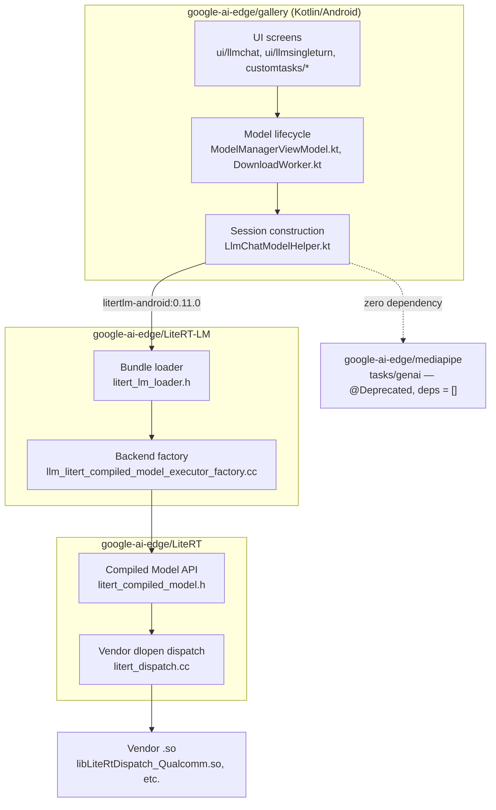

> Google AI Edge Gallery is Google's open-source showcase app for running LLMs and other models fully on-device. The report must answer, with evidence: 1. Codebases — what repositories actually make it up, and how they relate. At minimum look at google-ai-edge/gallery (the app), and the runtime stack it sits on: LiteRT / LiteRT-LM, MediaPipe GenAI tasks (mediapipe/tasks/genai, LlmInference API), and the .task/.litertlm model bundle formats. Identify which layer owns what: UI, model download/lifecycle, inference session, accelerator delegation. 2. Features — what the app actually ships (Ask Image, Prompt Lab, AI Chat, function calling, RAG, audio, whatever is present), and what each one exercises in the runtime underneath. 3. Models — which models it distributes, where they come from (Hugging Face LiteRT Community, Gemma family, Qwen, Hammer, etc.), quantization formats (int4/int8, per-channel), sizes on disk, and context window limits. 4. Performance — real measured numbers: prefill tokens/sec, decode tokens/sec, time-to-first-token, memory footprint, CPU vs GPU vs NPU delegation. Where the app reports its own benchmark stats, say so and quote the mechanism. 5. Where it breaks — device/RAM requirements, why NPU support is limited, licensing gates (Gemma terms, HF token flow), what fails on mid-range hardware. I don't like reports that rephrase the README — read real code from the actual repositories, cite concrete files, classes, and call sites (the model allowlist source, the download manager, the inference session setup, the accelerator selection logic). Where you state a performance number, attribute it to its source and note whether it is vendor-published or independently measured. Flag any number you cannot source rather than asserting it.

## Short answer

- **Codebases**: Gallery (`google-ai-edge/gallery`, Kotlin/Android) depends only on **LiteRT-LM** (`com.google.ai.edge.litertlm:litertlm-android:0.11.0`) for inference — there is **zero MediaPipe dependency** in the app. MediaPipe's GenAI `LlmInference` API is source-level `@Deprecated` and was gutted in a January 2026 commit ("Remove the CPU-only MediaPipe LLM Inference Engine \ Please use LiteRT LM instead"); it now exists only as a deprecated pointer. LiteRT-LM itself sits on **LiteRT's** Compiled Model API and a runtime `dlopen` mechanism for vendor NPU silicon. The `.task` format (a MediaPipe-era zip bundle) is legacy and has no producer left in either repo; `.litertlm` (a FlatBuffer-defined sectioned container) is the current format and is the only one that can carry vision/audio adapters, external weights, LoRA, or an embedding section.
- **Features**: the app ships **AI Chat, Ask Image, Audio Scribe, Prompt Lab, Agent Skills, Mobile Actions, and Tiny Garden** — not the "Ask Image / Prompt Lab / AI Chat / function calling / RAG / audio" set assumed going in. "Agent Skills" is the function-calling feature (real tool calls over MCP, `io.modelcontextprotocol:kotlin-sdk`). **There is no RAG feature** — no embedding model, no vector store anywhere in the tree — even though the `.litertlm` format itself reserves a section for one.
- **Models**: 9 models in the live allowlist, all `litert-community/` or `google/` Hugging Face repos: Gemma 4 E2B/E4B, Gemma 3n E2B/E4B, Gemma3-1B, Qwen2.5-1.5B-Instruct, DeepSeek-R1-Distill-Qwen-1.5B, and two FunctionGemma-270M fine-tunes. Quantization is only inferable from filename suffixes (`int4`, `q8`); **no entry states per-channel vs. per-tensor granularity anywhere**. **Hammer is not a Gallery model** — it is a third-party (MadeAgents) family that shows up only as a conversion target in Google's separate `litert-torch` tooling repo.
- **Performance**: Google's own docs table (`developers.google.com/edge/litert-lm/overview`, v0.14.0, undated) reports prefill/decode/TTFT/memory for Gemma-4-E2B across 6 platforms × CPU/GPU. **The oft-quoted "52 tok/s" is one row of eleven, not a ceiling** — a MacBook Pro M4 Max hits 160 tok/s decode on GPU, an RTX 4090 hits 143 tok/s, and a Raspberry Pi 5 floors at 8 tok/s. **The table has no NPU column at all.** The only NPU numbers found anywhere are on Hugging Face model cards for the older Gemma-3n, not Gemma 4. The app does self-report benchmark stats, through a real harness (`BenchmarkViewModel.runBenchmark()` calling LiteRT-LM's own `benchmark()` function), not a marketing claim.
- **Where it breaks**: RAM gating exists (`minDeviceMemoryInGb` per model) but is a **dismissable soft warning**, never a hard block — the README states no RAM number at all. NPU support is limited because the NPU executor is compile-time optional, the default vendor dispatch is a no-op stub requiring a real per-vendor `.so`, and the issue tracker documents concrete failures across MediaTek (unsupported, crashes), Samsung Exynos (`INTERNAL` engine-creation error), Intel VPU generation mismatches, and even Google's own Tensor G5 (DMA-buf exhaustion on the base Pixel 10). Licensing is gated dynamically — the app tries an unauthenticated download first and only falls back to Hugging Face OAuth on a 403 — plus a separate, narrower Gemma-terms-of-use gate that curiously excludes the Gemma 4 models. Mid-range and older hardware fails in varied, non-uniform ways: EMUI crash-on-launch, an Android 17 per-app `MemoryLimiter` killing Gemma-4-E4B on a Pixel 6a, KV-cache-growth OOM in long chats, and raw `SIGILL` on CPUs lacking NEON/SVE.

All findings below were fetched live from the repositories (`gh api`/`curl raw.githubusercontent.com` against verified default-branch commits) rather than recalled from training data or paraphrased from READMEs — every claim below carries its file path, or is explicitly flagged as unsourced.

## What this report adds beyond the existing vault

[LLM inference on Android](/wiki/android-llm-inference/) and [Running Small LLMs on Android: Options and Trade-offs for a Galaxy S26 Ultra](/posts/running-small-llms-on-android/) already cover, and this report does not re-litigate: the general Android runtime landscape (LiteRT-LM vs. Qualcomm Genie/GenieX vs. ONNX Runtime GenAI vs. Gemini Nano), GGUF/AWQ/GPTQ/Hexagon-W4A16 quantization mechanics, the memory-bandwidth roofline argument for prefill-vs-decode, on-device model file management in general (thin-APK-plus-download, mmap, Play size limits), Gemma/Llama redistribution licensing in the abstract, and Gallery's basic identity as "a ready-made no-build app" with its GitHub-stars/Apache-2.0/GitHub-Releases facts and the single 52 tok/s headline number.

What is genuinely new here, because no existing page opens the app or its runtime stack's source:

1. The actual repository architecture — which of Gallery/LiteRT/LiteRT-LM/MediaPipe owns which layer, with the MediaPipe-deprecation timeline pinned to a commit.
2. The `.task`/`.litertlm` bundle format internals and why one supersedes the other.
3. The full feature list with correct names and what runtime call each one makes — including the fact that RAG does not exist in the app despite being asked about.
4. The full multi-platform benchmark table (not just the one headline number) and the explicit absence of an NPU row in it.
5. The concrete, sourced list of GitHub issues describing exactly how and where the app breaks on real hardware.

## 1. Codebases: what makes up Google AI Edge Gallery

### The four repositories and how they actually relate



**Gallery has no MediaPipe dependency at all.** `libs.versions.toml` pins only `litertlm = "0.11.0"` as the LLM runtime (`google-ai-edge/gallery:Android/src/app/src/app/build.gradle.kts` → `libs.versions.toml#L23,71`), consumed as `implementation(libs.litertlm)` (`build.gradle.kts#L94`). A repo-wide search for `"tasks-genai"` and `"com.google.mediapipe"` across the app returns zero results. The app additionally depends on `play-services-tflite-java`/`gpu:16.4.0` and, for a *separate*, non-LiteRT-LM code path, `com.google.mlkit:genai-prompt:1.0.0-beta2` (`libs.versions.toml#L26-27,42,74-75,97`) — Android's system AICore service, used only by `runtime/aicore/AICoreModelHelper.kt`.

**MediaPipe's GenAI `LlmInference` API is deprecated at the source level, not just in docs**, and Gallery does not call it. Every public class in the Java package carries the annotation, quoted verbatim from `google-ai-edge/mediapipe:mediapipe/tasks/java/com/google/mediapipe/tasks/genai/llminference/LlmInference.java#L17-21`:

```
 * @deprecated Migrate to LiteRT LM instead. For more details, refer to LiteRT LM on GitHub:
 *     https://github.com/google-ai-edge/LiteRT-LM
 */
@Deprecated
public class LlmInference implements AutoCloseable {
```

The same annotation appears on `LlmInferenceSession.java`, `ErrorListener.java`, `GraphOptions.java`, `AudioModelOptions.java`, `ProgressListener.java`, `VisionModelOptions.java`, and `PromptTemplates.java`. The removal is a dated, findable commit: `83fdad9b` (2026-01-30T16:51:33Z), message *"Remove the CPU-only MediaPipe LLM Inference Engine \ Please use LiteRT LM instead"*, deleting roughly 100 files including the entire `mediapipe/tasks/cc/genai/inference/` tree, the iOS genai subtree, and the Python `.task` bundler. A later commit (`80f4a5bb`, 2026-02-25) re-added `LlmInference.java` from scratch, already carrying `@Deprecated` on arrival — restored as a pointer, not a working engine. The Java BUILD target confirms this: `mediapipe_jni_binary(name = "llm_inference_engine_jni", uses_explicit_exports = True, deps = [])` — `deps = []`, no native engine wired in (`google-ai-edge/mediapipe:mediapipe/tasks/java/com/google/mediapipe/tasks/genai/BUILD`). Google's own docs corroborate without dating a cutoff: *"The MediaPipe LLM Inference API (Android, iOS, and Web) is now in maintenance-only mode. New features and optimizations will be focused on LiteRT-LM."* (`developers.google.com/edge/mediapipe/solutions/genai/llm_inference`). Note also that `google/mediapipe` now resolves to `google-ai-edge/mediapipe` — the repo itself moved orgs.

**LiteRT-LM does not build against LiteRT's current `main`.** Its Bazel `WORKSPACE` pins `LITERT_REF = "0a0339003ab8e01b137e88238886a7f136e26866"` (`google-ai-edge/LiteRT-LM:WORKSPACE#6-8,389-400`), while its CMake build pins a *different* commit, `fb16353a648922cb6c67a8e9a7a9ebc946360ad2` (`cmake/packages/litert/litert.cmake#43-46`, comment `# Updated on 2026-03-24`). Two build systems in the same repo target two different LiteRT commits — a build-consistency risk worth knowing before assuming "LiteRT-LM uses LiteRT HEAD."

### Layer ownership, pinned to source

| Layer | Owner | Where |
|---|---|---|
| UI, screens, chat state | Gallery | `Android/src/app/src/main/java/com/google/ai/edge/gallery/ui/**` |
| Model lifecycle (allowlist fetch, download, resume, storage, HF auth) | Gallery | `worker/DownloadWorker.kt`, `ui/modelmanager/ModelManagerViewModel.kt`, `data/Model.kt` |
| Bundle parsing + session construction | LiteRT-LM (via `litertlm-android` AAR) | `LiteRT-LM:runtime/util/litert_lm_loader.h`, `runtime/core/engine_advanced_impl.cc` |
| Backend dispatch (CPU/GPU/NPU) | LiteRT-LM → LiteRT Compiled Model API | `LiteRT-LM:runtime/executor/llm_litert_compiled_model_executor_factory.cc#171-183` |
| Vendor NPU silicon binding | LiteRT, at runtime via `dlopen` | `LiteRT:litert/runtime/dispatch/litert_dispatch.cc#158-176` |
| Kernels, delegates, interpreter | LiteRT | `LiteRT:litert/**` |
| Legacy, unused by Gallery | MediaPipe genai (deprecated) | `mediapipe/tasks/java/.../genai/llminference/` |

### The model allowlist: two files, and a live discrepancy

There is a stale, repo-root `model_allowlist.json` with 4 entries pointing at old `.task` files — do not treat this as current. The app actually fetches a **version-pinned** file at runtime, built from `BuildConfig.VERSION_NAME`:

```
https://raw.githubusercontent.com/google-ai-edge/gallery/refs/heads/main/model_allowlists/${VERSION_NAME.replace(".","_")}.json
```

(`google-ai-edge/gallery:Android/src/app/src/main/java/com/google/ai/edge/gallery/ui/modelmanager/ModelManagerViewModel.kt#L87-88,954-957,1523-1525`). At the moment of research, `versionName = "1.0.17"` (`Android/src/app/build.gradle.kts#L40`), but the highest checked-in file is `model_allowlists/1_0_15.json` — no `1_0_16.json` or `1_0_17.json` exists in the repo. A user on the current build resolves a URL that does not exist yet, which is worth flagging as an app/repo release-process gap rather than a hypothetical.

The Kotlin schema, `data class AllowedModel` (`data/ModelAllowlist.kt#L46-73`), is richer than any current JSON entry exercises — it also supports `socToModelFiles` (per-SoC file variants), a `runtimeType` field (LiteRT-LM vs. AICore), a `disabled` flag, and `DeviceRequirements`/`NamedDeviceGroup` gating (`#L241-257`). A representative live entry (`model_allowlists/1_0_15.json#L2-32`):

```json
{
  "name": "Gemma-4-E2B-it",
  "modelId": "litert-community/gemma-4-E2B-it-litert-lm",
  "modelFile": "gemma-4-E2B-it.litertlm",
  "sizeInBytes": 2588147712,
  "minDeviceMemoryInGb": 8,
  "commitHash": "6e5c4f1e395deb959c494953478fa5cec4b8008f",
  "llmSupportImage": true,
  "llmSupportAudio": true,
  "capabilities": ["llm_thinking", "speculative_decoding"],
  "defaultConfig": {
    "topK": 64, "topP": 0.95, "temperature": 1.0,
    "maxContextLength": 32000, "maxTokens": 4000,
    "accelerators": "gpu,cpu", "visionAccelerator": "gpu"
  }
}
```

### The download manager

`class DownloadWorker` (`Android/src/app/src/main/java/com/google/ai/edge/gallery/worker/DownloadWorker.kt#L68-69`) is a `CoroutineWorker` dispatched via Android's WorkManager (`OneTimeWorkRequestBuilder<DownloadWorker>()`, `data/DownloadRepository.kt#L134`).

- **Auth**: `connection.setRequestProperty("Authorization", "Bearer $accessToken")` (`DownloadWorker.kt#L136-139`), where the token comes from a real Hugging Face OAuth 2.0 flow via AppAuth against `https://huggingface.co/oauth/authorize` / `.../oauth/token` (`common/ProjectConfig.kt#L20,35-43`).
- **Progress**: throttled to 200ms, reporting bytes downloaded, a rolling 5-sample rate, and an ETA (`DownloadWorker.kt#L221-260`), backed by a foreground notification (`#L347-382`).
- **Storage**: `context.getExternalFilesDir(null)/<modelDir>/<version>/<fileName>`, computed by `Model.getPath()` (`data/Model.kt#L349-376`) and reconstructed identically by the worker (`DownloadWorker.kt#L142-169`).
- **Resumability is real, not cosmetic**: on restart the worker checks the partial `.tmp_file`'s length, sends `Range: bytes=${outputFileBytes}-` plus `Accept-Encoding: identity` (to stop gzip from re-chunking the response), appends rather than overwrites, and validates the returned `Content-Range` header before proceeding (`DownloadWorker.kt#L155-179,187-201,209-210`).

### The inference session and accelerator selection

Session construction is entirely a LiteRT-LM API call, not MediaPipe's:

```kotlin
// google-ai-edge/gallery:Android/src/app/src/main/java/com/google/ai/edge/gallery/ui/llmchat/LlmChatModelHelper.kt#L113-178
val engineConfig = EngineConfig(
    modelPath = modelPath,
    backend = preferredBackend,
    visionBackend = if (shouldEnableImage) visionBackend else null,
    audioBackend = if (shouldEnableAudio) Backend.CPU() else null,  // "must be CPU for Gemma 3n"
    maxNumTokens = maxTokens,
    cacheDir = ...,
)
val engine = Engine(engineConfig)
engine.initialize()
val conversation = engine.createConversation(ConversationConfig(
    samplerConfig = if (preferredBackend is Backend.NPU) null
      else SamplerConfig(topK = topK, topP = topP.toDouble(), temperature = temperature.toDouble()),
    systemInstruction = systemInstruction,
    tools = tools,
))
```

`object LlmChatModelHelper : LlmModelHelper` (`#L57`) imports `com.google.ai.edge.litertlm.*` (`#L36-48`). A second, independent implementation exists for the non-LiteRT-LM path: `runtime/aicore/AICoreModelHelper.kt`, built on ML Kit's `genai-prompt` and Android AICore — a genuinely different execution surface, not a fallback within LiteRT-LM.

**Accelerator selection is user-facing but constrained and sometimes silently overridden.** The UI exposes a segmented `Accelerator` choice (`CPU, GPU, NPU, TPU` — `data/Types.kt#L19-24`) via `createLlmChatConfigs()`/`createLlmChatConfigsForNpuModel()` (`data/Config.kt#L322-326,352-356`), but the *set* of choices offered is restricted per-model by the allowlist's `defaultConfig.accelerators` string. On top of that, `ModelAllowlist.kt#L115-118,140-144` rewrites "NPU" to "TPU" in the label on Pixel devices, and **forcibly removes GPU as an option on Pixel 10 specifically**, regardless of what the allowlist says — with no in-app indication to the user that an override happened. (Section 5 below traces the real device-level consequence of this override.)

Gallery's mapping from its own `Accelerator` enum to LiteRT-LM's `Backend` sealed type — `Backend.CPU()`, `Backend.GPU()`, `Backend.NPU(nativeLibraryDir=...)`, with TPU also resolving to `Backend.NPU` — lives at `LlmChatModelHelper.kt#L88-109`.

Inside LiteRT-LM, the executor factory switches on this backend (`runtime/executor/llm_litert_compiled_model_executor_factory.cc#171-183`): **CPU and GPU share one path**, `CreateCpuOrGpuLlmLiteRtCompiledModelExecutor` — the CPU/GPU split itself happens one layer down, inside LiteRT's own Compiled Model API. NPU has a separate path, and the whole feature is **compile-time optional**: guarded by `#if !defined(LITERT_DISABLE_NPU)`; when NPU support is compiled out, the factory returns `absl::InvalidArgumentError("Only CPU and GPU backends are supported.")` (`#L157-163`).

Vendor NPU silicon is bound at **runtime**, not compile time, through `dlopen`: `litert::SharedLibrary::Load(shared_lib_path, ...)`, resolving the symbol `"LiteRtDispatchGetApi"` (`LiteRT:litert/runtime/dispatch/litert_dispatch.cc#158-176`). This is corroborated by a device log quoted in a real bug report: *"Loading shared library: /data/local/tmp/gemma/libLiteRtDispatch_Qualcomm.so"* (LiteRT-LM issue #1979). The default dispatch shipped when no vendor library is present is a pure stub — all ~35 API entry points return `kLiteRtStatusErrorUnsupported` (`LiteRT:litert/runtime/dispatch/litert_dispatch_dummy.cc#22-260`) — with real vendor implementations living under `litert/vendors/{broadcom,google_tensor,intel_openvino,mediatek,qualcomm,samsung}`; Qualcomm's is the most built-out, with its own QNN graph-legalization compiler plugin.

### The `.task` and `.litertlm` bundle formats

**`.task` is the older format**: a plain ZIP (detected in code by checking whether the header bytes start with `"PK"` — `LiteRT-LM:runtime/util/file_format_util.cc#45-48`), a filename→byte-range map with a header literally reading *"Copyright 2022 The MediaPipe Authors"* (`runtime/util/model_asset_bundle_resources.h#14-40`). It carries no metadata proto, no external-weights section, and no embedding-metadata section. There is **no producer for it left in either repo**: MediaPipe's `.task` bundler script was deleted in the same `83fdad9b` removal commit discussed above and now 404s.

**`.litertlm` is a FlatBuffer-defined, sectioned container**, structurally unrelated to a zip. Its root table, `LiteRTLMMetaData`, holds `system_metadata` (key/value pairs) and `section_metadata` (a list of `SectionObject`, each with a byte-offset range and a `data_type`) — the section types enumerated in `AnySectionDataType` are `GenericBinaryData, Deprecated, TFLiteModel, SP_Tokenizer, LlmMetadataProto, HF_Tokenizer_Zlib, TFLiteWeights, EmbeddingMetadataProto` (`LiteRT-LM:schema/core/litertlm_header_schema.fbs#105-124`). In practice this packages: the LLM config as a protobuf (`litert.lm.proto.LlmMetadata`), a tokenizer (either a SentencePiece binary or a zlib-compressed Hugging Face tokenizer JSON), one or more TFLite graphs keyed by model type (prefill/decode/embedder/vision/audio adapters), optionally separate external weights, and optionally an embedding-metadata section. The format is versioned in code — `LITERTLM_MAJOR_VERSION = 1; LITERTLM_MINOR_VERSION = 6; LITERTLM_PATCH_VERSION = 0;` (`schema/core/litertlm_header.h#37-39`) — and magic-sniffed by the ASCII bytes `"LITERTLM"` (`runtime/util/file_format_util.cc#47-48`).

**Producer**: a real CLI, `litert-lm-builder`, with subcommands `toml, system_metadata, llm_metadata, tflite_model, tflite_weights, sp_tokenizer, hf_tokenizer, output, unpack` (`python/litert_lm_builder/litertlm_builder_cli.py#L20-90`, documented at `docs/litert_lm_builder.md`), plus an inspector, `litert-lm-peek`.

**Consumer**: `BuildLiteRtCompiledModelResources(...)` dispatches on detected format:

```cpp
// LiteRT-LM:runtime/executor/litert_compiled_model_executor_utils.cc#456-467
switch (format) {
  case FileFormat::TASK:
    return BuildModelResourcesFromTaskFormat(model_assets);
  case FileFormat::LITERT_LM:
    return BuildModelResourcesFromLitertLmFormat(model_assets, enable_file_backed_model_loading);
  default:
    return absl::InvalidArgumentError("Unsupported file format.");
}
```

The `.litertlm` path constructs a `LitertLmLoader` (`runtime/util/litert_lm_loader.h#100-256`) whose accessors — `GetSentencePieceTokenizer()`, `GetHuggingFaceTokenizer()`, `GetTFLiteModel(ModelType)`, `GetTFLiteWeights(ModelType)`, `GetLlmMetadata()`, `GetEmbeddingMetadata()` — mmap sections on demand.

No document states outright why `.litertlm` supersedes `.task`; this is reconstructed from the repository's own history and test fixtures, not asserted from a changelog line. A commit titled *"Convert legacy LoRA task model to litertlm format and update tests"* (`dcc12365`) calls `.task` legacy in its own words. More decisively, `runtime/testdata/` contains exactly two `.task` fixtures, both plain-text-only (`test_lm.task`, `test_lm_new_metadata.task`) — every fixture exercising vision, audio, LoRA, external weights, or multi-prefill is `.litertlm`-only. `.litertlm` is the only format capable of carrying the newer capabilities at all; `.task` remains readable purely for backward compatibility with the pre-2026 MediaPipe artifacts already in the wild. Note: `developers.google.com/edge/litert-lm/faq`, the URL that would plausibly hold an official explanation, currently 404s.

## 2. Features: what the app ships, and what each exercises underneath

The canonical feature list is `object BuiltInTaskId` (`google-ai-edge/gallery:Android/src/app/src/main/java/com/google/ai/edge/gallery/data/Tasks.kt#L136-145`) — it corrects several names assumed going into this research:

| Task ID | Actual UI label | Implementation | Runtime mechanism |
|---|---|---|---|
| `llm_chat` | **AI Chat** | `ui/llmchat/LlmChatScreen.kt` | `LlmChatModelHelper` → LiteRT-LM `Engine`/`Conversation`, text-only `Content.Text` |
| `llm_ask_image` | **Ask Image** | same module | same `Engine`, `supportImage = true` on init → `Content.ImageBytes(...)`; vision pinned to GPU by allowlist (`visionAccelerator: "gpu"`) |
| `llm_ask_audio` | **Audio Scribe** (not "audio") | same module | same `Engine`, `supportAudio = true` → `Content.AudioBytes(...)`; audio backend hard-pinned to CPU in code, comment *"must be CPU for Gemma 3n"* |
| `llm_prompt_lab` | **Prompt Lab** | `ui/llmsingleturn/LlmSingleTurnTaskModule.kt` | same `Engine`, single-turn (no conversation history) |
| `llm_agent_chat` | **Agent Skills** (the function-calling feature) | `customtasks/agentchat/AgentChatTaskModule.kt` | real tool/function calling over the **Model Context Protocol** — `io.modelcontextprotocol:kotlin-sdk:0.8.0` plus a Ktor client (`libs.versions.toml#L43,98`, `build.gradle.kts#L126-128`); `LlmModelHelper.initialize()` takes a `tools: List<ToolProvider>` parameter (`runtime/LlmModelHelper.kt#L61`) that flows into `ConversationConfig(tools = tools)` |
| `llm_mobile_actions` | **Mobile Actions** | `customtasks/mobileactions/MobileActionsTask.kt` | same tool-calling path, on a FunctionGemma-270m fine-tune |
| `llm_tiny_garden` | **Tiny Garden** | `customtasks/tinygarden/TinyGardenTask.kt` | same tool-calling path, on a FunctionGemma-270m fine-tune |
| `mp_scrapbook` | *(constant only, no screen implementation found)* | — | vestigial/reserved |

Two corrections against the assumptions this report was scoped with:

- **The feature named "function calling" in the assumption above is "Agent Skills"** in the shipped app, and it is real structured tool-calling — declared tools flow through MCP, not a bespoke JSON schema, and the resulting `ToolProvider` list is passed straight into the LiteRT-LM session's `ConversationConfig`.
- **RAG does not exist anywhere in this codebase.** A case-insensitive search of the full source tree for `rag`, `embed`, `vector`, `gecko`, `objectbox`, and `sqlite` returns zero matches — no embedding model, no vector store, no retrieval step. This is worth stating precisely because the *format* the app consumes is not the limiting factor: `.litertlm`'s schema reserves an `AnySectionDataType.EmbeddingMetadataProto` section and `LitertLmLoader` already exposes `GetEmbeddingMetadata()` — the runtime supports embedding models, the app simply ships no feature that uses one.

**Thinking mode is real and traceable**, not a UI label over nothing: `ModelCapability.LLM_THINKING` and a distinct `THOUGHT_CHANNEL` in the streaming callback (`LlmChatModelHelper.kt#L319`), gated per-model by the allowlist's `capabilities` array (e.g. Gemma-4-E2B lists `["llm_thinking", "speculative_decoding"]`).

**The app self-reports benchmark stats through a dedicated harness, not a marketing claim.** `ui/benchmark/BenchmarkViewModel.kt` calls **LiteRT-LM's own** exported `benchmark` function directly (`import com.google.ai.edge.litertlm.benchmark`):

```kotlin
// ui/benchmark/BenchmarkViewModel.kt#L154-172
val benchmarkInfo = benchmark(
    modelPath = modelPath, backend = backend,
    prefillTokens = prefillTokens, decodeTokens = decodeTokens, cacheDir = cacheDirPath,
)
prefillSpeeds.add(benchmarkInfo.lastPrefillTokensPerSecond)
decodeSpeeds.add(benchmarkInfo.lastDecodeTokensPerSecond)
timesToFirstToken.add(benchmarkInfo.timeToFirstTokenInSecond)
```

The result is serialized into an `LlmBenchmarkStats` protobuf (`Android/src/app/src/main/proto/benchmark.proto`) with fields `prefillSpeed`/`decodeSpeed`/`timeToFirstToken`/`firstInitTimeMs` — the same metric names Google's published documentation table reports (Section 4), which means the app is measuring the identical quantities on the user's own device, not a different, softer statistic. Separately, ordinary chat messages carry a per-message `latencyMs` rendered whenever it is non-negative (`ui/common/chat/MessageLatency.kt#L32-39`).

## 3. Models: what it actually distributes

The live allowlist (`model_allowlists/1_0_15.json`) has 9 entries:

| Model | Hugging Face source | Quantization (from filename) | Size on disk | Context |
|---|---|---|---|---|
| Gemma-4-E2B-it | `litert-community/gemma-4-E2B-it-litert-lm` | not stated in filename | 2.59 GB | 32,000 (`maxContextLength`) |
| Gemma-4-E4B-it | `litert-community/gemma-4-E4B-it-litert-lm` | not stated | 3.66 GB | 32,000 |
| Gemma-3n-E2B-it | `google/gemma-3n-E2B-it-litert-lm` | int4 (`-int4.litertlm`) | 3.66 GB | `maxTokens` 4,096, no `maxContextLength` set |
| Gemma-3n-E4B-it | `google/gemma-3n-E4B-it-litert-lm` | int4 | 4.92 GB | 4,096 |
| Gemma3-1B-IT | `litert-community/Gemma3-1B-IT` | int4 (`gemma3-1b-it-int4.litertlm`) | 584 MB | 1,024 |
| Qwen2.5-1.5B-Instruct | `litert-community/Qwen2.5-1.5B-Instruct` | q8 (`_q8_ekv4096`) | 1.60 GB | 4,096 |
| DeepSeek-R1-Distill-Qwen-1.5B | `litert-community/DeepSeek-R1-Distill-Qwen-1.5B` | q8 (`_q8_ekv4096`) | 1.83 GB | 4,096 |
| TinyGarden-270M | `litert-community/functiongemma-270m-ft-tiny-garden` | q8 (`_q8_ekv1024`) | 289 MB | 1,024 |
| MobileActions-270M | `litert-community/functiongemma-270m-ft-mobile-actions` | q8 | 289 MB | 1,024 |

**Per-channel vs. per-tensor quantization granularity is absent from every entry across all 13 historical allowlist versions checked** (`1_0_4` through `1_0_15`, plus an `ios_1_0_0` variant) — quantization scheme is only inferable from the filename suffix (`int4`, `q8`), never stated as a structured field. Do not treat any granularity claim about these specific artifacts as sourced.

Against the families named in the original ask:

- **Gemma**: present, and dominant — 5 of 9 entries.
- **Qwen**: present — `Qwen2.5-1.5B-Instruct` directly, plus `DeepSeek-R1-Distill-Qwen-1.5B`, which is a Qwen-architecture distillation.
- **Hammer**: **not distributed by Gallery.** A code search for `Hammer` across the Gallery repository, and a case-insensitive grep of all 13 allowlist JSON files, both return zero matches. Hammer is real, but it surfaces only as a conversion *target* in Google's separate PyTorch-to-LiteRT tooling repository, `google-ai-edge/litert-torch` (PRs "Add Hammer 2.1 to ai-edge-torch" and a related conversion-script update). The upstream model family is third-party — `MadeAgents/Hammer2.1` (0.5B/1.5B/3B/7B, function-calling-tuned on Qwen 2.5 Coder). The correct framing: Google's toolchain can convert it, Gallery does not ship it.

The source split is also worth noting precisely: Gemma 3n comes from Google's own `google/` Hugging Face org, while everything else — including Gemma 4 — comes through the `litert-community/` org rather than a `google/` one.

## 4. Performance: real measured numbers, by source

### The full multi-platform table (vendor-published, LiteRT-LM docs)

Source: `developers.google.com/edge/litert-lm/overview`, tagged **v0.14.0**, no measurement date stated, model **Gemma-4-E2B** (2.58 GB):

| Platform (device) | Backend | Prefill (tok/s) | Decode (tok/s) | TTFT (s) | Peak CPU memory (MB) |
|---|---|---|---|---|---|
| Android (Galaxy S26 Ultra) | CPU | 557 | 47 | 1.8 | 1,733 |
| Android (Galaxy S26 Ultra) | GPU | 3,808 | **52** | 0.3 | 676 |
| iOS (iPhone 17 Pro) | CPU | 532 | 25 | 1.9 | 607 |
| iOS (iPhone 17 Pro) | GPU | 2,878 | 56 | 0.3 | 1,450 |
| Linux (Arm + RTX 4090) | CPU | 260 | 35 | 4.0 | 1,628 |
| Linux (Arm + RTX 4090) | GPU | 11,234 | 143 | 0.1 | 913 |
| macOS (MacBook Pro M4 Max) | CPU | 901 | 42 | 1.1 | 736 |
| macOS (MacBook Pro M4 Max) | GPU | 7,835 | **160** | 0.1 | 1,623 |
| Windows (Intel Lunar Lake) | CPU | 435 | 30 | 2.4 | 3,505 |
| Windows (Intel Lunar Lake) | GPU | 3,751 | 48 | 0.3 | 3,540 |
| IoT (Raspberry Pi 5, 16 GB) | CPU | 133 | 8 | 7.8 | 1,546 |

**The widely-quoted "52 tok/s, Galaxy S26 Ultra, GPU" figure is one row of eleven in this table, not the runtime's ceiling.** A MacBook Pro M4 Max decodes Gemma-4-E2B over 3× faster on GPU (160 tok/s), and an RTX 4090 hits 143 tok/s; the floor is a Raspberry Pi 5 on CPU at 8 tok/s with a 7.8-second TTFT. **Every row in this table is CPU or GPU — there is no NPU row for Gemma 4 anywhere in Google's own published table.** A second table on the same page adds Gemma-4-E4B and older models (Gemma-3n, Gemma3-1B, FunctionGemma, phi-4-mini, Qwen2.5-1.5B/0.5B, Qwen3-0.6B) across additional devices (Samsung S24/S25 Ultra, Vivo X300 Pro), same CPU/GPU-only pattern.

### The Google Developers Blog post (vendor-published, dated)

Source: "Blazing-fast on-device GenAI with LiteRT-LM," `developers.googleblog.com/blazing-fast-on-device-genai-with-litert-lm/`, **published 2026-05-19** — this is the origin of the headline number and adds two figures the docs table does not have:

- *"52 tokens/sec decode speed via the GPU backend on Android (OpenCL), and 56 tokens/sec on iOS (Metal)"* — matches the docs table.
- *"decode speeds of up to 76 tokens/sec decode on a MacBook Pro"* **via WebGPU** — this is a genuinely different number from the same page's native-macOS-GPU figure of 160 tok/s cited above, because it is a different backend (WebGPU/JS vs. native Metal through ML Drift). Do not collapse these into one "Mac GPU decode" figure — they are not the same measurement.
- *"up to a 2.2x speedup"* from multi-token prediction, with no base rate quantified alongside it.
- *"physical memory footprint of just 607MB on Apple mobile CPUs"* for the ~2.58 GB model — this exactly matches the iOS-CPU peak-memory cell in the docs table, consistent with XNNPACK's weight-caching behavior rather than a separate measurement.
- No prefill or TTFT number appears in this blog post at all — those exist only in the docs table and the Hugging Face model cards below.

### The only NPU numbers found anywhere (Hugging Face model cards, vendor-published, older model)

No NPU figure exists for Gemma 4 in any source checked. The only NPU numbers found at all are on Hugging Face model cards for the **older** Gemma 3n:

- `google/gemma-3n-E2B-it-litert-lm`: on a **Vivo X300 Pro, NPU backend — prefill 1,671.3 tok/s, decode 28.4 tok/s** (int4 weights, float activations; CPU baseline measured via XNNPACK, 4 threads, `cpufreq=performance`).
- `google/gemma-3n-E4B-it-litert-lm`: Samsung S24 Ultra CPU 73.5/9.2 tok/s, GPU 548.0/9.4 tok/s; MacBook Pro M3 CPU 170.1/20.1 tok/s; MacBook Pro M4 Max (Web/WebGPU) 1,434/32.9 tok/s.

### Google blog posts checked and found to have no usable numbers

Two additional Google posts discuss NPU performance qualitatively but publish **no** tok/s, TTFT, or memory figures — flagged explicitly rather than mined for approximate numbers:

- "Building real-world on-device AI with LiteRT and NPU" (2026-04-23) — only qualitative claims (a Google Meet segmentation model *"25x larger"* at the same speed/power; Epic Games Live Link Face *"up to 30 FPS"*; a third-party SDK *"over 2x speedup"* GPU→NPU).
- "Benchmark LLMs on-device with AI Edge Portal" (Google Cloud blog, 2026-05-21) — announces a 120+ device benchmarking lab measuring init time, prefill, decode, and peak memory, but the post itself publishes no numbers.

**Explicit gaps**: no NPU prefill/decode/TTFT figure exists for either Gemma-4-E2B or Gemma-4-E4B in any source checked. Neither the Gallery nor the LiteRT README contains its own benchmark table — both defer entirely to the external docs page. No GitHub issue or discussion was found with an extractable numeric tok/s or TTFT figure (one issue, #727, has benchmark results as a screenshot image only — not machine-extractable text, and not quoted here as a number for that reason).

## 5. Where it breaks

### Device and RAM requirements: documented loosely, enforced softly

The README states only an OS floor — *"Android 12 and up, and iOS 17 and up"* — with **no RAM figure anywhere in it**. The real requirement lives per-model in the allowlist's `minDeviceMemoryInGb` field (6 GB for the smallest models, 8 GB for Gemma-4-E2B/Gemma-3n-E2B, 12 GB for the E4B variants). Enforcement is a **soft, dismissable warning, never a hard block**:

```kotlin
// ui/common/MemoryWarning.kt#L51-72
fun isMemoryLow(context: Context, model: Model): Boolean {
  var deviceMemInGb = memoryInfo.totalMem / BYTES_IN_GB
  if (Build.VERSION.SDK_INT >= Build.VERSION_CODES.UPSIDE_DOWN_CAKE) {
    deviceMemInGb = memoryInfo.advertisedMem / BYTES_IN_GB  // API 34+
  }
  deviceMemInGb < minDeviceMemoryInGb
}
```

The resulting alert offers a **"Proceed anyway"** button — it informs, it does not prevent. This gap is on record in the tracker: issue #423, a user running v1.0.3 on an *"Android 8.1 phone with 3Gb RAM,"* asked the maintainers to *"add [minimal requirements] to the repo's README"* — unanswered, and still undocumented as of this research.

### Why NPU support is limited

The limitation is structural, not just a rollout lag. The NPU executor is compile-time optional (`#if !defined(LITERT_DISABLE_NPU)`, Section 1), and the default vendor dispatch shipped with LiteRT is a pure stub returning "unsupported" on every call unless a real per-vendor `.so` is present and successfully `dlopen`s. Concrete, dated failure reports from the issue trackers:

- **MediaTek is not supported at all, and the app does not fail gracefully.** Gallery #920 (Xiaomi 14T, Dimensity 8300 Ultra): *"when i want switch to npu in app, app get crashed."* Maintainer reply: *"the NPU backend is currently supported on Qualcomm Snapdragon SoCs. Because your Xiaomi 14T uses a MediaTek Dimensity chipset, the NPU is not supported yet."* LiteRT-LM #2507 asks explicitly for a safe CPU/GPU fallback instead of a crash on MediaTek; #1268 shows a MediaTek crash reading *"Failed to restore model from compiled network."*
- **Qualcomm, the best-supported vendor, still fails on specific chips/driver combinations.** LiteRT-LM #2226: a QNN system-library version mismatch on a Galaxy S25 Ultra (SM8750) despite using the documented QAIRT version. LiteRT-LM #1979: on an SM8550 device, CPU/GPU/NPU all register successfully and the vendor `.so` loads, yet inference still fails — the break is inside Qualcomm's own QNN initialization, downstream of everything traced in Section 1.
- **Intel's own VPU generations are not interchangeable.** LiteRT-LM #2451: an Intel-targeted `.litertlm` built for one VPU generation fails with *"The current expects VPUX37XX, but model reports VPUX40XX"* on a newer chip.
- **Samsung Exynos fails at engine creation, for every model.** Gallery #882/#548 (Galaxy S26, Exynos 2600/Xclipse 960): a raw `INTERNAL` error inside `llm_litert_compiled_model_executor.cc`. A structurally similar error also appears on MediaTek devices in #557 — worth noting against any clean "it's an Exynos problem" narrative; the same error class is not vendor-exclusive.
- **Even Google's own first-party Tensor silicon fails, for a hardware reason, not a driver bug.** Gallery #1008: on a base Pixel 10 (12 GB, Tensor G5) running the TPU-labeled variant of Gemma-4-E2B, logs trace to the Tachyon TPU driver refusing to `dma-buf`-map the ~1.9 GB weight section a second time (once for prefill, once for decode) — `errno=No space left on device`. The same model works on a Pixel 10 Pro (16 GB, same SoC). This is the concrete, user-visible consequence of the Pixel-10 GPU-removal override in `ModelAllowlist.kt` noted in Section 1: the reporter states plainly, *"Gallery removes the GPU accelerator option on Pixel 10 devices, there is no fallback and the model is simply unusable on this device."*
- **The per-SoC routing mechanism exists in code but is not populated.** Gallery #730/#888: on a Snapdragon-8-Gen-5 OnePlus device with a SoC-specific APK, *"there is no NPU model shown to download."* Discussion traces this to `ModelAllowlist.kt#L84-94` and `Consts.kt#L72-77`, whose `socToModelFiles` routing exists in the schema but is unpopulated in `model_allowlists/1_0_15.json` — maintainer confirmation: *"the socToModelFiles routing is not fully supported in our external build process."*

The gap between marketing framing and tracker reality is worth stating directly: the April 2026 NPU blog post presents Google Tensor, MediaTek, and Qualcomm as supported, flagging only Google Tensor's own ML SDK as experimental — while the issue tracker shows specific MediaTek chips outright unsupported, specific Qualcomm chips version-mismatching, and Intel VPU generations incompatible with each other.

### Licensing gates: dynamic detection, not a hardcoded gated-model list

The app does not hardcode which models require authentication — it probes. For any Hugging Face URL, it first attempts an **unauthenticated** download; only on failure does it check for a stored OAuth token and, if absent or expired, launch the AppAuth flow (`ui/common/DownloadAndTryButton.kt#L247-321`). A separate, narrower gate additionally requires acknowledging Gemma's terms of use, keyed by an explicit name set:

```kotlin
// DownloadAndTryButton.kt#L95-96
private val MODEL_NAMES_TO_SHOW_GEMMA_LICENSES =
  setOf("Gemma-3n-E2B-it", "Gemma-3n-E4B-it", "Gemma3-1B-IT", "Gemma3-1B-IT NPU")
```

Notably, **this set does not include the Gemma 4 models** — either a drift in the release process or a deliberate distinction in the Gemma-4 repos' actual Hugging Face gating status; the source alone does not settle which. If a token is present but the server still returns 403 (the user has not yet accepted the gated-repo agreement on Hugging Face itself), the app opens a Custom Tab to that agreement and retries (`#L207-224`). One structural detail worth knowing before attempting to build the app from source: the OAuth client credentials in the public repository are literal placeholders — `"REPLACE_WITH_YOUR_CLIENT_ID_IN_HUGGINGFACE_APP"` (`common/ProjectConfig.kt#L22-43`) — so a from-source build requires registering one's own Hugging Face OAuth application first. User-side pain from this flow is on record: issue #71, *"Contrary to the in-app instructions, I had to go in and find a somewhat hidden 'request access' form, and accept the terms on one of Google's sites"*; issue #195, where a maintainer gives a four-step manual workaround (accept terms in browser, download the `.task`/`.litertlm` file manually, use the app's "Import model" feature).

### What actually fails on mid-range and older hardware

The pattern in the tracker is that failures are varied rather than uniformly "not enough RAM":

- **Crash-on-launch on Huawei's EMUI**, independent of any model download (#599, Nova 12s and duplicates on the Pura 80 and Mate Xs 2): *"App fails to launch... immediate crash with 'App closed due to error.'"* Maintainer response: logged, under investigation, unresolved as of this research.
- **A newer OS-level memory limiter, not raw RAM, killing a specific model** on a Pixel 6a (6 GB) after upgrading to an Android 17 beta (#701): Gemma-4-E4B *"consistently crashes"*, attributed by the reporter to Android 17's new per-app `MemoryLimiter` scaled to total device RAM.
- **A high-RAM device still failing, for a feature-specific reason**: an iPhone with a 12 GB A19 Pro (#703) runs Gemma-4-E4B fine for standard inference but crashes specifically when Thinking Mode is enabled, attributed to a memory spike unique to that mode — a useful counterexample against treating every crash as a pure capacity problem.
- **Unbounded KV-cache growth in long chats** (#856): on GPU/NPU the app crashes outright once a hidden token ceiling is exceeded; on CPU it loops instead. The reporter requests sliding-window KV-cache eviction in LiteRT-LM itself.
- **No graceful degradation on CPUs lacking modern SIMD or a usable OpenCL runtime** (#543): reported failures are a raw, unhandled `SIGILL` (illegal instruction) on devices without ARM NEON/SVE, or a bare *"session code 2. OpenCL library was not found"* with no user-facing explanation.
- One superficially similar report (#992, a POCO M8 5G with 8 GB RAM failing across all three backends) was **closed by the reporter as a corrupted download**, not a hardware limitation — worth excluding from any "low-RAM device" tally rather than folding in as more evidence of a capacity ceiling.

## Sources

- [LLM inference on Android](/wiki/android-llm-inference/), on-device-llm-inference, [On-device ML runtimes (Core ML vs LiteRT)](/wiki/on-device-ml-runtimes/), [On-device neural accelerators (NPU / ANE / Hexagon)](/wiki/on-device-neural-accelerators/) — the existing wiki coverage this report extends rather than repeats (see "What this report adds," above).
- [Running Small LLMs on Android: Options and Trade-offs for a Galaxy S26 Ultra](/posts/running-small-llms-on-android/) — the adjacent report whose runtime-comparison table already carries Gallery's basic identity and the single 52 tok/s figure this report re-sources in full context.
- Code (fetched live, `gh api`/`curl raw.githubusercontent.com`, verified default-branch commits, 2026-07-21): [google-ai-edge/gallery](https://github.com/google-ai-edge/gallery), [google-ai-edge/LiteRT](https://github.com/google-ai-edge/LiteRT), [google-ai-edge/LiteRT-LM](https://github.com/google-ai-edge/LiteRT-LM), [google-ai-edge/mediapipe](https://github.com/google-ai-edge/mediapipe) (canonical name; `google/mediapipe` redirects here), [google-ai-edge/litert-torch](https://github.com/google-ai-edge/litert-torch).
- Docs and blog posts: [LiteRT-LM overview and benchmark table](https://developers.google.com/edge/litert-lm/overview) (v0.14.0), ["Blazing-fast on-device GenAI with LiteRT-LM"](https://developers.googleblog.com/blazing-fast-on-device-genai-with-litert-lm/) (2026-05-19), ["Building real-world on-device AI with LiteRT and NPU"](https://developers.googleblog.com/building-real-world-on-device-ai-with-litert-and-npu/) (2026-04-23), ["Benchmark LLMs on-device with AI Edge Portal"](https://cloud.google.com/blog/products/ai-machine-learning/benchmark-llms-on-device-with-ai-edge-portal) (2026-05-21), ["Accelerating Gemma 4: multi-token prediction drafters"](https://blog.google/innovation-and-ai/technology/developers-tools/multi-token-prediction-gemma-4/) (2026-05-05), [MediaPipe LLM Inference API docs (maintenance-only notice)](https://developers.google.com/edge/mediapipe/solutions/genai/llm_inference), [Gallery wiki: Model Management](https://github.com/google-ai-edge/gallery/wiki/5.-Model-Management).
- Model cards: [google/gemma-3n-E2B-it-litert-lm](https://huggingface.co/google/gemma-3n-E2B-it-litert-lm), [google/gemma-3n-E4B-it-litert-lm](https://huggingface.co/google/gemma-3n-E4B-it-litert-lm).
- GitHub issues cited directly: gallery [#920](https://github.com/google-ai-edge/gallery/issues/920), [#882](https://github.com/google-ai-edge/gallery/issues/882), [#548](https://github.com/google-ai-edge/gallery/issues/548), [#557](https://github.com/google-ai-edge/gallery/issues/557), [#1008](https://github.com/google-ai-edge/gallery/issues/1008), [#905](https://github.com/google-ai-edge/gallery/issues/905), [#730](https://github.com/google-ai-edge/gallery/issues/730), [#888](https://github.com/google-ai-edge/gallery/issues/888), [#423](https://github.com/google-ai-edge/gallery/issues/423), [#71](https://github.com/google-ai-edge/gallery/issues/71), [#195](https://github.com/google-ai-edge/gallery/issues/195), [#599](https://github.com/google-ai-edge/gallery/issues/599), [#701](https://github.com/google-ai-edge/gallery/issues/701), [#703](https://github.com/google-ai-edge/gallery/issues/703), [#856](https://github.com/google-ai-edge/gallery/issues/856), [#543](https://github.com/google-ai-edge/gallery/issues/543), [#992](https://github.com/google-ai-edge/gallery/issues/992); LiteRT-LM [#2507](https://github.com/google-ai-edge/LiteRT-LM/issues/2507), [#1268](https://github.com/google-ai-edge/LiteRT-LM/issues/1268), [#2226](https://github.com/google-ai-edge/LiteRT-LM/issues/2226), [#1979](https://github.com/google-ai-edge/LiteRT-LM/issues/1979), [#2451](https://github.com/google-ai-edge/LiteRT-LM/issues/2451).
