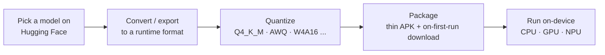

> How to run small LLMs on the Android platform, especially my phone. How people do this, from porting to quantizing models from Hugging Face, how they operate the model on-device (library, model file management, ...). I want several options and trade-offs between them.

## Short answer

There is no single best answer — it splits by how much engineering effort you want to spend, and the trade-off is model breadth vs. peak speed:

- **Fastest path to trying it, zero build**: sideload **Google AI Edge Gallery** (open source, Apache-2.0, GitHub Releases — fits the same Obtainium workflow already used for the camera app). It runs Google's official **LiteRT-LM** runtime, which is the only runtime in this survey with a first-party benchmark naming the exact device: **52 tokens/sec decode for Gemma 3n/4 E2B on a Samsung Galaxy S26 Ultra**, GPU backend, per Google's own May 2026 blog post.
- **Best path for a hand-built Kotlin integration**: **LiteRT-LM** (Google AI Edge) as the primary runtime — Kotlin-native API, Apache-2.0, actively maintained, and the only option with that device-named number. Use **llama.cpp (GGUF)** as the fallback when a model isn't in LiteRT-LM's supported set — GGUF has by far the broadest Hugging Face model coverage, an MIT license, and is what PocketPal AI and ChatterUI both build on. Its cost is a fragmented Android GPU story (OpenCL-Adreno vs. Vulkan, no single recommended path) and no benchmark found that names an Android phone directly.
- **Chasing peak Hexagon NPU throughput**: Qualcomm's own **Genie / GenieX** stack running pre-quantized W4A16 models from **Qualcomm AI Hub**. This is the fastest NPU-specific path but the narrowest model list, and gated models (Llama) require you to run the quantization yourself.
- **Skip for a general "run any LLM" goal**: ONNX Runtime GenAI (no Android benchmarks found anywhere, open packaging bugs) and Gemini Nano / AICore (task APIs, not general prompting, and Pixel devices get quota concessions Samsung devices don't).

This depends on one hard ceiling that holds across every option: at the Galaxy S26 Ultra's ~84.8 GB/s memory bandwidth, decode throughput for any ~4 GB (Q4, ~8B-class) model is bounded near **~20 tokens/sec regardless of backend**, because autoregressive decode is memory-bandwidth-bound, not compute-bound — the NPU's compute advantage shows up in prompt prefill, not in decode speed. Model file management follows the same pattern already used for the camera app: ship a thin APK, download GGUF/LiteRT weights to app-internal storage on first run, never bundle multi-gigabyte weights in the APK itself — both because of Play's size limits and because bundling a gated model's weights (Llama) plausibly triggers its redistribution clause in a way runtime download does not.

## The end-to-end path

Every option below fills these five boxes differently — the format chosen in step B constrains which quantization schemes step C can use, which in turn decides which backends step E can dispatch to.

## Runtime and library options

| Runtime | Model format | Android backends | Maturity (mid-2026) | Device-named benchmark found | Model breadth | License |
|---|---|---|---|---|---|---|
| **llama.cpp** | GGUF | CPU (NEON/dotprod/i8mm), OpenCL (Adreno, Qualcomm-upstreamed), Vulkan (cross-GPU) — no NPU delegate | Very active (daily releases) | None found naming absolute tok/s on an Android phone — only relative-speedup blog posts | Largest — GGUF exists for nearly every HF model | MIT |
| **Google AI Edge / LiteRT-LM** (+ MediaPipe LLM Inference API) | LiteRT / `.task` | CPU (XNNPACK), GPU, NPU (claimed, vendor unconfirmed in this search) | LiteRT-LM active (v0.14.0, Jul 2026); MediaPipe LLM Inference API now maintenance-only, Google recommends migrating off it | **Yes — 52 tok/s, Gemma 3n/4 E2B, GPU, Samsung Galaxy S26 Ultra**, official Google blog, May 19 2026 | Gemma, Llama, Phi-4, Qwen (curated list) | Apache-2.0 |
| **MLC LLM / Apache TVM** | TVM-compiled (from HF safetensors) | OpenCL (Adreno/Mali) only per official docs — Android docs explicitly require a real mobile GPU | Active project, but Android build is compile-heavy (Rust, pinned NDK) | Official 2023 blog ran Vicuna-7B on a Galaxy S23 but gave no tok/s; a third-party site's NPU claim contradicts MLC's own GPU-only docs — do not trust it | Wide, via its own compilation step | Apache-2.0 |
| **ExecuTorch** (PyTorch) | `.pte` | XNNPACK (CPU), Vulkan (GPU, "experimental" for LLM export), QNN (Qualcomm NPU) | Beta→maturing (v1.3.1), production use at Meta (Instagram, WhatsApp) | Llama-3.2-1B: **50.2 tok/s decode, 260 tok/s prefill, OnePlus 12** (official PyTorch blog); **53.0 tok/s, Pixel 8 Pro** (official Arm learning path) — both XNNPACK/CPU, not Snapdragon-8-Elite-Gen-5-specific | Good, via its own PT2E export flow | BSD |
| **ONNX Runtime GenAI** | ONNX | CPU; QNN and NNAPI execution providers listed but confirmed still in progress / unclear for the GenAI extension | Weakest here — open GitHub issues asking Microsoft to even document the Android build, DllNotFoundException reports, wrong-arch `.so` bundling bugs | None found | Good on paper, poor in practice on Android | MIT |
| **Qualcomm QNN / Genie / GenieX** | QNN context binary (via AI Hub) or GGUF (GenieX's llama.cpp backend) | Hexagon NPU (Genie path), or CPU/GPU/NPU (GenieX, wraps both llama.cpp and QAIRT) | Genie: official, closed CLI. GenieX: newer, open-source (BSD-3), higher-level | Llama-3.2-3B ≈ **10 tok/s**, Llama-3.1-8B ≈ **5 tok/s**, both W4A16 on Hexagon NPU, plain "Snapdragon 8 Elite" (third-party blog) — no number found naming 8 Elite Gen 5 / S26 Ultra specifically | Curated (AI Hub gallery); gated models (Llama) require self-export | BSD-3 (tooling); model licenses vary |
| **Gemini Nano / AICore / ML Kit GenAI** | N/A (platform service) | NPU/accelerator, opaque to the app | ML Kit GenAI task APIs: GA. Raw prompt access (AICore Developer Preview): preview/beta | No tok/s benchmark surfaced (not the framing Google publishes for this path) | Fixed Google-curated model (Gemini Nano / Gemma variants), not "any HF model" | Platform service, not a library you ship |

Two existing wiki pages already cover the layer beneath this table in more depth: [On-device ML runtimes (Core ML vs LiteRT)](/wiki/on-device-ml-runtimes/) (Core ML vs. LiteRT + vendor delegates generally) and [On-device neural accelerators (NPU / ANE / Hexagon)](/wiki/on-device-neural-accelerators/) (why NPU operator coverage, not TOPS, is the perennial constraint, and why Qualcomm's own TOPS figures should be treated skeptically). This report only adds the LLM-specific layer on top: which of these runtimes actually run an autoregressive decoder today, and what they measure at when someone bothers to publish a number.

### Ready-made "no-build" apps

All four pull GGUF or LiteRT models straight from Hugging Face and need no engineering to try:

| App | Backend | Model source | License | Distribution | Adoption signal |
|---|---|---|---|---|---|
| **Google AI Edge Gallery** | LiteRT-LM (migrated off MediaPipe LLM Inference API) | Hugging Face LiteRT Community + custom | Apache-2.0 | Google Play, App Store, GitHub Releases | 24.2k GitHub stars |
| **PocketPal AI** | llama.cpp via `llama.rn` | Any GGUF on Hugging Face, incl. gated repos via token | MIT | Google Play, App Store | 7.6k stars |
| **ChatterUI** | llama.cpp via `cui-llama.rn` | GGUF from Hugging Face, or remote APIs / Ollama | AGPL-3.0 | GitHub Releases only (no Play listing) | 2.6k stars |
| **Termux + llama.cpp** (DIY, not really an "app") | llama.cpp built from source (`pkg install clang cmake`, optional Vulkan) | Any GGUF | MIT | Manual build | ~121k stars on `ggml-org/llama.cpp` itself |

Given the existing Obtainium-based sideload workflow (see [Personal APK distribution](/wiki/personal-apk-distribution/) and [Android sideloading and silent updates](/wiki/android-sideloading-and-silent-updates/)), **Google AI Edge Gallery** and **ChatterUI** are the two that fit directly — both ship via GitHub Releases, which Obtainium already watches.

## Quantization in practice

Two quantization worlds exist, and which one a runtime accepts is not interchangeable:

- **GGUF K-quants** (`Q4_K_M`, `Q5_K_M`, `Q6_K`, `Q8_0`, ...) — blockwise linear quantization, each block carrying its own scale (and min), with `_S`/`_M`/`_L` suffixes controlling which layers get bumped to higher precision. `Q4_K_M` sits around 4.5 bits per weight; on a 7B model, moving from F16 (perplexity ≈ 5.96) to Q4_K_M (≈ 6.01) is a hundredths-of-a-point quality cost. No calibration data is required.
- **GGUF I-quants** (`IQ2_XS`, `IQ3_XXS`, `IQ4_NL`, ...) — non-linear, codebook-based quantization that needs an **importance matrix (imatrix)** computed from calibration text to be usable at very low bit-widths (2–3 bpw); without one, quality degrades badly. Use these only when the memory budget is tight enough that K-quants don't fit.
- **AWQ** (activation-aware) and **GPTQ** (one-shot, layer-wise) are the two calibration-based schemes from the GPU-server world. **ONNX Runtime GenAI** accepts AWQ directly (Microsoft ships a worked example) and GPTQ via its model-builder tool; **MLC-LLM** loads weights matching AutoAWQ's GEMM kernel format directly. **ExecuTorch** does *not* consume either — its XNNPACK backend expects its own PT2E-based quantization flow (per-channel 4-bit weights + 8-bit dynamic activations), so a model must be re-quantized through ExecuTorch's own toolchain regardless of what format it started in.
- **Qualcomm's Hexagon NPU path** requires weights to be **static (const) data** to use INT4 encoding, and the standard flow — Qualcomm's own AIMET library performing Adaptive Rounding (AdaRound) — needs a representative calibration dataset to reach good accuracy; a single random sample calibrates but degrades quality. The scheme actually used for LLMs on Hexagon is **W4A16** (4-bit weights, 16-bit activations), which is what Qualcomm AI Hub's own published Llama/Gemma/Qwen exports use. This is a real, per-target-chipset compile step (AIMET/QAIRT → per-chipset context binary), not a drop-in conversion — doing it yourself for a model AI Hub hasn't already published is a genuine ML-engineering undertaking, which is exactly why AI Hub's pre-quantized gallery exists.
- By contrast, **llama.cpp's CPU (GGUF) path needs no calibration** for standard K-quants at any bit width — the quantization is done once, offline, by whoever converts the model, with no device- or runtime-specific step. This asymmetry — one-time offline quantization vs. per-chipset calibrated compilation — is the practical reason GGUF has far broader model coverage than the Hexagon-NPU path: anyone can quantize and upload a GGUF; almost nobody self-serves a Hexagon-ready W4A16 export outside Qualcomm's own gallery.

## CPU vs. GPU vs. NPU: what actually delivers tokens/sec

The academic literature is explicit that **prefill is compute-bound and decode is memory-bandwidth-bound** — prefill processes the whole prompt in one parallel pass (arithmetic intensity ≈ prompt length, high), while decode reads the entire model out of memory for every single generated token (arithmetic intensity ≈ 1, low). One paper on edge LLM inference reports a 40-TOPS-rated NPU (Hailo-10H) achieving only 6.9 tok/s in sustained single-sequence decode, explicitly attributing this to the bandwidth bound rather than the NPU's compute ceiling; another reports L2 cache miss rates over 60% during decode on mobile SoCs, and that decode speed "does not vary significantly across top-tier devices" for exactly this reason.

This is why an NPU's peak-TOPS number (see [On-device neural accelerators (NPU / ANE / Hexagon)](/wiki/on-device-neural-accelerators/) for why Qualcomm doesn't even publish a clean one) says much less about chat latency than it implies: the NPU's compute headroom helps time-to-first-token (prefill) far more than steady-state tokens/sec (decode).

**Grounding this on the Galaxy S26 Ultra specifically** (Snapdragon 8 Elite Gen 5, Adreno 840, LPDDR5X-5300 at a confirmed **84.8 GB/s** peak bandwidth): reading a 4 GB (Q4, ~8B-class) model's full weights once per token bounds decode near **84.8 GB/s ÷ 4 GB ≈ 21 tokens/sec** as an absolute ceiling — this specific number is a derivation from the confirmed bandwidth spec, not a reported measurement, but it lines up with the ~10 tok/s reported for a smaller 3B model on the Hexagon NPU of the *previous*-generation plain Snapdragon 8 Elite (real throughput sits below the naive ceiling because of KV-cache traffic, non-weight memory reads, and per-op overhead). Reported cross-device numbers for smaller models are consistent with this picture: Qwen2.5-1.5B at Q4 reached ~10.4 tok/s on a Snapdragon-8-Gen-3 Galaxy S24 Ultra at its thermally-throttled plateau in one academic benchmark. No source in this survey names the exact Snapdragon 8 Elite Gen 5 / Galaxy S26 Ultra for an NPU tokens/sec figure — every concrete Hexagon-NPU number found is pinned to the prior chip generation, so treat any extrapolation to the S26 Ultra as directional, not measured.

Practical reading for this device class: expect roughly the same decode tok/s (bounded by bandwidth) whichever backend is used for a given model size, but expect the GPU/NPU path to win clearly on prompt-processing latency and on power/thermal cost per token — which matters more the longer a chat session runs.

## On-device model file management

- **Where weights live**: the dominant real pattern — used by MLC LLM's own Android app and every llama.cpp-based app surveyed — is a thin base APK that **downloads the model file at first run** into app-internal storage, not scoped/shared storage. Scoped storage restrictions on modern Android make shared storage awkward for this anyway.
- **APK/AAB size limits are the reason bundling isn't viable**: Android's base module has roughly a 200 MB compressed-download ceiling before Play requires asset delivery, and Play Asset Delivery's own asset packs cap at roughly 1 GB (install-time) / 512 MB (each fast-follow/on-demand pack), ~2 GB combined — figures reported secondhand, not independently confirmed against Google's current support page in this pass. A Q4-quantized 3B model alone runs ~2 GB, already at or past that combined ceiling and ~10× the base-module limit. No example was found of a shipped app actually using Play Asset Delivery for multi-gigabyte LLM weights — treat that as plausible by the numbers, not demonstrated in practice.
- **mmap** is why GGUF loads fast and keeps peak RSS low on a phone — the OS pages weights in on demand instead of fully deserializing into RAM up front. One Android-specific wrinkle worth flagging: a llama.cpp GitHub issue reports mmap behavior on Android is filesystem-path-dependent (some storage paths need it to work around an EINVAL failure; some users report `--no-mmap` speeding up prompt processing) — this is not the clean, uniformly-beneficial story it is on desktop Linux.
- **Licensing/redistribution**: Gemma's terms are described as permissive (redistribution, fine-tuning, commercial use allowed). Meta's Llama Community License explicitly conditions redistribution — a product containing Llama Materials must include the license and prominently display "Built with Llama." Whether *bundling* weights in a distributed APK counts as the triggering "distribution" is unambiguous; whether *downloading them onto the user's own device at runtime* moves that obligation is a genuinely open question — no source states it plainly either way. The practically defensible reading, and the one this report recommends: treat runtime download the way the existing Obtainium/GitHub-Releases pipeline already treats the camera app's own APK (see [Personal APK distribution](/wiki/personal-apk-distribution/)) — ship the thin binary, let the device pull the model, and don't bundle a gated model's weights inside anything that gets redistributed.

## Realistic small models today

Sizes below are Hugging Face's own reported GGUF file sizes (Q4_K_M / Q8_0), not naive parameter-count estimates — the naive `params × 0.5 bytes` formula consistently runs 40–60% under the real figures, because embedding/LM-head tables are not quantized as aggressively as other layers.

| Model | Params | Q4_K_M | Q8_0 | Note |
|---|---|---|---|---|
| Gemma 3 270M | 270M | 253 MB | 292 MB | Smallest realistic chat model |
| Gemma 3 1B | 1B | 806 MB | 1.07 GB | |
| Gemma 3 4B | 4B | 2.49 GB | 4.13 GB | |
| Gemma 3n E2B | 5B raw | 3.03 GB | 4.79 GB | Per-Layer Embeddings stream unused experts from storage — Google states this lets E2B run in **~2 GB**, far under its raw 5B-parameter footprint |
| Gemma 3n E4B | 8B raw | 4.54 GB | 7.35 GB | Same PLE mechanism; Google states **~3 GB** effective footprint |
| Qwen3 0.6B | 0.6B | ~350–400 MB (derived) | — | |
| Qwen3 1.7B | 1.7B | 1.11 GB | 1.83 GB | |
| Qwen3 4B | 4B | 2.5 GB | 4.28 GB | |
| Llama 3.2 1B | 1B | 808 MB | 1.32 GB | |
| Llama 3.2 3B | 3B | 2.02 GB | 3.42 GB | Gated HF access — see licensing note above |
| Phi-4-mini | 3.8B | 2.49 GB | — | |
| SmolLM2 1.7B | 1.7B | 1.06 GB | 1.82 GB | |
| SmolLM3 3B | 3B | 1.92 GB | 3.28 GB | |

With 12 or 16 GB of RAM (the Galaxy S26 Ultra's only two configurations), every model in this table fits comfortably alongside the rest of Android — the practical ceiling on this device is decode speed (the bandwidth roofline above), not whether the weights fit in memory. Gemma 3n's PLE architecture is the one entry that breaks the params-to-footprint pattern deliberately, by design, and is worth knowing about specifically because it's the one place "8B-class capability" and "2–3 GB effective RAM" coexist.

## Recommendation for this device and use case

Given a Kotlin Android camera app already in development, a preference for on-device/no-cloud approaches, and an existing Obtainium-based sideload pipeline:

1. **Evaluate first with Google AI Edge Gallery** — it is the only option with a measurement on this exact phone (52 tok/s, Gemma 3n/4 E2B, GPU), it is open source and Apache-2.0, and it distributes via GitHub Releases, so it slots into the same Obtainium workflow as the camera app with no new distribution channel to build.
2. **Build with LiteRT-LM** if/when the camera app needs an embedded LLM feature — Kotlin-native, Apache-2.0, actively developed by Google, and the only runtime in this survey backed by a device-named number rather than a relative-speedup claim or a stale-generation figure. Its limitation is a curated model list (Gemma, Llama, Phi-4, Qwen) rather than "any Hugging Face model."
3. **Fall back to llama.cpp (GGUF)** for any model outside that curated list, or if LiteRT-LM's NPU dispatch proves unreliable in practice — GGUF is the most broadly available format on Hugging Face by a wide margin, needs no calibration step, and is what both surveyed no-build apps (PocketPal, ChatterUI) already rely on. Accept the cost: no official Android benchmark number exists for it, and the GPU story (OpenCL-Adreno vs. Vulkan) is genuinely fragmented rather than a single supported path.
4. **Reach for Qualcomm Genie/GenieX only if peak Hexagon throughput is the explicit goal** and the target model is already in Qualcomm AI Hub's gallery — the payoff (NPU dispatch without hand-rolling QNN) is real, but self-quantizing a gated model (Llama) for this path is a nontrivial undertaking better spent elsewhere unless NPU throughput is specifically the point.
5. **Skip ONNX Runtime GenAI** for now — no Android benchmark surfaced anywhere in this research, and open packaging bugs suggest the Android build path is not yet production-ready. **Treat Gemini Nano / ML Kit GenAI as a different tool, not a competitor** — it's a fixed set of task APIs (summarize, rewrite, describe) on a Google-curated model, useful for specific camera-app features (e.g., auto-captioning a photo) but not a general "run an LLM I chose" runtime, and its raw-prompt access is still preview-stage with Pixel-only quota concessions.

None of this changes the bandwidth ceiling: whichever runtime is chosen, expect roughly 10–20 tok/s decode for a model in the 3–8B class on this device, with the runtime choice affecting prefill latency, power draw, and which models are reachable at all — not the decode ceiling itself.

## Sources

- [On-device ML runtimes (Core ML vs LiteRT)](/wiki/on-device-ml-runtimes/) — the general Core ML vs. LiteRT + vendor delegate layer this report's runtime table sits on top of.
- [On-device neural accelerators (NPU / ANE / Hexagon)](/wiki/on-device-neural-accelerators/) — why NPU operator coverage and bandwidth, not TOPS, are the governing constraints; why Qualcomm's TOPS figures should be treated skeptically.
- [Personal APK distribution](/wiki/personal-apk-distribution/) and [Android sideloading and silent updates](/wiki/android-sideloading-and-silent-updates/) — the existing Obtainium/GitHub-Releases sideload pipeline this report's app recommendations plug into.
- [Generative UI on Android](/wiki/generative-ui-android/) — covers ML Kit GenAI / Gemini Nano / AICore in more depth as a separate on-device building block.
- llama.cpp: [GitHub](https://github.com/ggml-org/llama.cpp), [OpenCL backend for Adreno (Qualcomm blog)](https://www.qualcomm.com/developer/blog/2024/11/introducing-new-opn-cl-gpu-backend-llama-cpp-for-qualcomm-adreno-gpu), [QMX CPU acceleration (Qualcomm blog, Apr 2026)](https://www.qualcomm.com/developer/blog/2026/04/llama-models-acceleration-on-cpu-qmx), [Android performance discussion #14356](https://github.com/ggml-org/llama.cpp/discussions/14356), [mmap Android issue #18804](https://github.com/ggml-org/llama.cpp/issues/18804)
- MLC LLM: [GitHub](https://github.com/mlc-ai/mlc-llm), [Android deploy docs](https://llm.mlc.ai/docs/deploy/android.html), [original Android blog post](https://blog.mlc.ai/2023/05/08/bringing-hardware-accelerated-language-models-to-android-devices), [quantization config docs](https://llm.mlc.ai/docs/compilation/configure_quantization.html)
- Google AI Edge / LiteRT-LM: [LiteRT-LM GitHub](https://github.com/google-ai-edge/LiteRT-LM), [MediaPipe LLM Inference API (Android)](https://developers.google.com/edge/mediapipe/solutions/genai/llm_inference/android), [official benchmark blog naming the Galaxy S26 Ultra, May 19 2026](https://developers.googleblog.com/blazing-fast-on-device-genai-with-litert-lm/), [Google AI Edge Gallery GitHub](https://github.com/google-ai-edge/gallery)
- ExecuTorch: [GitHub](https://github.com/pytorch/executorch), [ExecuTorch Beta blog (Oct 2024)](https://pytorch.org/blog/executorch-beta/), [Arm learning path benchmark on Pixel 8 Pro](https://learn.arm.com/learning-paths/mobile-graphics-and-gaming/build-llama3-chat-android-app-using-executorch-and-xnnpack/5-run-benchmark-on-android/), [Qualcomm AI Engine backend docs](https://docs.pytorch.org/executorch/stable/backends-qualcomm.html), [XNNPACK backend docs](https://docs.pytorch.org/executorch/stable/backends-xnnpack.html)
- ONNX Runtime GenAI: [GitHub](https://github.com/microsoft/onnxruntime-genai), [AWQ example](https://github.com/microsoft/onnxruntime-genai/blob/main/examples/python/awq-quantized-model.md), [Android build documentation request, issue #1081](https://github.com/microsoft/onnxruntime-genai/issues/1081), [QNN support discussion #660](https://github.com/microsoft/onnxruntime-genai/discussions/660)
- Qualcomm: [Genie tutorial (quic/ai-hub-apps)](https://github.com/quic/ai-hub-apps/blob/main/tutorials/llm_on_genie/README.md), [GenieX](https://github.com/qualcomm/GenieX), [AI Hub Models](https://aihub.qualcomm.com/models), [AI Hub Models license](https://github.com/qualcomm/ai-hub-models/blob/main/LICENSE), [INT4 weight encoding guidance](https://docs.qualcomm.com/bundle/publicresource/topics/80-63442-50/htp_guidelines_int4_weights.html), [QAIRT quantization docs](https://docs.qualcomm.com/bundle/publicresource/topics/80-63442-10/quantization.html), [Grape Up: LLMs on Snapdragon 8 Elite](https://grapeup.com/blog/running-llms-on-device-with-qualcomm-snapdragon-8-elite)
- Gemini Nano / ML Kit GenAI: [ML Kit GenAI overview](https://developers.google.com/ml-kit/genai), [AICore Developer Preview docs](https://developers.google.com/ml-kit/genai/aicore-dev-preview), [Gemma 4 in AICore preview (Android blog, Apr 2026)](https://android-developers.googleblog.com/2026/04/AI-Core-Developer-Preview.html)
- No-build apps: [PocketPal AI](https://github.com/a-ghorbani/pocketpal-ai), [ChatterUI](https://github.com/Vali-98/ChatterUI)
- Device specs: [GSMArena — Galaxy S26 Ultra](https://www.gsmarena.com/samsung_galaxy_s26_ultra_5g-14320.php), [GSMArena — Snapdragon 8 Elite Gen 5](https://www.gsmarena.com/qualcomm_snapdragon_8_elite_gen_5_soc_features_specs-news-69656.php), [9to5google Snapdragon 8 Elite Gen 5 announcement](https://9to5google.com/2025/09/24/snapdragon-8-elite-gen-5/), [CpuTronic bandwidth spec](https://cputronic.com/soc/qualcomm-snapdragon-8-elite-gen-5)
- Memory-bandwidth roofline argument: [arXiv 2603.23640, "LLM Inference at the Edge"](https://arxiv.org/html/2603.23640v2), [arXiv 2410.03613, "Understanding LLMs in Your Pockets"](https://arxiv.org/html/2410.03613v4)
- Small-model checkpoints (Hugging Face): [Gemma 3 GGUF (unsloth)](https://huggingface.co/unsloth/gemma-3-4b-it-GGUF), [Gemma 3n GGUF (unsloth)](https://huggingface.co/unsloth/gemma-3n-E4B-it-GGUF), [Introducing Gemma 3n (Google blog, PLE mechanism)](https://developers.googleblog.com/en/introducing-gemma-3n/), [Qwen3 GGUF (official)](https://huggingface.co/Qwen/Qwen3-4B-GGUF), [Llama 3.2 GGUF (unsloth)](https://huggingface.co/unsloth/Llama-3.2-3B-Instruct-GGUF), [Phi-4-mini GGUF (unsloth)](https://huggingface.co/unsloth/Phi-4-mini-instruct-GGUF), [SmolLM3 GGUF](https://huggingface.co/unsloth/SmolLM3-3B-GGUF), [Llama 3.1 license terms](https://huggingface.co/meta-llama/Llama-3.1-8B-Instruct)
