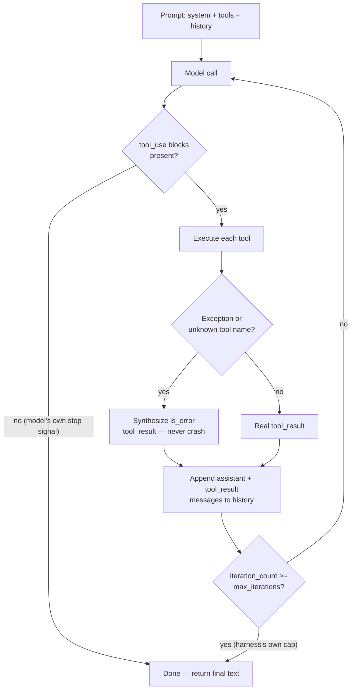

> Research tool-use agent loop implementations. How-to, examples, design patterns, and pitfalls. My focus is to implement a minimal on-device agent harness with restricted number of tools (camera app unit features) and structured output for displaying sentences.

## Short answer

- **Don't build a loop by default.** For a fixed, single-digit camera tool set (shutter, zoom, flash, focus, exposure compensation, white balance, self-timer, aspect ratio, scene mode), the right shape is a **single constrained decode**: the model emits either exactly one tool call or plain text, never both, never a chain. Escalate to a capped 2–3-turn loop only for a genuinely compound utterance ("zoom in and switch to night mode") — and detect that compound-ness with a **cheap non-LLM heuristic** (conjunction/multi-verb-phrase segmentation on the transcript, run *before* any model call), never a second LLM classification pass, which would silently double the per-utterance model-call cost for every command, not just compound ones. This split is a documented, solved pattern in production voice assistants, not a research problem.
- **Force the tool call, never the sentence — and the exact mechanism is now fully mapped at the source level.** `llama.cpp`'s lazy/triggered grammars (`grammar_lazy` + `grammar_triggers`) genuinely cost nothing while the model is generating free text — the grammar sampler is a hard no-op until a trigger fires (token ID, literal word, or regex, with an explicit full-buffer-anchor variant) — then locks every subsequent token to a JSON-Schema-derived grammar. XGrammar's `TriggeredTags` and vLLM's `structural_tag` are genuinely the same *family* (free text by default, schema-locked after a trigger) but not the same *mechanism*: XGrammar compiles the trigger check into the grammar's own automaton and pays a real (optimized but nonzero) masking cost on every step, including during free text, while llama.cpp's early-return costs nothing until the trigger fires. For an embedded, llama.cpp-based Android harness, llama.cpp's native mechanism is the better fit for exactly that reason.
- **On the runtime this app's ecosystem already uses (LiteRT-LM), the KV-cache question is now settled, not assumed: yes, it reuses.** Read from the actual C++ implementation (`conversation.cc`, `session_advanced.h`, `kv_cache.h`): `Conversation` holds one persistent `Session` for the whole exchange, computes each turn's prefill input by literally string-diffing the old and new rendered prompt templates and sending only the delta, and the underlying KV-cache buffers only grow, never rebuild. A multi-turn loop on LiteRT-LM costs one prefill total, not N — but the runtime has no automatic context-window eviction (confirmed both at the API level, tracked in LiteRT-LM issue #1878, and now at the implementation level: no LRU/eviction logic exists anywhere in the resource-management code), so the harness must still manage trimming itself for a long-running session.
- **LiteRT-LM's tool calling does not require MCP.** The library ships a plain `@Tool`/`@ToolParam`-annotated Kotlin function API (`ToolSet`, `tool()`, `ToolProvider`, `ConversationConfig(tools = ...)`) — Google AI Edge Gallery's Model-Context-Protocol-based "Agent Skills" is one particular tool implementation built on top of this, not a requirement of the library. MediaPipe's older LLM Inference API never had any form of tool/function calling, at any point in its source history.
- **A structured, independent adversarial review of the pass-one recommendation found it fundamentally sound but incomplete in five specific, fixable ways** (detailed in Recommendation, below): the compound-command escalation needed a named, cheap detection mechanism rather than being left implicit; "undo" needs to be a harness-native affordance bypassing the model entirely, not something the model is asked to infer; the flat-argument rule was justified on the wrong grounds (the cited bugs are about *unconstrained or variable-shape* JSON, not about nesting depth under a locked grammar — the real reason to stay flat is that this app's actual feature list never needs more); the failure-path fallback message should be grounded in the real error the harness already has, exactly like the success path already is; and the iteration cap should be wall-clock-aware, not a flat count, because the same nominal cap costs very different real time on CPU vs. GPU.
- **Never let the model narrate what it didn't do.** This remains the single highest-severity, best-evidenced pitfall — confirmed, not weakened, by the deeper pass.

## Loop anatomy: the minimal correct control flow

The clearest primary source for "what does a correct tool-use loop actually do" is Anthropic's own SDK tool runner — not because this harness will run on Anthropic's API, but because it is real, shipped, production code implementing exactly the five-stage loop the question asks about, and its termination logic is worth copying regardless of which model sits behind it.

Read from `anthropic-sdk-python`, `src/anthropic/lib/tools/_beta_runner.py`, class `BaseSyncToolRunner.__run__` (and its structural twin in `anthropic-sdk-typescript`'s `BetaToolRunner.ts`):



The five stages map onto real functions: `_handle_request()` calls the model with the full accumulated `messages` list (nothing is summarized unless a compaction feature is explicitly configured); `_generate_tool_call_response()` filters for `tool_use` blocks — zero blocks is the model's own "I'm done" signal, returning `None`; each tool is looked up by name and executed, with three explicit outcomes — success, a caught `ToolError`, or any other exception — all folded into a `tool_result` block, **never** a crash; `append_messages()` appends both the assistant's call and the synthesized result, which is what grows context every turn; and the loop's `while not self._should_stop()` check is a pure iteration counter (`self._iteration_count >= self._max_iterations`) that does nothing at all unless the caller explicitly sets a cap.

**Who owns each termination condition** — this is the load-bearing distinction:

| Termination trigger | Owner | Evidence |
|---|---|---|
| Model emits no `tool_use` blocks | **Model's own decision** | `_beta_runner.py:326-327`, loop returns |
| `stop_reason == "refusal"` | Model's decision, harness treats as terminal by policy ("executing tool_use blocks would fire side effects the model never confirmed") | `_beta_runner.py:279-281` |
| `iteration_count >= max_iterations` | **Caller-set hard cap**, harness enforces | `_beta_runner.py:125-128`; default is `None` — no cap unless the caller sets one |
| `stop_reason == "max_tokens"` with a truncated tool call | **Neither** — documented as a caller-must-detect-and-retry case, not runner-handled | [Anthropic docs, "Handling stop reasons"](https://platform.claude.com/docs/en/build-with-claude/handling-stop-reasons) |

The design lesson for a minimal on-device harness: keep these two concerns in two separate, small functions — "did the model call a tool this turn" (natural stop) and "have we hit the safety ceiling" (hard stop, harness-owned, independent of model judgment) — never merge them into one condition. That separation is what everything else in this report (the recommendation section especially) builds on.

## Design patterns: named, sourced, and when each earns its cost

Five patterns are named in the literature. Only some of them are genuinely different *control-flow shapes* — others are prompting styles layered on the identical loop above.

**ReAct** ([Yao et al. 2022, arXiv:2210.03629](https://arxiv.org/abs/2210.03629)) interleaves an explicit `Thought:`/`Action:`/`Observation:` text scratchpad inside free-text generation, letting the model revise its plan after an unpredicted observation. Reading the Anthropic runner's own code confirms it has *no* concept of a "Thought" step at all — native structured tool-calling (below) is the same loop with the scratchpad replaced by a `tool_use` block. **Earns its cost** when the correct tool sequence genuinely isn't knowable in advance (open-ended search/retrieval). **For camera commands it is pure overhead**: the correct next action is usually obvious from current camera state, every extra reasoning token costs real on-device latency, and a visible scratchpad has to be hidden from the user anyway since the app only ever displays clean sentences.

**Function/tool calling** ([OpenAI, June 2023](https://openai.com/index/function-calling-and-other-api-updates/); Anthropic's native `tool_use` blocks) is not a separate shape from ReAct — it's the identical act-or-stop loop with reasoning (if any) moved to a separate, optionally hidden channel. This is the default/floor pattern for the camera use case: a single model call that either calls a tool or doesn't.

**Plan-then-execute** actually names two different things worth not conflating. Plan-and-Solve prompting ([Wang et al., ACL 2023, arXiv:2305.04091](https://arxiv.org/abs/2305.04091)) asks the model to write a plan and solve it *within one generation* — not a multi-call pattern. [LangChain's plan-and-execute agent](https://www.langchain.com/blog) is the real control-flow variant: a Planner call produces a full multi-step plan up front, then Executor call(s) — possibly a smaller/cheaper model — carry it out without re-consulting the planner after each step. **Earns its cost** only when enough sequential steps exist that batching the plan saves real round trips *and* the full plan is knowable before any tool executes. A fixed camera tool set with typically 0–2 calls per utterance never reaches that threshold.

**Router / classifier-first.** No canonical peer-reviewed paper defines this as a control-flow pattern distinct from constrained single-tool-choice (this vault could not find one — flagged honestly rather than inventing a citation). It is, in practice, structured tool-calling forced to emit **at most one** call (e.g. Anthropic's `tool_choice: {type: "any"}`, or a grammar constraining the decode to a 1-of-N discriminated union) with the loop hard-capped at one iteration. **This is the best-fit pattern for the camera harness**: with ≤9 fixed tools, one constrained decode that emits at most one call, rendered to natural language, with no multi-turn machinery at all, satisfies the requirement — for a compound utterance, the escalation to a short loop must be triggered by a cheap heuristic outside the model, not by a second LLM decision (see Recommendation), or the "one model call" property silently stops holding for every command, not just compound ones.

**Reflection / self-critique** ([Shinn et al., "Reflexion," arXiv:2303.11366](https://arxiv.org/abs/2303.11366)) adds an *outer episode loop*: a failed episode's transcript is summarized into verbal feedback and injected into the *next* attempt. It requires a verifiable success/failure signal and a retry budget — neither exists for a live camera command answered in one shot to one user. **Skip it entirely** for this harness; it solves a problem (learning across attempts) a single-turn command doesn't have.

## Structured output: what forces well-formed calls, and what actually holds up on a small model

**The mechanism, at the token level.** llama.cpp's GBNF grammars ([`grammars/README.md`](https://github.com/ggml-org/llama.cpp/blob/master/grammars/README.md), `src/llama-grammar.cpp`) implement a stack-based parser: every possible parse position is tracked simultaneously in `llama_grammar_stacks`, and at each decoding step `llama_grammar_reject_candidates()` masks out any candidate token whose text doesn't match a live grammar terminal. This is **post-hoc logit masking on top of already-computed logits** — pure CPU bookkeeping, no extra GPU/NPU compute — which is why it costs nothing extra on the forward pass and works identically on llama.cpp's official Android/NDK build ([`docs/android.md`](https://github.com/ggml-org/llama.cpp/blob/master/docs/android.md)). The README's own caveat is worth keeping: naive optional-repetition patterns (`x? x? x?...`) can make sampling "extremely slow" — use bounded `x{0,N}` syntax when hand-writing a tool-argument grammar.

**Schema → grammar compilation** happens in `common/json-schema-to-grammar.cpp`, a recursive visitor over the JSON Schema AST: `_build_object_rule()` turns a tool's `{name, arguments}` shape into GBNF rules, and `_generate_union_rule()` emits alternation for `oneOf`/`anyOf` — the exact primitive that would encode a discriminated union of "which of 9 tools, with which flat arguments." Because the camera tool set is fixed, this schema→grammar compilation is a one-time cost at app init, not a per-request one.

### Lazy/triggered grammars — the exact mechanics, read from source

The pattern that actually matches this harness's two output shapes ("just talk" vs. "call a tool") is **lazy / triggered grammars**, shipped in llama.cpp via [PR #9639](https://github.com/ggml-org/llama.cpp/pull/9639). A second, deeper pass traced this all the way to the sampler:

- **Trigger types** (`common/common.h:141-152`): a trigger can be an exact token ID (`COMMON_GRAMMAR_TRIGGER_TYPE_TOKEN`), a literal word (`TYPE_WORD`, internally regex-escaped), a regex matched anywhere in the generated text so far (`TYPE_PATTERN`, `std::regex_search`), or a regex that must match the **entire buffer generated since the start of the turn** (`TYPE_PATTERN_FULL`, auto-wrapped `^...$`, `std::regex_match`) — this last form is the concrete answer to "can a trigger be anchored to fire only at the very start of generation": yes. Real per-model-family trigger tables live in `common/chat.cpp` — e.g. Mistral's is the literal word `[TOOL_CALLS]` (line 1101).
- **The "lazy" no-op is a literal early return, not a cheap mask**: `llama_grammar_apply_impl` (`src/llama-grammar.cpp:1339-1344`) is `if (grammar.awaiting_trigger) { return; }` — zero computation, no logit touched, not even EOS-suppression, while `awaiting_trigger` is true. Every generated token's text is appended to a `trigger_buffer`; on each new token, `llama_grammar_accept_impl` re-checks the registered trigger tokens/patterns against that buffer, and the instant one matches, `awaiting_trigger` flips false and the matched-and-following text is replayed into the grammar's parse-state stack so the automaton is caught up before the very next step constrains anything.
- **If the trigger never fires**: generation runs to ordinary completion (EOS or `max_tokens`), identically to having no grammar attached at all — confirmed by direct inspection, there is no error state or hang condition tied to "trigger never fired."
- **Sampler-chain ordering — the practically important nuance.** The grammar sampler is *not* inside the temperature/top-p/top-k chain; it's a separate step, and the server's default (`common_sampler_sample(..., grammar_first=false)`, `tools/server/server-context.cpp:3749`) **samples first** from the unconstrained chain, checks if that sampled token is grammar-valid, and only on rejection resets and resamples with the grammar mask applied *before* the chain (`common/sampling.cpp:540-622`). Inside a genuinely tight constraint (e.g. choosing among a handful of enum values out of a 32K–256K vocabulary), the optimistic first sample almost always fails and the mask-then-chain path runs — but critically, **temperature and top-p still operate on the surviving grammar-valid candidates** in that path, so which enum value gets picked is a real temperature-weighted sample, not a collapse to greedy, unless temperature is explicitly set to near-zero.

### XGrammar's `TriggeredTags` and vLLM's `structural_tag`: same family, different cost profile

A first pass claimed these three are "independently converged on the identical idea." A source-level check confirms the *shape* is shared but corrects the *mechanism*:

- **XGrammar's `TriggeredTagsFormat`** (`python/xgrammar/structural_tag.py:169-223` — "XGrammar-2" is a release milestone of the same repository, not a separate codebase) specifies triggers as **literal string prefixes of a tag's begin-string only** — no regex, no full-buffer-anchor concept comparable to llama.cpp's `TYPE_PATTERN_FULL`. Architecturally, the trigger check is compiled directly into the grammar's own automaton as an Aho-Corasick trie (`cpp/fsm_builder.cc:778-959`) that computes a full transition table for every state, **including the free-text state** — so unlike llama.cpp's genuine no-op, XGrammar's matcher walks and masks on every single step even before any trigger fires (`python/xgrammar/matcher.py:58-224`), relying on its fast bitmask engine to keep that cheap rather than skipping the work entirely.
- **vLLM's `structural_tag`** is not a fourth mechanism — it's a thin request-schema wrapper (`vllm/sampling_params.py:83`, `vllm/v1/structured_output/backend_xgrammar.py:96-126`) that constructs XGrammar's own `TriggeredTagsFormat` under the hood (or, via an alternate backend, Microsoft's `llguidance` engine — not independently verified at the source level here). A real worked example exists in the repo ([`examples/features/structured_outputs/structured_outputs_client.py:136-194`](https://github.com/vllm-project/vllm/blob/main/examples/features/structured_outputs/structured_outputs_client.py)) combining free text with a `<function=get_weather>{...}</function>`-triggered JSON-schema span — the exact shape this harness needs, now confirmed with a citable example a first pass could not find.
- **Practical conclusion, revised**: all three genuinely share the "free text by default, lock on trigger" bet, but llama.cpp's version is strictly cheaper during the free-text phase (a real no-op vs. a per-step masked automaton walk) and has richer trigger syntax (regex plus explicit start-anchoring vs. literal-prefix-only). For an embedded, llama.cpp-based Android harness with a fixed 9-tool set and a plain literal marker token as the trigger, llama.cpp's native mechanism remains the better fit — XGrammar's heavier automaton buys generality (arbitrary regex-free tag dispatch at scale) this use case doesn't need.

### The Android Kotlin API surface, precisely

A first pass knew Google AI Edge Gallery's "Agent Skills" used MCP but could not say whether MCP was required by the underlying library or just Gallery's own choice. Read directly from `google-ai-edge/LiteRT-LM`'s Kotlin sources, it is settled: **MCP is not required.**

The native API (`kotlin/java/com/google/ai/edge/litertlm/Tool.kt`, `Config.kt`) is a plain reflection-based tool interface:

```kotlin
@Target(AnnotationTarget.FUNCTION) annotation class Tool(val description: String)
@Target(AnnotationTarget.VALUE_PARAMETER) annotation class ToolParam(val description: String)
interface ToolSet {}
fun tool(toolSet: ToolSet): ToolProvider          // reflection-wraps @Tool-annotated methods
fun tool(openApiTool: OpenApiTool): ToolProvider  // for a hand-written OpenAPI-shaped tool
class ToolManager(val tools: List<ToolProvider> = emptyList())
```

A developer writes a class implementing `ToolSet` with `@Tool`/`@ToolParam`-annotated methods (parameter types: `String`, `Int`, `Boolean`, `Float`, `Double`, or `List` of them), then passes `tool(instance)` into `ConversationConfig(tools = listOf(...))` — no MCP server, no protocol round-trip, required. Google AI Edge Gallery's own "Agent Skills" tool set (`ToolDefinition.kt`, declared as `interface ToolDefinition : ToolSet`) uses this exact native path for most tools; MCP shows up only inside one *specific* tool implementation (`RunMcpTool.kt`) that exposes a single generic `runMcpTool(toolName, input)` function and internally dispatches to an MCP server — MCP is Gallery's own layered choice for one tool, not a requirement of the library itself.

**The older MediaPipe LLM Inference API never had any tool-calling surface, confirmed at the source level, not just "deprecated."** A full grep of the current `mediapipe/tasks/java/.../genai/llminference/` tree (`LlmInference.java`, `LlmInferenceSession.java`, `LlmTaskRunner.java`) for `tool`/`function` returns only unrelated Java `java.util.function.Function` lambda-type usage. `LlmInferenceSession`'s complete public surface (`addQueryChunk`, `addImage`, `addAudio`, `generateResponse`/`generateResponseAsync`, `sizeInTokens`, `cloneSession`, `updateSessionOptions`) and `LlmInferenceSessionOptions` (`topK`, `topP`, `temperature`, `randomSeed`, `loraPath`, `graphOptions`, `constraintHandle`, `promptTemplates`) have no `tools` field or equivalent, at any point checked. Tool calling on this app's target platform is LiteRT-LM-only.

### Small-model reality — does constrained decoding actually matter, and what do the numbers say now?

The Hammer paper ("Robust Function-Calling for On-Device Language Models via Function Masking," [arXiv:2410.04587](https://arxiv.org/abs/2410.04587)) names three concrete on-device small-model failure modes — malformed JSON, hallucinated function names, forcing a call when none applies — and reports masking-based constrained decoding achieves "near-perfect format compliance" against unconstrained approaches' "high error rates." This qualitative claim stands.

A deeper pass tried to get the **quantitative** BFCL (Berkeley Function-Calling Leaderboard) numbers behind that gap, from the underlying CSV the live site's own JavaScript fetches (`gorilla.cs.berkeley.edu/data_overall.csv`, BFCL v4, 109 entries, pulled directly rather than scraped from the rendered page) rather than a secondary aggregation. The honest result is more nuanced than a first pass implied: **there is no Gemma entry with both an FC (native tool-calling) and a Prompt (text-parsed) score to compare — every Gemma-3 entry on the current board is Prompt-only.** The closest same-family comparison available is Qwen3: **Qwen3-4B-Instruct-2507 scores 35.68% FC vs. 35.52% Prompt (a 0.16-point gap, essentially tied)**, and **Qwen3-0.6B scores 23.93% FC vs. 22.38% Prompt (a 1.55-point gap)** — both far smaller than the "high error rate" framing might suggest, at least for a modern instruction-tuned small model whose training data likely covers structured output either way. This is also a different axis than Hammer's own claim: BFCL's FC/Prompt split measures native-tool-API-parsing vs. prompted-text-parsing, not grammar-constrained-decoding vs. unconstrained — a locked grammar forces syntactic validity regardless of whether the model's underlying data-value choice is good, which BFCL's split doesn't isolate. **Net for this report: keep Hammer's qualitative claim, but do not read BFCL as corroborating a large gap for a Gemma-class model — that comparison doesn't exist on the current leaderboard, and the nearest available comparison (Qwen3) shows a small one.**

## Restricted tool sets: what changes at single-digit scale

With an open-ended tool set, a full multi-turn loop earns its cost because the model may need to discover which tools exist, in which order, based on what earlier calls reveal. None of that applies once the tool set is fixed, small, and known in advance: the "which of N discrete actions" decision is a classification problem, not a planning problem, and — per the router discussion above — a single constrained decode that emits at most one call from the fixed set is sufficient for the overwhelming majority of camera commands ("turn on flash," "zoom in," "use portrait mode"). A loop only earns its keep for genuinely compound commands ("brighter, and use the timer") — rare enough that capping it at 2–3 turns as an escalation path, triggered by a cheap pre-model heuristic rather than the model itself, is the right budget (see Recommendation).

**On flat arguments — the justification, corrected.** A first pass recommended flat scalar/enum tool arguments, citing two Gemma-4 JSON-corruption bugs in llama.cpp ([#21680](https://github.com/ggml-org/llama.cpp/issues/21680), [#21384](https://github.com/ggml-org/llama.cpp/issues/21384)) as if nesting itself were unsafe for this model family. An independent adversarial review checked both bugs directly rather than trusting their titles: **#21384 is corruption from array elements whose *string values* contain `{`/`}` characters** (JS-object-literal-shaped strings inside an array, triggering a grammar's dict-value parser to fall back to raw-string serialization), and **#21680 is corruption from a deep, dynamic-key, GraphQL-query-shaped argument** (`$`, operators as keys, multiple nesting levels) — both are failures of *unconstrained or variable-shape* structure, not failures a **locked, fixed-shape** GBNF grammar would ever exhibit: a grammar for `{"x": <float>, "y": <float>}` gives the model zero freedom over braces, keys, or shape regardless of nesting depth, so the two cited bugs don't actually establish that even a trivial locked nested object is unsafe. **The real, sufficient reason to keep this app's tools flat is domain-driven, not fragility-driven: every parameter in the app's actual feature set — capture, zoom, flash, tap-to-focus's `(x, y)`, AE/AF lock, exposure compensation, white balance, self-timer, aspect ratio, quality priority, scene mode, JPEG quality, grid, and horizon-level toggles — is a scalar, an enum, or a trivial pair of sibling scalars (tap-to-focus's coordinates need no nested object at all: `{"tool": "tap_to_focus", "x": 0.42, "y": 0.61}` is already flat).** Nothing in the real spec needs an array or a dynamic-key object. State the rule this way so a future maintainer who adds a genuinely structured tool doesn't wrongly conclude that even a locked, grammar-constrained nested shape is unsafe — it isn't, by the same mechanism that makes the flat case safe.

## On-device constraints: context budget, prefill/decode cost, and KV-cache reuse

**Per-turn latency, worked from Google's own published LiteRT-LM numbers**, cross-validated in this pass by two independent, differently-sourced real measurements (below). Using `wall_clock_per_turn = context_tokens / prefill_rate + output_tokens / decode_rate` against the Galaxy S26 Ultra Gemma-4-E2B figures already in [Google AI Edge Gallery](/wiki/google-ai-edge-gallery/) (GPU: prefill 3,808 tok/s / decode 52 tok/s; CPU: prefill 557 tok/s / decode 47 tok/s — [developers.google.com/edge/litert-lm/overview](https://developers.google.com/edge/litert-lm/overview), v0.14.0), treated as a roofline ceiling per on-device-llm-inference, not a measurement:

| Context (tok) | GPU, short tool-call (~30 tok out) | GPU, long sentence (~100 tok out) | CPU, short | CPU, long |
|---|---|---|---|---|
| 500 | 0.71 s (decode-bound) | 2.05 s (decode-bound) | 1.54 s (**prefill**-bound) | 3.03 s (decode-bound) |
| 1,000 | 0.84 s | 2.19 s | 2.43 s (**prefill**-bound) | 3.92 s |
| 2,000 | 1.10 s | 2.45 s | 4.23 s (**prefill**-bound) | 5.72 s (**prefill**-bound) |

The crossover point where re-prefilling the growing conversation starts to dominate wall clock over decode is `output_tokens × (prefill_rate / decode_rate)`: **~2,200 tokens on GPU, ~356 tokens on CPU** for a 30-token tool-call response. A fixed single-digit tool set with short outputs stays comfortably under the GPU crossover — decode speed, not re-prefill, is the primary lever there — but **CPU-backend turns are prefill-bound almost immediately**, meaning naive full-history re-prefill is the wrong architecture for any CPU fallback path unless prefix caching (below) is used.

### Real numbers on real mobile silicon

A first pass relied entirely on Google's own published table. A deeper pass found two independently-sourced real measurements, plus community data too noisy to trust:

- **The exact target stack, independently measured**: a journalist benchmark (gadgets.beebom.com) ran **Gemma 4 E2B through Google's own AI Edge Gallery app on LiteRT-LM** (256 prefill / 256 decode tokens, 3-run average) across real current-generation devices, including a **Galaxy S26 Ultra on GPU: TTFT 0.13 s, decode 48.55 tok/s** — closely matching Google's own published 52 tok/s figure from an independent methodology and device sample, real corroboration rather than a single vendor-reported number. The same test found an iPhone Air (A19 Pro) GPU at 51.28 tok/s, a Vivo X300 Pro (Dimensity 9500) GPU at only 16.45 tok/s, and a Pixel 10 Pro Fold (Tensor G5) on CPU at 10.42 tok/s with a 1.65 s TTFT — a reminder the 52 tok/s figure is Snapdragon-flagship-specific, not universal even among current phones.
- **A smaller model, an academic benchmark, with real thermal data**: [arXiv:2603.23640](https://arxiv.org/abs/2603.23640) ("LLM Inference at the Edge: Mobile, NPU, and GPU Performance Efficiency Trade-offs Under Sustained Load") measured **Qwen2.5-1.5B, 4-bit, on a Galaxy S24 Ultra (Snapdragon 8 Gen 3, Adreno 750), via MLC-LLM**, 20 iterations of a fixed 258-token prompt: decode throughput **10.83 ± 0.75 tok/s mean, peaking at 12.21 tok/s then settling to 10.38 ± 0.44, bottoming at 9.55 tok/s — a 22% degradation from peak over sustained repeated use**, attributable to thermal/DVFS throttling, not a one-time cold-start effect. The same paper's prefill figure for this run (91 seconds) is a benchmark-harness artifact from an artificially small 128-token prefill chunk size serializing OpenCL dispatch calls, not a real ceiling — worth flagging explicitly so it isn't mistaken for a representative number.
- **Community GitHub issues exist but are too noisy to cite as representative**: `mlc-ai/mlc-llm` issue #3379 reports Qwen3-1.7B prefill at 1 tok/s on a Snapdragon 8 Gen 3 phone — but the reporter themselves suspects a compile bug, since Llama-3.2-3B on the identical device/run hit 110 tok/s prefill. Issue #2648 similarly reports a 0.4 tok/s prefill the reporter attributes to a possible CPU-fallback bug rather than real GPU execution. Both are flagged **UNVERIFIED as representative** rather than cited as real numbers.
- **Multi-turn, context-growth-specific latency data does not exist in any source found.** Every real number located — including the two above — measures single-shot generation at a fixed prompt length, not the cost of an agent loop's context accumulating turn over turn. The closest available proxy is thermal/DVFS decay under *repeated fixed-length* generation (the 22% S24 Ultra degradation above; a second paper, [arXiv:2410.03613](https://arxiv.org/abs/2410.03613), found a similar ~30% decay on a Snapdragon 8 Gen 3 over 20 rounds) — this is a different phenomenon (sustained-load thermal throttling) from context-length-driven per-turn cost growth, and should not be substituted for it. **This specific number — real per-turn latency growth across a genuine multi-turn on-device agent loop — remains genuinely unmeasured in the literature as far as this research could determine.**

### KV-cache reuse across turns — now settled for two of the four runtimes

A first pass could not confirm from documentation alone whether LiteRT-LM or MLC LLM's mobile path actually reuse the KV cache across turns, or silently rebuild it. Reading the actual source settles both.

**LiteRT-LM: settled, real incremental prefill, not a documentation inference.** From `google-ai-edge/LiteRT-LM` (commit `9dcd6b6`):
- `Conversation` holds one `Session` object as a persistent member (`runtime/conversation/conversation.h:779`), created once in `Conversation::Create` and reused for every subsequent call — never recreated per turn.
- The "diff the prompt template" behavior is literal string diffing, not a metaphor: `GetSingleTurnTextFromFullHistory` (`conversation.cc:254-321`) renders the template twice — once with history up to the previous turn, once including the new message — asserts the new render starts with the old one, and returns only the trailing delta (`new_string.substr(old_string.size())`). That delta, and only that delta, is sent to `session_->RunPrefillAsync()` (`conversation.cc:719`).
- The session's state is tracked as a step counter, not recomputed: `SessionAdvanced` (`runtime/core/session_advanced.h:166-179, 227-237`) exposes `GetCurrentStep()`, `SaveCheckpoint()`/`RewindToCheckpoint()` over one continuous KV-cache timeline; `Conversation::GetTokenCount()` reads this counter directly rather than recomputing anything.
- The underlying tensor buffers are genuinely persistent: `LitertKVCache::Resize()` (`runtime/executor/litert/kv_cache.h:60-63`) is explicitly documented as a no-op when the requested size is smaller than the current one — consistent with append-only incremental growth, not rebuild-from-scratch.
- **No automatic eviction exists anywhere.** A grep of `runtime/framework/resource_management/` for eviction/LRU/swap logic found nothing; the only context-limit behavior is a hard stop, `ConversationConfig::return_error_on_max_tokens_reached()` (`conversation.h:105-108`), which governs whether hitting the limit errors or soft-signals — nothing clears or trims the cache mid-conversation. This confirms and sharpens the LiteRT-LM issue #1878 finding already in [Google AI Edge Gallery](/wiki/google-ai-edge-gallery/): the primitives for checkpoint/rewind/clear exist, but no coordinating eviction policy exists at any layer checked — **a harness built on LiteRT-LM gets real incremental prefill for free, but must still implement its own context-window trimming for a long-running multi-turn session.**

**MLC LLM's Android path: settled, same engine as the server, same default cache.** From `mlc-ai/mlc-llm` (commit `a2bcc5c`): the Android JNI binding (`android/mlc4j`) constructs `mlc.json_ffi.CreateJSONFFIEngine`, whose C++ constructor (`cpp/json_ffi/json_ffi_engine.cc:24`) is literally `engine_ = serve::ThreadedEngine::Create()` — the identical engine class the server/Python deployment path uses. The Android build (`android/mlc4j/CMakeLists.txt:53-63`) statically links the *entire* `mlc_llm_static` library, not a trimmed mobile variant, and the Kotlin wrapper's `reload()` doesn't override `prefix_cache_mode`, so it inherits the engine's compiled-in default — `PrefixCacheMode::kRadix` (`cpp/serve/config.h:287`). **The Android app gets the radix-tree prefix cache automatically, with no separate mobile-only code path** — this closes a gap a first pass left unverified.

**ExecuTorch**, unchanged from the first pass: `generate_from_pos()` ([docs.pytorch.org](https://docs.pytorch.org/executorch/stable/llm/run-with-c-plus-plus.html)) is an explicit, named multi-turn KV-continuation API — resuming generation from a specific prior KV-cache position rather than re-prefilling.

**Net**: three of the four runtimes now have a confirmed (not inferred) answer on KV-cache reuse: llama.cpp (`cache_prompt`, server-shaped but confirmed mature), LiteRT-LM (confirmed real incremental prefill, confirmed no auto-eviction), and MLC LLM (confirmed same-engine radix caching reaches Android). Only the exact behavior of llama.cpp's underlying `llama_context` when embedded directly as a library (as opposed to the HTTP server) remains a matter of "the primitive exists, the harness must drive it explicitly" rather than something a first-party API automates — consistent with what a first pass already concluded there.

### Context budget for the tool schema — recounted with Gemma's real tokenizer

A first pass estimated the 9-tool camera schema's token cost using `cl100k_base` (a GPT-family tokenizer) as a proxy, since Gemma's own tokenizer wasn't checked. A deeper pass loaded Gemma's actual SentencePiece tokenizer (via ungated mirrors of Google's tokenizer files — `unsloth/gemma-3n-E2B-it`, vocab size 262,400, verified against Google's published spec) and recounted the identical schema:

| Tokenizer | Pretty-printed | Compact JSON |
|---|---|---|
| `cl100k_base` (GPT proxy, first-pass estimate) | 969 | 564 |
| **Gemma 3n E2B (real tokenizer)** | **1,164** | **610** |
| Gemma 3 4B (real tokenizer) | 1,164 | 610 |
| Gemma 2 2B (real tokenizer, cross-family sanity check) | 1,162 | 604 |

The correction is material on the pretty-printed count (**+20.1%**) and smaller on compact JSON (**+8.2%**) — and the fact that Gemma 2's independently-trained tokenizer gives nearly the same delta as Gemma 3n's confirms this is a structural SentencePiece-vs-BPE effect, not something specific to one model release. Against **Gemma 3n's 4,096-token context, the real count is 29.15% of the window** (vs. an estimated 24.15% from the GPT proxy) — a real, non-trivial fraction, meaningfully bigger than first estimated. Against **Gemma 4's 32,000-token context, it's 3.73%** (vs. an estimated 3.09%) — still a rounding error either way. **The qualitative conclusion is unchanged (the tool schema is a real budget item on Gemma 3n, negligible on Gemma 4), but if the decision to prefer one model over the other is close, use the corrected 29% figure, not the proxy's 24%.**

## Pitfalls: concrete failure modes with evidence

**Infinite/runaway loops.** Documented across multiple frameworks: an agent repeatedly re-invoking the same tool with rephrased input instead of concluding after a successful result ([Mintplex-Labs/anything-llm #4901](https://github.com/Mintplex-Labs/anything-llm/issues/4901)); a recursion-limit kill with no loop or repetition detection ([bytedance/deer-flow #1055](https://github.com/bytedance/deer-flow/issues/1055)); local (non-frontier) models specifically prone to repeated/infinite tool loops ([agent0ai/agent-zero #1551](https://github.com/agent0ai/agent-zero/issues/1551)). The common root cause reported: an ambiguous, non-terminal tool result phrasing ("may need adjustment") reads to the model as incomplete, prompting a retry — direct implication that camera tool results must be worded as unambiguous and terminal ("Flash: ON.", not "Flash setting updated, may need adjustment"). This is exactly why the harness-owned hard iteration cap from the loop-anatomy section is non-negotiable, independent of model judgment.

**Hallucinated tool names.** A model inventing a plausible-sounding tool not in the actual list is observed even in frontier-adjacent models ([sgl-project/sglang #11473](https://github.com/sgl-project/sglang/issues/11473); [SolaceLabs/solace-agent-mesh #1261](https://github.com/SolaceLabs/solace-agent-mesh/issues/1261); [google/adk-python #4173](https://github.com/google/adk-python/issues/4173)). The Anthropic runner's own defense — an unknown tool name becomes a synthesized `is_error` result, never a crash (`_beta_runner.py:332-350`) — is the pattern to copy; with only 9 fixed tools this is a real, expected failure mode, not an edge case.

**Malformed JSON arguments from a small model.** Gemma-specific evidence ([llama.cpp #21680](https://github.com/ggml-org/llama.cpp/issues/21680), [#21384](https://github.com/ggml-org/llama.cpp/issues/21384)) and a third case where long tool-definition system prompts trigger mixed-quote-style corruption ([#20359](https://github.com/ggml-org/llama.cpp/issues/20359)) are real — but, per the Restricted Tool Sets section above, closer reading shows both Gemma-specific bugs are failures of *unconstrained or variable-shape* generation, not evidence that a locked grammar over a fixed, simple shape is unsafe regardless of nesting depth. The practical mitigation is still keeping this app's tool schema small and simple — because the domain doesn't need more, not because a locked grammar couldn't handle more. A documented mitigation layer for the unconstrained case specifically is JSON-repair-before-parse ([openclaw/openclaw #9916](https://github.com/openclaw/openclaw/issues/9916)).

**Context growth per turn**, confirmed directly from source rather than a marketing multiplier: `append_messages()` unconditionally appends the full tool_use and tool_result content every iteration, and every model call resends the entire accumulated `messages` list — architecturally full-resend, not delta (`_beta_runner.py:111-123`). Quantitative "Nx cost" claims found in secondary blog sources were not independently verifiable and are explicitly not cited as fact here. What is verifiable: Anthropic's own SDK ships automatic-compaction machinery triggered by a token threshold specifically because unbounded append-only history is a recognized production problem — evidence from the primary source's own design, not from a blog's number. For a ≤4K–32K-context on-device model with single-digit tools, the practical fix is smaller than porting compaction: keep tool_result content minimal and templated, and keep `max_iterations` small enough (2–3) that compaction is never needed. Note this is a distinct concern from LiteRT-LM's confirmed real incremental *prefill* (above) — the runtime not re-prefilling old tokens doesn't mean the conversation can grow the context window forever; the harness still must trim eventually.

**Error results poisoning the loop.** A documented pattern of an agent retrying the identical failing call four times with the identical error, with a proposed mitigation of disabling tool calls after N (default 3) consecutive identical failures and falling back to text-only ([openclaw/openclaw](https://github.com/openclaw/openclaw)). This should be a harness-owned safety mechanism analogous to the iteration cap, not left to model judgment — track consecutive-identical-failure count per tool and short-circuit to a natural-language explanation after 2–3 repeats, grounded in the actual failure reason where one is available (see Recommendation, item 3).

**Silent no-op tool calls — the highest-severity pitfall for this specific app.** Documented cases of a model's narrated text claiming a tool executed successfully while no `tool_use` block was actually emitted, or the tool silently failing with the error swallowed rather than surfaced ([openclaw/openclaw #40069](https://github.com/openclaw/openclaw/issues/40069), [#11284](https://github.com/openclaw/openclaw/issues/11284); [langchain-ai/langchain #36349](https://github.com/langchain-ai/langchain/issues/36349)). Because this harness's entire job is rendering tool outcomes as sentences the user reads and trusts, a divergence between "what the model says happened" and "what actually happened" is a **user-visible lie**, not an internal bookkeeping bug. An independent adversarial review of the recommendation confirmed this posture is, if anything, undersold rather than oversold for a hardware-control app: the user has no other channel to verify camera internal state before pressing the shutter, unlike a chat app where a wrong sentence just gets corrected next turn.

## Recommendation: a minimal harness for the fixed camera tool set

This recommendation was independently red-teamed after the first pass — attacked specifically on compound requests, the flat-argument constraint, the cost of templated confirmations, and whether the iteration cap masks failures the user should see. The core shape (single constrained decode, harness-owned safety, grammar-locked tool calls) survived; five concrete gaps did not, and are folded in below rather than left as caveats.

1. **Shape: single constrained decode by default, escalate only on a cheap, explicit signal.** One model call per user utterance. The model emits either one tool call (grammar-locked) or plain text (unconstrained). Escalate to a hard-capped 2–3-turn loop **only** when a pre-model heuristic — conjunction/multi-verb-phrase segmentation on the transcript ("zoom in **and** switch to night mode"), run before any model call, not a second LLM classification pass — flags the utterance as compound. This is a documented, solved approach in production voice interfaces (e.g. the segmentation strategy in Google's own multi-command-utterance patent, US9966065B2), not a research problem this harness needs to solve from scratch; routing compound-detection through a second model call would silently double the per-utterance cost for every command, not just compound ones, so the detector must live outside the model.
2. **Structured output: lazy/triggered grammar constraining the tool call, via whichever runtime is chosen — both paths are now concretely specified.** If embedding llama.cpp directly: compile the 9-tool JSON Schema to GBNF once at app init, wire it via `grammar_lazy` + `grammar_triggers` (a single-token literal marker is both the cheapest trigger to check and sufficient for a fixed tool set), and rely on the confirmed zero-cost no-op during free text. If staying on LiteRT-LM (this app's ecosystem default): use its **native** `Tool`/`ToolParam`/`ToolSet`/`ConversationConfig(tools = ...)` API directly — no MCP dependency needed — and add a validate-then-repair fallback, since this path has no token-level grammar guarantee. Keep every tool's arguments flat scalars/enums/simple sibling pairs — **because this app's actual feature list never needs more, not because a locked grammar couldn't handle nesting safely**; if a future tool genuinely needs a nested shape, a fixed grammar makes it exactly as safe as the flat case.
3. **Ground both the success and the failure sentence in real data, never model narration.** The success sentence is templated from the actual tool_result payload, as before. **Extend this to the failure path**: when the harness gives up (cap reached, repeated identical failure), template the explanation from the *last tool_result's actual error/reason field* when one exists (flash unavailable while recording, AE/AF lock conflict, permission denied) — reserve a generic "I couldn't do that" only for truly unclassified exceptions. Where richer, situational language is wanted (e.g. explaining *why* a setting changed), prefer **harness-controlled reason slots filled from real telemetry** (append "(low light)" to a flash-on template only when the harness's own sensor reading justifies it) over letting the model invent the reasoning — this recovers some naturalness without reopening the silent-no-op risk.
4. **Give the harness a native undo affordance; don't ask the model to infer one.** A literal "undo"/"never mind" utterance should revert the last executed tool call directly from a harness-owned one-slot action log, bypassing tool-selection through the model entirely. The model was never given the prior parameter value and has no reliable way to compute an inverse action from a general instruction — this is a harness bookkeeping problem, not a model-capability one, and treating it as the latter is both unnecessary and unreliable.
5. **Termination and safety are harness-owned, and the cap should be wall-clock-aware, not a flat iteration count.** Use `min(iteration_count, wall_clock_budget)`, with the wall-clock budget set per backend — tighter on CPU, looser on GPU — consistent with the CPU/GPU latency split below; a flat count of 2–3 iterations means a very different real wait on a prefill-bound CPU turn (4–6 s each, per the arithmetic above) than on a decode-bound GPU turn. Keep the consecutive-identical-tool-failure breaker (2–3) and the unknown-tool-name/tool-exception path that always produces a structured error rather than a crash.
6. **Pay the tool-schema token cost once, not every turn, and budget it with the real number.** Cache the fixed tool definitions as a shared prefix across the session — LiteRT-LM's `Conversation`/`Session` now confirmed to genuinely reuse the KV cache and prefill only the incremental delta, so this is a real, not aspirational, saving; llama.cpp's `cache_prompt`/`--system-prompt-file` is the equivalent if embedding it directly. Since the tool schema is confirmed at **~29% of Gemma 3n's 4,096-token window** (not the ~24% a GPT-tokenizer proxy suggested) versus **under 4% of Gemma 4's 32,000-token window**, prefer Gemma 4 when the choice is close and memory/latency allow it. Either runtime still requires the harness to implement its own context-window trimming for a long session — neither ships automatic eviction (confirmed for LiteRT-LM at the implementation level: no LRU/eviction logic exists anywhere in its resource-management code).
7. **Budget CPU fallback separately from GPU, and expect real thermal decay on top of the roofline ceiling.** The GPU path stays decode-bound (the cheap regime) for any realistic camera-command context length; the CPU path becomes prefill-bound almost immediately (~356 tokens). Two independently-sourced real measurements now back this split: a journalist benchmark of the exact target stack (Gemma 4 E2B on LiteRT-LM, Galaxy S26 Ultra GPU) measured 48.55 tok/s decode, closely matching Google's own 52 tok/s figure; a separate academic benchmark of Qwen2.5-1.5B on a Snapdragon 8 Gen 3 via MLC-LLM measured real thermal throttling — decode dropping ~22% from a 12.21 tok/s peak to a 9.55 tok/s floor over 20 sustained iterations. Design for the sustained-load number, not just the cold-start peak, if the app expects back-to-back commands in one session.
8. **If the app ever needs true multi-step commands, add Reflexion-style retry last, not first** — and only if a verifiable, synchronous success signal exists (it typically doesn't for a live camera action seen once by one user), which is a strong argument for not building it at all for this product.

## Sources

- on-device-llm-inference — decode-is-bandwidth-bound roofline, runtime-support-is-three-claims survey, and the "no runtime ships a full agent harness / the chat template is the real interface" finding this report builds directly on.
- [Google AI Edge Gallery](/wiki/google-ai-edge-gallery/) — the Gemma-4-E2B multi-platform benchmark table, LiteRT-LM's MCP-based Agent Skills tool calling, and Gallery/LiteRT-LM issue #856/#1878 used throughout the on-device-constraints section.
- [LLM inference on Android](/wiki/android-llm-inference/) — the Android runtime landscape and Galaxy S26 Ultra framing this report's arithmetic reuses.
- on-device-agent-tool-loops — this report's own wiki-page synthesis; cross-referenced here for the reverse direction.
- Anthropic, `anthropic-sdk-python` — [`src/anthropic/lib/tools/_beta_runner.py`](https://github.com/anthropics/anthropic-sdk-python), and `anthropic-sdk-typescript`'s `BetaToolRunner.ts` — the loop-anatomy primary source.
- Anthropic docs, ["Handling stop reasons"](https://platform.claude.com/docs/en/build-with-claude/handling-stop-reasons).
- Yao et al., ["ReAct: Synergizing Reasoning and Acting in Language Models,"](https://arxiv.org/abs/2210.03629) arXiv:2210.03629.
- OpenAI, ["Function calling and other API updates,"](https://openai.com/index/function-calling-and-other-api-updates/) June 2023.
- Wang et al., ["Plan-and-Solve Prompting,"](https://arxiv.org/abs/2305.04091) ACL 2023, arXiv:2305.04091.
- Shinn et al., ["Reflexion: Language Agents with Verbal Reinforcement Learning,"](https://arxiv.org/abs/2303.11366) arXiv:2303.11366.
- ggml-org/llama.cpp — [`grammars/README.md`](https://github.com/ggml-org/llama.cpp/blob/master/grammars/README.md), `src/llama-grammar.h`/`.cpp`, `common/common.h`, `common/chat.cpp`, `common/sampling.cpp`, [`common/json-schema-to-grammar.cpp`](https://github.com/ggml-org/llama.cpp/blob/master/common/json-schema-to-grammar.cpp), [PR #9639](https://github.com/ggml-org/llama.cpp/pull/9639) (lazy grammars), [`docs/android.md`](https://github.com/ggml-org/llama.cpp/blob/master/docs/android.md), [`tools/server/README.md`](https://github.com/ggml-org/llama.cpp/blob/master/tools/server/README.md) (`cache_prompt`, `--cache-reuse`, slot save/restore); issues [#21680](https://github.com/ggml-org/llama.cpp/issues/21680), [#21384](https://github.com/ggml-org/llama.cpp/issues/21384), [#20359](https://github.com/ggml-org/llama.cpp/issues/20359).
- mlc-ai/xgrammar — `python/xgrammar/structural_tag.py`, `cpp/fsm_builder.cc`, `python/xgrammar/matcher.py`, and the XGrammar-2 release notes in the repo's own `README.md`.
- vllm-project/vllm — `vllm/sampling_params.py`, `vllm/v1/structured_output/backend_xgrammar.py`, [`examples/features/structured_outputs/structured_outputs_client.py`](https://github.com/vllm-project/vllm/blob/main/examples/features/structured_outputs/structured_outputs_client.py).
- Hammer, ["Robust Function-Calling for On-Device Language Models via Function Masking,"](https://arxiv.org/abs/2410.04587) arXiv:2410.04587.
- Berkeley Function-Calling Leaderboard — underlying data pulled directly from `gorilla.cs.berkeley.edu/data_overall.csv` (BFCL v4), not the JS-rendered page; repo `ShishirPatil/gorilla`.
- google-ai-edge/LiteRT-LM — `runtime/conversation/conversation.h`/`.cc`, `runtime/core/session_advanced.h`, `runtime/executor/litert/kv_cache.h`, `runtime/executor/llm_litert_compiled_model_executor.h`, `kotlin/java/com/google/ai/edge/litertlm/Tool.kt`/`Config.kt`, [issue #1878](https://github.com/google-ai-edge/LiteRT-LM/issues/1878).
- google-ai-edge/gallery — `tools/ToolDefinition.kt`, `tools/RunMcpTool.kt`, `tools/ToolsProvider.kt`, `ui/modelmanager/LlmChatModelHelper.kt`.
- google-ai-edge/mediapipe — `mediapipe/tasks/java/com/google/mediapipe/tasks/genai/llminference/` (confirmed no tool-calling surface at any point checked).
- mlc-ai/mlc-llm — `android/mlc4j/src/main/java/ai/mlc/mlcllm/JSONFFIEngine.java`/`MLCEngine.kt`, `cpp/json_ffi/json_ffi_engine.cc`, `cpp/serve/config.h`, `android/mlc4j/CMakeLists.txt`; issues [#3379](https://github.com/mlc-ai/mlc-llm/issues/3379), [#2648](https://github.com/mlc-ai/mlc-llm/issues/2648) (both flagged unverified/anomalous).
- ExecuTorch — [`docs.pytorch.org/executorch/stable/llm/run-with-c-plus-plus.html`](https://docs.pytorch.org/executorch/stable/llm/run-with-c-plus-plus.html) (`generate_from_pos`).
- Tummalapalli, Arayakandy, Pal, Kundan, ["LLM Inference at the Edge: Mobile, NPU, and GPU Performance Efficiency Trade-offs Under Sustained Load,"](https://arxiv.org/abs/2603.23640) arXiv:2603.23640 — the Snapdragon 8 Gen 3 / Qwen2.5-1.5B / MLC-LLM thermal-throttling measurement.
- ["Large Language Model Performance Benchmarking on Mobile Platforms,"](https://arxiv.org/abs/2410.03613) arXiv:2410.03613.
- Beebom, Gemma 4 / Google AI Edge Gallery / LiteRT-LM cross-device benchmark (gadgets.beebom.com) — independent corroboration of Google's published Galaxy S26 Ultra decode figure.
- Google patent, ["Multi-command single utterance input method," US9966065B2](https://patents.google.com/patent/US9966065B2/en) — real precedent for pre-NLU compound-command segmentation.
- GitHub issues on loop/pitfall evidence: [bytedance/deer-flow #1055](https://github.com/bytedance/deer-flow/issues/1055), [Mintplex-Labs/anything-llm #4901](https://github.com/Mintplex-Labs/anything-llm/issues/4901), [agent0ai/agent-zero #1551](https://github.com/agent0ai/agent-zero/issues/1551), [sgl-project/sglang #11473](https://github.com/sgl-project/sglang/issues/11473), [SolaceLabs/solace-agent-mesh #1261](https://github.com/SolaceLabs/solace-agent-mesh/issues/1261), [google/adk-python #4173](https://github.com/google/adk-python/issues/4173), [openclaw/openclaw #9916](https://github.com/openclaw/openclaw/issues/9916), [#40069](https://github.com/openclaw/openclaw/issues/40069), [#11284](https://github.com/openclaw/openclaw/issues/11284), [langchain-ai/langchain #36349](https://github.com/langchain-ai/langchain/issues/36349), [QwenLM/qwen-code #5760](https://github.com/QwenLM/qwen-code/issues/5760).
- This vault's sibling repository, `camera/spec/product.md`, `camera/spec/product-camera.md`, and `camera/spec/README.md` (internal, unpublished) — the camera app's actual feature set and category model, used both to ground the "single-digit fixed tool set" framing and, in the red-team pass, to check the flat-argument recommendation against the app's real feature list rather than a hypothetical one.
