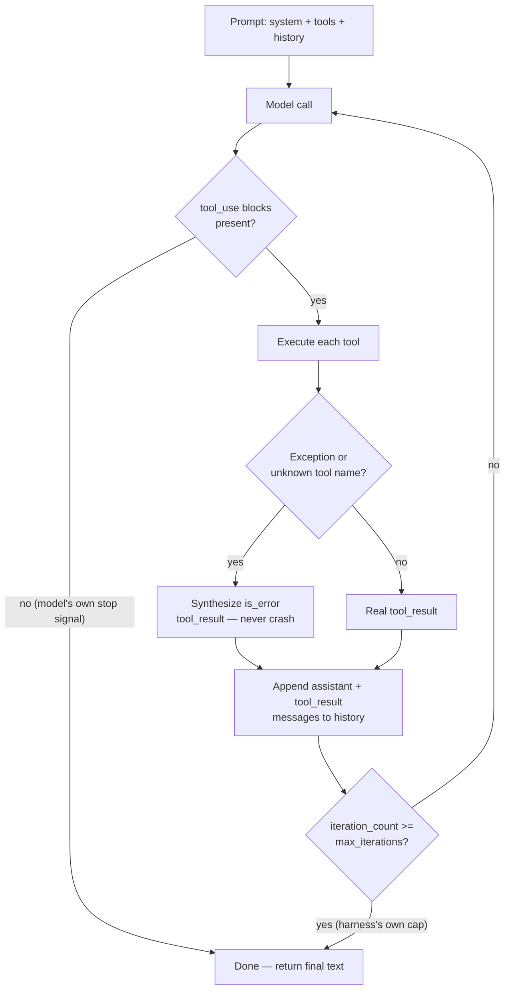

> Research tool-use agent loop implementations. How-to, examples, design patterns, and pitfalls. My focus is to implement a minimal on-device agent harness with restricted number of tools (camera app unit features) and structured output for displaying sentences.

## Short answer

- **Don't build a loop by default.** For a fixed, single-digit camera tool set (shutter, zoom, flash, focus, exposure compensation, white balance, self-timer, aspect ratio, scene mode), the right shape is a **single constrained decode**: the model emits either exactly one tool call or plain text, never both, never a chain. This is the "router" pattern, not ReAct or plan-then-execute — those earn their cost only when a request plausibly needs several *sequentially dependent* tool calls, which single camera commands almost never do. Reserve a capped loop (2–3 turns) for the rare compound command.
- **Force the tool call, never the sentence.** The mechanism that actually holds up on-device is *lazy/triggered grammar-constrained decoding* (llama.cpp's `grammar_lazy` + `grammar_triggers`, independently converged on by vLLM's `structural_tag` and XGrammar-2's `TriggeredTags`): the model generates unconstrained text until it emits a trigger string, after which a JSON-Schema-derived grammar locks every following token. This gives a hard structural guarantee on the tool call while leaving the natural-language final answer completely free — which is exactly the two output shapes this harness needs.
- **Never let the model narrate what it didn't do.** The single highest-severity, best-evidenced pitfall for a harness that renders tool outcomes as sentences is the model claiming success on a tool call that never fired, or never fired correctly. The displayed sentence must be templated from the actual tool result, not freely generated by the model in the same turn.
- **The harness, not the model, owns termination.** Copy the separation in Anthropic's own tool-runner: "no tool_use block" is the model's *natural* stop signal; a hard iteration cap and a consecutive-identical-failure breaker are the harness's *independent* safety stops. Never conflate the two.
- **Context is the real on-device constraint, not compute.** A realistic 9-tool camera schema costs roughly 500–1,000 tokens depending on formatting — negligible against a 32K-context model, but 14–24% of a 4,096-token model's window before a single turn of conversation. Since the tool set is fixed, this cost should be paid once per session (a cached shared prefix), never re-paid every turn.
- **On the runtime this app already targets (LiteRT-LM on Android), the loop is entirely application code.** No on-device runtime surveyed — llama.cpp, LiteRT-LM, MLC LLM, ExecuTorch — ships a complete "declare tools → execute → loop the result back" harness. LiteRT-LM has real MCP-based tool calling and an incrementally-diffed conversation API, but no grammar-constrained decoding layer and no coordinated KV-cache eviction policy; llama.cpp has the more mature structural guarantees but ships as a server-shaped library, not an Android-native one.

## Loop anatomy: the minimal correct control flow

The clearest primary source for "what does a correct tool-use loop actually do" is Anthropic's own SDK tool runner — not because this harness will run on Anthropic's API, but because it is real, shipped, production code implementing exactly the five-stage loop the question asks about, and its termination logic is worth copying regardless of which model sits behind it.

Read from `anthropic-sdk-python`, `src/anthropic/lib/tools/_beta_runner.py`, class `BaseSyncToolRunner.__run__` (and its structural twin in `anthropic-sdk-typescript`'s `BetaToolRunner.ts`):

The five stages map onto real functions: `_handle_request()` calls the model with the full accumulated `messages` list (nothing is summarized unless a compaction feature is explicitly configured); `_generate_tool_call_response()` filters for `tool_use` blocks — zero blocks is the model's own "I'm done" signal, returning `None`; each tool is looked up by name and executed, with three explicit outcomes — success, a caught `ToolError`, or any other exception — all folded into a `tool_result` block, **never** a crash; `append_messages()` appends both the assistant's call and the synthesized result, which is what grows context every turn; and the loop's `while not self._should_stop()` check is a pure iteration counter (`self._iteration_count >= self._max_iterations`) that does nothing at all unless the caller explicitly sets a cap.

**Who owns each termination condition** — this is the load-bearing distinction:

| Termination trigger | Owner | Evidence |
|---|---|---|
| Model emits no `tool_use` blocks | **Model's own decision** | `_beta_runner.py:326-327`, loop returns |
| `stop_reason == "refusal"` | Model's decision, harness treats as terminal by policy ("executing tool_use blocks would fire side effects the model never confirmed") | `_beta_runner.py:279-281` |
| `iteration_count >= max_iterations` | **Caller-set hard cap**, harness enforces | `_beta_runner.py:125-128`; default is `None` — no cap unless the caller sets one |
| `stop_reason == "max_tokens"` with a truncated tool call | **Neither** — documented as a caller-must-detect-and-retry case, not runner-handled | [Anthropic docs, "Handling stop reasons"](https://platform.claude.com/docs/en/build-with-claude/handling-stop-reasons) |

The design lesson for a minimal on-device harness: keep these two concerns in two separate, small functions — "did the model call a tool this turn" (natural stop) and "have we hit the safety ceiling" (hard stop, harness-owned, independent of model judgment) — never merge them into one condition. That separation is what everything else in this report (the recommendation section especially) builds on.

## Design patterns: named, sourced, and when each earns its cost

Five patterns are named in the literature. Only some of them are genuinely different *control-flow shapes* — others are prompting styles layered on the identical loop above.

**ReAct** ([Yao et al. 2022, arXiv:2210.03629](https://arxiv.org/abs/2210.03629)) interleaves an explicit `Thought:`/`Action:`/`Observation:` text scratchpad inside free-text generation, letting the model revise its plan after an unpredicted observation. Reading the Anthropic runner's own code confirms it has *no* concept of a "Thought" step at all — native structured tool-calling (below) is the same loop with the scratchpad replaced by a `tool_use` block. **Earns its cost** when the correct tool sequence genuinely isn't knowable in advance (open-ended search/retrieval). **For camera commands it is pure overhead**: the correct next action is usually obvious from current camera state, every extra reasoning token costs real on-device latency, and a visible scratchpad has to be hidden from the user anyway since the app only ever displays clean sentences.

**Function/tool calling** ([OpenAI, June 2023](https://openai.com/index/function-calling-and-other-api-updates/); Anthropic's native `tool_use` blocks) is not a separate shape from ReAct — it's the identical act-or-stop loop with reasoning (if any) moved to a separate, optionally hidden channel. This is the default/floor pattern for the camera use case: a single model call that either calls a tool or doesn't.

**Plan-then-execute** actually names two different things worth not conflating. Plan-and-Solve prompting ([Wang et al., ACL 2023, arXiv:2305.04091](https://arxiv.org/abs/2305.04091)) asks the model to write a plan and solve it *within one generation* — not a multi-call pattern. [LangChain's plan-and-execute agent](https://www.langchain.com/blog) is the real control-flow variant: a Planner call produces a full multi-step plan up front, then Executor call(s) — possibly a smaller/cheaper model — carry it out without re-consulting the planner after each step. **Earns its cost** only when enough sequential steps exist that batching the plan saves real round trips *and* the full plan is knowable before any tool executes. A fixed camera tool set with typically 0–2 calls per utterance never reaches that threshold.

**Router / classifier-first.** No canonical peer-reviewed paper defines this as a control-flow pattern distinct from constrained single-tool-choice (this vault could not find one — flagged honestly rather than inventing a citation). It is, in practice, structured tool-calling forced to emit **at most one** call (e.g. Anthropic's `tool_choice: {type: "any"}`, or a grammar constraining the decode to a 1-of-N discriminated union) with the loop hard-capped at one iteration. **This is the best-fit pattern for the camera harness**: with ≤9 fixed tools, one constrained decode that emits at most one call, rendered to natural language, with no multi-turn machinery at all, satisfies the requirement.

**Reflection / self-critique** ([Shinn et al., "Reflexion," arXiv:2303.11366](https://arxiv.org/abs/2303.11366)) adds an *outer episode loop*: a failed episode's transcript is summarized into verbal feedback and injected into the *next* attempt. It requires a verifiable success/failure signal and a retry budget — neither exists for a live camera command answered in one shot to one user. **Skip it entirely** for this harness; it solves a problem (learning across attempts) a single-turn command doesn't have.

## Structured output: what forces well-formed calls, and what actually holds up on a small model

**The mechanism, at the token level.** llama.cpp's GBNF grammars ([`grammars/README.md`](https://github.com/ggml-org/llama.cpp/blob/master/grammars/README.md), `src/llama-grammar.cpp`) implement a stack-based parser: every possible parse position is tracked simultaneously in `llama_grammar_stacks`, and at each decoding step `llama_grammar_reject_candidates()` masks out any candidate token whose text doesn't match a live grammar terminal. This is **post-hoc logit masking on top of already-computed logits** — pure CPU bookkeeping, no extra GPU/NPU compute — which is why it costs nothing extra on the forward pass and works identically on llama.cpp's official Android/NDK build ([`docs/android.md`](https://github.com/ggml-org/llama.cpp/blob/master/docs/android.md)). The README's own caveat is worth keeping: naive optional-repetition patterns (`x? x? x?...`) can make sampling "extremely slow" — use bounded `x{0,N}` syntax when hand-writing a tool-argument grammar.

**Schema → grammar compilation** happens in `common/json-schema-to-grammar.cpp`, a recursive visitor over the JSON Schema AST: `_build_object_rule()` turns a tool's `{name, arguments}` shape into GBNF rules, and `_generate_union_rule()` emits alternation for `oneOf`/`anyOf` — the exact primitive that would encode a discriminated union of "which of 9 tools, with which flat arguments." Because the camera tool set is fixed, this schema→grammar compilation is a one-time cost at app init, not a per-request one.

**The pattern that actually matches this harness's two output shapes** is **lazy / triggered grammars**, shipped in llama.cpp via [PR #9639](https://github.com/ggml-org/llama.cpp/pull/9639) and exposed server-side as `grammar_lazy` + `grammar_triggers`. In the author's own words: *"Output is completely unconstrained before triggers, and completely constrained after, which allows for `content` vs. `tool_call` outputs."* The model generates freely — this is the final-sentence path — until it emits a model-specific trigger string (e.g. `{"name": "toolN"` for Llama-family models, `[TOOL_CALLS]` for Mistral); the grammar activates only then, guaranteeing every subsequent token conforms to the tool's schema. If the trigger never fires, the turn ends as ordinary unconstrained text with no forced envelope at all. Two independent projects converged on the identical idea: vLLM's `structural_tag` ("follow a JSON schema within a set of specified tags within the generated text") and XGrammar-2's `TriggeredTags` ([blog.mlc.ai](https://blog.mlc.ai/2026/05/04/xgrammar-2-fast-customizable-structured-generation)), which explicitly names this on-device motivation: *"On-device scenarios typically use small models, which benefit from constrained decoding even more than large ones, yet they often lack a Python environment."* — and addresses the no-Python-environment problem via a language-agnostic ABI (TVM-FFI: Python/C++/Rust/JS, PyTorch/JAX/MLX).

This is a materially different — and cheaper — design than wrapping *both* branches in one JSON schema (`oneOf: [ToolCall, FinalAnswer]`): the "just talk normally" branch never has to be forced into any envelope at all, so the grammar-compilation and stack-tracking cost is paid only when a tool call is actually happening.

**Outlines** ([dottxt-ai/outlines](https://github.com/dottxt-ai/outlines)) implements the same regex/CFG-constrained-logit-masking technique, but its documented backends (transformers, llama.cpp-as-backend, vLLM, Ollama, cloud APIs) all presume a Python process with a loaded model — there is no mobile/edge target in the README. **Not directly embeddable in an Android app**; the *technique* is portable via its llama.cpp backend, the *package* is not.

**Small-model reality — does any of this actually matter?** Yes, and it's directly evidenced. The Hammer paper ("Robust Function-Calling for On-Device Language Models via Function Masking," [arXiv:2410.04587](https://arxiv.org/abs/2410.04587)) names three concrete on-device small-model failure modes — malformed JSON/parameter structure, hallucinated function names, and forcing a call when none applies — and states masking-based constrained decoding achieves "near-perfect format compliance" against unconstrained approaches' "high error rates." TinyLLM ([arXiv:2511.22138](https://arxiv.org/abs/2511.22138)), evaluating small models specifically for edge/agentic tasks on BFCL, finds 1–3B models "significantly outperform" sub-1B models, with a best reported ~65.74% overall accuracy after fine-tuning and ~55.62% multi-turn — a real but incomplete floor, reinforcing that structural enforcement (not model scale alone) is what closes the remaining gap. The Berkeley Function-Calling Leaderboard ([gorilla.cs.berkeley.edu/leaderboard.html](https://gorilla.cs.berkeley.edu/leaderboard.html)) formally separates "FC" (native function-calling) from "Prompt" (unconstrained + regex-parsing) methodology precisely because the two produce different reliability — institutional confirmation the distinction is real, though this vault could not scrape its exact numeric small-model deltas (JS-rendered page). One caution worth keeping ([arXiv:2607.02595](https://arxiv.org/abs/2607.02595)): some measured "structured output" gains are format-compliance artifacts rather than genuine tool-choice-skill gains — a grammar fixes *whether the call parses*, not *whether the model chose the right tool or arguments*; those need separate evaluation.

Concretely for Gemma-family models (this app's target per [Google AI Edge Gallery](/wiki/google-ai-edge-gallery/)'s allowlist): [`ggml-org/llama.cpp` #21680](https://github.com/ggml-org/llama.cpp/issues/21680) and [#21384](https://github.com/ggml-org/llama.cpp/issues/21384) document Gemma 4 corrupting *nested* and *array-typed* tool arguments (merged quote keys, double-encoded arrays) — failures that cluster specifically around non-flat argument shapes. **A fixed camera tool set should therefore use flat scalar/enum arguments** (`{tool: "set_exposure", value: -1}`, not nested objects), both because camera controls genuinely are flat and because it sidesteps a documented failure class for exactly this model family.

## Restricted tool sets: what changes at single-digit scale

With an open-ended tool set, a full multi-turn loop earns its cost because the model may need to discover which tools exist, in which order, based on what earlier calls reveal. None of that applies once the tool set is fixed, small, and known in advance: the "which of N discrete actions" decision is a classification problem, not a planning problem, and — per the router discussion above — a single constrained decode that emits at most one call from the fixed set is sufficient for the overwhelming majority of camera commands ("turn on flash," "zoom in," "use portrait mode"). A loop only earns its keep for genuinely compound commands ("brighter, and use the timer") — rare enough that capping it at 2–3 turns as an escalation path, rather than the default shape, is the right budget.

The tool-definition style matters at this scale precisely because the definitions are a fixed, recurring cost (see the context-budget arithmetic below): flat, enum-heavy schemas are both cheaper to encode as tokens and the documented safer shape for a small model's argument generation (Gemma 4's nested/array JSON failures, above).

## On-device constraints: context budget, prefill/decode cost, and KV-cache reuse

**Per-turn latency, worked from Google's own published LiteRT-LM numbers.** Using `wall_clock_per_turn = context_tokens / prefill_rate + output_tokens / decode_rate` against the Galaxy S26 Ultra Gemma-4-E2B figures already in [Google AI Edge Gallery](/wiki/google-ai-edge-gallery/) (GPU: prefill 3,808 tok/s / decode 52 tok/s; CPU: prefill 557 tok/s / decode 47 tok/s — [developers.google.com/edge/litert-lm/overview](https://developers.google.com/edge/litert-lm/overview), v0.14.0), treated as a roofline ceiling per on-device-llm-inference, not a measurement:

| Context (tok) | GPU, short tool-call (~30 tok out) | GPU, long sentence (~100 tok out) | CPU, short | CPU, long |
|---|---|---|---|---|
| 500 | 0.71 s (decode-bound) | 2.05 s (decode-bound) | 1.54 s (**prefill**-bound) | 3.03 s (decode-bound) |
| 1,000 | 0.84 s | 2.19 s | 2.43 s (**prefill**-bound) | 3.92 s |
| 2,000 | 1.10 s | 2.45 s | 4.23 s (**prefill**-bound) | 5.72 s (**prefill**-bound) |

The crossover point where re-prefilling the growing conversation starts to dominate wall clock over decode is `output_tokens × (prefill_rate / decode_rate)`: **~2,200 tokens on GPU, ~356 tokens on CPU** for a 30-token tool-call response. A fixed single-digit tool set with short outputs stays comfortably under the GPU crossover — decode speed, not re-prefill, is the primary lever there — but **CPU-backend turns are prefill-bound almost immediately**, meaning naive full-history re-prefill is the wrong architecture for any CPU fallback path unless prefix caching (below) is used.

**Context budget for the tool schema itself.** A realistic 9-tool camera schema (`capture_photo`, `set_zoom`, `set_flash`, `set_focus`, `set_exposure_compensation`, `set_white_balance`, `set_self_timer`, `set_aspect_ratio`, `set_scene_mode`), tokenized with a GPT-family tokenizer as an order-of-magnitude proxy (not Gemma's actual SentencePiece tokenizer — flagged as an approximation), costs **~969 tokens pretty-printed / ~564 tokens compact JSON**. Against Gemma 3n's 4,096-token context (the smallest in the Gallery allowlist), that's **14–24% of the entire window before a single turn of history** — not negligible. Against Gemma 4's 32,000-token context, it's under 2% — a rounding error. **The choice between Gemma 3n and Gemma 4 materially changes whether the tool schema is a real budget constraint.**

**KV-cache reuse across turns — this is the single most load-bearing fact for whether a multi-turn loop is viable at interactive latency, and the picture differs sharply by runtime:**

- **llama.cpp** (`tools/server/`) has the most mature, explicit mechanism: `cache_prompt` (default **true**) reuses the KV cache for any shared leading prefix; `--cache-reuse N` extends this to mid-sequence chunk matching; `/slots/{id}?action=save|restore` persists a session's cache to disk. `--system-prompt-file` explicitly caches a shared system prompt across all sessions — exactly the shape of a fixed tool-definition block. This is HTTP-server-shaped, though: an app embedding llama.cpp as a JNI library (not spinning up a server) gets the underlying `llama_context`'s resident KV cache for free but must itself track how much of the current context is already cached and submit only the delta — simpler than the server's multi-slot matching problem for a single-session agent, not harder.
- **LiteRT-LM** (the Android-native runtime this app's ecosystem already surveys) — its `Conversation`/`Session` API ([`docs/api/cpp/conversation.md`](https://github.com/google-ai-edge/LiteRT-LM/blob/main/docs/api/cpp/conversation.md)) is explicitly designed to extract and send only the *new* portion of the prompt template on each `SendMessage()` call, strong indirect evidence the KV cache persists between turns — but this vault could not find an explicit doc sentence stating that guarantee outright (flagged as inferred from API design, not confirmed). What *is* confirmed: raw KV-cache primitives (`SaveCheckpoint`, `RewindToCheckpoint`, `ClearKVCache`, `DeleteTokensFromKvCache`) exist with **no coordinating eviction policy** ([LiteRT-LM #1878](https://github.com/google-ai-edge/LiteRT-LM/issues/1878), open) — which is the root cause behind the unbounded-KV-growth crash already documented in [Google AI Edge Gallery](/wiki/google-ai-edge-gallery/) as Gallery issue #856. **A harness built on LiteRT-LM must implement its own context-window eviction**, e.g. dropping old tool-call/result pairs once nearing the model's context limit.
- **MLC LLM**'s server engine has the most sophisticated *automatic* reuse — a `PagedRadixTree` prefix cache (`--prefix-cache-mode radix`) — but this vault could not confirm whether that applies to MLC's mobile JNI wrapper (`mlc4j`) or only its server deployment path (flagged unverified).
- **ExecuTorch** has an explicit, named multi-turn continuation primitive, `generate_from_pos()` — "starting generation from a specific position in the KV cache... for continuing generation from a previous state" ([docs.pytorch.org](https://docs.pytorch.org/executorch/stable/llm/run-with-c-plus-plus.html)) — correcting a stale secondary claim that ExecuTorch lacks attention caching.

None of this changes the verdict already on record in on-device-llm-inference: no runtime here ships a complete agent harness. KV-cache reuse is a serving-layer latency optimization underneath wherever the tool-execution loop lives — it does not substitute for writing the loop, but it is the difference between a multi-turn design being interactively viable or not.

## Pitfalls: concrete failure modes with evidence

**Infinite/runaway loops.** Documented across multiple frameworks: an agent repeatedly re-invoking the same tool with rephrased input instead of concluding after a successful result ([Mintplex-Labs/anything-llm #4901](https://github.com/Mintplex-Labs/anything-llm/issues/4901)); a recursion-limit kill with no loop or repetition detection ([bytedance/deer-flow #1055](https://github.com/bytedance/deer-flow/issues/1055)); local (non-frontier) models specifically prone to repeated/infinite tool loops ([agent0ai/agent-zero #1551](https://github.com/agent0ai/agent-zero/issues/1551)). The common root cause reported: an ambiguous, non-terminal tool result phrasing ("may need adjustment") reads to the model as incomplete, prompting a retry — direct implication that camera tool results must be worded as unambiguous and terminal ("Flash: ON.", not "Flash setting updated, may need adjustment"). This is exactly why the harness-owned hard iteration cap from the loop-anatomy section is non-negotiable, independent of model judgment.

**Hallucinated tool names.** A model inventing a plausible-sounding tool not in the actual list is observed even in frontier-adjacent models ([sgl-project/sglang #11473](https://github.com/sgl-project/sglang/issues/11473); [SolaceLabs/solace-agent-mesh #1261](https://github.com/SolaceLabs/solace-agent-mesh/issues/1261); [google/adk-python #4173](https://github.com/google/adk-python/issues/4173)). The Anthropic runner's own defense — an unknown tool name becomes a synthesized `is_error` result, never a crash (`_beta_runner.py:332-350`) — is the pattern to copy; with only 9 fixed tools this is a real, expected failure mode, not an edge case.

**Malformed JSON arguments from a small model**, with Gemma-specific evidence already cited above ([llama.cpp #21680](https://github.com/ggml-org/llama.cpp/issues/21680), [#21384](https://github.com/ggml-org/llama.cpp/issues/21384)) and a third case where long tool-definition system prompts trigger mixed-quote-style corruption ([#20359](https://github.com/ggml-org/llama.cpp/issues/20359)) — another argument for keeping the fixed tool set's schema small and flat. A documented mitigation layer is JSON-repair-before-parse ([openclaw/openclaw #9916](https://github.com/openclaw/openclaw/issues/9916)).

**Context growth per turn**, confirmed directly from source rather than a marketing multiplier: `append_messages()` unconditionally appends the full tool_use and tool_result content every iteration, and every model call resends the entire accumulated `messages` list — architecturally full-resend, not delta (`_beta_runner.py:111-123`). Quantitative "Nx cost" claims found in secondary blog sources were not independently verifiable and are explicitly not cited as fact here. What is verifiable: Anthropic's own SDK ships automatic-compaction machinery triggered by a token threshold specifically because unbounded append-only history is a recognized production problem — evidence from the primary source's own design, not from a blog's number. For a ≤4K–32K-context on-device model with single-digit tools, the practical fix is smaller than porting compaction: keep tool_result content minimal and templated, and keep `max_iterations` small enough (2–3) that compaction is never needed.

**Error results poisoning the loop.** A documented pattern of an agent retrying the identical failing call four times with the identical error, with a proposed mitigation of disabling tool calls after N (default 3) consecutive identical failures and falling back to text-only ([openclaw/openclaw](https://github.com/openclaw/openclaw)). This should be a harness-owned safety mechanism analogous to the iteration cap, not left to model judgment — track consecutive-identical-failure count per tool and short-circuit to a natural-language "I couldn't do that" response after 2–3 repeats.

**Silent no-op tool calls — the highest-severity pitfall for this specific app.** Documented cases of a model's narrated text claiming a tool executed successfully while no `tool_use` block was actually emitted, or the tool silently failing with the error swallowed rather than surfaced ([openclaw/openclaw #40069](https://github.com/openclaw/openclaw/issues/40069), [#11284](https://github.com/openclaw/openclaw/issues/11284); [langchain-ai/langchain #36349](https://github.com/langchain-ai/langchain/issues/36349)). Because this harness's entire job is rendering tool outcomes as sentences the user reads and trusts, a divergence between "what the model says happened" and "what actually happened" is a **user-visible lie**, not an internal bookkeeping bug. This is the strongest argument in the whole report for templating the confirmation sentence from the real tool result rather than letting the model free-generate it.

## Recommendation: a minimal harness for the fixed camera tool set

Putting the above together, opinionated and specific:

1. **Shape: single constrained decode by default, no loop.** One model call per user utterance. The model emits either one tool call (grammar-locked) or plain text (unconstrained) — never both, never a sequence, unless the harness explicitly detects a compound command and escalates to a hard-capped 2–3-turn loop. This is the router pattern, and it is sufficient for the near-totality of camera commands.
2. **Structured output: lazy/triggered grammar constraining, if the runtime allows it; flat schemas regardless.** If the harness runs on llama.cpp (embedded, not the HTTP server), compile the 9-tool JSON Schema to a GBNF grammar once at app init and wire it as a lazy/triggered grammar so the model's default output stays free text and only locks into schema-valid JSON after a trigger token. If the harness stays on LiteRT-LM (this app's ecosystem default per prior research), there is no equivalent grammar layer today — use its native MCP-based "Agent Skills" tool calling and add a validate-then-repair step (`jsonrepair`-style) as a fallback, since the runtime offers no hard structural guarantee. Either way: keep every tool's arguments flat scalars/enums, never nested objects or arrays — this is a documented Gemma-family failure mode, not a style preference.
3. **Never let the model narrate the outcome.** The sentence rendered to the user is templated from the actual tool_result payload the harness receives back from executing the call — "Flash turned on." only appears if the flash tool actually returned success. The model's job is choosing the tool and arguments (and, when no tool applies, composing the free-text reply); the harness's job is confirming what really happened.
4. **Termination and safety are harness-owned, never inferred from model judgment**: a hard iteration cap (2, escalating to 3 only for a detected compound command), a consecutive-identical-tool-failure breaker (2–3) that falls back to a text-only "I couldn't do that," and an unknown-tool-name / tool-exception path that always produces a structured error rather than a crash.
5. **Pay the tool-schema token cost once, not every turn.** Cache the fixed tool definitions as a shared prefix across the session (llama.cpp's `cache_prompt`/`--system-prompt-file` equivalent, or rely on LiteRT-LM's incremental `Conversation` design) rather than re-submitting ~500–1,000 tokens of tool schema on every turn. If choosing between Gemma 3n (4,096 context) and Gemma 4 (32,000 context) for this app, prefer the larger-context model unless memory/latency forces the smaller one — the schema tax is a rounding error on the larger context and a real constraint on the smaller one.
6. **Budget for CPU fallback separately from GPU.** The GPU path stays decode-bound (the cheap regime) for any realistic camera-command context length; the CPU path becomes prefill-bound almost immediately (~356 tokens). If the harness must support a CPU-only fallback device, prefix caching is not optional there — without it, CPU-backend turns will not feel interactive.
7. **If the app ever needs true multi-step commands, add Reflexion-style retry last, not first** — and only if a verifiable, synchronous success signal exists (it typically doesn't for a live camera action seen once by one user), which is a strong argument for not building it at all for this product.

## Sources

- on-device-llm-inference — decode-is-bandwidth-bound roofline, runtime-support-is-three-claims survey, and the "no runtime ships a full agent harness / the chat template is the real interface" finding this report builds directly on.
- [Google AI Edge Gallery](/wiki/google-ai-edge-gallery/) — the Gemma-4-E2B multi-platform benchmark table, LiteRT-LM's MCP-based Agent Skills tool calling, and Gallery issue #856 (unbounded KV growth) used throughout the on-device-constraints section.
- [LLM inference on Android](/wiki/android-llm-inference/) — the Android runtime landscape and Galaxy S26 Ultra framing this report's arithmetic reuses.
- Anthropic, `anthropic-sdk-python` — [`src/anthropic/lib/tools/_beta_runner.py`](https://github.com/anthropics/anthropic-sdk-python), and `anthropic-sdk-typescript`'s `BetaToolRunner.ts` — the loop-anatomy primary source.
- Anthropic docs, ["Handling stop reasons"](https://platform.claude.com/docs/en/build-with-claude/handling-stop-reasons).
- Yao et al., ["ReAct: Synergizing Reasoning and Acting in Language Models,"](https://arxiv.org/abs/2210.03629) arXiv:2210.03629.
- OpenAI, ["Function calling and other API updates,"](https://openai.com/index/function-calling-and-other-api-updates/) June 2023.
- Wang et al., ["Plan-and-Solve Prompting,"](https://arxiv.org/abs/2305.04091) ACL 2023, arXiv:2305.04091.
- Shinn et al., ["Reflexion: Language Agents with Verbal Reinforcement Learning,"](https://arxiv.org/abs/2303.11366) arXiv:2303.11366.
- ggml-org/llama.cpp — [`grammars/README.md`](https://github.com/ggml-org/llama.cpp/blob/master/grammars/README.md), `src/llama-grammar.cpp`, [`common/json-schema-to-grammar.cpp`](https://github.com/ggml-org/llama.cpp/blob/master/common/json-schema-to-grammar.cpp), [PR #9639](https://github.com/ggml-org/llama.cpp/pull/9639) (lazy grammars), [`docs/android.md`](https://github.com/ggml-org/llama.cpp/blob/master/docs/android.md), [`tools/server/README.md`](https://github.com/ggml-org/llama.cpp/blob/master/tools/server/README.md) (`cache_prompt`, `--cache-reuse`, slot save/restore); issues [#21680](https://github.com/ggml-org/llama.cpp/issues/21680), [#21384](https://github.com/ggml-org/llama.cpp/issues/21384), [#20359](https://github.com/ggml-org/llama.cpp/issues/20359).
- dottxt-ai/outlines — [github.com/dottxt-ai/outlines](https://github.com/dottxt-ai/outlines).
- mlc-ai/xgrammar and XGrammar-2 — [blog.mlc.ai/2026/05/04/xgrammar-2-fast-customizable-structured-generation](https://blog.mlc.ai/2026/05/04/xgrammar-2-fast-customizable-structured-generation).
- Hammer, ["Robust Function-Calling for On-Device Language Models via Function Masking,"](https://arxiv.org/abs/2410.04587) arXiv:2410.04587.
- TinyLLM, ["Evaluation and Optimization of Small Language Models for Agentic Tasks on Edge Devices,"](https://arxiv.org/abs/2511.22138) arXiv:2511.22138.
- Berkeley Function-Calling Leaderboard — [gorilla.cs.berkeley.edu/leaderboard.html](https://gorilla.cs.berkeley.edu/leaderboard.html).
- ["Attributing Structured-Output Gains in Function Calling,"](https://arxiv.org/abs/2607.02595) arXiv:2607.02595.
- vLLM `structural_tag` — [docs.vllm.ai/en/latest/features/structured_outputs](https://docs.vllm.ai/en/latest/features/structured_outputs/).
- LiteRT-LM — [`docs/api/cpp/conversation.md`](https://github.com/google-ai-edge/LiteRT-LM/blob/main/docs/api/cpp/conversation.md), [api_overview](https://developers.google.com/edge/litert-lm/api_overview), [issue #1878](https://github.com/google-ai-edge/LiteRT-LM/issues/1878), [overview benchmark table](https://developers.google.com/edge/litert-lm/overview).
- MLC LLM server deployment (`--prefix-cache-mode radix`, `PagedRadixTree`) — via [DeepWiki summary](https://deepwiki.com/mlc-ai/mlc-llm/7.2-server-deployment), MLC's own docs not independently confirmed for this detail.
- ExecuTorch — [`docs.pytorch.org/executorch/stable/llm/run-with-c-plus-plus.html`](https://docs.pytorch.org/executorch/stable/llm/run-with-c-plus-plus.html) (`generate_from_pos`).
- GitHub issues on loop/pitfall evidence: [bytedance/deer-flow #1055](https://github.com/bytedance/deer-flow/issues/1055), [Mintplex-Labs/anything-llm #4901](https://github.com/Mintplex-Labs/anything-llm/issues/4901), [agent0ai/agent-zero #1551](https://github.com/agent0ai/agent-zero/issues/1551), [sgl-project/sglang #11473](https://github.com/sgl-project/sglang/issues/11473), [SolaceLabs/solace-agent-mesh #1261](https://github.com/SolaceLabs/solace-agent-mesh/issues/1261), [google/adk-python #4173](https://github.com/google/adk-python/issues/4173), [openclaw/openclaw #9916](https://github.com/openclaw/openclaw/issues/9916), [#40069](https://github.com/openclaw/openclaw/issues/40069), [#11284](https://github.com/openclaw/openclaw/issues/11284), [langchain-ai/langchain #36349](https://github.com/langchain-ai/langchain/issues/36349), [QwenLM/qwen-code #5760](https://github.com/QwenLM/qwen-code/issues/5760).
- This vault's sibling repository, `camera/spec/product.md` and `camera/spec/README.md` (internal, unpublished) — the camera app's actual feature set and category model, used to ground the "single-digit fixed tool set" framing throughout.
