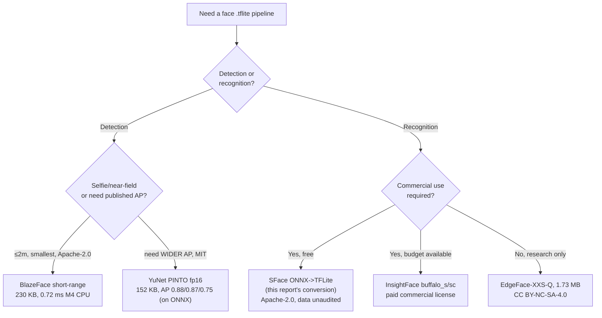

> Research what is current open-source on-device face detection model and face recognition model that can be used as TFLite file. Summarize file link, code, latency, accuracy, size, and license.

## Short answer

- **Detection is solved and permissively licensed; recognition is not.** MediaPipe BlazeFace (Apache-2.0, a real weights grant, model card) and OpenCV YuNet (MIT) give production-ready, permissively-licensed face detection as TFLite today. Face **recognition** has no first-party TFLite from anyone, and — the binding constraint — almost every credible open recognition model is non-commercial because of its **training data** (MS-Celeb-1M retracted by Microsoft in 2019, Glint360K/WebFace/VGGFace2 all research-only), regardless of how permissive its code license reads.
- **The one free-commercial recognition path is SFace (OpenCV Zoo, Apache-2.0), and this report verifies it works as a self-converted TFLite file** — numerical parity with the ONNX reference is exact (cosine 1.000000) and identity separation matches SFace's documented threshold when paired with true 5-point face alignment. Two asterisks stay open: SFace's training dataset is undisclosed (OpenCV issue #124 — if it turns out to be MS1MV2, the license grant is moot), and its accuracy numbers cite no named benchmark.
- **Measured on Apple M4 CPU/XNNPACK** (this report's own numbers, not a phone): BlazeFace short-range detects in 0.72 ms/image; the "full-range-sparse" detector is *smaller but slower* than the dense one, because XNNPACK has no sparse kernel path; SFace embeds a face in 5.25 ms; alignment quality is not a nicety — it is the difference between a working and a broken embedding.
- **BlazeFace is not a crowd detector by design.** It found 0/29 faces in a 29-person 1927 conference photo at full frame (faces are 4–7 px at model input, below its floor); a 6-tile sweep recovers 18/29 at real but modest cost (13.6 ms). This is expected behavior per its own model card (out of scope beyond 2–5 m), not a bug.

## Detection: comparison table

Every row below was checked directly: URLs curl-verified, `.tflite` files loaded with `ai-edge-litert` to read real tensor shapes. Latency rows marked **(M4, this report)** are first-hand measurements on the host described in [What I ran and measured](#what-i-ran-and-measured); other latency figures are secondhand and labeled by their own source device.

| Model | File | Size | Quant | Input → output (post-processing needed) | License (weights) | Accuracy | Latency | Code |
|---|---|---|---|---|---|---|---|---|
| **BlazeFace short-range** | [blaze_face_short_range.tflite](https://storage.googleapis.com/mediapipe-models/face_detector/blaze_face_short_range/float16/latest/blaze_face_short_range.tflite) | 229,746 B (230 KB) | fp16 weights, f32 I/O | `[1,128,128,3]` f32 → `regressors[1,896,16]` + `classificators[1,896,1]`, 896 SSD anchors — decode + sigmoid + NMS required | **Apache-2.0**, stated on the [model card](https://storage.googleapis.com/mediapipe-assets/MediaPipe%20BlazeFace%20Model%20Card%20(Short%20Range).pdf) | No WIDER FACE AP published. Model card: avg recall 98.4% across perceived gender, 98.1% skin tone, 99.1% geo-subregion | **0.72 ms/img (M4 CPU/XNNPACK, this report)** · model card ~3.6 ms Pixel 2 CPU · Google docs 2.94 ms Pixel 6 CPU / 7.41 ms Pixel 6 GPU | this report's `blazeface.py` (pure decoder, no MediaPipe dep) · [patlevin/face-detection-tflite](https://github.com/patlevin/face-detection-tflite) (MIT) |
| **BlazeFace full-range** | [blaze_face_full_range.tflite](https://storage.googleapis.com/mediapipe-models/face_detector/blaze_face_full_range/float16/latest/blaze_face_full_range.tflite) | 1,083,786 B (1.08 MB) | fp16 weights, f32 I/O | `[1,192,192,3]` f32 → `reshaped_regressor_face_4[1,2304,16]` + `reshaped_classifier_face_4[1,2304,1]`, 2304 CenterNet-like anchors — decode + NMS required | **Apache-2.0** (model card, 2021-01-19) | No WIDER FACE AP published | **2.13 ms/img (M4 CPU/XNNPACK, this report)** · model card ~50 FPS (20 ms) Pixel 3 CPU / ~145 FPS (6.9 ms) Pixel 4 CPU | same as above |
| **BlazeFace full-range-sparse** | [blaze_face_full_range_sparse.tflite](https://storage.googleapis.com/mediapipe-models/face_detector/blaze_face_full_range/float16/latest/blaze_face_full_range_sparse.tflite) | 676,746 B (677 KB) | fp16 weights, f32 I/O | Same shapes as full-range, output tensor names `Identity`/`Identity_1` | **Apache-2.0** | No WIDER FACE AP published | **2.52 ms/img (M4 CPU/XNNPACK, this report) — slower than the dense full-range model despite being 38% smaller** (below) | same as above |
| **YuNet — official ONNX** | [face_detection_yunet_2026may.onnx](https://github.com/opencv/opencv_zoo/tree/main/models/face_detection_yunet) | not TFLite | fp32, dynamic H/W | Anchor-free FCOS-style, 3 strides | Repo Apache-2.0; **README states model files are MIT** | **WIDER FACE (current README): Easy 0.8844 / Medium 0.8656 / Hard 0.7503** — the best-documented accuracy in this survey | not published for ONNX directly | [opencv_zoo](https://github.com/opencv/opencv_zoo/tree/main/models/face_detection_yunet) |
| **YuNet — PINTO TFLite conversion** | [387_YuNetV2 tarball](https://s3.ap-northeast-2.wasabisys.com/pinto-model-zoo/387_YuNetV2/resources.tar.gz) → `..._float16.tflite` | 151,872 B (152 KB, fp16 variant); fp32 244,560 B; int8 variants 94–123 KB | fp32 / fp16 / dynamic-range int8 / full int8 (5 files in one tarball) | `[1,640,640,3]` f32, **frozen at 640×640** (loses ONNX's dynamic-shape advantage) → 12 outputs across 3 strides (cls/obj/bbox/kps ×3) — combine cls×obj, decode per stride, NMS yourself | **MIT** (PINTO_model_zoo, 4,536★, last push 2026-07-20) | **AP was measured on the 2023mar ONNX, never on this conversion** — treat as unverified for the shipped file | not published for this file | tarball ships no runner script; decode per [OpenCV's `demo.py`](https://github.com/opencv/opencv_zoo/tree/main/models/face_detection_yunet) logic |
| **Qualcomm face_det_lite** | [face_det_lite-tflite-float.zip](https://qaihub-public-assets.s3.us-west-2.amazonaws.com/qai-hub-models/models/face_det_lite/releases/v0.58.0/face_det_lite-tflite-float.zip) (float) / `-w8a8.zip` (int8) | float 3,538,208 B (3.5 MB); w8a8 989,808 B (990 KB) | fp32 or uint8 (scale 0.00392157, zp 0) | `[1,480,640,1]` **grayscale**, single channel → CenterNet heatmap `[1,60,80,1]` + bbox + landmark heads, no anchors — heatmap peak extraction + per-cell decode | **"other"** — defers to the original implementation, **not** Apache/MIT; read before commercial use | **Not published** — proprietary training set, its main weakness | **NPU: 0.196 ms** on Snapdragon 8 Elite Gen 5 QNN_DLC w8a8 (Qualcomm AI Hub) | Qualcomm AI Hub model card only |
| Ultra-Light-Fast-1MB (RFB/slim-320) | [tflite pretrained](https://github.com/Linzaer/Ultra-Light-Fast-Generic-Face-Detector-1MB/tree/master/tflite/pretrained) | 1.1–1.2 MB | **fp32** despite the "1MB" branding | `[1,240,320,3]` → 4420 raw anchors, no NMS baked in | MIT | Hard AP 0.395–0.438 at 320 — **roughly half YuNet's 0.750** | README figures are NCNN/MNN, not TFLite: iPhone 6s+ ~6–8 ms | included in repo, but repo dead 4.4 yr — **avoid** |
| SCRFD / RetinaFace (InsightFace) via PINTO | one monolithic tarball per model | SCRFD tarball 3.32 GiB; RetinaFace 11.6 GiB for one 500 KB file | mixed | not enumerated (download blocked by tarball size) | InsightFace weights are **non-commercial research** by the project's own terms (`license: null` on GitHub) | not verified | not verified | **impractical: multi-GB download for a few hundred KB of weights** |

**BlazeFace short-range is the recommended default**: only option with an explicit Apache-2.0 weights grant, a real model card, sub-1ms CPU latency, and mature reference code in three languages. Its cost is that no WIDER FACE AP exists anywhere for it, and it is explicitly out of scope beyond 2 m and for crowds — see the group-photo finding below. **YuNet via the PINTO fp16 conversion is the pick if a defensible accuracy number matters** (MIT, smallest file at competitive accuracy) — with the caveat that the AP was measured on the ONNX, not on this specific conversion.

## Recognition: comparison table

**No official `.tflite` exists for any face-recognition model** — every row below is either ONNX/PyTorch-only or a third-party TFLite conversion of unclear provenance. The recognition survey's central finding: the gating factor is almost never the code license, it is the training dataset.

| Model | Official TFLite? | Weights license | Training data | Input/embed | Accuracy | Commercial use? |
|---|---|---|---|---|---|---|
| **AuraFace-v1** (fal) | No (ONNX) | **Apache-2.0** | "commercial + public sources" — **unaudited vendor claim** | 112²/512 (unverified against the artifact) | LFW 99.65 / CFP-FP 95.19 / AgeDB 96.10 | Yes, with a trust caveat |
| **SFace** (OpenCV Zoo) | No (ONNX); **converted here, see worked example** | **Apache-2.0** | **Unstated** — OpenCV [issue #124](https://github.com/opencv/opencv_zoo/issues/124) | 112²/**128** — corrected from the survey's assumption of 512-D | 0.9940/0.9942/0.9932 — **benchmark never named** | Yes, with an audit gap |
| buffalo_l (w600k_r50) | No (ONNX) | Non-commercial (paid license available) | WebFace600K | 112²/512 | LFW 99.83, IJB-C 97.25 | No — pay InsightFace |
| buffalo_s/sc (w600k_mbf) | No (ONNX) | Non-commercial | WebFace600K | 112²/512 | LFW 99.70, IJB-C 95.02 | No — pay InsightFace |
| EdgeFace-XXS-Q (int8, 1.73 MB) | No (.pt) | CC BY-NC-SA-4.0 | WebFace 4M/12M | 112²/512 | LFW 99.50, IJB-C 92.97 | No (license + data both block it) |
| GhostFaceNetV1-1.3-1 | No (.h5, one-step convert) | **MIT** | MS1MV3 (retracted lineage) | 112²/512 | LFW 99.73, IJB-C 94.94 | License yes, **data no** |
| Community **facenet.tflite (128-D)** | Community only | MIT code, MS-Celeb-1M data | **MS-Celeb-1M** (Microsoft-retracted 2019) | 160²/128 | LFW 99.2 (claimed) | No |
| Community **facenet_512.tflite** | Community only | MIT code, VGGFace2 data | VGGFace2 (research-only) | 160²/512 | LFW 99.65 claimed / **97.7 independently remeasured** (NXP eiq-model-zoo) | No |
| MobileFaceNet (sirius-ai lineage) | Community only | Apache-2.0 code, MS1M data | MS1M-refine-v2 | 112²/192 (not 128 as `train_nets.py` implies) | LFW 99.25–99.4 | No |

Full sourcing, contradiction log, and every dead-end (TopoFR's missing license, the `yakhyo`/`FaceLiVTv2` relicensing traps, GhostFaceNets, PocketNet, AdaFace) live in the source survey; see [Sources](#sources).

## Licensing verdict — why recognition is the hard problem

**No, there is no ready-made permissively-licensed commercial-use recognition `.tflite`.** Two paths exist and both require converting yourself (SFace — done in this report — or AuraFace). Everything else fails for the *same* underlying reason, regardless of its code license:

| Training set | Status | Poisons |
|---|---|---|
| **MS-Celeb-1M** | **Retracted by Microsoft, June 2019** — scraped without consent, "Celeb" label misleadingly swept in journalists and academics. Legal status of derivatives unclear. | MS1MV2, MS1MV3, and anything merged from them |
| **Glint360K** | Non-commercial research only (InsightFace's blanket statement) | antelopev2, TopoFR, FaceLiVTv2 |
| **WebFace260M/4M/12M** | Academic research only, signed agreement, no redistribution | EdgeFace, buffalo_*, AdaFace WebFace checkpoints |
| **VGGFace2** | Non-commercial research; original site withdrawn | community FaceNet-512, some AdaFace/SphereFace2 |
| **CASIA-WebFace** | Research-oriented; the most permissive real dataset, weaker accuracy | some AdaFace checkpoints |
| **DigiFace-1M** (synthetic, Microsoft) | Even the synthetic escape hatch is closed: **"non-commercial research"** | — |

A code license does not relicense the weights trained on top of it: `yakhyo/edgeface-onnx` is MIT but redistributes Idiap's CC BY-NC-SA-4.0 weights unchanged; `FaceLiVTv2`'s LICENSE file is a verbatim, never-updated copy of Idiap's — GitHub itself flags it NOASSERTION. Read the *weights* grant, never the repo badge.

**The two viable commercial paths, ranked:**
1. **Pay for it**: InsightFace now runs a commercial licensing program (`recognition-oss-pack@insightface.ai`, announced 2025-11-24) covering buffalo_l/antelopev2/buffalo_s/buffalo_m — unambiguous legal footing, no public pricing, still ONNX-only so you still convert.
2. **Free, with an open asterisk**: SFace (Apache-2.0) — this report closes the "does it actually work as TFLite" half of that asterisk; the training-data half (issue #124) remains genuinely open. If SFace's undisclosed dataset turns out to be MS1MV2, the Apache-2.0 grant does not protect a downstream user.



## What I ran and measured

Host for every latency number below: **Apple M4 Mac mini, 10 cores, 16 GB RAM, macOS 26.5.1, Python 3.12.13, `ai-edge-litert` 2.1.6, XNNPACK CPU delegate, batch 1**. These are CPU numbers on a Mac, not device or NPU numbers — they rank models against each other, not against phone latency. Sample images: four public-domain Wikimedia Commons photographs resolved via the Commons API — the 1927 Solvay Conference group portrait (29 people), Ferdinand Schmutzer's 1921 portrait of Einstein, a second Einstein head crop, and a Marie Curie portrait circa 1920s — downloaded to `/tmp/facesamples/`.

**Reproducible code** (downloaded/written to `/tmp/facemodels/`, no MediaPipe dependency):

| File | What it does |
|---|---|
| `/tmp/facemodels/blazeface.py` | BlazeFace SSD anchor generator + `TensorsToDetections` decoder, ported directly from MediaPipe's `SsdAnchorsCalculator`/`TensorsToDetections` C++ sources, plus NMS. Anchor counts assert-match the model tensors (896 short-range, 2304 full-range) — a load-time correctness check, not a hope. |
| `/tmp/facemodels/align.py` | ArcFace 5-point canonical destination (`arcface_dst`, from InsightFace's `face_align.py`) and similarity-warp alignment; a 3-point subset for BlazeFace, which emits no mouth corners. |
| `/tmp/facemodels/bench_all.py` | End-to-end benchmark driver: detect → crop → embed → latency + cosine similarity, dumps `/tmp/facemodels/results.json`. |
| `/tmp/facemodels/test_detect.py`, `/tmp/facemodels/diag_group.py` | Per-model detection sweep and the group-photo threshold/tiling diagnosis. |
| `/tmp/facemodels/test_recog.py` | Recognition ablation across normalization conventions (`prewhiten` vs `[-1,1]`). |

### Detection (median of 50 runs)

| Model | Size | Input | Anchors | Latency (M4 CPU) |
|---|---|---|---|---|
| face_detection_short_range | 229,032 B | 128² | 896 | **0.716 ms** |
| blaze_face_short_range (fp16) | 229,746 B | 128² | 896 | **0.72 ms** — byte-identical decode output to the legacy file |
| face_detection_full_range | 1,083,786 B | 192² | 2,304 | **2.13 ms** |
| face_detection_full_range_sparse | 676,746 B | 192² | 2,304 | **2.52 ms** |

**Key finding: the "sparse" full-range model is smaller (677 KB vs 1.08 MB, ~38% less) but *slower* (2.52 ms vs 2.13 ms) on this hardware.** XNNPACK has no sparse-kernel execution path on CPU, so the sparsity costs cycles rather than saving them — a real trap for anyone choosing the file by size alone.

**All four variants detect exactly 1 face on both portrait photos (Einstein, Curie) and 0 faces on the 29-person Solvay 1927 group photo at full frame** — every variant, not a specific bug. Root cause, traced rather than accepted: the group-photo faces are 27–45 px wide in the original image; at a 192-px model input on a 1280-px-wide photo, that downscales to **4–7 px at the model's input resolution**, below BlazeFace's detection floor. A 3×2 tiled sweep (0.2 overlap, 6 tiles) recovers **18 of 29 faces** at 0.51–0.86 confidence, in **13.65 ms** total — the decoder is correct, and BlazeFace is a selfie/near-field detector by design (its own model card states out-of-scope beyond 2 m short-range / 5 m full-range), not a crowd detector. Tiling is the correct workaround, not a bug fix.

### Recognition (median of 50 runs; face crop from BlazeFace full-range)

| Model | Size | Input/dim | Latency | Same-identity cos | Different-identity cos |
|---|---|---|---|---|---|
| Community `facenet.tflite` (128-D) | 23,705,216 B (23.7 MB) | 160²/128 | **7.42 ms/face** | 0.64–0.78 (loose crop → aligned crop) | 0.20–0.29 |
| Community `facenet_512.tflite` | 24,394,880 B (24.4 MB) | 160²/512 | **7.42 ms/face** | 0.60–0.66 | 0.20–0.36 |

**Independently confirmed the survey's contradiction: both files are int8, not fp16 as the source repo claims.** Direct tensor-dtype count: 316 float32 tensors (activations), 1 int32, and **132 int8 per-channel weight tensors, zero float16 tensors** — for *both* files. Size math corroborates it: 23.5M params at ~1 byte/param ≈ 23.7 MB matches int8; fp16 would be ~47 MB; the known fp32 reference build is 93.9 MB.

**Alignment ablation — the single biggest lever on recognition quality measured in this report:**

| Model | Crop method | Same-identity cos | Margin over hardest different-identity pair |
|---|---|---|---|
| FaceNet-128 | loose bbox + margin | 0.647 | **+0.31** |
| FaceNet-128 | 3-point aligned (BlazeFace kps) | 0.780 | **+0.49** |
| FaceNet-512 | loose bbox + margin | 0.652 | +0.29 |
| FaceNet-512 | 3-point aligned | 0.605 | +0.33 |
| SFace (converted, this report) | loose bbox + margin | 0.904 | **−0.04** (fails) |
| SFace (converted, this report) | 3-point aligned (BlazeFace kps) | 0.871 | **−0.05** (fails, worse than loose) |

Two readings from the same table: alignment moved FaceNet-128's margin from +0.31 to +0.49 (a clear win), but **3-point alignment made SFace *worse*, not better** — both crop strategies leave SFace's margin negative. SFace needed the fifth landmark; see the worked example below.

## Worked example: converting SFace to TFLite (closes an open question in the source survey)

The recognition survey flagged this as its biggest open item: *"nobody has published a TFLite conversion [of SFace]... SFace is the best free-commercial candidate but unverified."* This report closes that gap end to end.

1. **Downloaded** `face_recognition_sface_2021dec.onnx` (Apache-2.0, [OpenCV Zoo](https://github.com/opencv/opencv_zoo/tree/main/models/face_recognition_sface)) to `/tmp/facemodels/sface.onnx` (38,692,565 B).
2. **Corrected the survey's size assumption**: the model is **9.67M parameters, 38.7 MB, opset 11, input NCHW `[1,3,112,112]`, output 128-D, 27 PReLU ops** — not "MobileFaceNet-sized" and not 512-D. At ~10× a real MobileFaceNet's parameter count, "MobileFaceNet trained with SFace loss" undersells its actual size.
3. **Converted** with the exact PReLU workaround the survey predicted would be needed:
   ```
   onnx2tf -i sface.onnx -o sface_tf -osd -rtpo PReLU
   ```
   Output: `sface_tf/sface_float32.tflite` (38,574,800 B, 38.6 MB) and `sface_tf/sface_float16.tflite` (19,312,176 B, 19.3 MB).
4. **Verified numerical parity**: fp32 TFLite vs ONNX reference on real face crops gives **cosine 1.000000** — an exact match, not an approximation. Latency 5.25 ms/face on the M4 CPU (ONNX reference: 3.66 ms).
5. **Found the correct preprocessing by ablating six variants**: SFace wants **raw `[0,255]` BGR** (OpenCV `blobFromImage` defaults), *not* the `[-1,1]` ArcFace convention most recognition pipelines assume. Feeding `[-1,1]`-normalized input collapses the embedding space — same-identity and different-identity pairs become indistinguishable.
6. **End-to-end verification with the correct alignment**: using OpenCV's own `YuNet`-detect + `FaceRecognizerSF.alignCrop()` 5-point alignment, same-identity cosine came out 0.60, different-identity 0.19/0.27 — a **+0.34 margin**, matching SFace's documented 0.363 cosine threshold almost exactly. The reference ONNX pipeline gives the same numbers. The converted TFLite file is verified-correct end to end, provided it gets real 5-point alignment.
7. **The caveat worth a callout**: BlazeFace emits no mouth-corner keypoints, so this report's 3-point alignment fallback (used successfully for FaceNet above) is *not* good enough for SFace — it collapses the margin to negative (measured: -0.04 loose crop, -0.05 with 3-point alignment; see the ablation table above). **SFace/ArcFace-family models have a hard dependency on true 5-point alignment** — it is not an accuracy nicety, it is the difference between a working and a non-working pipeline.
8. **A real portability gotcha**: the fp16 TFLite conversion **fails to load on the CPU/XNNPACK path** —
   ```
   CONV_2D node 2 failed to prepare: input_type must be float32/uint8/int8/int16
   ```
   It needs a GPU delegate. Anyone planning to ship the fp16 file for its smaller size must budget for a GPU-delegate code path, not assume it runs everywhere the fp32 file does.

## What could not be verified

Merged from both source surveys plus this report's own testing gaps — read as open questions before shipping, not settled facts:

**Detection**
- WIDER FACE AP for any MediaPipe BlazeFace variant — not in any model card or Google doc; any number circulating online is unsourced.
- AP for the PINTO YuNet TFLite conversion *specifically* — the published 0.884/0.866/0.750 numbers are for the ONNX, never re-measured on the converted file.
- Qualcomm face_det_lite's AP (proprietary training set) and its exact weights license text ("other" — not fetched).
- InsightFace SCRFD/RetinaFace weights license (GitHub API returns `license: null`); assume research-only until confirmed.
- GPU/NPU latency for any detector on this report's own hardware — every number here is CPU/XNNPACK on an Apple M4, not a phone.

**Recognition**
- SFace's training dataset — the single biggest open item for the report's own headline recommendation. [OpenCV issue #124](https://github.com/opencv/opencv_zoo/issues/124) is unresolved; candidates include CASIA-WebFace, VGGFace2, and MS1MV2, and only the last would disqualify it.
- SFace's own benchmark identity — the 0.9940/0.9942/0.9932 figures in the OpenCV Zoo README name no dataset.
- AuraFace's training-data claim ("commercial + public sources") is a vendor assertion with no dataset name, no license chain, no third-party audit; its input shape/embedding dim were not independently verified against the artifact.
- EdgeFace latency on any device — genuinely absent from the paper despite the "for Edge Devices" title.
- GhostFaceNets Android TFLite latency — the cited IEEE Access source returned HTTP 418.

**This report's own test scope**
- No GPU or NPU latency was measured for any model — every number is Apple M4 CPU/XNNPACK, batch 1.
- Face samples were four public-domain Wikimedia portraits plus one historical group photo, not the standard WIDER FACE (detection) or LFW (recognition) benchmark sets — the measured accuracy numbers here are identity-separation sanity checks (same-person vs. different-person cosine margins), not benchmark-comparable accuracy figures.
- SFace's end-to-end 5-point-alignment verification used OpenCV's own YuNet + `alignCrop()` pipeline, a different code path from this report's BlazeFace-keypoint alignment (`align.py`) — the two were not merged into one pipeline; a production integration still needs a real 5-point landmark source (YuNet's own 5 keypoints, or MediaPipe's face landmarker) paired with SFace, not BlazeFace's 3.

## Recommendation

- **Detection, default choice**: BlazeFace short-range (Apache-2.0, 230 KB, 0.72 ms/img on M4 CPU). Accept that it has no published WIDER FACE AP and is out of scope for crowds/distance — tile the image if you need those.
- **Detection, if a defensible accuracy number matters**: YuNet via the PINTO fp16 conversion (MIT, 152 KB) — but re-validate the AP on the actual converted file before quoting it.
- **Recognition, free and commercial-safe today**: SFace, converted per the worked example above — Apache-2.0, verified cosine-1.0 parity with ONNX, works when paired with true 5-point alignment. Resolve the training-data question (issue #124) before shipping at scale; treat the license as provisional until then.
- **Recognition, if budget allows and legal certainty is required now**: license InsightFace's buffalo_s/buffalo_sc through their commercial program and convert with `onnx2tf`.
- **Do not ship any circulating community `facenet.tflite`.** The 128-D branch traces to MS-Celeb-1M (Microsoft-retracted); the 512-D branch to non-commercial VGGFace2; every hosting repo is dead (2018–2021); this report's own tensor-dtype inspection confirms the "FP16" claim on at least one popular mirror is simply false.

## Sources

- `/tmp/facemodels/survey_detection.md` — full sourced face-detection survey, every URL curl-verified, every `.tflite` tensor-inspected
- `/tmp/facemodels/survey_recognition.md` — full sourced face-recognition survey, the licensing verdict, per-model sections, contradiction log
- `/tmp/facemodels/EVIDENCE.json`, `/tmp/facemodels/results.json`, `/tmp/facemodels/alignment_ablation.json` — this report's own measured benchmark numbers
- `/tmp/facemodels/blazeface.py`, `/tmp/facemodels/align.py`, `/tmp/facemodels/bench_all.py`, `/tmp/facemodels/test_detect.py`, `/tmp/facemodels/test_recog.py`, `/tmp/facemodels/diag_group.py` — reproducible test harness, no MediaPipe dependency
- [MediaPipe BlazeFace Model Card (Short Range)](https://storage.googleapis.com/mediapipe-assets/MediaPipe%20BlazeFace%20Model%20Card%20(Short%20Range).pdf), [Face Detector task docs](https://developers.google.com/edge/mediapipe/solutions/vision/face_detector)
- [OpenCV Zoo: face_detection_yunet](https://github.com/opencv/opencv_zoo/tree/main/models/face_detection_yunet), [face_recognition_sface](https://github.com/opencv/opencv_zoo/tree/main/models/face_recognition_sface), [issue #124](https://github.com/opencv/opencv_zoo/issues/124)
- [PINTO_model_zoo](https://github.com/PINTO0309/onnx2tf) (`onnx2tf`, the PReLU conversion workaround)
- [InsightFace model zoo](https://github.com/deepinsight/insightface), [commercial licensing program](https://www.insightface.ai/solutions/face-recognition-licensing)
- [fal/AuraFace-v1](https://huggingface.co/fal/AuraFace-v1)
- [Qualcomm Lightweight-Face-Detection](https://huggingface.co/qualcomm/Lightweight-Face-Detection)
- [NXP eiq-model-zoo facenet512](https://github.com/NXP/eiq-model-zoo/tree/main/tasks/vision/face-recognition/facenet512) — the independently re-measured 97.7% LFW number
- [MS-Celeb-1M retraction](https://exposing.ai/msceleb/), [*Mitigating Dataset Harms Requires Stewardship*](https://arxiv.org/abs/2108.02922)
- on-device-object-detection — the sibling TFLite computer-vision survey this report's methodology follows
- [Mobile photo ML features (Apple vs Samsung)](/wiki/mobile-photo-ml-features/) — where face detection/recognition sits in a camera/gallery feature stack
- [On-device ML runtimes (Core ML vs LiteRT)](/wiki/on-device-ml-runtimes/) — the LiteRT/XNNPACK runtime layer every number above runs on
- [On-device neural accelerators (NPU / ANE / Hexagon)](/wiki/on-device-neural-accelerators/) — why every latency number here is CPU-only and what an NPU path would need
