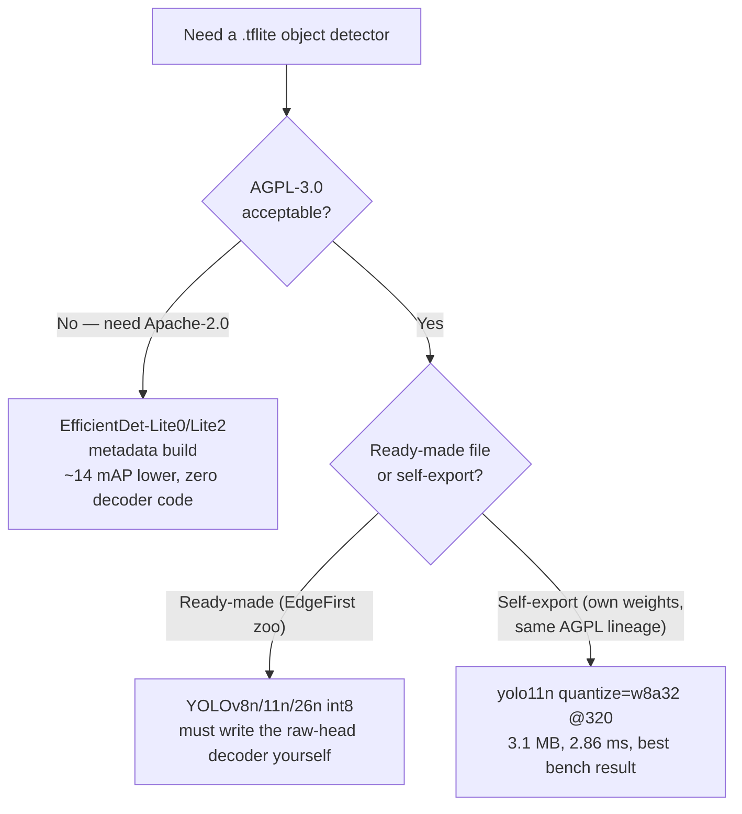

> Research what is the current SOTA open-source on-device object detection model that can be used as a TFLite file. Summarize file link, code, latency, accuracy, size, and license.

## Short answer

- **There is no single SOTA file — there is a license fork, and it is the sharp decision in this survey, not a technical one.** Every ready-made, high-accuracy YOLO `.tflite` (YOLOv8n/YOLO11n/YOLO26n, whether self-exported or pulled from the EdgeFirst zoo) carries **AGPL-3.0** because the weights are Ultralytics-derived. The only pre-built **Apache-2.0** detector family is Google's **EfficientDet-Lite**, at roughly 14 fewer mAP points.
- **Best overall on this bench, if AGPL-3.0 is acceptable:** self-exported **YOLO11n int8 (`quantize=w8a32`) at 320×320** — 3.1 MB, 2.86 ms median `invoke()` on an Apple M4 CPU (2 threads, XNNPACK), correct detections on the test image (bus + 4 people), ~40.9 mAP50-95 fp32 reference ceiling per Ultralytics.
- **Best if you need a permissive license and minimal code:** **EfficientDet-Lite0 int8** from the metadata build (`download.tensorflow.org/models/tflite/task_library/...`) — 4.6 MB, ~6–7 ms on the same M4 bench (29.3 ms on Google's own Pixel 6 CPU reference), 25.7 mAP50-95 @320, Apache-2.0, NMS baked into the graph via `TFLite_Detection_PostProcess` — zero decoder code required.
- **Ultralytics ships no `.tflite` release assets at all.** Getting YOLO11/YOLO26 as TFLite means exporting it yourself through the new `litert-torch` path (`format=litert`, not the removed `format=tflite`), and that export has its own sharp edges (below) that will silently produce garbage detections if missed.
- A Mac CPU is not a phone: the M4 numbers here rank architectures against each other, not against Pixel/Snapdragon latency. Google's published Pixel 6 numbers are the mobile reference point, and they are included below for exactly that reason.

## The landscape: only two sources of ready-made COCO detectors

As of this survey (every URL checked with `curl`), exactly two sources ship a live, ready-to-run COCO-class `.tflite` detector:

| Source | Models | License | Output format |
|---|---|---|---|
| **MediaPipe / LiteRT bucket** (`storage.googleapis.com/mediapipe-models`, `download.tensorflow.org`) | EfficientDet-Lite0/Lite2, SSD MobileNetV2 | **Apache-2.0** | 4-tensor post-processed (NMS in-graph) *only from the metadata builds* — see Finding 1 |
| **EdgeFirst zoo on Hugging Face** (Au-Zone, updated 2026-07-04) | Pre-exported INT8 YOLOv5/v8/11/26 | **AGPL-3.0** (Ultralytics-derived) | Raw per-FPN-level heads — see Finding 5 |

Everything else is a dead end, each for a documented reason:

- **RF-DETR** (Apache-2.0, Nano–Large, 48.4 mAP @384) — a real TFLite export path exists, but Roboflow's own docs call it experimental; no pre-built file, no published TFLite accuracy or mobile latency.
- **D-FINE / DEIM / RT-DETRv3-v4** — no official TFLite export path at all; GPU/TensorRT-first ecosystems.
- **NanoDet-Plus** (27.0 mAP @320, 1.2 MB) — last released March 2023, ONNX/ncnn only; a TFLite export exists solely via a third-party PINTO-zoo Google Drive link.
- **PP-PicoDet** (30.6 mAP @320) — Paddle Lite `.nb` format, no TFLite path.
- **YOLOX-Nano** (25.3 mAP @416, the most permissive license of the bunch) — TFLite exists only on a third-party author's Google Drive, with mAP listed as "TODO".
- **Kaggle Models API** — 404s unauthenticated; use the `storage.googleapis.com` mirrors directly.
- **`litert-community` on Hugging Face** — classification models only, zero detection models. Google is not shipping new detection models to LiteRT.



## Measured benchmark

Apple M4 (4 performance + 6 efficiency cores), macOS, Python 3.11.15 in a `uv` venv,
`ai-edge-litert` interpreter, **CPU/XNNPACK only — no GPU, no NNAPI, no Core ML
delegate**. Latency is `interpreter.invoke()` median over 30 runs after 3–5
warmups; it **excludes** preprocessing and NMS. Sample images `bus.jpg` (ground
truth: 1 bus + 4 people) and `zidane.jpg` (2 people) from ultralytics.com.

| model | size | input | 1thr | 2thr | 4thr | 8thr | detections on bus.jpg |
|---|---|---|---|---|---|---|---|
| ssd_mobilenet_v1_quant (postproc) | 4.2 MB | 300 uint8 | 14.27 | 7.43 | 4.76 | 4.44 | 10 — bus, person + FALSE umbrella, handbag |
| efficientdet_lite0 int8 (metadata) | 4.6 MB | 320 uint8 | 7.26 | 6.33 | 6.12 | 7.48 | 4 — bus + 3 person (misses one person) |
| yolo11n self-export fp32 | 10.7 MB | 320 f32 | 5.40 | 4.28 | 4.42 | 7.26 | 5 — correct |
| **yolo11n self-export int8 (w8a32)** | **3.1 MB** | 320 f32 iface | 3.04 | **2.86** | 3.08 | 4.90 | 5 — correct |
| yolo11n self-export fp32 | 10.8 MB | 640 f32 | 19.92 | 13.45 | 12.34 | 15.13 | 5 — correct |
| yolov8n EdgeFirst int8 | 3.4 MB | 640 uint8 | 9.03 | 7.47 | 6.87 | 7.94 | 5 — correct |
| yolo11n EdgeFirst int8 | 3.0 MB | 640 uint8 | 11.21 | 9.64 | 9.26 | 10.82 | 5 — correct |
| yolo26n EdgeFirst int8 | 2.8 MB | 640 uint8 | 13.80 | 12.25 | 11.90 | 13.74 | 5 — correct |

**Thread scaling tops out at 2–4 threads on an M4 and regresses at 8** — these
models are too small to feed 8 threads, and scheduling overhead dominates.
**YOLO26n is the smallest file but the slowest of the YOLOs at 640** — newest is
not fastest, at least not on a generic CPU.

### Accuracy references (not measured on this bench — cited, not re-derived)

Nobody publishes plain-CPU-int8 mAP for these files, so accuracy has to be
triangulated from two different sources that measure different things:

| model | mAP50-95 | source | condition |
|---|---|---|---|
| EfficientDet-Lite0 | 25.69 | Google/MediaPipe | int8, @320 |
| EfficientDet-Lite2 | ~32 | Google/MediaPipe | int8, @448 |
| SSD MobileNetV2 | ~21 | Google/MediaPipe | @256 |
| YOLOv8n | 35.83 (EdgeFirst) / 43.22 for YOLOv8s | EdgeFirst `pycocotools` | fp32 reference |
| YOLO11n | 40.9 (Ultralytics official, 2.4M params, 5.4 GFLOPs) | Ultralytics | fp32, @640 |
| YOLO26n | 39.69 (EdgeFirst) vs. **40.9 (Ultralytics official)** | both | fp32 reference — EdgeFirst reconciles the gap to letterbox/crowd/`maxDets` methodology, not different weights |
| YOLO26s / m / l / x | 48.6 / 53.1 / 55.0 / 57.5 | Ultralytics official | fp32, @640 |

EdgeFirst publishes **no mAP or latency for the plain TFLite INT8 file on a
generic ARM CPU** at all — their on-target tables are exclusively NPU (i.MX 8M
Plus, Hailo-8L, Jetson), where int8 degradation runs **−1.1 to −3.9 pp** for the
nano tier versus the fp32 numbers above.

**Google's Pixel 6 reference** (the actual mobile data point, since the M4 bench
above is not one): EfficientDet-Lite0 int8 CPU **29.31 ms**, fp32 CPU 61.30, fp32
GPU 27.83; Lite2 int8 CPU 70.91; SSD MobileNetV2 fp32 CPU 36.30.

**LiteRT on Snapdragon 8 Elite Gen 5** (`w8a32`, Ultralytics' own published
number): YOLO26n **52.4 ms CPU / 13.5 ms Adreno GPU** — a reminder that the GPU
delegate, not CPU/XNNPACK, is where a real phone gets YOLO-class latency down.

## Findings that cost real debugging time

This is the part a literature summary cannot give you — every one of these came
from a model that loaded fine, ran fine, and produced a wrong or crashing
answer silently.

### 1. MediaPipe's raw `.tflite` files are not standalone

`efficientdet_lite0/float32`, `efficientdet_lite2/float32`, and
`ssd_mobilenet_v2/float32` from `storage.googleapis.com/mediapipe-models/...`
output **raw anchor tensors** — e.g. `[1,19206,90]` logits + `[1,19206,4]`
deltas — not the 4-tensor post-processed format. They need MediaPipe's SSD
anchor generator to become boxes. Run through a bare interpreter, they either
crash or — worse — silently emit garbage: `efficientdet_lite2` confidently
returned six "bicycle" boxes at <1% image area on a photo of a bus.

**A raw-anchor model fails silently, not loudly.** The fix is to use the
*metadata* builds from `download.tensorflow.org/models/tflite/task_library/...`
instead, which embed `TFLite_Detection_PostProcess` in the graph. `detect.py`
tells these two conventions apart by output tensor count, not by name or
source, because that is the only thing that is actually reliable:

```python
outputs = [dequantize(interp.get_tensor(d["index"]), d) for d in out_details]
if len(outputs) >= 4:
    detections = decode_postproc(outputs, out_details, score_threshold)
    convention = "postproc"
else:
    detections = decode_yolo(outputs[0], score_threshold, iou_threshold, max(height, width))
    convention = "yolo"
```

### 2. The 91-vs-90 COCO label offset

The classic `labelmap.txt` has a `???` placeholder at index 0, while the model
emits 0-based ids into 90 real classes. Left unhandled, a bus reads as
"airplane" and every person reads as `???`. `detect.py` detects and corrects it
by inspecting the label file itself rather than hardcoding the offset:

```python
labels = load_labels(model_path, labels_path)
# A 91-entry COCO map carries a "???" placeholder at index 0 while the model
# emits 0-based ids into the 90 real classes -- shift to line them up.
offset = 1 if labels and labels[0] == "???" else 0
```

### 3. Ultralytics removed `format=tflite`

As of 8.4.83 the export target is `format=litert`, and `half=`/`int8=` became
`quantize=` (`w8a32`, `w8a16`, `8`). The export runs through a new
`litert-torch` dependency, **not** the old `onnx2tf` chain. `uv venv` creates a
venv with no `pip`, and Ultralytics' auto-install shells out to
`python -m pip` — so the export fails with `No module named pip` before it
ever reaches the real error. Install `pip` and `litert-torch` explicitly before
exporting.

### 4. LiteRT-Torch exports are NCHW

`yolo11n.tflite` from the new export path has input `[1,3,320,320]` —
**channel-first**, unlike essentially every other TFLite vision model in this
survey. Feeding it NHWC produces silent garbage. `detect.py` detects layout
from the shape rather than assuming NHWC everywhere:

```python
def input_geometry(shape):
    """Return (height, width, channels_first). LiteRT-Torch exports keep NCHW."""
    if int(shape[1]) == 3 and int(shape[-1]) != 3:
        return int(shape[2]), int(shape[3]), True
    return int(shape[1]), int(shape[2]), False
```

### 5. EdgeFirst's model card does not match the shipped files

The card documents two tensors, `boxes (1,4,8400)` + `scores (1,80,8400)`. The
actual files expose **six** raw per-FPN-level heads (80×80 / 40×40 / 20×20
grids at stride 8 / 16 / 32, NHWC int8) — a box head and a class head for each
level. There is no decoder to reuse; `decode_edgefirst.py` writes one by
pairing heads by grid size:

```python
def group_heads(tensors):
    """Pair each level's box head with its class head by grid size."""
    levels = {}
    for tensor in tensors:
        _, grid_h, grid_w, channels = tensor.shape
        entry = levels.setdefault(grid_h, {})
        entry["class" if channels == 80 else "box"] = tensor
    for grid, entry in levels.items():
        if "box" not in entry or "class" not in entry:
            raise ValueError(f"grid {grid} is missing a head: {sorted(entry)}")
    return [levels[g] for g in sorted(levels, reverse=True)]  # 80, 40, 20
```

### 6. The box heads differ structurally across YOLO generations — and the file proves the architecture claim

YOLO26n's box heads have **4** channels — direct ltrb regression, confirming
YOLO26 is genuinely DFL-free, not just "faster" by marketing. YOLOv8n/YOLO11n's
have **64** = 16 DFL bins × 4 sides, requiring a softmax-expectation decode. One
decoder must branch on channel count, since nothing else in the file names the
architecture:

```python
DFL_BINS = 16

def decode_level(box_head, class_head, input_size):
    grid = box_head.shape[1]
    stride = input_size / grid
    channels = box_head.shape[3]

    if channels == 4:
        ltrb = box_head[0].reshape(-1, 4)
    elif channels == 4 * DFL_BINS:
        logits = box_head[0].reshape(-1, 4, DFL_BINS)
        bins = np.arange(DFL_BINS, dtype=np.float32)
        ltrb = (softmax(logits, axis=2) * bins).sum(axis=2)   # DFL expectation
    else:
        raise ValueError(f"unexpected box head channels: {channels}")
    ...
```

This decoder was cross-validated: EdgeFirst int8 boxes agree with an
independent fp32 export to ~0.005 in normalized coordinates.

### 7. int8 output quantization visibly coarsens confidence scores

EdgeFirst scores land on repeated values (0.831, 0.866, ...) because the
class-head output scale is ~0.2–0.5 in logit space before the sigmoid. This is
expected int8 behavior, not a decoder bug — worth knowing before spending time
debugging "suspiciously identical" scores.

### 8. `ssd_mobilenet_v2` int8 from MediaPipe 404s

Google's own docs table links an "int8" row that actually points at the
float16 path. Verify the URL resolves before wiring a download step around it.

## The licensing fork

Every ready-made YOLO `.tflite` in this survey is **AGPL-3.0** because the
weights are Ultralytics-derived — EdgeFirst and Synaptics included. AGPL's
network clause means shipping it in anything users reach over a network
obliges source disclosure for the whole combined work; Ultralytics sells an
Enterprise license precisely to let commercial users avoid that. This is not a
detail to skim past — it determines which half of this survey's numbers are
even reachable for a given project:

- **If AGPL is disqualifying**, the ready-made options collapse to
  **EfficientDet-Lite0/Lite2 (Apache-2.0)**, and the cost is ~14 mAP points.
- **If AGPL is acceptable**, or you self-export **RF-DETR Nano (Apache-2.0)**
  and accept its experimental toolchain, the full YOLO accuracy range is open.

## Recommendation to land

- **Need a permissive license and the least code:** EfficientDet-Lite0 int8
  from the metadata build. Apache-2.0, NMS in-graph, no decoder to write.
- **Need accuracy and AGPL is acceptable:** YOLO11n or YOLOv8n int8. On this
  bench, YOLOv8n was meaningfully faster than YOLO11n and YOLO26n at 640 for
  ~2 pp less mAP.
- **Best overall on this bench:** self-exported YOLO11n `quantize=w8a32` at
  320 — 3.1 MB, 2.86 ms, correct detections.
- **Verify layout, output convention, and label offset on any new `.tflite`
  before trusting a single detection.** `inspect_model.py` — dump every
  input/output tensor's shape, dtype, and quantization params before writing a
  line of decode logic — is step zero, not an afterthought:

```python
def describe(detail):
    q = detail.get("quantization_parameters", {})
    scales, zeros = q.get("scales", []), q.get("zero_points", [])
    return {
        "name": detail["name"], "index": int(detail["index"]),
        "shape": [int(x) for x in detail["shape"]], "dtype": detail["dtype"].__name__,
        "scale": float(scales[0]) if len(scales) else None,
        "zero_point": int(zeros[0]) if len(zeros) else None,
    }
```

## Sources

- [Ultralytics: YOLO26](https://docs.ultralytics.com/models/yolo26), [LiteRT integration](https://docs.ultralytics.com/integrations/litert), [TFLite integration (deprecated)](https://docs.ultralytics.com/integrations/tflite), [Raspberry Pi guide](https://docs.ultralytics.com/guides/raspberry-pi/), [`ultralytics` issue #23557](https://github.com/ultralytics/ultralytics/issues/23557) (the `format=tflite` → `format=litert` migration)
- [Google MediaPipe: Object Detector task](https://developers.google.com/edge/mediapipe/solutions/vision/object_detector)
- [EdgeFirst model zoo on Hugging Face](https://huggingface.co/EdgeFirst) — `yolo26-det`, `yolo11-det`, `yolov8-det`
- [RF-DETR (Roboflow)](https://github.com/roboflow/rf-detr), [export docs](https://rfdetr.roboflow.com/latest/learn/export/)
- [NanoDet](https://github.com/RangiLyu/nanodet)
- [PaddleDetection: PP-PicoDet](https://github.com/PaddlePaddle/PaddleDetection)
- [YOLOX](https://github.com/Megvii-BaseDetection/YOLOX)
- [On-device ML runtimes (Core ML vs LiteRT)](/wiki/on-device-ml-runtimes/) — the LiteRT/delegate layer these `.tflite` files run on
- [On-device neural accelerators (NPU / ANE / Hexagon)](/wiki/on-device-neural-accelerators/) — why this bench is CPU/XNNPACK-only and what an NPU path would need
- [Google AI Edge Gallery](/wiki/google-ai-edge-gallery/) — the sibling survey's benchmark-table methodology this report follows
- [Mobile photo ML features (Apple vs Samsung)](/wiki/mobile-photo-ml-features/) — where a shipped detector like this would sit in a camera/gallery feature stack
