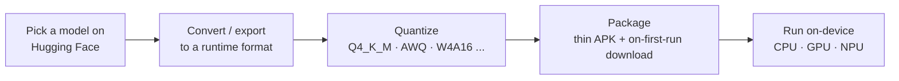

# LLM inference on Android

Running an autoregressive chat LLM specifically on Android hardware — the
Android-specific runtime landscape (LiteRT-LM, Qualcomm Genie/GenieX,
ONNX Runtime GenAI, Gemini Nano/AICore) and the concrete numbers for a
current flagship (Galaxy S26 Ultra). This page sits between the
platform-general layers below it and the cross-platform runtime survey
beside it:

- [On-device ML runtimes (Core ML vs LiteRT)](/wiki/on-device-ml-runtimes/) — the general Core ML vs. LiteRT + vendor-delegate
  layer.
- [On-device neural accelerators (NPU / ANE / Hexagon)](/wiki/on-device-neural-accelerators/) — the NPU hardware, operator coverage, and
  why peak-TOPS numbers are unreliable.
- on-device-llm-inference — the cross-platform third-party LLM-runtime
  picture (llama.cpp, Ollama, MLX, MLC LLM, ExecuTorch), K-quant bits/weight
  arithmetic, and hybrid-attention KV-cache mechanics. This page adds the
  Android-only runtimes that survey doesn't cover (LiteRT-LM, Qualcomm
  Genie/GenieX, ONNX Runtime GenAI), Android-specific quantization schemes
  beyond K-quants, and a device-named bandwidth roofline.

## The end-to-end path

The format chosen in step B constrains which quantization schemes step C can
use, which in turn decides which backends step E can dispatch to.

## Runtime landscape: what's Android-only

Beyond llama.cpp, MLC-LLM, and ExecuTorch — already surveyed generally in
on-device-llm-inference — Android has several vendor- and Google-specific
runtimes with no cross-platform equivalent:

| Runtime | Backends on Android | Device-named benchmark | Model breadth | License |
|---|---|---|---|---|
| **Google AI Edge / LiteRT-LM** (successor to the now-maintenance-only MediaPipe LLM Inference API) | CPU (XNNPACK), GPU, NPU (ships by default on Android; gated at runtime on a per-vendor `dlopen`. No NPU row for the current model in Google's docs table — the one published Gemma-4 NPU figure is on embedded silicon, not a phone — see below) | **52 tok/s, Gemma 3n/4 E2B, GPU, Galaxy S26 Ultra** — the only runtime in this survey with a number naming this exact phone (Google blog, May 2026) | Gemma, Llama, Phi-4, Qwen (curated) | Apache-2.0 |
| **ONNX Runtime GenAI** | CPU; QNN/NNAPI execution providers unclear/in-progress | none found; open packaging bugs (wrong-arch `.so`, undocumented Android build) | Good on paper, poor in practice on Android | MIT |
| **Qualcomm QNN / Genie / GenieX** (via AI Hub) | Hexagon NPU (Genie); CPU/GPU/NPU (GenieX wraps llama.cpp + QAIRT) | Llama-3.2-3B ≈10 tok/s, Llama-3.1-8B ≈5 tok/s, W4A16 on Hexagon — pinned to the *prior*-generation plain Snapdragon 8 Elite, not confirmed for 8 Elite Gen 5 | Curated (AI Hub gallery); gated models (Llama) need self-export | BSD-3 (tooling) |
| **Gemini Nano / AICore / ML Kit GenAI** | NPU/accelerator, opaque to the app | see contradiction, below | Fixed Google-curated model, not "any HF model" | platform service |

**Correction to the "52 tok/s" figure's framing**: that number is one row of
an **eleven-row** table Google publishes for Gemma-4-E2B across six
platforms × CPU/GPU (`developers.google.com/edge/litert-lm/overview`,
v0.14.0) — not a ceiling. GPU decode ranges from 8 tok/s (Raspberry Pi 5,
CPU floor) up to **160 tok/s on a MacBook Pro M4 Max** and 143 tok/s on an
RTX 4090, roughly 3× the Galaxy S26 Ultra figure. **No row in that table is
NPU** — the "NPU (claimed, vendor-unconfirmed)" column above is not a gap in
this survey's sourcing, it reflects a structural fact: on Android the NPU
executor ships by default, but binding real silicon needs a runtime `dlopen`
of a per-vendor dispatch `.so` that is absent on most devices, and the loader
then fails hard rather than degrading. (`LITERT_DISABLE_NPU` is compile-time,
but selected only on iOS.) One Gemma-4 NPU figure is published off-table, on
embedded Qualcomm Dragonwing silicon rather than a handset. Full table, per-platform breakdown, and the sourced
per-vendor NPU failure modes (MediaTek unsupported, Qualcomm QNN version
mismatches, Intel VPU generation mismatches, even Google's own Tensor G5
failing via DMA-buf exhaustion): [Google AI Edge Gallery](/wiki/google-ai-edge-gallery/).

llama.cpp adds OpenCL (Adreno, Qualcomm-upstreamed) and Vulkan backends on
Android with no NPU delegate; MLC-LLM is OpenCL-only per its own Android
docs; ExecuTorch's Qualcomm backend targets QNN (Hexagon) alongside its
XNNPACK/Vulkan paths. Full sourcing and adoption signals:
[Running Small LLMs on Android: Options and Trade-offs for a Galaxy S26 Ultra](/posts/running-small-llms-on-android/).

**Correction to a blanket claim on this wiki**: [On-device neural accelerators (NPU / ANE / Hexagon)](/wiki/on-device-neural-accelerators/)
and on-device-llm-inference both currently state that none of the
surveyed LLM runtimes dispatch onto the ANE/Hexagon/Exynos NPU. That holds for
the llama.cpp/Ollama/MLX/MLC-LLM/ExecuTorch set those pages actually surveyed
(none of which reach a phone's NPU), but it is not true in general: **Qualcomm's
Genie**, running W4A16-quantized models from AI Hub, dispatches onto the
Hexagon NPU by design — that's the entire point of the stack, and it's the
source of the ≈5–10 tok/s Hexagon numbers in the table above. Both pages are
corrected accordingly.

## Ready-made "no-build" apps

All four pull GGUF or LiteRT models straight from Hugging Face:

| App | Backend | License | Distribution |
|---|---|---|---|
| Google AI Edge Gallery | LiteRT-LM | Apache-2.0 | Google Play, App Store, GitHub Releases |
| **PocketPal AI** | llama.cpp (`llama.rn`) | MIT | Google Play, App Store |
| **ChatterUI** | llama.cpp (`cui-llama.rn`) | AGPL-3.0 | GitHub Releases only |
| **Termux + llama.cpp** | llama.cpp built from source | MIT | Manual build |

Google AI Edge Gallery and ChatterUI both ship via GitHub Releases, which fits
the existing Obtainium-based sideload workflow directly — see
[Personal APK distribution](/wiki/personal-apk-distribution/) and [Android sideloading and silent updates](/wiki/android-sideloading-and-silent-updates/).

## Quantization beyond K-quants

on-device-llm-inference already covers GGUF K-quants' actual bits/weight
(measured, not nominal). Three more schemes matter specifically for the
Android runtime landscape above, and none of them are interchangeable — which
one a runtime accepts is fixed by the runtime, not a free choice:

- **GGUF I-quants** (`IQ2_XS`, `IQ3_XXS`, `IQ4_NL`, …) — non-linear,
  codebook-based, and need an **importance matrix (imatrix)** computed from
  calibration text to be usable at very low bit-widths (2–3 bpw); without one,
  quality degrades badly. Use only when K-quants don't fit the memory budget.
- **AWQ** (activation-aware) and **GPTQ** (one-shot, layer-wise) — the two
  calibration-based schemes from the GPU-server world. ONNX Runtime GenAI
  accepts AWQ directly and GPTQ via its model-builder tool; MLC-LLM loads
  weights matching AutoAWQ's GEMM kernel format directly. ExecuTorch accepts
  neither — its XNNPACK backend requires its own PT2E-based
  per-channel-4-bit-weight / 8-bit-dynamic-activation flow regardless of the
  model's original format.
- **Hexagon W4A16** (Qualcomm) — 4-bit weights, 16-bit activations, the
  scheme Qualcomm AI Hub's own Llama/Gemma/Qwen exports use. Requires
  **static (const) weight data** and, for good accuracy, a representative
  calibration set run through Qualcomm's AIMET library (Adaptive Rounding).
  This is a real per-target-chipset compile step (AIMET/QAIRT → per-chipset
  context binary), not a drop-in conversion — self-serving it for a model AI
  Hub hasn't already published is a genuine ML-engineering undertaking,
  which is why AI Hub's pre-quantized gallery exists at all.

By contrast, GGUF K-quants need **no calibration** at any bit width — quantize
once, offline, upload anywhere. That asymmetry (one-time offline quantization
vs. per-chipset calibrated compilation) is the practical reason GGUF has far
broader Hugging Face coverage than the Hexagon-NPU path.

## Why decode speed converges regardless of backend: the memory-bandwidth roofline

[On-device neural accelerators (NPU / ANE / Hexagon)](/wiki/on-device-neural-accelerators/) already argues on-device inference is
bandwidth- and thermal-bound, not FLOP-bound, in general. For LLM decode
specifically, the mechanism is sharper: **prefill is compute-bound** (one
parallel pass over the whole prompt, high arithmetic intensity) while
**decode is memory-bandwidth-bound** (every generated token re-reads the
entire model's weights, arithmetic intensity ≈ 1). A 40-TOPS-rated NPU
(Hailo-10H) sustains only 6.9 tok/s in single-sequence decode in one paper,
explicitly attributed to the bandwidth bound rather than the NPU's compute
ceiling; another reports >60% L2 cache miss rates during decode on mobile
SoCs, and that decode speed "does not vary significantly across top-tier
devices" for exactly this reason.

Grounded on the Galaxy S26 Ultra (Snapdragon 8 Elite Gen 5, Adreno 840,
LPDDR5X-5300 at a confirmed **84.8 GB/s** peak bandwidth): reading a 4 GB
(Q4, ~8B-class) model's full weights once per token bounds decode near

$$
\text{decode ceiling} = \frac{\text{memory bandwidth}}{\text{model size}}
= \frac{84.8\ \text{GB/s}}{4\ \text{GB}} \approx 21\ \text{tok/s}
$$

as an absolute ceiling — a derivation from the confirmed bandwidth spec, not
a measurement. It lines up with the ~10 tok/s reported for a smaller 3B model
on the Hexagon NPU of the *previous*-generation plain Snapdragon 8 Elite (real
throughput sits below the naive ceiling because of KV-cache traffic,
non-weight reads, and per-op overhead). No source names the exact Snapdragon
8 Elite Gen 5 / Galaxy S26 Ultra for an NPU tokens/sec figure — every concrete
Hexagon-NPU number found is pinned to the prior chip generation.

Practical reading: expect roughly the same decode tok/s (bounded by
bandwidth) whichever backend is used for a given model size on this device
class, but expect the GPU/NPU path to win clearly on prompt-processing
latency and on power/thermal cost per token.

## On-device model file management

- **Where weights live**: a thin base APK that downloads the model at first
  run into app-internal storage — not bundled, not scoped/shared storage.
- **Why bundling isn't viable**: Android's base module has roughly a 200 MB
  compressed-download ceiling before Play requires asset delivery, and Play
  Asset Delivery's own packs cap at roughly 1 GB (install-time) / 512 MB
  (fast-follow/on-demand), ~2 GB combined — a Q4-quantized 3B model alone
  runs ~2 GB, already at or past that combined ceiling. No example was found
  of a shipped app using Play Asset Delivery for multi-gigabyte LLM weights.
- **mmap** keeps GGUF load fast and RSS low, but a llama.cpp GitHub issue
  reports Android mmap behavior is filesystem-path-dependent (some storage
  paths need it to work around an EINVAL failure; some report `--no-mmap`
  speeding up prompt processing) — not the clean, uniformly-beneficial story
  it is on desktop Linux.
- **Licensing**: Gemma's terms permit redistribution and commercial use.
  Meta's Llama Community License conditions redistribution on including the
  license and displaying "Built with Llama." Whether *bundling* weights in a
  distributed APK counts as the triggering "distribution" is unambiguous;
  whether *downloading them at runtime onto the user's own device* moves that
  obligation is a genuinely open question — no source states it plainly
  either way. Practical reading: treat runtime download like the existing
  Obtainium/GitHub-Releases pipeline treats the APK itself (see
  [Personal APK distribution](/wiki/personal-apk-distribution/)) — ship the thin binary, let the device pull
  the model, don't bundle a gated model's weights inside anything
  redistributed.

## Confirmed Galaxy S26 Ultra specs

| Spec | Value |
|---|---|
| SoC | Snapdragon 8 Elite Gen 5 |
| GPU | Adreno 840 |
| RAM | 12 or 16 GB, LPDDR5X-5300 |
| Memory bandwidth | 84.8 GB/s (confirmed) |

With either RAM configuration, every realistic small model (Gemma 3/3n, Qwen3,
Llama 3.2, Phi-4-mini, SmolLM) fits comfortably alongside the rest of
Android — the practical ceiling on this device is decode speed (the roofline
above), not whether the weights fit in memory.

## Contradiction: does Gemini Nano/AICore publish a decode tok/s number?

> ⚠️ [Running Small LLMs on Android: Options and Trade-offs for a Galaxy S26 Ultra](/posts/running-small-llms-on-android/) found "no tok/s benchmark
> surfaced" for the Gemini Nano/AICore/ML Kit GenAI path, calling it "not the
> framing Google publishes for this path." [Generative UI on Android](/wiki/generative-ui-android/)
> (two days older) states published AICore numbers: prefill 510 tok/s
> (Pixel 9 Pro, nano-v2) / 940 tok/s (Pixel 10 Pro, nano-v3); ~11 tok/s decode
> (Pixel 9 Pro). Flagged and left open on [Generative UI on Android](/wiki/generative-ui-android/); not
> resolved here.

## See also

- [Google AI Edge Gallery](/wiki/google-ai-edge-gallery/) — the code-level deep-dive backing this page's
  LiteRT-LM row and Gallery entry: repository layering, `.task`/`.litertlm`
  bundle-format internals, the actual shipped feature/model set, the full
  eleven-row benchmark table, and sourced per-vendor NPU/licensing/hardware
  failure modes.
- [On-device ML runtimes (Core ML vs LiteRT)](/wiki/on-device-ml-runtimes/) — the general runtime/delegate layer this page's
  Android-specific LLM runtimes sit on top of.
- [On-device neural accelerators (NPU / ANE / Hexagon)](/wiki/on-device-neural-accelerators/) — the NPU hardware and TOPS skepticism the
  bandwidth roofline above reinforces with a device-named number; see the
  Qualcomm Genie correction above.
- on-device-llm-inference — the cross-platform LLM-runtime survey
  (llama.cpp, Ollama, MLX, MLC LLM, ExecuTorch) this page adds the
  Android-only runtimes and device numbers on top of.
- [Generative UI on Android](/wiki/generative-ui-android/) — Gemini Nano/AICore/ML Kit GenAI in depth (API
  surface, LoRA adapters, fragmentation); see the contradiction above.
- [Personal APK distribution](/wiki/personal-apk-distribution/), [Android sideloading and silent updates](/wiki/android-sideloading-and-silent-updates/) —
  the sideload pipeline the ready-made apps above fit into.
