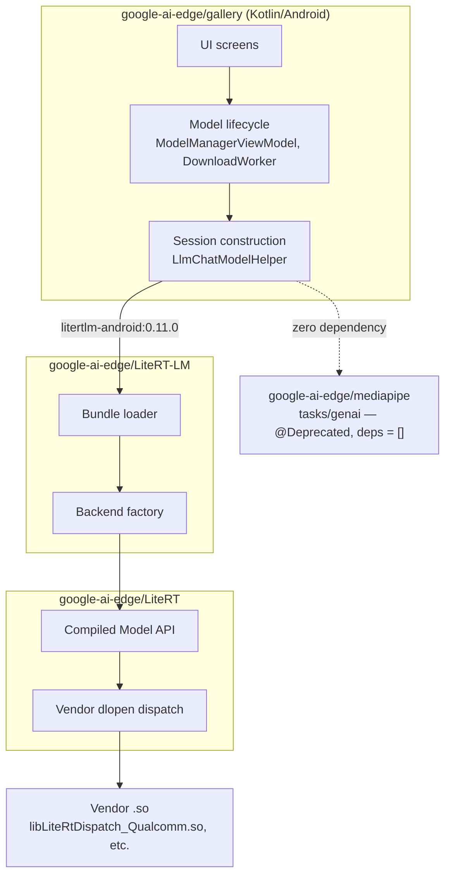

# Google AI Edge Gallery

Google's open-source, on-device showcase app for LLMs and multimodal models
(`google-ai-edge/gallery`, Kotlin/Android + iOS) and the runtime stack under
it — LiteRT-LM, LiteRT, and the now-deprecated MediaPipe GenAI API. This page
is the **code-level deep-dive**: repository layering, bundle-format
internals, the actual shipped feature/model set, and sourced failure modes.
[LLM inference on Android](/wiki/android-llm-inference/) keeps the cross-runtime Android survey (LiteRT-LM
as one row among Qualcomm Genie/GenieX, ONNX Runtime GenAI, Gemini Nano) and
the ready-made-apps comparison; this page is what backs that row up.

## Architecture: four repositories, one dependency chain

| Layer | Owner | Where |
|---|---|---|
| UI, screens, chat state | Gallery | `ui/**` |
| Model lifecycle (allowlist fetch, download, resume, HF auth) | Gallery | `worker/DownloadWorker.kt`, `ui/modelmanager/ModelManagerViewModel.kt` |
| Bundle parsing + session construction | LiteRT-LM (`litertlm-android` AAR) | `runtime/util/litert_lm_loader.h`, `runtime/core/engine_advanced_impl.cc` |
| Backend dispatch (CPU/GPU/NPU) | LiteRT-LM → LiteRT Compiled Model API | `runtime/executor/llm_litert_compiled_model_executor_factory.cc` |
| Vendor NPU silicon binding | LiteRT, at runtime via `dlopen` | `litert/runtime/dispatch/litert_dispatch.cc` |
| Legacy, unused by Gallery | MediaPipe GenAI (deprecated) | `mediapipe/tasks/java/.../genai/llminference/` |

**Gallery depends only on LiteRT-LM (`litertlm-android:0.11.0`) — there is
zero MediaPipe dependency in the app.** A repo-wide search for
`"tasks-genai"` / `"com.google.mediapipe"` returns nothing. A second,
independent execution path exists for Android's system AICore service
(`runtime/aicore/AICoreModelHelper.kt`, on ML Kit's `genai-prompt`) — see
[Generative UI on Android](/wiki/generative-ui-android/) for that surface in depth; it is not part of the
LiteRT-LM path this page covers.

**MediaPipe's GenAI `LlmInference` API is deprecated at the source level, not
just in docs**, and Gallery never calls it. Every public class in the Java
package carries `@Deprecated` with *"Migrate to LiteRT LM instead."* A dated
commit, `83fdad9b` (2026-01-30), titled *"Remove the CPU-only MediaPipe LLM
Inference Engine \ Please use LiteRT LM instead,"* deleted the entire
`mediapipe/tasks/cc/genai/inference/` tree, the iOS genai subtree, and the
Python `.task` bundler — about 100 files. A later commit (`80f4a5bb`,
2026-02-25) restored `LlmInference.java` as a pointer only, already carrying
`@Deprecated` on arrival; its BUILD target wires in `deps = []`, no native
engine. Google's docs corroborate without dating the cutoff: *"The MediaPipe
LLM Inference API ... is now in maintenance-only mode. New features and
optimizations will be focused on LiteRT-LM."* This settles, with a commit
date, what [LLM inference on Android](/wiki/android-llm-inference/) already states in passing — LiteRT-LM
as "successor to the now-maintenance-only MediaPipe LLM Inference API."

One build-consistency risk worth flagging: LiteRT-LM's Bazel `WORKSPACE` and
its CMake build pin **two different LiteRT commits** (`0a033900...` vs.
`fb16353a...`, the latter dated "Updated on 2026-03-24") — do not assume
"LiteRT-LM tracks LiteRT `main`."

## Bundle formats: `.task` vs. `.litertlm`

**`.task`** is the older, MediaPipe-era format: a plain ZIP (detected by
`"PK"` header bytes), a filename→byte-range map, no metadata proto, no
external-weights section, no embedding section. **There is no producer for
it left in either repo** — the bundler script was deleted in the same
`83fdad9b` commit above and now 404s. It remains readable only for backward
compatibility with pre-2026 artifacts already in the wild.

**`.litertlm`** is a FlatBuffer-defined, sectioned container (magic bytes
`"LITERTLM"`, versioned in code as 1.6.0), structurally unrelated to a zip.
Its root table holds `system_metadata` and a list of `SectionObject`s typed
by `AnySectionDataType`: `GenericBinaryData, TFLiteModel, SP_Tokenizer,
LlmMetadataProto, HF_Tokenizer_Zlib, TFLiteWeights, EmbeddingMetadataProto`,
among others. In practice one bundle packages the LLM config (a protobuf),
a tokenizer (SentencePiece binary or zlib-compressed HF tokenizer JSON), one
or more TFLite graphs (prefill/decode/embedder/vision/audio adapters),
optionally external weights, and optionally embedding metadata. Produced by
a real CLI (`litert-lm-builder`) and consumed by `LitertLmLoader`, which
mmaps sections on demand.

**`.litertlm` is the only format that can carry vision/audio adapters, LoRA,
external weights, or an embedding section** — the repository's own test
fixtures make this concrete: exactly two `.task` fixtures exist and both are
plain-text-only, while every fixture touching vision, audio, LoRA, or
multi-prefill is `.litertlm`-only. No document states outright *why* one
supersedes the other; this is reconstructed from history and fixtures, not
from a changelog line.

## Features shipped

The canonical feature list is `object BuiltInTaskId`:

| Feature (UI label) | Runtime mechanism |
|---|---|
| **AI Chat** | LiteRT-LM `Engine`/`Conversation`, text-only |
| **Ask Image** | same `Engine`, `supportImage = true`; vision pinned to GPU by the allowlist |
| **Audio Scribe** | same `Engine`, `supportAudio = true`; audio backend hard-pinned to CPU ("must be CPU for Gemma 3n") |
| **Prompt Lab** | same `Engine`, single-turn, no conversation history |
| **Agent Skills** | real tool/function calling over the **Model Context Protocol** (`io.modelcontextprotocol:kotlin-sdk`); a `ToolProvider` list flows into `ConversationConfig(tools = ...)` |
| **Mobile Actions**, **Tiny Garden** | same MCP tool-calling path, running a FunctionGemma-270M fine-tune each |

**"Function calling" in this stack is named Agent Skills**, and it is
genuine structured tool-calling through MCP, not a bespoke JSON schema.

**There is no RAG feature anywhere in this codebase** — no embedding model,
no vector store, no retrieval step; a full-tree search for `rag`, `embed`,
`vector`, `gecko`, `objectbox`, `sqlite` returns zero matches. This is worth
stating precisely because the *format* isn't the limiting factor: `.litertlm`
already reserves an `EmbeddingMetadataProto` section and `LitertLmLoader`
already exposes `GetEmbeddingMetadata()` — the runtime supports embedding
models, the app simply ships no feature that uses one.

**Thinking mode is real and traceable**: a distinct `THOUGHT_CHANNEL` in the
streaming callback, gated per-model by the allowlist's `capabilities` array
(e.g. Gemma-4-E2B lists `["llm_thinking", "speculative_decoding"]`).

**The app self-reports benchmark stats through a dedicated harness, not a
marketing claim.** `BenchmarkViewModel.runBenchmark()` calls LiteRT-LM's own
exported `benchmark()` function directly and serializes the result into an
`LlmBenchmarkStats` protobuf with fields `prefillSpeed`/`decodeSpeed`/
`timeToFirstToken` — the same metric names as Google's published docs table
below, so the in-app number measures the identical quantities on the user's
own device.

## Models: the live allowlist

The app fetches a version-pinned allowlist at runtime
(`model_allowlists/${VERSION_NAME}.json`), not the stale repo-root
`model_allowlist.json`. Nine entries, all `litert-community/` or `google/`
Hugging Face repos:

| Model | HF source | Quantization (filename only) | Size | Context |
|---|---|---|---|---|
| Gemma-4-E2B-it | `litert-community/gemma-4-E2B-it-litert-lm` | not stated | 2.59 GB | 32,000 |
| Gemma-4-E4B-it | `litert-community/gemma-4-E4B-it-litert-lm` | not stated | 3.66 GB | 32,000 |
| Gemma-3n-E2B-it | `google/gemma-3n-E2B-it-litert-lm` | int4 | 3.66 GB | 4,096 |
| Gemma-3n-E4B-it | `google/gemma-3n-E4B-it-litert-lm` | int4 | 4.92 GB | 4,096 |
| Gemma3-1B-IT | `litert-community/Gemma3-1B-IT` | int4 | 584 MB | 1,024 |
| Qwen2.5-1.5B-Instruct | `litert-community/Qwen2.5-1.5B-Instruct` | q8 | 1.60 GB | 4,096 |
| DeepSeek-R1-Distill-Qwen-1.5B | `litert-community/DeepSeek-R1-Distill-Qwen-1.5B` | q8 | 1.83 GB | 4,096 |
| TinyGarden-270M | `litert-community/functiongemma-270m-ft-tiny-garden` | q8 | 289 MB | 1,024 |
| MobileActions-270M | `litert-community/functiongemma-270m-ft-mobile-actions` | q8 | 289 MB | 1,024 |

**Per-channel vs. per-tensor quantization granularity is absent from every
entry across all 13 historical allowlist versions checked** — only
inferable from the filename suffix (`int4`, `q8`), never a structured field.

**Hammer is not a Gallery model.** It surfaces only as a conversion *target*
in Google's separate PyTorch-to-LiteRT tooling repo (`litert-torch`); the
upstream family is third-party (`MadeAgents/Hammer2.1`). Google's toolchain
can convert it — Gallery does not ship it. Gemma 3n comes from Google's own
`google/` HF org; everything else, including Gemma 4, comes through
`litert-community/` instead.

## Performance: the full picture, not one number

[LLM inference on Android](/wiki/android-llm-inference/) cites **52 tok/s (Gemma 3n/4 E2B, GPU, Galaxy S26
Ultra)** as the headline LiteRT-LM figure. That number is real but is **one
row of an eleven-row table**, sourced from `developers.google.com/edge/litert-lm/overview`
(v0.14.0, model Gemma-4-E2B, 2.58 GB):

| Platform | Backend | Prefill (tok/s) | Decode (tok/s) | TTFT (s) |
|---|---|---|---|---|
| Android (Galaxy S26 Ultra) | CPU | 557 | 47 | 1.8 |
| Android (Galaxy S26 Ultra) | GPU | 3,808 | **52** | 0.3 |
| iOS (iPhone 17 Pro) | CPU | 532 | 25 | 1.9 |
| iOS (iPhone 17 Pro) | GPU | 2,878 | 56 | 0.3 |
| Linux (Arm + RTX 4090) | CPU | 260 | 35 | 4.0 |
| Linux (Arm + RTX 4090) | GPU | 11,234 | 143 | 0.1 |
| macOS (MacBook Pro M4 Max) | CPU | 901 | 42 | 1.1 |
| macOS (MacBook Pro M4 Max) | GPU | 7,835 | **160** | 0.1 |
| Windows (Intel Lunar Lake) | CPU | 435 | 30 | 2.4 |
| Windows (Intel Lunar Lake) | GPU | 3,751 | 48 | 0.3 |
| IoT (Raspberry Pi 5, 16 GB) | CPU | 133 | 8 | 7.8 |

**GPU decode ranges 8–160 tok/s across this table, not a single figure**: a
MacBook Pro M4 Max hits 160 tok/s (3× the Galaxy S26 Ultra number), an RTX
4090 hits 143, and a Raspberry Pi 5 floors at 8 tok/s CPU with a 7.8 s TTFT.
**Every row is CPU or GPU — there is no NPU row for Gemma 4 anywhere in
Google's own published table**, and no other source checked (Google's May
2026 LiteRT-LM blog post, its April 2026 NPU blog post, or the Google Cloud
benchmark-portal post) publishes an NPU tok/s figure for Gemma 4 either. The
only NPU numbers found at all are on Hugging Face model cards for the
**older** Gemma 3n (Vivo X300 Pro NPU: prefill 1,671 tok/s / decode 28.4
tok/s) — not the model this table benchmarks.

One more distinction worth keeping separate: the LiteRT-LM blog post's *"up
to 76 tokens/sec on a MacBook Pro"* is a **WebGPU** number, not the same
measurement as the 160 tok/s native-Metal figure in the table above — do not
collapse the two into one "Mac GPU decode" figure.

This elaborates, rather than contradicts, [On-device neural accelerators (NPU / ANE / Hexagon)](/wiki/on-device-neural-accelerators/)'s
general argument that peak-TOPS/single-number framing is unreliable: here
the absent NPU row is not a missing benchmark run but a **structural** gap
(see below).

## Where it breaks

### RAM gating: soft, dismissable

The README states only an OS floor (*"Android 12 and up, and iOS 17 and
up"*) — no RAM number. The real requirement lives per-model in the
allowlist's `minDeviceMemoryInGb` (6–12 GB). Enforcement is a dismissable
warning with a **"Proceed anyway"** button, never a hard block. Tracker
issue #423 (Android 8.1, 3 GB RAM) asked maintainers to document a minimum —
unanswered as of this research.

### NPU support: structurally limited, not just a rollout lag

The NPU executor is compile-time optional
(`#if !defined(LITERT_DISABLE_NPU)`); the default vendor dispatch shipped
with LiteRT is a pure stub returning "unsupported" on every call unless a
real per-vendor `.so` is present and successfully `dlopen`s a symbol
(`"LiteRtDispatchGetApi"`). This is the concrete, vendor-fragmented failure
mode that [On-device neural accelerators (NPU / ANE / Hexagon)](/wiki/on-device-neural-accelerators/)'s operator-coverage argument
predicts in the abstract — a runtime having "an NPU path" and a given
device's NPU actually running are separate claims, and the gap is
per-vendor, per-chip, and even per-driver-version:

- **MediaTek**: not supported at all, and the app does not fail gracefully —
  Gallery #920 (Dimensity 8300 Ultra) crashes on NPU switch; maintainer
  confirms only Qualcomm Snapdragon SoCs are supported.
- **Qualcomm** (the best-supported vendor) still fails on specific
  chip/driver combinations: LiteRT-LM #2226, a QNN system-library version
  mismatch on a Galaxy S25 Ultra despite using the documented QAIRT version;
  LiteRT-LM #1979, CPU/GPU/NPU all register and the vendor `.so` loads, yet
  inference still fails inside Qualcomm's own QNN initialization.
- **Intel**: VPU generations are not interchangeable — LiteRT-LM #2451, a
  `.litertlm` built for one VPU generation fails with *"expects VPUX37XX,
  but model reports VPUX40XX"* on a newer chip.
- **Samsung Exynos**: fails at engine creation for every model tried —
  Gallery #882/#548, a raw `INTERNAL` error inside the compiled-model
  executor. A structurally similar error also appears on MediaTek (#557) —
  not an Exynos-exclusive error class.
- **Google's own first-party Tensor silicon fails too, for a hardware
  reason**: Gallery #1008, a base Pixel 10 (12 GB, Tensor G5) running the
  TPU-labeled Gemma-4-E2B hits the Tachyon TPU driver refusing to
  `dma-buf`-map the ~1.9 GB weight section a second time (once for prefill,
  once for decode) — `errno=No space left on device`. Works fine on the
  16 GB Pixel 10 Pro, same SoC. The proximate cause traces to Gallery's own
  code: `ModelAllowlist.kt` forcibly removes GPU as an accelerator option on
  Pixel 10 devices specifically, with no fallback, so the TPU path is the
  only one offered and it is the one that fails.
- **The per-SoC routing mechanism exists in schema but is unpopulated**:
  Gallery #730/#888, a Snapdragon-8-Gen-5 device shows no NPU model to
  download at all; maintainer confirms `socToModelFiles` routing "is not
  fully supported in our external build process."

Google's own April 2026 NPU blog post presents Tensor, MediaTek, and
Qualcomm as supported, flagging only Tensor's ML SDK as experimental — the
issue tracker shows a materially rougher picture: specific MediaTek chips
outright unsupported, specific Qualcomm chips version-mismatching, and Intel
VPU generations incompatible with each other.

### Licensing: a dynamic, probe-first gate

The app does not hardcode which models need authentication — it probes: an
unauthenticated download is attempted first, and only on failure does it
check for a stored Hugging Face OAuth token (AppAuth flow against
`huggingface.co/oauth/...`) or launch the auth UI. A separate, narrower gate
additionally requires acknowledging Gemma's terms of use, keyed by an
explicit name set that **excludes the Gemma 4 models** — either a release-
process drift or a deliberate distinction in the Gemma-4 repos' actual HF
gating status; the source alone doesn't settle which. If a token is present
but the server still 403s (terms not yet accepted on Hugging Face itself),
the app opens a Custom Tab to the agreement and retries. Building from
source requires registering one's own HF OAuth app first — the public
repo's client credentials are literal placeholders.

### Mid-range and older hardware: varied failures, not uniformly "low RAM"

- **Crash-on-launch on Huawei's EMUI**, independent of any model download
  (#599) — unresolved as of this research.
- **A newer OS-level memory limiter, not raw RAM**, killing a specific model:
  Pixel 6a (6 GB) on an Android 17 beta, Gemma-4-E4B crashes consistently,
  attributed to Android 17's new per-app `MemoryLimiter` (#701).
- **A high-RAM device still failing, for a feature-specific reason**: a
  12 GB A19 Pro iPhone runs Gemma-4-E4B fine normally but crashes
  specifically with Thinking Mode enabled (#703) — a counterexample against
  treating every crash as a pure capacity problem.
- **Unbounded KV-cache growth in long chats** (#856): crashes outright on
  GPU/NPU past a hidden token ceiling; loops instead on CPU.
- **No graceful degradation on CPUs lacking modern SIMD**: raw `SIGILL` on
  devices without ARM NEON/SVE, or an unexplained *"OpenCL library was not
  found"* (#543).

## See also

- [LLM inference on Android](/wiki/android-llm-inference/) — the cross-runtime Android survey this page's
  LiteRT-LM row backs up in full detail; also carries the ready-made-apps
  comparison table Gallery appears in.
- [On-device neural accelerators (NPU / ANE / Hexagon)](/wiki/on-device-neural-accelerators/) — the general operator-coverage/
  vendor-fragmentation argument this page's per-vendor NPU failures
  concretely instantiate, from a different (Gallery/LiteRT-LM) angle than
  Qualcomm Genie.
- [On-device ML runtimes (Core ML vs LiteRT)](/wiki/on-device-ml-runtimes/) — the general Core ML vs. LiteRT + vendor-
  delegate layer LiteRT-LM's Compiled Model API and `dlopen` dispatch sit
  on top of.
- [Generative UI on Android](/wiki/generative-ui-android/) — the app's second, independent execution path
  (Android AICore / ML Kit GenAI), not part of the LiteRT-LM stack above.

## Sources

- [Google AI Edge Gallery: Codebases, Features, Models, and Failure Modes](/posts/google-ai-edge-gallery/) — the report this page is drawn
  from in full; every claim above traces to a file path, class, commit
  hash, or GitHub issue cited there.
